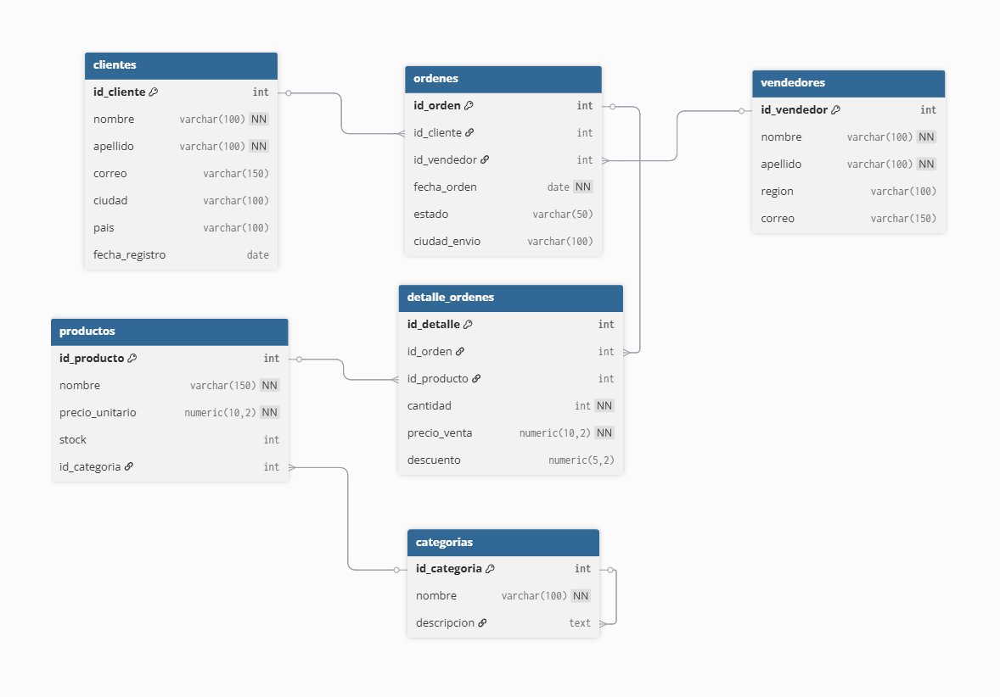

# Práctica 2.1 Consultas sobre tablas

<br/><br/>

## Duración
60 minutos 

<br/><br/>

## Objetivos

Al completar este laboratorio, serás capaz de:

- Escribir consultas SELECT con filtros WHERE usando operadores lógicos (`AND`, `OR`, `NOT`) y de comparación (`=`, `<>`, `>`, `<`, `>=`, `<=`)
- Aplicar ordenamiento con `ORDER BY` (ASC/DESC) y paginación con `LIMIT` y `OFFSET`
- Combinar tablas usando `INNER JOIN`, `LEFT JOIN`, `RIGHT JOIN` y `FULL OUTER JOIN`
- Calcular métricas agregadas usando `GROUP BY`, `HAVING` y las funciones `COUNT`, `SUM`, `AVG`, `MIN`, `MAX`
- Filtrar registros con los operadores `IN`, `BETWEEN` y `LIKE` para búsquedas de patrones
- Manejar valores NULL usando `IS NULL`, `IS NOT NULL` y la función `COALESCE`

<br/><br/>

## Diagrama ER de la base de datos usadas en clase



<br/><br/>


## Prerrequisitos

### Conocimiento Requerido

- Práctica 1.1: entorno Docker con PostgreSQL 16 funcional y accesible
- Comprensión teórica de la anatomía de una sentencia SQL (Lección 2.1): palabras clave, identificadores, literales, operadores y terminador
- Familiaridad con las cuatro categorías de SQL: DDL, DML, DCL, TCL
- Conocimiento básico del modelo relacional: tablas, columnas, claves primarias y foráneas

### Acceso Requerido

- Contenedor Docker de PostgreSQL 16 en ejecución (iniciado en el Laboratorio 01-00-01)
- Acceso a `psql` CLI (dentro del contenedor o instalación local) o pgAdmin 4
- Permisos de lectura y escritura sobre la base de datos `ventas_db` (usuario `postgres`)

<br/><br/>

### Configuración Inicial

Antes de comenzar, verifica que tu entorno del Laboratorio 01-00-01 esté operativo:

```bash
# Verificar que el contenedor PostgreSQL está en ejecución
docker ps --filter "name=curso_postgres"
```

Si el contenedor no aparece en la lista, inícialo:

```bash
# Iniciar el contenedor (nombre puede variar según tu configuración del Lab 01-00-01)
docker start curso_postgres
```

Verifica la conectividad accediendo a psql:

```bash
# Conectarse a psql dentro del contenedor
docker exec -it curso_postgres psql -U postgres
```

Deberías ver el prompt `postgres=#`. Escribe `\q` para salir por ahora.

> **Nota de Seguridad:** Este laboratorio usa las credenciales `usuario: postgres / contraseña: postgres` exclusivamente para entornos de desarrollo local. **Nunca uses estas credenciales en un entorno de producción.**

<br/><br/>

## Instrucciones 

### Paso 1: Crear la base de datos y el esquema del dataset de ventas

1. Conéctate al contenedor PostgreSQL mediante psql:

   ```bash
   docker exec -it curso_postgres psql -U postgres
   ```

2. Crea la base de datos `ventas_db` y conéctate a ella:

   ```sql
   -- DDL: Crear la base de datos del laboratorio
   CREATE DATABASE ventas_db;
   \c ventas_db
   ```

3. Crea las tablas en el orden correcto (respetando las dependencias de claves foráneas). Copia y ejecuta el siguiente bloque completo en psql:

   ```sql
   -- DDL: Tabla de categorías de productos
   CREATE TABLE categorias (
       id_categoria   SERIAL PRIMARY KEY,
       nombre         VARCHAR(100) NOT NULL,
       descripcion    TEXT
   );

   -- DDL: Tabla de productos
   CREATE TABLE productos (
       id_producto    SERIAL PRIMARY KEY,
       nombre         VARCHAR(150) NOT NULL,
       precio_unitario NUMERIC(10, 2) NOT NULL,
       stock          INTEGER DEFAULT 0,
       id_categoria   INTEGER REFERENCES categorias(id_categoria)
   );

   -- DDL: Tabla de clientes
   CREATE TABLE clientes (
       id_cliente     SERIAL PRIMARY KEY,
       nombre         VARCHAR(100) NOT NULL,
       apellido       VARCHAR(100) NOT NULL,
       correo         VARCHAR(150),
       ciudad         VARCHAR(100),
       pais           VARCHAR(100) DEFAULT 'Colombia',
       fecha_registro DATE DEFAULT CURRENT_DATE
   );

   -- DDL: Tabla de vendedores
   CREATE TABLE vendedores (
       id_vendedor    SERIAL PRIMARY KEY,
       nombre         VARCHAR(100) NOT NULL,
       apellido       VARCHAR(100) NOT NULL,
       region         VARCHAR(100),
       correo         VARCHAR(150)
   );

   -- DDL: Tabla de órdenes (cabecera)
   CREATE TABLE ordenes (
       id_orden       SERIAL PRIMARY KEY,
       id_cliente     INTEGER REFERENCES clientes(id_cliente),
       id_vendedor    INTEGER REFERENCES vendedores(id_vendedor),
       fecha_orden    DATE NOT NULL,
       estado         VARCHAR(50) DEFAULT 'pendiente',
       ciudad_envio   VARCHAR(100)
   );

   -- DDL: Tabla de detalle de órdenes (líneas)
   CREATE TABLE detalle_ordenes (
       id_detalle     SERIAL PRIMARY KEY,
       id_orden       INTEGER REFERENCES ordenes(id_orden),
       id_producto    INTEGER REFERENCES productos(id_producto),
       cantidad       INTEGER NOT NULL,
       precio_venta   NUMERIC(10, 2) NOT NULL,
       descuento      NUMERIC(5, 2) DEFAULT 0.00
   );
   ```

4. Verifica que las tablas fueron creadas correctamente:

   ```sql
   -- Listar todas las tablas del esquema público
   \dt
   ```

<br/>

**Salida Esperada:**

```
               List of relations
 Schema |      Name       | Type  |  Owner
--------+-----------------+-------+----------
 public | categorias      | table | postgres
 public | clientes        | table | postgres
 public | detalle_ordenes | table | postgres
 public | ordenes         | table | postgres
 public | productos       | table | postgres
 public | vendedores      | table | postgres
(6 rows)
```

<br/>

**Verificación:**

- Confirma que aparecen exactamente 6 tablas en la lista.
- Ejecuta `\d clientes` para revisar la estructura de la tabla clientes y verificar que los tipos de datos son correctos.

<br/><br/>

### Paso 2: Cargar el dataset de ventas minoristas

1. Manteniéndote conectado a `ventas_db` en psql, ejecuta el siguiente script de inserción de datos. Puedes copiarlo completo y pegarlo en la terminal:


```sql

   -- DML: Insertar categorías de productos
   INSERT INTO categorias (nombre, descripcion) VALUES
       ('Electrónica',     'Dispositivos electrónicos y accesorios tecnológicos'),
       ('Ropa',            'Prendas de vestir para hombre, mujer y niños'),
       ('Hogar',           'Artículos para el hogar y decoración'),
       ('Deportes',        'Equipamiento y ropa deportiva'),
       ('Libros',          'Libros, revistas y material educativo'),
       ('Alimentos',       'Productos alimenticios y bebidas'),
       ('Juguetes',        'Juguetes y entretenimiento infantil'),
       ('Belleza',         'Cosméticos, perfumes y cuidado personal');
```
    
  <br/>

```sql

   -- DML: Insertar productos
   INSERT INTO productos (nombre, precio_unitario, stock, id_categoria) VALUES
       ('Laptop HP 15"',           1299.99,  45,  1),
       ('Mouse Inalámbrico',          25.50, 200,  1),
       ('Teclado Mecánico',           89.99, 120,  1),
       ('Monitor 24" Full HD',       350.00,  60,  1),
       ('Audífonos Bluetooth',        75.00, 150,  1),
       ('Camiseta Polo Hombre',       35.00, 300,  2),
       ('Jeans Mujer Slim',           65.00, 180,  2),
       ('Chaqueta Deportiva',         95.00,  90,  2),
       ('Vestido Casual',             55.00, 120,  2),
       ('Zapatillas Running',        110.00,  75,  2),
       ('Sofá 3 Puestos',            850.00,  20,  3),
       ('Mesa de Comedor',           420.00,  15,  3),
       ('Lámpara de Escritorio',      45.00, 100,  3),
       ('Set de Sábanas',             70.00, 200,  3),
       ('Cafetera Espresso',         180.00,  55,  3),
       ('Bicicleta de Montaña',      650.00,  30,  4),
       ('Pesas Ajustables 20kg',     120.00,  80,  4),
       ('Raqueta de Tenis',           85.00,  60,  4),
       ('Balón de Fútbol',            30.00, 250,  4),
       ('Colchoneta Yoga',            40.00, 180,  4),
       ('El Quijote',                 22.00, 500,  5),
       ('Python para Análisis',       55.00, 300,  5),
       ('Historia Universal',         38.00, 200,  5),
       ('Diccionario Español',        28.00, 150,  5),
       ('Aceite de Oliva Extra',      18.50, 400,  6),
       ('Café Molido Premium',        24.00, 350,  6),
       ('Chocolate Artesanal',        12.00, 600,  6),
       ('Vino Tinto Reserva',         35.00, 200,  6),
       ('LEGO Classic 500pz',         65.00, 120,  7),
       ('Muñeca Interactiva',         45.00, 100,  7),
       ('Crema Hidratante SPF50',     28.00, 300,  8),
       ('Perfume Floral 100ml',       95.00, 150,  8),
       ('Producto Sin Venta',        999.99, 10, 1);

```

<br/>

```sql

   -- DML: Insertar vendedores
   INSERT INTO vendedores (nombre, apellido, region, correo) VALUES
       ('Carlos',   'Mendoza',   'Bogotá',      'cmendoza@ventas.co'),
       ('Lucía',    'Ramírez',   'Medellín',    'lramirez@ventas.co'),
       ('Andrés',   'Torres',    'Cali',        'atorres@ventas.co'),
       ('Valentina','García',    'Barranquilla','vgarcia@ventas.co'),
       ('Miguel',   'Herrera',   'Bogotá',      'mherrera@ventas.co'),
       ('Sofía',    'Morales',   'Medellín',    'smorales@ventas.co'),
       ('Julián',   'Vargas',    'Cali',        NULL),
       ('Daniela',  'Castro',    'Barranquilla','dcastro@ventas.co');

```

<br/>

```sql

   -- DML: Insertar clientes
   INSERT INTO clientes (nombre, apellido, correo, ciudad, pais, fecha_registro) VALUES
       ('Ana',       'López',      'ana.lopez@email.com',      'Bogotá',       'Colombia', '2022-03-15'),
       ('Pedro',     'Martínez',   'pedro.m@email.com',        'Medellín',     'Colombia', '2022-05-20'),
       ('María',     'González',   'maria.g@email.com',        'Cali',         'Colombia', '2022-07-10'),
       ('Luis',      'Rodríguez',  'luis.r@email.com',         'Barranquilla', 'Colombia', '2022-08-05'),
       ('Camila',    'Sánchez',    'camila.s@email.com',       'Bogotá',       'Colombia', '2022-09-18'),
       ('Jorge',     'Pérez',      'jorge.p@email.com',        'Medellín',     'Colombia', '2022-10-22'),
       ('Laura',     'Díaz',       'laura.d@email.com',        'Cali',         'Colombia', '2023-01-08'),
       ('Sebastián', 'Flores',     'sebastian.f@email.com',    'Bogotá',       'Colombia', '2023-02-14'),
       ('Isabella',  'Torres',     NULL,                       'Barranquilla', 'Colombia', '2023-03-30'),
       ('Diego',     'Vargas',     'diego.v@email.com',        'Bogotá',       'Colombia', '2023-04-11'),
       ('Valeria',   'Morales',    'valeria.m@email.com',      'Medellín',     'Colombia', '2023-05-25'),
       ('Mateo',     'Jiménez',    'mateo.j@email.com',        'Cali',         'Colombia', '2023-06-03'),
       ('Gabriela',  'Ruiz',       'gabriela.r@email.com',     'Bogotá',       'Colombia', '2023-07-19'),
       ('Alejandro', 'Castro',     NULL,                       'Barranquilla', 'Colombia', '2023-08-07'),
       ('Natalia',   'Herrera',    'natalia.h@email.com',      'Medellín',     'Colombia', '2023-09-14'),
       ('Felipe',    'Mendoza',    'felipe.m@email.com',       'Bogotá',       'Colombia', '2023-10-02'),
       ('Mariana',   'Reyes',      'mariana.r@email.com',      'Cali',         'Colombia', '2023-11-20'),
       ('Daniel',    'Ortiz',      'daniel.o@email.com',       'Bogotá',       'Colombia', '2023-12-05'),
       ('Catalina',  'Núñez',      'catalina.n@email.com',     'Medellín',     'Colombia', '2024-01-17'),
       ('Tomás',     'Aguilar',    'tomas.a@email.com',        'Cali',         'Colombia', '2024-02-28'),
       ('Lucía',     'Islas',      'lucy.is@email.com',        'Ciudad de México', 'México', '2026-03-28');

```

<br/>

```sql

   -- DML: Insertar órdenes
   INSERT INTO ordenes (id_cliente, id_vendedor, fecha_orden, estado, ciudad_envio) VALUES
       ( 1,  1, '2023-01-15', 'entregado',  'Bogotá'),
       ( 2,  2, '2023-01-22', 'entregado',  'Medellín'),
       ( 3,  3, '2023-02-05', 'entregado',  'Cali'),
       ( 4,  4, '2023-02-18', 'entregado',  'Barranquilla'),
       ( 5,  1, '2023-03-01', 'entregado',  'Bogotá'),
       ( 6,  2, '2023-03-14', 'entregado',  'Medellín'),
       ( 7,  3, '2023-04-02', 'entregado',  'Cali'),
       ( 8,  5, '2023-04-20', 'entregado',  'Bogotá'),
       ( 9,  4, '2023-05-08', 'entregado',  'Barranquilla'),
       (10,  1, '2023-05-25', 'entregado',  'Bogotá'),
       (11,  6, '2023-06-10', 'entregado',  'Medellín'),
       (12,  3, '2023-06-28', 'entregado',  'Cali'),
       (13,  5, '2023-07-15', 'entregado',  'Bogotá'),
       (14,  4, '2023-07-30', 'cancelado',  'Barranquilla'),
       (15,  2, '2023-08-12', 'entregado',  'Medellín'),
       (16,  1, '2023-08-25', 'entregado',  'Bogotá'),
       (17,  7, '2023-09-05', 'entregado',  'Cali'),
       (18,  5, '2023-09-20', 'pendiente',  'Bogotá'),
       (19,  6, '2023-10-03', 'entregado',  'Medellín'),
       (20,  8, '2023-10-18', 'entregado',  'Cali'),
       ( 1,  1, '2023-11-02', 'entregado',  'Bogotá'),
       ( 3,  3, '2023-11-15', 'cancelado',  'Cali'),
       ( 5,  5, '2023-12-01', 'entregado',  'Bogotá'),
       ( 7,  7, '2023-12-20', 'pendiente',  'Cali'),
       ( 2,  2, '2024-01-08', 'entregado',  'Medellín'),
       ( 4,  4, '2024-01-22', 'entregado',  'Barranquilla'),
       ( 6,  1, '2024-02-05', 'entregado',  'Bogotá'),
       ( 8,  6, '2024-02-19', 'entregado',  'Bogotá'),
       (10,  2, '2024-03-04', 'entregado',  'Bogotá'),
       (12,  3, '2024-03-18', 'pendiente',  'Cali');

```

<br/>

```sql

   -- DML: Insertar detalles de órdenes
   INSERT INTO detalle_ordenes (id_orden, id_producto, cantidad, precio_venta, descuento) VALUES
       ( 1,  1, 1, 1299.99, 0.00),
       ( 1,  2, 2,   25.50, 0.00),
       ( 2,  6, 3,   35.00, 5.00),
       ( 2, 10, 1,  110.00, 0.00),
       ( 3, 11, 1,  850.00, 50.00),
       ( 3, 13, 2,   45.00, 0.00),
       ( 4,  4, 1,  350.00, 0.00),
       ( 4,  5, 1,   75.00, 10.00),
       ( 5, 21, 2,   22.00, 0.00),
       ( 5, 22, 1,   55.00, 0.00),
       ( 6, 16, 1,  650.00, 30.00),
       ( 6, 19, 2,   30.00, 0.00),
       ( 7, 25, 5,   18.50, 0.00),
       ( 7, 26, 3,   24.00, 0.00),
       ( 8,  3, 1,   89.99, 0.00),
       ( 8,  2, 1,   25.50, 0.00),
       ( 9, 29, 1,   65.00, 0.00),
       ( 9, 30, 2,   45.00, 5.00),
       (10,  7, 2,   65.00, 0.00),
       (10,  8, 1,   95.00, 10.00),
       (11, 31, 2,   28.00, 0.00),
       (11, 32, 1,   95.00, 0.00),
       (12, 17, 1,  120.00, 0.00),
       (12, 20, 2,   40.00, 0.00),
       (13,  1, 1, 1299.99, 100.00),
       (13,  5, 2,   75.00, 0.00),
       (14, 12, 1,  420.00, 0.00),
       (15,  9, 2,   55.00, 0.00),
       (15, 23, 1,   38.00, 0.00),
       (16, 27, 4,   12.00, 0.00),
       (16, 28, 2,   35.00, 5.00),
       (17, 14, 3,   70.00, 0.00),
       (17, 15, 1,  180.00, 20.00),
       (18, 18, 1,   85.00, 0.00),
       (19, 24, 2,   28.00, 0.00),
       (19,  6, 5,   35.00, 0.00),
       (20, 16, 1,  650.00, 50.00),
       (21,  2, 3,   25.50, 0.00),
       (21,  3, 1,   89.99, 0.00),
       (22, 11, 1,  850.00, 0.00),
       (23,  1, 2, 1299.99, 200.00),
       (23, 22, 1,   55.00, 0.00),
       (24, 20, 3,   40.00, 0.00),
       (25,  7, 1,   65.00, 0.00),
       (25, 10, 2,  110.00, 10.00),
       (26,  4, 1,  350.00, 0.00),
       (26, 13, 2,   45.00, 0.00),
       (27, 19, 3,   30.00, 0.00),
       (27, 21, 4,   22.00, 0.00),
       (28,  5, 2,   75.00, 0.00),
       (29,  8, 1,   95.00, 0.00),
       (29, 31, 2,   28.00, 5.00),
       (30, 17, 1,  120.00, 0.00),
       (30, 26, 2,   24.00, 0.00);

```

2. Verifica el conteo de registros en cada tabla:

```sql
   -- Verificar cantidad de registros por tabla
   SELECT 'categorias'      AS tabla, COUNT(*) AS registros FROM categorias
   UNION ALL
   SELECT 'productos',                COUNT(*)               FROM productos
   UNION ALL
   SELECT 'clientes',                 COUNT(*)               FROM clientes
   UNION ALL
   SELECT 'vendedores',               COUNT(*)               FROM vendedores
   UNION ALL
   SELECT 'ordenes',                  COUNT(*)               FROM ordenes
   UNION ALL
   SELECT 'detalle_ordenes',          COUNT(*)               FROM detalle_ordenes;
```

<br/>

**Salida Esperada:**

```
      tabla       | registros
------------------+-----------
 categorias       |         8
 productos        |        33
 clientes         |        21
 vendedores       |         8
 ordenes          |        30
 detalle_ordenes  |        54
(6 rows)
```

<br/>

**Verificación:**

- Confirma que los 6 conteos coinciden exactamente con los valores de la tabla anterior.
- Si algún conteo difiere, revisa el bloque de INSERT correspondiente y vuelve a ejecutarlo.


<br/><br/>

### Paso 3: Consultas SELECT básicas con WHERE

1. **Consulta 3.1 — SELECT básico:** Lista todos los productos con su precio y categoría ID:

   ```sql
   -- DML: Seleccionar todos los productos
   SELECT
       id_producto,
       nombre,
       precio_unitario,
       stock,
       id_categoria
   FROM productos
   ORDER BY precio_unitario DESC;
   ```

2. **Consulta 3.2 — Filtro con operador de comparación:** Muestra solo los productos con precio mayor a $100:

   ```sql
   -- DML: Productos con precio superior a 100
   SELECT
       nombre,
       precio_unitario,
       stock
   FROM productos
   WHERE precio_unitario > 100.00
   ORDER BY precio_unitario DESC;
   ```

3. **Consulta 3.3 — Filtros combinados con AND:** Productos de la categoría Electrónica (id=1) con stock menor a 100 unidades:

   ```sql
   -- DML: Electrónica con stock bajo
   SELECT
       nombre,
       precio_unitario,
       stock
   FROM productos
   WHERE id_categoria = 1
     AND stock < 100
   ORDER BY stock ASC;
   ```

4. **Consulta 3.4 — Filtro con OR:** Clientes de Bogotá o Medellín:

   ```sql
   -- DML: Clientes en ciudades principales
   SELECT
       nombre,
       apellido,
       ciudad,
       correo
   FROM clientes
   WHERE ciudad = 'Bogotá'
      OR ciudad = 'Medellín'
   ORDER BY ciudad, apellido;
   ```

5. **Consulta 3.5 — Operadores IN y BETWEEN:** Productos cuyo precio está entre $20 y $100, en las categorías 5 (Libros), 6 (Alimentos) o 8 (Belleza):

   ```sql
   -- DML: Productos económicos en categorías seleccionadas
   SELECT
       nombre,
       precio_unitario,
       id_categoria
   FROM productos
   WHERE precio_unitario BETWEEN 20.00 AND 100.00
     AND id_categoria IN (5, 6, 8)
   ORDER BY id_categoria, precio_unitario;
   ```

6. **Consulta 3.6 — Operador LIKE:** Clientes cuyo nombre empieza con la letra 'M' o cuyo apellido contiene 'ez':

   ```sql
   -- DML: Búsqueda de clientes por patrón de nombre
   SELECT
       nombre,
       apellido,
       correo,
       ciudad
   FROM clientes
   WHERE nombre LIKE 'M%'
      OR apellido LIKE '%ez'
   ORDER BY apellido;
   ```

<br/>

**Salida Esperada (Consulta 3.5):**

```
          nombre           | precio_unitario | id_categoria
---------------------------+-----------------+--------------
 El Quijote                |           22.00 |            5
 Diccionario Español       |           28.00 |            5
 Historia Universal        |           38.00 |            5
 Python para Análisis      |           55.00 |            5
 Aceite de Oliva Extra     |           18.50 |            6
 Café Molido Premium       |           24.00 |            6
 Chocolate Artesanal       |           12.00 |            6
 Vino Tinto Reserva        |           35.00 |            6
 Crema Hidratante SPF50    |           28.00 |            8
 Perfume Floral 100ml      |           95.00 |            8
(10 rows)
```

<br/>

> **Nota:** El resultado incluye el Aceite de Oliva ($18.50) y el Chocolate ($12.00) porque el filtro `IN (5, 6, 8)` los incluye aunque estén fuera del rango BETWEEN. Analiza la precedencia de los operadores: `BETWEEN` se evalúa antes que `AND`, y `AND` antes que `OR`. Si quieres combinar ambas condiciones de forma exclusiva, necesitas paréntesis explícitos.

<br/>

**Verificación:**

- La Consulta 3.2 debe retornar exactamente 12 productos.
- La Consulta 3.4 debe retornar exactamente 10 clientes.
- La Consulta 3.6 debe incluir a María González, Mateo Jiménez, Mariana Reyes y otros con el patrón indicado.


<br/><br/>

### Paso 4: Paginación con LIMIT y OFFSET

1. **Consulta 4.1 — Top 5 productos más caros:**

   ```sql
   -- DML: Los 5 productos de mayor precio
   SELECT
       nombre,
       precio_unitario,
       stock
   FROM productos
   ORDER BY precio_unitario DESC
   LIMIT 5;
   ```

2. **Consulta 4.2 — Página 1 de clientes (5 por página):**

   ```sql
   -- DML: Primera página de clientes (registros 1-5)
   SELECT
       id_cliente,
       nombre,
       apellido,
       ciudad
   FROM clientes
   ORDER BY id_cliente ASC
   LIMIT 5 OFFSET 0;
   ```

3. **Consulta 4.3 — Página 2 de clientes:**

   ```sql
   -- DML: Segunda página de clientes (registros 6-10)
   SELECT
       id_cliente,
       nombre,
       apellido,
       ciudad
   FROM clientes
   ORDER BY id_cliente ASC
   LIMIT 5 OFFSET 5;
   ```

4. **Consulta 4.4 — Página 3 de clientes:**

   ```sql
   -- DML: Tercera página de clientes (registros 11-15)
   SELECT
       id_cliente,
       nombre,
       apellido,
       ciudad
   FROM clientes
   ORDER BY id_cliente ASC
   LIMIT 5 OFFSET 10;
   ```

<br/>

**Salida Esperada (Consulta 4.1):**

```
          nombre           | precio_unitario | stock
---------------------------+-----------------+-------
 Laptop HP 15"             |         1299.99 |    45
 Sofá 3 Puestos            |          850.00 |    20
 Bicicleta de Montaña      |          650.00 |    30
 Mesa de Comedor           |          420.00 |    15
 Monitor 24" Full HD       |          350.00 |    60
(5 rows)
```

<br/>

**Verificación:**

- Confirma que las páginas 1, 2 y 3 juntas cubren los 15 primeros clientes sin repeticiones ni saltos.
- El OFFSET de la página N se calcula como: `(N - 1) × tamaño_página`. Para la página 4 sería `OFFSET 15`.


<br/><br/>


### Paso 5: Consultas multi-tabla con JOIN

1. **Consulta 5.1 — INNER JOIN:** Lista las órdenes con el nombre del cliente y del vendedor (solo las que tienen ambos):

   ```sql
   -- DML: Órdenes con datos de cliente y vendedor (INNER JOIN)
   SELECT
       o.id_orden,
       o.fecha_orden,
       o.estado,
       c.nombre    AS nombre_cliente,
       c.apellido  AS apellido_cliente,
       c.ciudad    AS ciudad_cliente,
       v.nombre    AS nombre_vendedor,
       v.region    AS region_vendedor
   FROM ordenes AS o
   INNER JOIN clientes  AS c ON o.id_cliente  = c.id_cliente
   INNER JOIN vendedores AS v ON o.id_vendedor = v.id_vendedor
   ORDER BY o.fecha_orden ASC;
   ```

2. **Consulta 5.2 — JOIN con detalle:** Muestra el detalle de las órdenes con nombre de producto y subtotal calculado:

   ```sql
   -- DML: Detalle de órdenes con nombre de producto y subtotal
   SELECT
       d.id_orden,
       p.nombre              AS producto,
       d.cantidad,
       d.precio_venta,
       d.descuento,
       (d.cantidad * d.precio_venta) - d.descuento AS subtotal
   FROM detalle_ordenes AS d
   INNER JOIN productos AS p ON d.id_producto = p.id_producto
   ORDER BY d.id_orden, subtotal DESC;
   ```

3. **Consulta 5.3 — LEFT JOIN:** Lista todos los clientes y sus órdenes. Incluye clientes que nunca han hecho una orden (aparecerán con NULL en los campos de orden):

   ```sql
   -- DML: Todos los clientes con sus órdenes (LEFT JOIN)
   SELECT
       c.id_cliente,
       c.nombre,
       c.apellido,
       c.ciudad,
       o.id_orden,
       o.fecha_orden,
       o.estado
   FROM clientes AS c
   LEFT JOIN ordenes AS o ON c.id_cliente = o.id_cliente
   ORDER BY c.id_cliente, o.fecha_orden;
   ```

4. **Consulta 5.4 — Identificar clientes sin órdenes con LEFT JOIN + IS NULL:**

   ```sql
   -- DML: Clientes que nunca han realizado una orden
   SELECT
       c.id_cliente,
       c.nombre,
       c.apellido,
       c.ciudad,
       c.correo
   FROM clientes AS c
   LEFT JOIN ordenes AS o ON c.id_cliente = o.id_cliente
   WHERE o.id_orden IS NULL
   ORDER BY c.apellido;
   ```

5. **Consulta 5.5 — JOIN completo con categoría:** Vista completa del detalle de órdenes incluyendo categoría de producto:

   ```sql
   -- DML: Vista completa de ventas con categoría
   SELECT
       o.id_orden,
       o.fecha_orden,
       c.nombre    || ' ' || c.apellido  AS cliente,
       cat.nombre                         AS categoria,
       p.nombre                           AS producto,
       d.cantidad,
       d.precio_venta,
       (d.cantidad * d.precio_venta) - d.descuento AS subtotal
   FROM ordenes AS o
   INNER JOIN clientes        AS c   ON o.id_cliente   = c.id_cliente
   INNER JOIN detalle_ordenes AS d   ON o.id_orden     = d.id_orden
   INNER JOIN productos       AS p   ON d.id_producto  = p.id_producto
   INNER JOIN categorias      AS cat ON p.id_categoria = cat.id_categoria
   ORDER BY o.fecha_orden, o.id_orden, subtotal DESC;
   ```

<br/>

**Salida Esperada (Consulta 5.4 — clientes sin órdenes):**

```
 id_cliente |  nombre   |  apellido  |    ciudad    |          correo
------------+-----------+------------+--------------+--------------------------
         13 | Gabriela  | Ruiz       | Bogotá       | gabriela.r@email.com
         14 | Alejandro | Castro     | Barranquilla |
         15 | Natalia   | Herrera    | Medellín     | natalia.h@email.com
         16 | Felipe    | Mendoza    | Bogotá       | felipe.m@email.com
         18 | Daniel    | Ortiz      | Bogotá       | daniel.o@email.com
         19 | Catalina  | Núñez      | Medellín     | catalina.n@email.com
(6 rows)
```

<br/>

> **Nota:** La consulta 5.4 usa el patrón clásico `LEFT JOIN ... WHERE ... IS NULL` para encontrar registros huérfanos. Observa que Alejandro Castro (id=14) no tiene correo registrado — su campo `correo` es NULL, lo cual es diferente a no tener órdenes.

<br/>

**Verificación:**

- La Consulta 5.1 debe retornar 30 filas (una por cada orden).
- La Consulta 5.3 debe retornar más de 30 filas (algunos clientes tienen múltiples órdenes, otros tienen NULL).
- Identifica en la Consulta 5.3 qué clientes aparecen con `id_orden` NULL — deben coincidir con los 6 de la Consulta 5.4.

<br/><br/>

### Paso 6: Manejo de valores NULL con IS NULL, IS NOT NULL y COALESCE

1. **Consulta 6.1 — Vendedores sin correo registrado:**

   ```sql
   -- DML: Vendedores con correo faltante
   SELECT
       id_vendedor,
       nombre,
       apellido,
       region,
       correo
   FROM vendedores
   WHERE correo IS NULL;
   ```

2. **Consulta 6.2 — Clientes sin correo registrado:**

   ```sql
   -- DML: Clientes con correo faltante
   SELECT
       id_cliente,
       nombre,
       apellido,
       ciudad
   FROM clientes
   WHERE correo IS NULL;
   ```

3. **Consulta 6.3 — COALESCE para reemplazar NULL con texto por defecto:**

   ```sql
   -- DML: Reemplazar correos NULL con texto descriptivo
   SELECT
       id_vendedor,
       nombre,
       apellido,
       region,
       COALESCE(correo, 'sin_correo@pendiente.co') AS correo_contacto
   FROM vendedores
   ORDER BY region, apellido;
   ```

4. **Consulta 6.4 — COALESCE en cálculos:** Calcular el total de una orden tratando descuentos NULL como cero:

   ```sql
   -- DML: Subtotales con manejo seguro de NULL en descuentos
   SELECT
       d.id_orden,
       p.nombre                                                         AS producto,
       d.cantidad,
       d.precio_venta,
       COALESCE(d.descuento, 0.00)                                      AS descuento_aplicado,
       (d.cantidad * d.precio_venta) - COALESCE(d.descuento, 0.00)     AS subtotal_neto
   FROM detalle_ordenes AS d
   INNER JOIN productos AS p ON d.id_producto = p.id_producto
   ORDER BY d.id_orden;
   ```

<br/><br/>

**Salida Esperada (Consulta 6.1):**

```
 id_vendedor | nombre | apellido | region |  correo
-------------+--------+----------+--------+---------
           7 | Julián | Vargas   | Cali   |
(1 row)
```

<br/><br/>

**Verificación:**

- Solo Julián Vargas debe aparecer en la Consulta 6.1.
- En la Consulta 6.3, el correo de Julián Vargas debe mostrarse como `sin_correo@pendiente.co`.
- En la Consulta 6.4, todos los subtotales deben ser valores numéricos, nunca NULL.

<br/><br/>

### Paso 7: Agregaciones con GROUP BY y HAVING

1. **Consulta 7.1 — Total de ventas por categoría:**

   ```sql
   -- DML: Ingresos totales por categoría de producto
   SELECT
       cat.nombre                                              AS categoria,
       COUNT(d.id_detalle)                                    AS num_lineas_venta,
       SUM(d.cantidad)                                        AS unidades_vendidas,
       SUM((d.cantidad * d.precio_venta) - d.descuento)      AS ingreso_total,
       AVG(d.precio_venta)                                    AS precio_promedio,
       MIN(d.precio_venta)                                    AS precio_minimo,
       MAX(d.precio_venta)                                    AS precio_maximo
   FROM detalle_ordenes AS d
   INNER JOIN productos  AS p   ON d.id_producto  = p.id_producto
   INNER JOIN categorias AS cat ON p.id_categoria = cat.id_categoria
   GROUP BY cat.id_categoria, cat.nombre
   ORDER BY ingreso_total DESC;
   ```

2. **Consulta 7.2 — Ventas por vendedor y región:**

   ```sql
   -- DML: Desempeño de ventas por vendedor
   SELECT
       v.region,
       v.nombre || ' ' || v.apellido                          AS vendedor,
       COUNT(DISTINCT o.id_orden)                             AS total_ordenes,
       SUM((d.cantidad * d.precio_venta) - d.descuento)      AS total_ventas
   FROM vendedores AS v
   INNER JOIN ordenes         AS o ON v.id_vendedor  = o.id_vendedor
   INNER JOIN detalle_ordenes AS d ON o.id_orden     = d.id_orden
   GROUP BY v.id_vendedor, v.region, v.nombre, v.apellido
   ORDER BY total_ventas DESC;
   ```

3. **Consulta 7.3 — HAVING para filtrar grupos:** Solo categorías con ingreso total mayor a $1,000:

   ```sql
   -- DML: Categorías con ingresos significativos (HAVING)
   SELECT
       cat.nombre                                              AS categoria,
       SUM((d.cantidad * d.precio_venta) - d.descuento)      AS ingreso_total,
       COUNT(DISTINCT o.id_orden)                             AS ordenes_con_esta_categoria
   FROM detalle_ordenes AS d
   INNER JOIN productos  AS p   ON d.id_producto  = p.id_producto
   INNER JOIN categorias AS cat ON p.id_categoria = cat.id_categoria
   INNER JOIN ordenes    AS o   ON d.id_orden     = o.id_orden
   GROUP BY cat.id_categoria, cat.nombre
   HAVING SUM((d.cantidad * d.precio_venta) - d.descuento) > 1000.00
   ORDER BY ingreso_total DESC;
   ```

4. **Consulta 7.4 — Análisis mensual de ventas:**

   ```sql
   -- DML: Evolución mensual de ingresos
   SELECT
       EXTRACT(YEAR  FROM o.fecha_orden)                      AS anio,
       EXTRACT(MONTH FROM o.fecha_orden)                      AS mes,
       COUNT(DISTINCT o.id_orden)                             AS total_ordenes,
       SUM((d.cantidad * d.precio_venta) - d.descuento)      AS ingreso_mensual
   FROM ordenes AS o
   INNER JOIN detalle_ordenes AS d ON o.id_orden = d.id_orden
   WHERE o.estado = 'entregado'
   GROUP BY
       EXTRACT(YEAR  FROM o.fecha_orden),
       EXTRACT(MONTH FROM o.fecha_orden)
   ORDER BY anio, mes;
   ```

5. **Consulta 7.5 — Clientes con más de una orden:**

   ```sql
   -- DML: Clientes recurrentes (más de 1 orden)
   SELECT
       c.nombre || ' ' || c.apellido  AS cliente,
       c.ciudad,
       COUNT(o.id_orden)              AS total_ordenes,
       MIN(o.fecha_orden)             AS primera_orden,
       MAX(o.fecha_orden)             AS ultima_orden
   FROM clientes AS c
   INNER JOIN ordenes AS o ON c.id_cliente = o.id_cliente
   GROUP BY c.id_cliente, c.nombre, c.apellido, c.ciudad
   HAVING COUNT(o.id_orden) > 1
   ORDER BY total_ordenes DESC, cliente;
   ```

<br/>

**Salida Esperada (Consulta 7.5):**

```
       cliente        |    ciudad    | total_ordenes | primera_orden | ultima_orden
----------------------+--------------+---------------+---------------+--------------
 Ana López            | Bogotá       |             3 | 2023-01-15    | 2024-02-05
 María González       | Cali         |             2 | 2023-02-05    | 2023-11-15
 Camila Sánchez       | Bogotá       |             2 | 2023-03-01    | 2023-12-01
 Laura Díaz           | Cali         |             2 | 2023-04-02    | 2023-12-20
 Diego Vargas         | Bogotá       |             2 | 2023-05-25    | 2024-03-04
 Mateo Jiménez        | Cali         |             2 | 2023-06-28    | 2024-03-18
 Pedro Martínez       | Medellín     |             2 | 2023-01-22    | 2024-01-08
 Luis Rodríguez       | Barranquilla |             2 | 2023-02-18    | 2024-01-22
 Jorge Pérez          | Medellín     |             2 | 2023-03-14    | 2024-02-19
 Sebastián Flores     | Bogotá       |             2 | 2023-04-20    | 2024-02-19
(10 rows)
```

<br/>

**Verificación:**

- La Consulta 7.1 debe mostrar las 8 categorías, ordenadas por ingreso descendente.
- La Consulta 7.3 debe mostrar menos categorías que la 7.1 (solo las que superan $1,000 en ingresos).
- La Consulta 7.4 debe cubrir los meses desde enero 2023 hasta marzo 2024.

<br/><br/>

### Paso 8: Ejercicios de práctica independiente

Escribe y ejecuta una consulta SQL para cada una de las siguientes preguntas de negocio. Intenta resolverlas antes de ver las pistas.

1. **Ejercicio 8.1:** ¿Cuáles son los 3 productos más vendidos en términos de unidades totales? Muestra el nombre del producto, la categoría y el total de unidades vendidas.

   > **Pista:** Necesitarás `SUM(cantidad)` con `GROUP BY` y un `LIMIT 3`.


<br/>

2. **Ejercicio 8.2:** ¿Qué porcentaje del total de órdenes tiene estado 'cancelado'? Muestra el conteo y el porcentaje redondeado a 2 decimales.

   > **Pista:** Usa `COUNT(*) FILTER (WHERE estado = 'cancelado')` o una subconsulta. La función `ROUND()` y una división con `::NUMERIC` te ayudarán.

<br/>

3. **Ejercicio 8.3:** Lista los productos que nunca han sido vendidos (no aparecen en `detalle_ordenes`). Muestra el nombre del producto, su precio y la categoría.

   > **Pista:** Usa `LEFT JOIN` entre `productos` y `detalle_ordenes`, filtrando con `IS NULL`.

<br/>

**Verificación:**

- El Ejercicio 8.1 debe mostrar exactamente 3 productos.
- El Ejercicio 8.2 debe mostrar que el porcentaje de cancelación es aproximadamente 6.67%.
- El Ejercicio 8.3 debe mostrar varios productos que no tienen ventas registradas.

<br/><br/>


## Validación y Pruebas

### Criterios de Éxito

- [ ] La base de datos `ventas_db` existe y contiene las 6 tablas con los registros correctos (8, 32, 20, 8, 30, 54 respectivamente)
- [ ] Las consultas SELECT con WHERE retornan resultados filtrados correctamente
- [ ] Las consultas con LIMIT/OFFSET paginen correctamente sin duplicados ni saltos
- [ ] Los INNER JOINs retornan solo registros con coincidencias en ambas tablas
- [ ] Los LEFT JOINs incluyen todos los registros de la tabla izquierda, con NULL donde no hay coincidencia
- [ ] Las funciones de agregación (COUNT, SUM, AVG, MIN, MAX) producen resultados coherentes con los datos insertados
- [ ] HAVING filtra grupos correctamente (diferente a WHERE que filtra filas)
- [ ] COALESCE reemplaza NULL con el valor por defecto especificado
- [ ] Los ejercicios independientes (8.1, 8.2, 8.3) producen resultados correctos

<br/>

### Procedimiento de Prueba

1. Verifica la existencia y estructura de las tablas:

   ```sql
   -- Conectarse a ventas_db y listar tablas con información de columnas
   \c ventas_db
   \dt
   ```

   **Resultado Esperado:** 6 tablas listadas en el esquema `public`.

<br/>

2. Ejecuta el script de validación completo:

   ```sql
   -- Script de validación del Laboratorio 02-00-01
   DO $$
   DECLARE
       v_count INTEGER;
   BEGIN
       -- Validar categorias
       SELECT COUNT(*) INTO v_count FROM categorias;
       IF v_count <> 8 THEN
           RAISE EXCEPTION 'ERROR: categorias tiene % registros, se esperaban 8', v_count;
       END IF;

       -- Validar productos
       SELECT COUNT(*) INTO v_count FROM productos;
       IF v_count <> 33 THEN
           RAISE EXCEPTION 'ERROR: productos tiene % registros, se esperaban 33', v_count;
       END IF;

       -- Validar clientes
       SELECT COUNT(*) INTO v_count FROM clientes;
       IF v_count <> 21 THEN
           RAISE EXCEPTION 'ERROR: clientes tiene % registros, se esperaban 21', v_count;
       END IF;

       -- Validar vendedores
       SELECT COUNT(*) INTO v_count FROM vendedores;
       IF v_count <> 8 THEN
           RAISE EXCEPTION 'ERROR: vendedores tiene % registros, se esperaban 8', v_count;
       END IF;

       -- Validar ordenes
       SELECT COUNT(*) INTO v_count FROM ordenes;
       IF v_count <> 30 THEN
           RAISE EXCEPTION 'ERROR: ordenes tiene % registros, se esperaban 30', v_count;
       END IF;

       -- Validar detalle_ordenes
       SELECT COUNT(*) INTO v_count FROM detalle_ordenes;
       IF v_count <> 54 THEN
           RAISE EXCEPTION 'ERROR: detalle_ordenes tiene % registros, se esperaban 54', v_count;
       END IF;

       RAISE NOTICE 'VALIDACIÓN EXITOSA: Todas las tablas tienen los registros correctos.';
   END;
   $$;
   ```


   **Resultado Esperado:**

   ```
   NOTICE:  VALIDACIÓN EXITOSA: Todas las tablas tienen los registros correctos.
   DO
   ```

<br/>

3. Verifica que las relaciones de clave foránea están intactas:

   ```sql

   -- Verificar integridad referencial: todos los productos tienen categoría válida

   SELECT COUNT(*) AS productos_sin_categoria
   FROM productos AS p
   LEFT JOIN categorias AS cat ON p.id_categoria = cat.id_categoria
   WHERE cat.id_categoria IS NULL;
   ```

   **Resultado Esperado:** `0` (ningún producto huérfano).


<br/><br/>

## Solución de Problemas

### Problema 1: Error al crear la base de datos — "database already exists"

**Síntomas:**
- Al ejecutar `CREATE DATABASE ventas_db;` aparece el error: `ERROR: database "ventas_db" already exists`

**Causa:**
La base de datos fue creada en una sesión anterior o en un intento previo del laboratorio.

**Solución:**

```sql
-- Opción A: Conectarse directamente a la BD existente
\c ventas_db

-- Opción B: Si necesitas empezar desde cero, eliminar y recrear
-- (ADVERTENCIA: esto borra TODOS los datos)
\c postgres
DROP DATABASE IF EXISTS ventas_db;
CREATE DATABASE ventas_db;
\c ventas_db
```

<br/><br/>

### Problema 2: Error de clave foránea al insertar órdenes — "violates foreign key constraint"

**Síntomas:**
- Al ejecutar el INSERT de `ordenes` aparece: `ERROR: insert or update on table "ordenes" violates foreign key constraint`

**Causa:**
Las tablas `clientes` o `vendedores` no tienen los registros con los IDs referenciados, generalmente porque el INSERT de esas tablas no se ejecutó completamente.

**Solución:**

```sql
-- Verificar cuántos clientes y vendedores existen
SELECT COUNT(*) AS total_clientes  FROM clientes;
SELECT COUNT(*) AS total_vendedores FROM vendedores;
```

Si los conteos son menores a 20 y 8 respectivamente, vuelve a ejecutar el bloque INSERT correspondiente del Paso 2. Si los datos ya estaban parcialmente insertados, primero limpia la tabla:

```sql
-- Limpiar y reinsertar (solo si los conteos son incorrectos)
TRUNCATE TABLE detalle_ordenes, ordenes, clientes, vendedores RESTART IDENTITY CASCADE;
```

Luego vuelve a ejecutar todos los INSERTs del Paso 2 en orden.

<br/><br/>

### Problema 3: La consulta con JOIN retorna más filas de las esperadas (producto cartesiano parcial)

**Síntomas:**
- Una consulta con múltiples JOINs retorna un número de filas mucho mayor al esperado.
- Los mismos datos aparecen repetidos varias veces.

**Causa:**
Falta una condición de JOIN o la condición está mal escrita, generando un producto cartesiano entre las tablas.

**Solución:**

```sql
-- Verificar que cada JOIN tiene su condición ON correcta
-- Incorrecto (falta condición ON):
-- FROM ordenes o INNER JOIN clientes c  ← genera producto cartesiano

-- Correcto:
SELECT o.id_orden, c.nombre
FROM ordenes AS o
INNER JOIN clientes AS c ON o.id_cliente = c.id_cliente;  -- ← condición obligatoria
```

Revisa que cada `INNER JOIN` o `LEFT JOIN` en tu consulta tenga exactamente una cláusula `ON` con la columna de clave foránea correcta.

<br/><br/>

### Problema 4: HAVING no filtra correctamente — "column does not exist"

**Síntomas:**
- Al usar `HAVING total_ventas > 1000` aparece: `ERROR: column "total_ventas" does not exist`

**Causa:**
`HAVING` no puede referenciar alias definidos en el `SELECT`. A diferencia de `ORDER BY`, `HAVING` se evalúa antes de que los alias estén disponibles.

**Solución:**

```sql
-- Incorrecto: usar alias en HAVING
SELECT cat.nombre, SUM(d.precio_venta * d.cantidad) AS total_ventas
FROM ...
HAVING total_ventas > 1000;  -- ERROR: alias no disponible

-- Correcto: repetir la expresión en HAVING
SELECT cat.nombre, SUM(d.precio_venta * d.cantidad) AS total_ventas
FROM ...
HAVING SUM(d.precio_venta * d.cantidad) > 1000;  -- CORRECTO
```

<br/><br/>

### Problema 5: El contenedor Docker no responde

**Síntomas:**
- `docker exec -it curso_postgres psql -U postgres` retorna: `Error response from daemon: Container is not running`

**Causa:**
El contenedor está detenido o fue eliminado.

**Solución:**

```bash
# Verificar el estado de todos los contenedores (incluyendo los detenidos)
docker ps -a --filter "name=curso_postgres"

# Si el contenedor está detenido (STATUS = Exited), iniciarlo
docker start curso_postgres

# Esperar 5 segundos y verificar que esté en ejecución
sleep 5
docker ps --filter "name=curso_postgres"

# Intentar la conexión nuevamente
docker exec -it curso_postgres psql -U postgres -d ventas_db
```

<br/><br/>

## Limpieza

> **ADVERTENCIA CRÍTICA:** **NO ejecutes los comandos de limpieza completa** si planeas continuar con las práctica del capítulo 3 en adelante. El dataset de ventas (`ventas_db`) es utilizado y enriquecido en todos los laboratorios posteriores. La limpieza total solo debe realizarse si necesitas reiniciar completamente el laboratorio desde cero.

**Limpieza parcial (solo para reiniciar el laboratorio manteniendo la BD):**

```sql
-- Conectarse a ventas_db
\c ventas_db

-- Eliminar datos manteniendo la estructura de tablas
-- USAR SOLO SI NECESITAS REINICIAR EL LABORATORIO
TRUNCATE TABLE detalle_ordenes RESTART IDENTITY CASCADE;
TRUNCATE TABLE ordenes         RESTART IDENTITY CASCADE;
TRUNCATE TABLE clientes        RESTART IDENTITY CASCADE;
TRUNCATE TABLE vendedores      RESTART IDENTITY CASCADE;
TRUNCATE TABLE productos       RESTART IDENTITY CASCADE;
TRUNCATE TABLE categorias      RESTART IDENTITY CASCADE;
```

**Limpieza completa (solo si se abandona el laboratorio permanentemente):**

```sql
-- Conectarse a la base de datos por defecto antes de eliminar ventas_db
\c postgres

-- Eliminar completamente la base de datos del laboratorio
DROP DATABASE IF EXISTS ventas_db;
```

**Verificar que la limpieza se realizó correctamente:**

```bash
# Verificar desde psql que ventas_db ya no existe
docker exec -it curso_postgres psql -U postgres -c "\l"
```

> **Recomendación:** Antes de cualquier limpieza, crea un backup del estado actual para poder restaurarlo si es necesario:

```bash
# Crear backup de ventas_db antes de limpiar
docker exec curso_postgres pg_dump -U postgres ventas_db > backup_ventas_db_lab02.sql
```

<br/><br/>

## Resumen

### Lo que Lograste

- Creaste la base de datos `ventas_db` con 6 tablas relacionadas que representan un sistema de ventas minoristas real
- Cargaste un dataset de prueba con 152 registros distribuidos en las 6 tablas, con relaciones de clave foránea correctamente establecidas
- Escribiste consultas SELECT con filtros WHERE usando operadores de comparación (`>`, `<`, `=`, `<>`), lógicos (`AND`, `OR`) y de patrón (`LIKE`, `IN`, `BETWEEN`)
- Implementaste paginación con `LIMIT` y `OFFSET` para recuperar subconjuntos de resultados
- Combinaste tablas con `INNER JOIN`, `LEFT JOIN` y el patrón `LEFT JOIN + IS NULL` para encontrar registros huérfanos
- Manejaste valores NULL con `IS NULL`, `IS NOT NULL` y `COALESCE` para reemplazar NULLs con valores por defecto
- Calculaste métricas de negocio con `COUNT`, `SUM`, `AVG`, `MIN`, `MAX` agrupadas con `GROUP BY` y filtradas con `HAVING`
- Respondiste preguntas de negocio concretas de forma autónoma en los ejercicios de práctica independiente


<br/><br/>

### Conceptos Clave

- **Anatomía SQL aplicada:** Cada consulta que escribiste sigue la estructura estudiada en la Lección 2.1: palabras clave en mayúsculas, identificadores en minúsculas con guion bajo, literales entre comillas simples y punto y coma como terminador.
- **Diferencia WHERE vs HAVING:** `WHERE` filtra filas individuales antes de la agregación; `HAVING` filtra grupos después de aplicar las funciones de agregación.
- **NULL no es cero ni cadena vacía:** Los valores NULL requieren operadores especiales (`IS NULL`, `IS NOT NULL`) y la función `COALESCE` para ser manejados en cálculos.
- **JOIN como puente entre tablas:** El tipo de JOIN determina qué registros se incluyen cuando no hay coincidencia: `INNER` excluye los no coincidentes, `LEFT` los incluye con NULL desde la tabla derecha.
- **Persistencia del dataset:** Las tablas creadas en este laboratorio son la base de todos los laboratorios posteriores. Mantén el contenedor Docker en ejecución y no elimines `ventas_db`.


<br/><br/>

## Retos 

Resuelve las siguientes preguntas de negocio escribiendo una sola consulta SQL por cada una. No se provee solución — el instructor evaluará tu respuesta. Completa este reto antes de avanzar al Laboratorio 03-00-01.

1. Genera un reporte que muestre, para cada ciudad donde hay clientes, el número total de clientes registrados, el número de clientes que han realizado al menos una orden, y el número de clientes que **nunca** han realizado una orden. Ordena por ciudad alfabéticamente.

2. Encuentra los 5 productos que generaron el mayor ingreso total (suma de subtotales netos: `cantidad * precio_venta - descuento`), pero solo considerando órdenes con estado `'entregado'`. Muestra el nombre del producto, la categoría, el ingreso total y el número de órdenes distintas en que fue vendido.

3. Escribe una consulta que liste todos los vendedores junto con el total de ventas que realizaron en el primer semestre de 2023 (enero a junio). Incluye también los vendedores que no tuvieron ventas en ese período (deben aparecer con `0` en el total, no con NULL — usa `COALESCE`). Ordena de mayor a menor total de ventas.


<br/><br/>


## Recursos Adicionales

- **PostgreSQL Documentation — SELECT**: Referencia completa de la sintaxis SELECT incluyendo todas las cláusulas, funciones de agregación y opciones de JOIN. Disponible en [https://www.postgresql.org/docs/16/sql-select.html](https://www.postgresql.org/docs/16/sql-select.html)

- **PostgreSQL Documentation — Functions and Operators**: Documentación de todas las funciones de agregación (`COUNT`, `SUM`, `AVG`, `MIN`, `MAX`) y funciones de manejo de NULL (`COALESCE`, `NULLIF`). Disponible en [https://www.postgresql.org/docs/16/functions.html](https://www.postgresql.org/docs/16/functions.html)

- **SQL Style Guide de Simon Holywell**: Guía de estilo para escribir SQL legible y consistente, aplicable directamente a las convenciones practicadas en este laboratorio. Disponible en [https://www.sqlstyle.guide/](https://www.sqlstyle.guide/)

- **PostgreSQL Documentation — JOIN Types**: Explicación detallada de los tipos de JOIN con diagramas de Venn y ejemplos. Disponible en [https://www.postgresql.org/docs/16/queries-table-expressions.html](https://www.postgresql.org/docs/16/queries-table-expressions.html)

- **Mode Analytics SQL Tutorial**: Tutorial interactivo de SQL con ejercicios prácticos sobre datasets reales, excelente para reforzar los conceptos de GROUP BY, HAVING y JOINs. Disponible en [https://mode.com/sql-tutorial/](https://mode.com/sql-tutorial/)