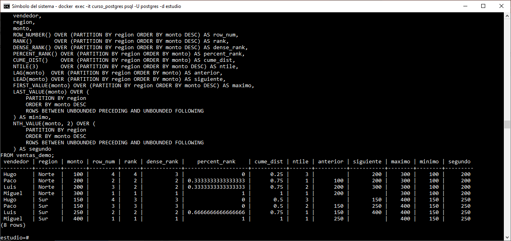

# Demo / POC: Funciones de Ventana - Propósito General

<br/><br/>

## Objetivo

Probar y entender el comportamiento de:

* Ranking
* Distribución
* Navegación (lag/lead)
* Acceso por posición (first/last/nth)


<br/><br/>

### 1. Crear tabla ventas_demo

```sql
CREATE TEMP TABLE ventas_demo (
    id SERIAL,
    vendedor TEXT,
    region TEXT,
    monto NUMERIC
);
```


<br/><br>

### 2. Insertar datos  

```sql
INSERT INTO ventas_demo (vendedor, region, monto) VALUES
('Hugo',  'Norte', 100),
('Paco',  'Norte', 200),
('Luis',  'Norte', 200), -- empate
('Miguel','Norte', 300),

('Hugo',  'Sur',   150),
('Paco',  'Sur',   150), -- empate
('Luis',  'Sur',   250),
('Miguel','Sur',   400);
```


<br/><br>

### 3. Tabla base

```sql
SELECT * FROM ventas_demo ORDER BY region, monto;
```

<br/><br>

##  4. Ranking Functions

### 4.1 `row_number()`

```sql
SELECT
    vendedor,
    region,
    monto,
    ROW_NUMBER() OVER (PARTITION BY region ORDER BY monto DESC) AS row_num
FROM ventas_demo;
```

<br/>

* Numera cada fila de forma única, 1,...,9223372036854775807
* BIGING entero con signo de 64 bits 

<br/><br>

### 4.2 `rank()`

```sql
SELECT
    vendedor,
    region,
    monto,
    RANK() OVER (PARTITION BY region ORDER BY monto DESC)
FROM ventas_demo;

```

<br/>

* Ranking con huecos cuando hay empates.

<br/><br>

### 4.3 `dense_rank()`

```sql
SELECT
    vendedor,
    region,
    monto,
    DENSE_RANK() OVER (PARTITION BY region ORDER BY monto DESC)
FROM ventas_demo;

```

<br/>

* Ranking sin huecos cuando hay empates.

<br/><br>

## 5. Distribución

### 5.1 `percent_rank()`

```sql
SELECT
    vendedor,
    region,
    monto,
    PERCENT_RANK() OVER (PARTITION BY region ORDER BY monto) AS percent_rank
FROM ventas_demo;
```

<br/>

* Posición relativa (0 a 1) dentro del grupo.
* Va de **0 a 1**
* Fórmula: (rank - 1) / (n - 1)

<br/><br>

### 5.2 `cume_dist()`

```sql
SELECT
    vendedor,
    region,
    monto,
    CUME_DIST() OVER (PARTITION BY region ORDER BY monto)
FROM ventas_demo;

```

<br/>

* % acumulado de filas hasta la actual
* Ejemplo: 0.75 = está en el 75% superior

<br/><br>

### 5.3 `ntile(3)`

```sql
SELECT
    vendedor,
    region,
    monto,
    NTILE(3) OVER (PARTITION BY region ORDER BY monto DESC) AS grupo
FROM ventas_demo;
```

<br/>

* Divide filas en n grupos, por ejemplo:
* Cuartiles (*Q*) divide en 4 partes, cada parte representa 25%
* Quintiles (*K*) divide en 5 partes, cada parte representa 20%
* Deciles (*D*) divice en 10 partes, cada parte representa el 10%

<br/><br>

##  6. Navegación

### 6.1 `lag()`

```sql
SELECT
    vendedor,
    region,
    monto,
    LAG(monto) OVER (PARTITION BY region ORDER BY monto) AS anterior
FROM ventas_demo;
```

<br/>

* Valor anterior (comparaciones temporales)

<br/><br>

### 6.2 `lead()`

```sql
SELECT
    vendedor,
    region,
    monto,
    LEAD(monto) OVER (PARTITION BY region ORDER BY monto) AS siguiente
FROM ventas_demo;

```

<br/>

* Valor Siguiente 

<br/><br>

## 7. Acceso por posición

Estas funciones dependen del **window frame**, no solo del ORDER BY.

### 7.1 `first_value()`

```sql
SELECT
    region,
    vendedor,
    monto,
    FIRST_VALUE(monto) OVER (PARTITION BY region ORDER BY monto DESC) AS mayor_venta,
    FIRST_VALUE(monto) OVER (
        PARTITION BY region 
        ORDER BY monto DESC
        RANGE BETWEEN UNBOUNDED PRECEDING AND CURRENT ROW
    ) AS mayor_venta
FROM ventas_demo;
```

<br/>

* Primer valor 

<br/><br>

### 7.2 `last_value()`  

```sql
SELECT
    region,
    vendedor,
    monto,
    LAST_VALUE(monto) OVER (
            PARTITION BY region 
            ORDER BY monto DESC 
            ROWS BETWEEN UNBOUNDED PRECEDING AND UNBOUNDED FOLLOWING
) AS menor_venta
FROM ventas_demo;
```

<br/>

* Último valor (depende del frame)
* Sin `ROWS BETWEEN`, nO funciona como espera

<br/><br>

### 7.3 `nth_value()`

```sql
SELECT
    region,
    vendedor,
    monto,
NTH_VALUE(monto, 2) OVER (
    PARTITION BY region
    ORDER BY monto DESC
    ROWS BETWEEN UNBOUNDED PRECEDING AND UNBOUNDED FOLLOWING
) AS segundo_mejor
FROM ventas_demo; 
```

<br/>

* Valor en posición específica.

<br/><br>

## Consulta con todas las funciones de ventana

```sql
SELECT
    vendedor,
    region,
    monto,

    ROW_NUMBER() OVER (PARTITION BY region ORDER BY monto DESC) AS row_num,
    RANK()       OVER (PARTITION BY region ORDER BY monto DESC) AS rank,
    DENSE_RANK() OVER (PARTITION BY region ORDER BY monto DESC) AS dense_rank,

    PERCENT_RANK() OVER (PARTITION BY region ORDER BY monto) AS percent_rank,
    CUME_DIST()    OVER (PARTITION BY region ORDER BY monto) AS cume_dist,
    NTILE(3)       OVER (PARTITION BY region ORDER BY monto DESC) AS ntile,

    LAG(monto)  OVER (PARTITION BY region ORDER BY monto) AS anterior,
    LEAD(monto) OVER (PARTITION BY region ORDER BY monto) AS siguiente,

    FIRST_VALUE(monto) OVER (PARTITION BY region ORDER BY monto DESC) AS maximo,

    LAST_VALUE(monto) OVER (
        PARTITION BY region
        ORDER BY monto DESC
        ROWS BETWEEN UNBOUNDED PRECEDING AND UNBOUNDED FOLLOWING
    ) AS minimo,

    NTH_VALUE(monto, 2) OVER (
        PARTITION BY region
        ORDER BY monto DESC
        ROWS BETWEEN UNBOUNDED PRECEDING AND UNBOUNDED FOLLOWING
    ) AS segundo

FROM ventas_demo;
```

<br/><br/>

## Resultado esperado

<br/>


<br/><br>

### Consulta con funciones de agregación usadas como funciones de ventana

```sql

SELECT
    id,
    vendedor,
    region,
    monto,

    -- Promedio por región (cohorte)
    AVG(monto) OVER (PARTITION BY region) AS promedio_region,

    -- Suma acumulada global (ordenada por id)
    SUM(monto) OVER (ORDER BY id) AS acumulado_global,

    -- Conteo por región
    COUNT(*) OVER (PARTITION BY region) AS total_registros_region,

    -- Máximo por región
    MAX(monto) OVER (PARTITION BY region) AS max_region,

    -- Mínimo por región
    MIN(monto) OVER (PARTITION BY region) AS min_region

FROM ventas_demo
ORDER BY id;

```


<br/><br/>

### Resultado esperado

<br/>


<br/><br>

## Tablas de ayuda 

### Funiones de Ventana 


| Función          | ¿Para qué sirve?                                     | Ejemplo rápido                                                     |
| ---------------- | ---------------------------------------------------- | ------------------------------------------------------------------ |
| `row_number()`   | Numera cada fila de forma única dentro de la cohorte | `row_number() OVER (PARTITION BY categoria ORDER BY ventas DESC)`  |
| `rank()`         | Ranking con huecos cuando hay empates                | `rank() OVER (ORDER BY ventas DESC)`                               |
| `dense_rank()`   | Ranking sin huecos                                   | `dense_rank() OVER (ORDER BY ventas DESC)`                         |
| `percent_rank()` | Posición relativa (0 a 1) dentro del grupo           | `percent_rank() OVER (ORDER BY ventas)`                            |
| `cume_dist()`    | % acumulado de filas hasta la actual                 | `cume_dist() OVER (ORDER BY ventas)`                               |
| `ntile(n)`       | Divide filas en *n* grupos (ej. cuartiles)           | `ntile(4) OVER (ORDER BY ventas)`                                  |
| `lag()`          | Valor anterior (comparaciones temporales)            | `lag(ventas) OVER (ORDER BY fecha)`                                |
| `lead()`         | Valor siguiente                                      | `lead(ventas) OVER (ORDER BY fecha)`                               |
| `first_value()`  | Primer valor de la cohorte                           | `first_value(ventas) OVER (PARTITION BY categoria ORDER BY fecha)` |
| `last_value()`   | Último valor (depende del frame)                     | `last_value(ventas) OVER (...)`                                    |
| `nth_value()`    | Valor en posición específica                         | `nth_value(ventas, 2) OVER (...)`                                  |


<br/><br>


### Funciones agregadas como ventana  

| Función   | ¿Para qué sirve?                    | Ejemplo                                     |
| --------- | ----------------------------------- | ------------------------------------------- |
| `avg()`   | Promedio sin agrupar filas          | `avg(ventas) OVER (PARTITION BY categoria)` |
| `sum()`   | Acumulados o totales por cohorte    | `sum(ventas) OVER (ORDER BY fecha)`         |
| `count()` | Conteo por cohorte                  | `count(*) OVER (PARTITION BY categoria)`    |
| `max()`   | Máximo por grupo sin perder detalle | `max(ventas) OVER (PARTITION BY categoria)` |
| `min()`   | Mínimo por grupo                    | `min(ventas) OVER (PARTITION BY categoria)` |


<br/><br>

## Conceptos clave 

### 1. NO agrupan filas

* A diferencia de `GROUP BY`, aquí **no pierdes detalle**
* Cada fila conserva su contexto

<br/>

### 2. Cohortes 

```sql
OVER (PARTITION BY categoria)
```

* Define el “grupo lógico” donde se calcula la función

<br>

### 3. Orden 

```sql
OVER (ORDER BY fecha)
```

* Define la secuencia (ej. mes, año, etc)

<br/><br>

### 4. Window Frame

Ejemplo:

```sql
SUM(ventas) OVER (
    ORDER BY fecha
    ROWS BETWEEN UNBOUNDED PRECEDING AND CURRENT ROW
)
```

* Esto define **acumulados**


<br/><br>

##  Errores comunes 

* `last_value()` no funciona como esperan necesita frame
* Olvidar `ORDER BY` en `lag()` / `lead()`
* Confundir `rank()` vs `dense_rank()`
* Creer que es igual a `GROUP BY`

<br/><br>

## Más notas:
* Si la función de ventana habla de posición, ranking o anterior/siguiente, necesita ORDER BY
* Ranking implica "ordenar para comparar"
* Navegación implica "moverse entre filas"
* Agregación implica "acumular o resumir dentro de una ventana"


<br/><br>

### A nivel negocio

| Caso                    | Función          |
| ----------------------- | ---------------- |
| Top clientes            | `rank()`         |
| Crecimiento mes a mes   | `lag()`          |
| Segmentación (Top 25%)  | `ntile()`        |
| Participación acumulada | `cume_dist()`    |
| Posición relativa       | `percent_rank()` |


<br/><br/>

## Referencias

- [Window Functionss](https://www.postgresql.org/docs/16/functions-window.html)
- [PostgreSQL 16.13 Documentation](https://www.postgresql.org/docs/16/index.html)

 
