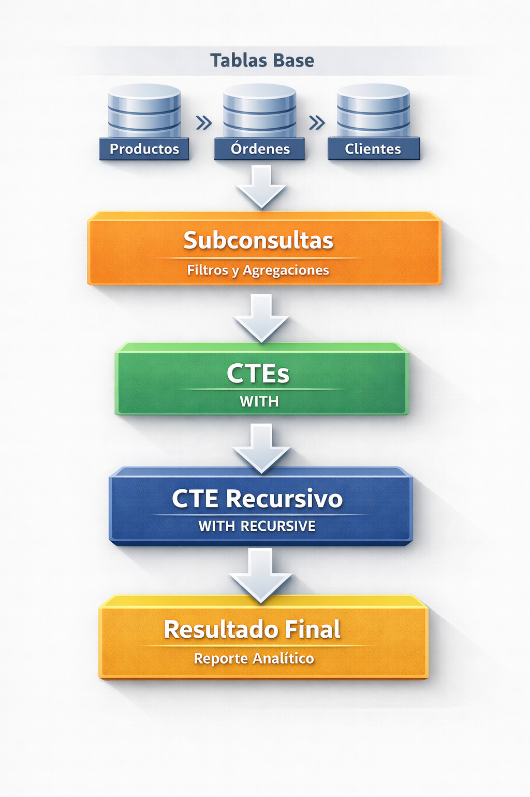

# Práctica 3.1 Creación de Consultas con Subconsultas y CTEs

<br/><br/>

## Objetivos

Al completar este práctica, serás capaz de:

- Escribir subconsultas correlacionadas y no correlacionadas en cláusulas `SELECT`, `FROM` y `WHERE` para filtrar y transformar datos del dataset de ventas.
- Crear CTEs con la cláusula `WITH` para estructurar lógica analítica compleja en pasos legibles y reutilizables.
- Implementar CTEs recursivos (`WITH RECURSIVE`) para navegar jerarquías de categorías padre-hijo y árboles de empleados.
- Comparar el rendimiento y la legibilidad entre subconsultas anidadas y CTEs equivalentes usando `EXPLAIN ANALYZE`.
- Aplicar CTEs encadenados para construir pipelines analíticos paso a paso sobre datos de ventas.

<br/><br/>

## Objetivo Visual

<p align="center">
  
</p>

<br/><br/>

## Prerrequisitos

### Conocimientos Requeridos

- Práctica 2.1 completado con el dataset de ventas cargado en PostgreSQL.
- Dominio de `SELECT`, `JOIN` (INNER, LEFT, RIGHT) y `GROUP BY` con funciones de agregación.
- Comprensión básica de claves primarias, claves foráneas y relaciones entre tablas.
- Familiaridad con el cliente `psql` o pgAdmin 4 para ejecutar consultas SQL.

### Acceso Requerido

- Contenedor Docker de PostgreSQL 16 en ejecución.
- Acceso al cliente `psql` dentro del contenedor o desde el host.
- pgAdmin 4 disponible en `http://localhost:8080` (opcional, para visualización del plan de ejecución).
- Base de datos `ventas_db` con el esquema y datos de la práctica 2.1.

<br/><br/>

### Configuración Inicial

Antes de comenzar, verifica que el entorno de la práctica anterior:

```bash
# Verificar que el contenedor de PostgreSQL está en ejecución
docker ps --filter "name=curso_postgres"

# Si el contenedor está detenido, iniciarlo
docker start curso_postgres

# Verificar la conexión a la base de datos ventas_db
docker exec -it curso_postgres psql -U postgres -d ventas_db -c "\dt"
```

Si el comando anterior muestra las tablas `productos`, `clientes`, `ordenes` y `detalle_ordenes`, el entorno está listo. En caso contrario, consulta la sección **Solución de Problemas** al final de esta práctica.

<br/><br/>

## Instrucciones 

### Paso 1: Ampliar el Esquema con Tablas Jerárquicas

1. Conéctate al contenedor de PostgreSQL y accede a la base de datos `ventas_db`:

   ```bash
   docker exec -it curso_postgres psql -U postgres -d ventas_db
   ```

2. Crea la tabla `categorias` con soporte de jerarquía padre-hijo:

   ```sql
   -- Tabla de categorías con jerarquía padre-hijo
   CREATE TABLE IF NOT EXISTS categorias (
       category_id   SERIAL PRIMARY KEY,
       category_name VARCHAR(100) NOT NULL,
       parent_id     INTEGER REFERENCES categorias(category_id),
       description   TEXT,
       created_at    TIMESTAMP DEFAULT CURRENT_TIMESTAMP
   );

   -- Comentario descriptivo en la tabla
   COMMENT ON TABLE categorias IS 'Jerarquía de categorías de productos (padre-hijo)';
   COMMENT ON COLUMN categorias.parent_id IS 'NULL indica categoría raíz; referencia a category_id del padre';
   ```

3. Inserta los datos de categorías con tres niveles jerárquicos:

   ```sql
   -- Nivel 1: Categorías raíz (parent_id = NULL)
   INSERT INTO categorias (category_name, parent_id, description) VALUES
   ('Electrónica',       NULL, 'Dispositivos y equipos electrónicos'),
   ('Ropa y Moda',       NULL, 'Prendas de vestir y accesorios'),
   ('Hogar y Jardín',    NULL, 'Artículos para el hogar y jardín'),
   ('Deportes',          NULL, 'Equipamiento y ropa deportiva'),
   ('Libros y Medios',   NULL, 'Libros, música, películas y software');

   -- Nivel 2: Subcategorías (referencia a categorías raíz)
   INSERT INTO categorias (category_name, parent_id, description) VALUES
   ('Smartphones',       1, 'Teléfonos inteligentes y accesorios'),
   ('Laptops',           1, 'Computadoras portátiles'),
   ('Audio',             1, 'Auriculares, altavoces y equipos de sonido'),
   ('Cámaras',           1, 'Cámaras fotográficas y de video'),
   ('Ropa Masculina',    2, 'Prendas para hombre'),
   ('Ropa Femenina',     2, 'Prendas para mujer'),
   ('Calzado',           2, 'Zapatos y zapatillas'),
   ('Muebles',           3, 'Muebles para interiores y exteriores'),
   ('Decoración',        3, 'Artículos decorativos para el hogar'),
   ('Jardín',            3, 'Herramientas y plantas para jardín'),
   ('Fútbol',            4, 'Equipamiento de fútbol'),
   ('Ciclismo',          4, 'Bicicletas y accesorios'),
   ('Fitness',           4, 'Equipos de gimnasio y fitness'),
   ('Novelas',           5, 'Ficción y literatura'),
   ('Técnicos',          5, 'Libros técnicos y de programación');

   -- Nivel 3: Sub-subcategorías
   INSERT INTO categorias (category_name, parent_id, description) VALUES
   ('iPhone',            6,  'Smartphones de Apple'),
   ('Android',           6,  'Smartphones con sistema Android'),
   ('Gaming Laptops',    7,  'Laptops para videojuegos de alto rendimiento'),
   ('Ultrabooks',        7,  'Laptops delgadas y livianas'),
   ('Auriculares',       8,  'Auriculares con y sin cable'),
   ('Altavoces',         8,  'Altavoces portátiles y de escritorio');
   ```

4. Crea la tabla `employees` con estructura de reporte jerárquico:

   ```sql
   -- Tabla de empleados con jerarquía de reporte
   CREATE TABLE IF NOT EXISTS employees (
       employee_id   SERIAL PRIMARY KEY,
       first_name    VARCHAR(50)  NOT NULL,
       last_name     VARCHAR(50)  NOT NULL,
       job_title     VARCHAR(100) NOT NULL,
       department    VARCHAR(50)  NOT NULL,
       manager_id    INTEGER REFERENCES employees(employee_id),
       hire_date     DATE         NOT NULL,
       salary        NUMERIC(10,2) NOT NULL,
       email         VARCHAR(100) UNIQUE NOT NULL
   );

   COMMENT ON TABLE employees IS 'Estructura organizacional con jerarquía de reporte manager-subordinado';
   COMMENT ON COLUMN employees.manager_id IS 'NULL indica que el empleado es CEO o director sin jefe directo';
   ```

5. Inserta los datos de empleados con cuatro niveles organizacionales:

   ```sql
   -- Nivel 1: CEO
   INSERT INTO employees (first_name, last_name, job_title, department, manager_id, hire_date, salary, email) VALUES
   ('Carlos',    'Mendoza',   'CEO',                      'Dirección',   NULL, '2015-01-15', 95000.00, 'c.mendoza@empresa.com');

   -- Nivel 2: Directores (reportan al CEO, employee_id=1)
   INSERT INTO employees (first_name, last_name, job_title, department, manager_id, hire_date, salary, email) VALUES
   ('Ana',       'Rodríguez', 'Directora de Ventas',      'Ventas',         1, '2016-03-01', 72000.00, 'a.rodriguez@empresa.com'),
   ('Luis',      'García',    'Director de Marketing',    'Marketing',      1, '2016-06-15', 68000.00, 'l.garcia@empresa.com'),
   ('Sofía',     'López',     'Directora de Operaciones', 'Operaciones',    1, '2017-01-10', 70000.00, 's.lopez@empresa.com');

   -- Nivel 3: Gerentes (reportan a directores)
   INSERT INTO employees (first_name, last_name, job_title, department, manager_id, hire_date, salary, email) VALUES
   ('Pedro',     'Martínez',  'Gerente de Ventas Norte',  'Ventas',         2, '2018-02-20', 52000.00, 'p.martinez@empresa.com'),
   ('Laura',     'Sánchez',   'Gerente de Ventas Sur',    'Ventas',         2, '2018-05-10', 51000.00, 'l.sanchez@empresa.com'),
   ('Diego',     'Torres',    'Gerente de Campañas',      'Marketing',      3, '2019-01-08', 48000.00, 'd.torres@empresa.com'),
   ('Valentina', 'Flores',    'Gerente de Logística',     'Operaciones',    4, '2018-11-15', 50000.00, 'v.flores@empresa.com');

   -- Nivel 4: Analistas y ejecutivos (reportan a gerentes)
   INSERT INTO employees (first_name, last_name, job_title, department, manager_id, hire_date, salary, email) VALUES
   ('Marcos',    'Jiménez',   'Ejecutivo de Ventas',      'Ventas',         5, '2020-03-01', 38000.00, 'm.jimenez@empresa.com'),
   ('Camila',    'Ruiz',      'Ejecutiva de Ventas',      'Ventas',         5, '2020-07-15', 37500.00, 'c.ruiz@empresa.com'),
   ('Andrés',    'Morales',   'Ejecutivo de Ventas',      'Ventas',         6, '2021-01-10', 36000.00, 'a.morales@empresa.com'),
   ('Isabella',  'Castro',    'Analista de Marketing',    'Marketing',      7, '2021-04-20', 35000.00, 'i.castro@empresa.com'),
   ('Sebastián', 'Vargas',    'Analista de Logística',    'Operaciones',    8, '2022-02-28', 34000.00, 'se.vargas@empresa.com');
   ```

6. Agrega la columna `category_id` a la tabla `productos` y actualiza los datos:

   ```sql
   -- Agregar columna de categoría a productos (si no existe)
   ALTER TABLE productos
       ADD COLUMN IF NOT EXISTS category_id INTEGER REFERENCES categorias(category_id);

   -- Asignar categorías a los productos existentes de forma distribuida
   -- Asumiendo que productos tiene al menos 20 registros de la práctica anterior
   UPDATE productos SET category_id = (
       CASE
           WHEN id_producto % 21 IN (0, 1)  THEN 16  -- iPhone
           WHEN id_producto % 21 IN (2, 3)  THEN 17  -- Android
           WHEN id_producto % 21 IN (4)     THEN 18  -- Gaming Laptops
           WHEN id_producto % 21 IN (5)     THEN 19  -- Ultrabooks
           WHEN id_producto % 21 IN (6, 7)  THEN 20  -- Auriculares
           WHEN id_producto % 21 IN (8)     THEN 21  -- Altavoces
           WHEN id_producto % 21 IN (9, 10) THEN 10  -- Ropa Masculina
           WHEN id_producto % 21 IN (11)    THEN 11  -- Ropa Femenina
           WHEN id_producto % 21 IN (12)    THEN 12  -- Calzado
           WHEN id_producto % 21 IN (13)    THEN 13  -- Muebles
           WHEN id_producto % 21 IN (14)    THEN 15  -- Jardín
           WHEN id_producto % 21 IN (15)    THEN 16  -- Fútbol (reasignado a iPhone por mod)
           WHEN id_producto % 21 IN (16)    THEN 17  -- Ciclismo
           WHEN id_producto % 21 IN (17)    THEN 18  -- Fitness
           WHEN id_producto % 21 IN (18)    THEN 14  -- Novelas
           WHEN id_producto % 21 IN (19)    THEN 15  -- Técnicos
           ELSE 9                                    -- Cámaras (default)
       END
   );

   -- Verificar que todos los productos tienen categoría asignada
   SELECT COUNT(*) AS productos_sin_categoria
   FROM productos
   WHERE category_id IS NULL;
   ```

<br/>

**Verificación:**

```sql
-- Verificar estructura de categorías
SELECT category_id, category_name, parent_id,
       CASE WHEN parent_id IS NULL THEN 'Raíz'
            ELSE 'Subcategoría'
       END AS nivel
FROM categorias
ORDER BY parent_id NULLS FIRST, category_id
LIMIT 10;

-- Verificar estructura de empleados
SELECT employee_id, first_name || ' ' || last_name AS nombre,
       job_title, manager_id
FROM employees
ORDER BY manager_id NULLS FIRST, employee_id;
```

- Confirma que existen 21 categorías en total (5 raíz + 16 hijos)
- Confirma que existen 13 empleados con la jerarquía correcta
- Confirma que `productos.category_id` no tiene valores NULL


<br/><br/>

### Paso 2: Subconsultas No Correlacionadas en WHERE y FROM


1. Escribe una subconsulta no correlacionada en `WHERE` para encontrar productos con precio superior al promedio global:

   ```sql
   -- Subconsulta no correlacionada en WHERE
   -- La subconsulta se ejecuta UNA SOLA VEZ y devuelve un escalar
   SELECT
       p.id_producto,
       p.product_name,
       p.price,
       ROUND(p.price - (SELECT AVG(price) FROM productos), 2) AS diferencia_vs_promedio
   FROM productos p
   WHERE p.price > (
       SELECT AVG(price)
       FROM productos
   )
   ORDER BY p.price DESC
   LIMIT 10;
   ```

2. Usa una subconsulta en `WHERE` con `IN` para obtener productos que han generado más de 50 ventas:

   ```sql
   -- Subconsulta no correlacionada con IN
   -- Devuelve un conjunto de valores (no un escalar)
   SELECT
       p.id_producto,
       p.product_name,
       p.price
   FROM productos p
   WHERE p.id_producto IN (
       SELECT oi.id_producto
       FROM order_items oi
       GROUP BY oi.id_producto
       HAVING SUM(oi.quantity) > 50
   )
   ORDER BY p.product_name;
   ```

3. Construye una tabla derivada en la cláusula `FROM` (subconsulta como tabla virtual):

   ```sql
   -- Subconsulta en FROM (tabla derivada / derived table)
   -- La subconsulta genera un conjunto de resultados que se trata como tabla
   SELECT
       resumen.category_id,
       c.category_name,
       resumen.total_productos,
       resumen.precio_promedio,
       resumen.precio_maximo,
       resumen.precio_minimo
   FROM (
       SELECT
           p.category_id,
           COUNT(*)            AS total_productos,
           ROUND(AVG(p.price), 2) AS precio_promedio,
           MAX(p.price)        AS precio_maximo,
           MIN(p.price)        AS precio_minimo
       FROM productos p
       WHERE p.category_id IS NOT NULL
       GROUP BY p.category_id
   ) AS resumen
   INNER JOIN categorias c ON c.category_id = resumen.category_id
   ORDER BY resumen.precio_promedio DESC;
   ```

4. Usa `EXISTS` con una subconsulta para encontrar clientes que han realizado al menos un pedido en los últimos 6 meses:

   ```sql
   -- Subconsulta con EXISTS (más eficiente que IN para conjuntos grandes)
   SELECT
       cu.customer_id,
       cu.first_name || ' ' || cu.last_name AS cliente,
       cu.email
   FROM customers cu
   WHERE EXISTS (
       SELECT 1
       FROM orders o
       WHERE o.customer_id = cu.customer_id
         AND o.order_date >= CURRENT_DATE - INTERVAL '6 months'
   )
   ORDER BY cu.last_name, cu.first_name
   LIMIT 10;

   ```

<br/>

**Salida Esperada:**

```
-- Consulta 1: productos sobre el promedio
 id_producto | product_name | price | diferencia_vs_promedio
------------+--------------+-------+------------------------
 ...        | ...          | ...   | ...
(N rows)

-- Consulta 3: resumen por categoría
 category_id | category_name  | total_productos | precio_promedio | precio_maximo | precio_minimo
-------------+----------------+-----------------+-----------------+---------------+--------------
 ...         | ...            | ...             | ...             | ...           | ...
(N rows)
```

<br/>


**Verificación:**

```sql
-- Confirmar que la subconsulta escalar devuelve exactamente 1 valor
SELECT ROUND(AVG(price), 2) AS promedio_global FROM productos;

-- Confirmar que EXISTS y IN producen el mismo resultado (deben coincidir)
SELECT COUNT(*) FROM customers cu
WHERE EXISTS (SELECT 1 FROM orders o WHERE o.customer_id = cu.customer_id
              AND o.order_date >= CURRENT_DATE - INTERVAL '6 months');

SELECT COUNT(DISTINCT o.customer_id) FROM orders o
WHERE o.order_date >= CURRENT_DATE - INTERVAL '6 months';
```

- Ambos `COUNT` deben devolver el mismo número
- La tabla derivada en `FROM` debe mostrar al menos una fila por categoría con productos asignados


<br/><br/>

### Paso 3: Subconsultas Correlacionadas en SELECT y WHERE

1. Escribe una subconsulta correlacionada en `SELECT` para mostrar el precio de cada producto junto con el promedio de su categoría específica:

   ```sql

   -- Subconsulta correlacionada en SELECT
   -- Se ejecuta UNA VEZ POR FILA del query externo
   -- La referencia p.category_id "correlaciona" la subconsulta con la fila actual

   SELECT
       p.id_producto,
       p.product_name,
       p.price                                                    AS precio_producto,
       (
           SELECT ROUND(AVG(p2.price), 2)
           FROM productos p2
           WHERE p2.category_id = p.category_id   -- <-- correlación
       )                                                          AS promedio_categoria,
       ROUND(
           p.price - (
               SELECT AVG(p2.price)
               FROM productos p2
               WHERE p2.category_id = p.category_id
           ),
       2)                                                         AS diferencia_vs_cat
   FROM productos p
   WHERE p.category_id IS NOT NULL
   ORDER BY ABS(
       p.price - (
           SELECT AVG(p2.price)
           FROM productos p2
           WHERE p2.category_id = p.category_id
       )
   ) DESC
   LIMIT 15;

   ```

2. Subconsulta correlacionada en `WHERE` para encontrar productos cuyo precio supera el promedio de su propia categoría:

   ```sql

   -- Subconsulta correlacionada en WHERE
   -- Filtra productos que son "caros" DENTRO de su categoría

   SELECT
       p.id_producto,
       p.product_name,
       c.category_name,
       p.price
   FROM productos p
   INNER JOIN categorias c ON c.category_id = p.category_id
   WHERE p.price > (
       SELECT AVG(p2.price)
       FROM productos p2
       WHERE p2.category_id = p.category_id   -- <-- correlación con la fila externa
   )
   ORDER BY c.category_name, p.price DESC;

   ```

3. Subconsulta correlacionada para obtener el pedido más reciente de cada cliente:

   ```sql

   -- Subconsulta correlacionada para obtener el máximo por grupo
   -- Patrón clásico: "el último X de cada Y"
   SELECT
       cu.customer_id,
       cu.first_name || ' ' || cu.last_name AS cliente,
       (
           SELECT MAX(o.order_date)
           FROM orders o
           WHERE o.customer_id = cu.customer_id   -- <-- correlación
       )                                           AS ultimo_pedido,
       (
           SELECT COUNT(*)
           FROM orders o
           WHERE o.customer_id = cu.customer_id
       )                                           AS total_pedidos
   FROM customers cu
   ORDER BY ultimo_pedido DESC NULLS LAST
   LIMIT 10;

   ```

4. Observa el plan de ejecución de la subconsulta correlacionada para entender su costo:

   ```sql

   -- Analizar el plan de ejecución de la subconsulta correlacionada
   EXPLAIN (ANALYZE, BUFFERS, FORMAT TEXT)
   SELECT
       p.id_producto,
       p.product_name,
       p.price,
       (
           SELECT ROUND(AVG(p2.price), 2)
           FROM productos p2
           WHERE p2.category_id = p.category_id
       ) AS promedio_categoria
   FROM productos p
   WHERE p.category_id IS NOT NULL;

   ```

**Salida Esperada:**

<br/>

```sql

-- Consulta 2: productos sobre el promedio de su categoría
 id_producto | product_name | category_name | price
------------+--------------+---------------+-------
 ...        | ...          | Smartphones   | ...
 ...        | ...          | Laptops       | ...
(N rows)

-- Plan de ejecución (fragmento)
Seq Scan on productos p  (cost=... rows=... width=...)
  SubPlan 1
    ->  Aggregate  (cost=... rows=1 width=32)
          ->  Seq Scan on productos p2  (cost=... rows=... width=...)
                Filter: (category_id = p.category_id)
```

<br/>

**Verificación:**

```sql
-- Verificar que la subconsulta correlacionada y el JOIN producen resultados equivalentes
-- Método 1: subconsulta correlacionada
SELECT COUNT(*) AS total_sobre_promedio_subquery
FROM productos p
WHERE p.price > (
    SELECT AVG(p2.price) FROM productos p2 WHERE p2.category_id = p.category_id
);

-- Método 2: JOIN con GROUP BY (equivalente, generalmente más eficiente)
SELECT COUNT(*) AS total_sobre_promedio_join
FROM productos p
INNER JOIN (
    SELECT category_id, AVG(price) AS avg_price
    FROM productos
    GROUP BY category_id
) cat_avg ON cat_avg.category_id = p.category_id
WHERE p.price > cat_avg.avg_price;
```

<br/>


- Ambos `COUNT` deben devolver el mismo número, confirmando equivalencia lógica
- Observa en el plan de ejecución la aparición de `SubPlan` o `InitPlan` que indica subconsulta correlacionada

<br/>
<br/>


### Paso 4: Introducción a CTEs con la Cláusula WITH

1. Refactoriza la tabla derivada del Paso 2 usando un CTE básico:

   ```sql
   -- CTE básico: equivalente a la subconsulta en FROM del Paso 2
   -- El CTE se define ANTES del SELECT principal y tiene un nombre
   WITH resumen_categorias AS (
       -- Este bloque es idéntico a la subconsulta en FROM del Paso 2
       SELECT
           p.category_id,
           COUNT(*)               AS total_productos,
           ROUND(AVG(p.price), 2) AS precio_promedio,
           MAX(p.price)           AS precio_maximo,
           MIN(p.price)           AS precio_minimo
       FROM productos p
       WHERE p.category_id IS NOT NULL
       GROUP BY p.category_id
   )
   -- Ahora el SELECT principal referencia el CTE por nombre
   SELECT
       rc.category_id,
       c.category_name,
       rc.total_productos,
       rc.precio_promedio,
       rc.precio_maximo,
       rc.precio_minimo
   FROM resumen_categorias rc
   INNER JOIN categorias c ON c.category_id = rc.category_id
   ORDER BY rc.precio_promedio DESC;
   ```

2. Crea un CTE encadenado (múltiples CTEs en secuencia) para construir un pipeline analítico de ventas:

   ```sql
   -- CTEs encadenados: cada CTE puede referenciar CTEs anteriores
   WITH
   -- CTE 1: calcular el total de ventas por producto
   ventas_por_producto AS (
       SELECT
           oi.id_producto,
           SUM(oi.quantity)                    AS unidades_vendidas,
           SUM(oi.quantity * oi.unit_price)    AS ingreso_total,
           COUNT(DISTINCT oi.order_id)         AS num_pedidos
       FROM order_items oi
       INNER JOIN orders o ON o.order_id = oi.order_id
       WHERE o.status != 'cancelled'
       GROUP BY oi.id_producto
   ),
   -- CTE 2: enriquecer con datos del producto y su categoría
   productos_enriquecidos AS (
       SELECT
           p.id_producto,
           p.product_name,
           p.category_id,
           p.price                         AS precio_actual,
           vp.unidades_vendidas,
           vp.ingreso_total,
           vp.num_pedidos
       FROM productos p
       INNER JOIN ventas_por_producto vp ON vp.id_producto = p.id_producto
   ),
   -- CTE 3: calcular el ranking dentro de cada categoría
   ranking_por_categoria AS (
       SELECT
           pe.*,
           c.category_name,
           RANK() OVER (
               PARTITION BY pe.category_id
               ORDER BY pe.ingreso_total DESC
           ) AS rank_en_categoria
       FROM productos_enriquecidos pe
       INNER JOIN categorias c ON c.category_id = pe.category_id
   )
   -- Query final: mostrar solo el top 3 por categoría
   SELECT
       category_name,
       rank_en_categoria AS rank,
       product_name,
       precio_actual,
       unidades_vendidas,
       ROUND(ingreso_total, 2) AS ingreso_total
   FROM ranking_por_categoria
   WHERE rank_en_categoria <= 3
   ORDER BY category_name, rank_en_categoria;
   ```

3. Usa un CTE para calcular métricas de clientes y luego segmentarlos:

   ```sql
   -- CTE para segmentación de clientes (patrón RFM simplificado)
   WITH
   metricas_cliente AS (
       SELECT
           cu.customer_id,
           cu.first_name || ' ' || cu.last_name          AS cliente,
           COUNT(DISTINCT o.order_id)                    AS frecuencia,
           SUM(oi.quantity * oi.unit_price)              AS valor_total,
           MAX(o.order_date)                             AS ultima_compra,
           CURRENT_DATE - MAX(o.order_date)              AS dias_desde_ultima
       FROM customers cu
       LEFT JOIN orders o    ON o.customer_id = cu.customer_id
                             AND o.status != 'cancelled'
       LEFT JOIN order_items oi ON oi.order_id = o.order_id
       GROUP BY cu.customer_id, cu.first_name, cu.last_name
   ),
   clientes_segmentados AS (
       SELECT
           *,
           CASE
               WHEN frecuencia >= 10 AND valor_total >= 5000  THEN 'VIP'
               WHEN frecuencia >= 5  AND valor_total >= 1000  THEN 'Frecuente'
               WHEN frecuencia >= 2                           THEN 'Ocasional'
               WHEN frecuencia = 1                            THEN 'Nuevo'
               ELSE 'Inactivo'
           END AS segmento
       FROM metricas_cliente
   )
   SELECT
       segmento,
       COUNT(*)                          AS num_clientes,
       ROUND(AVG(frecuencia), 1)         AS frecuencia_promedio,
       ROUND(AVG(valor_total), 2)        AS valor_promedio,
       ROUND(AVG(dias_desde_ultima), 0)  AS dias_promedio
   FROM clientes_segmentados
   GROUP BY segmento
   ORDER BY num_clientes DESC;
   ```

<br/>

**Salida Esperada:**

```sql

-- Consulta 2: top 3 por categoría
 category_name  | rank | product_name | precio_actual | unidades_vendidas | ingreso_total
----------------+------+--------------+---------------+-------------------+--------------
 Android        |    1 | ...          |          ...  |               ... |          ...
 Android        |    2 | ...          |          ...  |               ... |          ...
 Android        |    3 | ...          |          ...  |               ... |          ...
 Auriculares    |    1 | ...          |          ...  |               ... |          ...
(N rows)

-- Consulta 3: segmentación de clientes
 segmento  | num_clientes | frecuencia_promedio | valor_promedio | dias_promedio
-----------+--------------+---------------------+----------------+--------------
 Ocasional |           XX |                 ... |            ... |           ...
 Nuevo     |           XX |                 ... |            ... |           ...
(N rows)
```

<br/>

**Verificación:**

```sql

-- Verificar que el CTE y la subconsulta equivalente producen el mismo resultado
-- Versión con CTE

WITH resumen AS (
    SELECT category_id, ROUND(AVG(price), 2) AS avg_price
    FROM productos GROUP BY category_id
)
SELECT COUNT(*) AS total_cte
FROM productos p
INNER JOIN resumen r ON r.category_id = p.category_id
WHERE p.price > r.avg_price;

-- Versión con subconsulta (debe dar el mismo número)

SELECT COUNT(*) AS total_subquery
FROM productos p
WHERE p.price > (
    SELECT AVG(p2.price) FROM productos p2 WHERE p2.category_id = p.category_id
);

```

<br/>


- Ambos `COUNT` deben coincidir
- Los CTEs encadenados deben ejecutarse sin errores y devolver filas para cada categoría con ventas

<br/>
<br/>


### Paso 5: CTEs Recursivos para Jerarquías

1. Comprende la estructura de un CTE recursivo antes de escribirlo:

   ```sql

   -- ANATOMÍA DE UN CTE RECURSIVO:
   -- WITH RECURSIVE nombre_cte AS (
   --     [PARTE ANCLA]       -- Caso base: filas iniciales (sin recursión)
   --     UNION ALL
   --     [PARTE RECURSIVA]   -- Se ejecuta repetidamente, referenciando nombre_cte
   -- )
   -- SELECT ... FROM nombre_cte;

   -- Primero, exploremos la jerarquía de categorías manualmente
   -- Categorías raíz (nivel 1):

   SELECT category_id, category_name, parent_id
   FROM categorias
   WHERE parent_id IS NULL;

   -- Hijos directos de "Electrónica" (category_id = 1):
   SELECT category_id, category_name, parent_id
   FROM categorias
   WHERE parent_id = 1;

   -- Nietos de "Electrónica" (hijos de sus hijos):
   SELECT category_id, category_name, parent_id
   FROM categorias
   WHERE parent_id IN (
       SELECT category_id FROM categorias WHERE parent_id = 1
   );

   ```

2. Escribe el CTE recursivo para recorrer toda la jerarquía de categorías:

   ```sql

   -- CTE RECURSIVO: Jerarquía completa de categorías
   WITH RECURSIVE jerarquia_categorias AS (

       -- PARTE ANCLA: categorías raíz (punto de partida)
       SELECT
           category_id,
           category_name,
           parent_id,
           0                           AS nivel,          -- nivel 0 = raíz
           category_name::TEXT         AS ruta_completa,  -- ruta comienza con el nombre
           ARRAY[category_id]          AS ids_ruta        -- array para detectar ciclos
       FROM categorias
       WHERE parent_id IS NULL

       UNION ALL

       -- PARTE RECURSIVA: hijos de cada nodo ya procesado
       -- "jc" referencia la iteración anterior del CTE
       SELECT
           c.category_id,
           c.category_name,
           c.parent_id,
           jc.nivel + 1,                                          -- incrementar nivel
           (jc.ruta_completa || ' > ' || c.category_name)::TEXT, -- construir ruta
           jc.ids_ruta || c.category_id                          -- agregar al array
       FROM categorias c
       INNER JOIN jerarquia_categorias jc ON jc.category_id = c.parent_id
       WHERE NOT c.category_id = ANY(jc.ids_ruta)  -- prevenir ciclos infinitos
   )
   SELECT
       nivel,
       REPEAT('  ', nivel) || category_name   AS categoria_indentada,
       ruta_completa,
       category_id,
       parent_id
   FROM jerarquia_categorias
   ORDER BY ruta_completa;

   ```

3. Escribe el CTE recursivo para el árbol de empleados (cadena de mando):

   ```sql

   -- CTE RECURSIVO: Árbol organizacional de empleados
   WITH RECURSIVE cadena_de_mando AS (

       -- PARTE ANCLA: CEO (sin manager)
       SELECT
           employee_id,
           first_name || ' ' || last_name      AS nombre_completo,
           job_title,
           department,
           manager_id,
           0                                   AS nivel_jerarquico,
           (first_name || ' ' || last_name)::TEXT AS cadena,
           salary
       FROM employees
       WHERE manager_id IS NULL   -- CEO: no tiene manager

       UNION ALL

       -- PARTE RECURSIVA: subordinados de cada empleado procesado
       SELECT
           e.employee_id,
           e.first_name || ' ' || e.last_name,
           e.job_title,
           e.department,
           e.manager_id,
           cm.nivel_jerarquico + 1,
           (cm.cadena || ' → ' || e.first_name || ' ' || e.last_name)::TEXT,
           e.salary
       FROM employees e
       INNER JOIN cadena_de_mando cm ON cm.employee_id = e.manager_id
   )
   SELECT
       nivel_jerarquico                                         AS nivel,
       REPEAT('  ', nivel_jerarquico) || nombre_completo       AS empleado,
       job_title,
       department,
       salary,
       cadena                                                   AS cadena_de_reporte
   FROM cadena_de_mando
   ORDER BY cadena;

   ```

4. Usa el CTE recursivo para encontrar todos los subordinados de un manager específico:

   ```sql

   -- Encontrar todos los subordinados (directos e indirectos) de "Ana Rodríguez"
   -- Primero, identificar su employee_id

   SELECT employee_id, first_name, last_name, job_title
   FROM employees
   WHERE first_name = 'Ana' AND last_name = 'Rodríguez';

   ```

   ```sql

   -- CTE recursivo para subordinados de Ana Rodríguez (employee_id = 2)
   WITH RECURSIVE subordinados AS (

       -- ANCLA: el manager de interés
       SELECT
           employee_id,
           first_name || ' ' || last_name AS nombre,
           job_title,
           manager_id,
           0 AS nivel_bajo_manager
       FROM employees
       WHERE employee_id = 2   -- Ana Rodríguez

       UNION ALL

       -- RECURSIVO: sus subordinados directos e indirectos
       SELECT
           e.employee_id,
           e.first_name || ' ' || e.last_name,
           e.job_title,
           e.manager_id,
           s.nivel_bajo_manager + 1
       FROM employees e
       INNER JOIN subordinados s ON s.employee_id = e.manager_id
   )
   SELECT
       nivel_bajo_manager AS nivel,
       nombre,
       job_title
   FROM subordinados
   WHERE nivel_bajo_manager > 0   -- excluir al manager mismo
   ORDER BY nivel_bajo_manager, nombre;

   ```

5. Calcula el total de ventas agregado por rama de la jerarquía de categorías:

   ```sql

   -- Combinar CTE recursivo con datos de ventas
   WITH RECURSIVE jerarquia AS (
       SELECT
           category_id,
           category_name,
           parent_id,
           0 AS nivel,
           category_name::TEXT AS ruta
       FROM categorias
       WHERE parent_id IS NULL

       UNION ALL

       SELECT
           c.category_id,
           c.category_name,
           c.parent_id,
           j.nivel + 1,
           (j.ruta || ' > ' || c.category_name)::TEXT
       FROM categorias c
       INNER JOIN jerarquia j ON j.category_id = c.parent_id
   ),
   ventas_categoria AS (
       SELECT
           p.category_id,
           SUM(oi.quantity * oi.unit_price) AS ventas_directas
       FROM productos p
       INNER JOIN order_items oi ON oi.id_producto = p.id_producto
       INNER JOIN orders o       ON o.order_id = oi.order_id
       WHERE o.status != 'cancelled'
       GROUP BY p.category_id
   )
   SELECT
       j.nivel,
       REPEAT('  ', j.nivel) || j.category_name AS categoria,
       j.ruta,
       COALESCE(vc.ventas_directas, 0)           AS ventas_directas
   FROM jerarquia j
   LEFT JOIN ventas_categoria vc ON vc.category_id = j.category_id
   ORDER BY j.ruta;
   ```

<br/>


**Salida Esperada:**

```
-- Jerarquía de categorías con indentación
 nivel |       categoria_indentada        |              ruta_completa
-------+----------------------------------+------------------------------------------
     0 | Deportes                         | Deportes
     1 |   Ciclismo                       | Deportes > Ciclismo
     1 |   Fitness                        | Deportes > Fitness
     1 |   Fútbol                         | Deportes > Fútbol
     0 | Electrónica                      | Electrónica
     1 |   Audio                          | Electrónica > Audio
     2 |     Altavoces                    | Electrónica > Audio > Altavoces
     2 |     Auriculares                  | Electrónica > Audio > Auriculares
(21 rows)

-- Árbol de empleados
 nivel |           empleado              | job_title
-------+---------------------------------+---------------------------
     0 | Carlos Mendoza                  | CEO
     1 |   Ana Rodríguez                 | Directora de Ventas
     2 |     Laura Sánchez               | Gerente de Ventas Sur
     3 |       Andrés Morales            | Ejecutivo de Ventas
(13 rows)
```

<br/>

**Verificación:**

```sql
-- Verificar que el CTE recursivo encuentra todos los niveles
WITH RECURSIVE jerarquia AS (
    SELECT category_id, category_name, parent_id, 0 AS nivel
    FROM categorias WHERE parent_id IS NULL
    UNION ALL
    SELECT c.category_id, c.category_name, c.parent_id, j.nivel + 1
    FROM categorias c INNER JOIN jerarquia j ON j.category_id = c.parent_id
)
SELECT nivel, COUNT(*) AS categorias_en_nivel
FROM jerarquia
GROUP BY nivel
ORDER BY nivel;
```

- Debe mostrar: nivel 0 → 5 categorías, nivel 1 → 10 categorías, nivel 2 → 6 categorías (total: 21)
- El árbol de empleados debe mostrar exactamente 13 filas con 4 niveles (0 a 3)

<br/>
<br/>


### Paso 6: Comparación de Rendimiento – Subconsultas vs CTEs

1. Escribe la consulta de referencia como subconsulta anidada (versión compleja):

   ```sql
   -- VERSIÓN 1: Subconsultas anidadas
   -- Pregunta: ¿Cuáles son los 5 productos más vendidos de cada categoría raíz,
   --           con su porcentaje del total de ventas de esa categoría?
   SELECT
       cat_raiz.category_name                                          AS categoria_raiz,
       prod_ranking.product_name,
       prod_ranking.ingreso_producto,
       ROUND(
           prod_ranking.ingreso_producto * 100.0 /
           (
               SELECT SUM(oi2.quantity * oi2.unit_price)
               FROM order_items oi2
               INNER JOIN orders o2       ON o2.order_id = oi2.order_id
               INNER JOIN productos p2     ON p2.id_producto = oi2.id_producto
               INNER JOIN categorias c2   ON c2.category_id = p2.category_id
               WHERE o2.status != 'cancelled'
                 AND (
                     c2.category_id = cat_raiz.category_id
                     OR c2.parent_id = cat_raiz.category_id
                     OR c2.parent_id IN (
                         SELECT category_id FROM categorias
                         WHERE parent_id = cat_raiz.category_id
                     )
                 )
           ),
       2)                                                              AS pct_categoria,
       prod_ranking.rank_en_categoria
   FROM (
       SELECT
           p.id_producto,
           p.product_name,
           p.category_id,
           SUM(oi.quantity * oi.unit_price)   AS ingreso_producto,
           RANK() OVER (
               PARTITION BY p.category_id
               ORDER BY SUM(oi.quantity * oi.unit_price) DESC
           )                                  AS rank_en_categoria
       FROM productos p
       INNER JOIN order_items oi ON oi.id_producto = p.id_producto
       INNER JOIN orders o       ON o.order_id = oi.order_id
       WHERE o.status != 'cancelled'
       GROUP BY p.id_producto, p.product_name, p.category_id
   ) prod_ranking
   INNER JOIN categorias cat_leaf  ON cat_leaf.category_id = prod_ranking.category_id
   INNER JOIN categorias cat_raiz  ON (
       cat_raiz.category_id = cat_leaf.parent_id
       OR cat_raiz.category_id = cat_leaf.category_id
   )
   WHERE cat_raiz.parent_id IS NULL
     AND prod_ranking.rank_en_categoria <= 5
   ORDER BY cat_raiz.category_name, prod_ranking.rank_en_categoria;
   ```

2. Reescribe la misma consulta usando CTEs encadenados (versión legible):

   ```sql
   -- VERSIÓN 2: CTEs encadenados (misma lógica, más legible)
   WITH
   -- CTE 1: ventas por producto
   ventas_producto AS (
       SELECT
           p.id_producto,
           p.product_name,
           p.category_id,
           SUM(oi.quantity * oi.unit_price) AS ingreso_producto
       FROM productos p
       INNER JOIN order_items oi ON oi.id_producto = p.id_producto
       INNER JOIN orders o       ON o.order_id = oi.order_id
       WHERE o.status != 'cancelled'
       GROUP BY p.id_producto, p.product_name, p.category_id
   ),
   -- CTE 2: mapear cada categoría hoja a su categoría raíz
   categoria_raiz_map AS (
       SELECT
           hoja.category_id      AS cat_hoja_id,
           COALESCE(raiz.category_id, hoja.category_id) AS cat_raiz_id,
           COALESCE(raiz.category_name, hoja.category_name) AS cat_raiz_nombre
       FROM categorias hoja
       LEFT JOIN categorias raiz ON raiz.category_id = hoja.parent_id
                                 AND raiz.parent_id IS NULL
   ),
   -- CTE 3: ventas totales por categoría raíz
   ventas_por_raiz AS (
       SELECT
           crm.cat_raiz_id,
           SUM(vp.ingreso_producto) AS total_ingreso_raiz
       FROM ventas_producto vp
       INNER JOIN categoria_raiz_map crm ON crm.cat_hoja_id = vp.category_id
       GROUP BY crm.cat_raiz_id
   ),
   -- CTE 4: ranking de productos dentro de su categoría
   productos_rankeados AS (
       SELECT
           vp.*,
           crm.cat_raiz_id,
           crm.cat_raiz_nombre,
           RANK() OVER (
               PARTITION BY crm.cat_raiz_id
               ORDER BY vp.ingreso_producto DESC
           ) AS rank_en_categoria
       FROM ventas_producto vp
       INNER JOIN categoria_raiz_map crm ON crm.cat_hoja_id = vp.category_id
   )
   -- Query final: top 5 por categoría raíz con porcentaje
   SELECT
       pr.cat_raiz_nombre                                              AS categoria_raiz,
       pr.product_name,
       ROUND(pr.ingreso_producto, 2)                                  AS ingreso_producto,
       ROUND(pr.ingreso_producto * 100.0 / vpr.total_ingreso_raiz, 2) AS pct_categoria,
       pr.rank_en_categoria
   FROM productos_rankeados pr
   INNER JOIN ventas_por_raiz vpr ON vpr.cat_raiz_id = pr.cat_raiz_id
   WHERE pr.rank_en_categoria <= 5
   ORDER BY pr.cat_raiz_nombre, pr.rank_en_categoria;
   ```

3. Compara los planes de ejecución de ambas versiones:

   ```sql
   -- Plan de ejecución: Versión con subconsultas anidadas
   EXPLAIN (ANALYZE, COSTS, FORMAT TEXT)
   SELECT
       cat_raiz.category_name AS categoria_raiz,
       prod_ranking.product_name,
       prod_ranking.ingreso_producto,
       prod_ranking.rank_en_categoria
   FROM (
       SELECT
           p.id_producto,
           p.product_name,
           p.category_id,
           SUM(oi.quantity * oi.unit_price) AS ingreso_producto,
           RANK() OVER (
               PARTITION BY p.category_id
               ORDER BY SUM(oi.quantity * oi.unit_price) DESC
           ) AS rank_en_categoria
       FROM productos p
       INNER JOIN order_items oi ON oi.id_producto = p.id_producto
       INNER JOIN orders o       ON o.order_id = oi.order_id
       WHERE o.status != 'cancelled'
       GROUP BY p.id_producto, p.product_name, p.category_id
   ) prod_ranking
   INNER JOIN categorias cat_leaf ON cat_leaf.category_id = prod_ranking.category_id
   INNER JOIN categorias cat_raiz ON cat_raiz.category_id = cat_leaf.parent_id
   WHERE cat_raiz.parent_id IS NULL
     AND prod_ranking.rank_en_categoria <= 5
   ORDER BY cat_raiz.category_name, prod_ranking.rank_en_categoria;
   ```

   ```sql
   -- Plan de ejecución: Versión con CTEs
   EXPLAIN (ANALYZE, COSTS, FORMAT TEXT)
   WITH
   ventas_producto AS (
       SELECT
           p.id_producto,
           p.product_name,
           p.category_id,
           SUM(oi.quantity * oi.unit_price) AS ingreso_producto
       FROM productos p
       INNER JOIN order_items oi ON oi.id_producto = p.id_producto
       INNER JOIN orders o       ON o.order_id = oi.order_id
       WHERE o.status != 'cancelled'
       GROUP BY p.id_producto, p.product_name, p.category_id
   ),
   productos_rankeados AS (
       SELECT
           vp.*,
           c_hoja.parent_id AS cat_raiz_id,
           RANK() OVER (
               PARTITION BY c_hoja.parent_id
               ORDER BY vp.ingreso_producto DESC
           ) AS rank_en_categoria
       FROM ventas_producto vp
       INNER JOIN categorias c_hoja ON c_hoja.category_id = vp.category_id
       WHERE c_hoja.parent_id IS NOT NULL
   )
   SELECT
       c_raiz.category_name AS categoria_raiz,
       pr.product_name,
       ROUND(pr.ingreso_producto, 2) AS ingreso_producto,
       pr.rank_en_categoria
   FROM productos_rankeados pr
   INNER JOIN categorias c_raiz ON c_raiz.category_id = pr.cat_raiz_id
   WHERE pr.rank_en_categoria <= 5
   ORDER BY c_raiz.category_name, pr.rank_en_categoria;
   ```

4. Documenta tus observaciones sobre legibilidad y rendimiento:

   ```sql
   -- Consulta de resumen: comparar tiempos de ejecución
   -- Ejecutar cada versión 3 veces y anotar el tiempo promedio de EXPLAIN ANALYZE
   -- Buscar en la salida: "Execution Time: X.XXX ms"

   -- Nota importante sobre CTEs en PostgreSQL 12+:
   -- Por defecto, los CTEs NO son "optimization fences" desde PostgreSQL 12
   -- El planificador puede "inlinear" el CTE si lo considera más eficiente
   -- Para forzar materialización (útil para CTEs costosos reutilizados):

   WITH ventas_producto AS MATERIALIZED (
       SELECT
           p.id_producto,
           p.product_name,
           p.category_id,
           SUM(oi.quantity * oi.unit_price) AS ingreso_producto
       FROM productos p
       INNER JOIN order_items oi ON oi.id_producto = p.id_producto
       INNER JOIN orders o       ON o.order_id = oi.order_id
       WHERE o.status != 'cancelled'
       GROUP BY p.id_producto, p.product_name, p.category_id
   )
   SELECT COUNT(*), SUM(ingreso_producto)
   FROM ventas_producto;
   ```

<br/>

**Salida Esperada:**

```sql
-- Comparación de planes (fragmento)
-- Subconsultas: el planificador puede mostrar más pasos anidados
Hash Join  (cost=... rows=... width=...)
  ->  WindowAgg  (cost=... rows=... width=...)
        ->  HashAggregate  (cost=... rows=... width=...)
  ->  Hash  (cost=... rows=... width=...)

-- CTEs: puede mostrar "CTE Scan" o inlining del CTE
CTE ventas_producto
  ->  HashAggregate  (cost=... rows=... width=...)
CTE productos_rankeados
  ->  WindowAgg  (cost=... rows=...)

Execution Time: X.XXX ms   <-- comparar entre versiones
```

<br/>


**Verificación:**

```sql

-- Las dos versiones deben producir el mismo número de filas
-- (verificación de equivalencia lógica)

SELECT COUNT(*) AS filas_version_cte
FROM (
    WITH
    ventas_producto AS (
        SELECT p.id_producto, p.product_name, p.category_id,
               SUM(oi.quantity * oi.unit_price) AS ingreso_producto
        FROM productos p
        INNER JOIN order_items oi ON oi.id_producto = p.id_producto
        INNER JOIN orders o ON o.order_id = oi.order_id
        WHERE o.status != 'cancelled'
        GROUP BY p.id_producto, p.product_name, p.category_id
    ),
    productos_rankeados AS (
        SELECT vp.*, c_hoja.parent_id AS cat_raiz_id,
               RANK() OVER (PARTITION BY c_hoja.parent_id
                            ORDER BY vp.ingreso_producto DESC) AS rnk
        FROM ventas_producto vp
        INNER JOIN categorias c_hoja ON c_hoja.category_id = vp.category_id
        WHERE c_hoja.parent_id IS NOT NULL
    )
    SELECT pr.product_name
    FROM productos_rankeados pr
    WHERE pr.rnk <= 5
) t;
```

- Confirma que ambas versiones devuelven el mismo número de filas
- Anota los tiempos de ejecución de `EXPLAIN ANALYZE`.
- Observa si PostgreSQL aplica "CTE inlining" o materialización en cada caso

<br/>
<br/>


### Paso 7: Reto – Pipeline Analítico Completo

Construye un reporte analítico completo que responda la siguiente pregunta de negocio:

> *"Para cada categoría raíz, muestra el top 3 de clientes con mayor gasto total, indicando: nombre del cliente, categoría raíz, total gastado, número de órdenes, ticket promedio, y el porcentaje que representa su gasto sobre el total de ventas de esa categoría raíz. Incluye solo clientes activos (con al menos una orden en los últimos 12 meses) y categorías con al menos 5 clientes distintos."*

<br/>


**Requisitos técnicos del reto:**

```sql
-- Tu solución debe:
-- 1. Usar AL MENOS 4 CTEs encadenados con nombres descriptivos
-- 2. Incluir un CTE que calcule la jerarquía de categorías (raíz → hoja)
--    usando WITH RECURSIVE (o una versión simplificada con JOIN de dos niveles)
-- 3. Filtrar clientes activos usando una subconsulta o CTE separado
-- 4. Calcular el porcentaje del gasto del cliente sobre el total de la categoría
-- 5. Usar RANK() o ROW_NUMBER() para obtener el top 3 por categoría
-- 6. El resultado final debe tener estas columnas:
--    categoria_raiz | rank | cliente | total_gastado | num_ordenes |
--    ticket_promedio | pct_sobre_categoria

-- Estructura sugerida (completa el contenido de cada CTE):

WITH
clientes_activos AS (
    -- TODO: clientes con al menos una orden en los últimos 12 meses
),
ventas_cliente_categoria AS (
    -- TODO: total gastado, número de órdenes por cliente y categoría hoja
),
ventas_con_raiz AS (
    -- TODO: mapear categoría hoja a categoría raíz
),
total_por_raiz AS (
    -- TODO: total de ventas por categoría raíz (para calcular porcentaje)
),
ranking_clientes AS (
    -- TODO: RANK() de clientes dentro de cada categoría raíz
),
categorias_con_suficientes_clientes AS (
    -- TODO: filtrar categorías con al menos 5 clientes distintos
)
SELECT
    -- TODO: columnas finales del reporte
FROM ranking_clientes
-- TODO: JOINs y filtros finales
ORDER BY categoria_raiz, rank;

```

<br/>


**Criterios de Evaluación:**

| Criterio | Puntos |
|----------|--------|
| Uso correcto de al menos 4 CTEs encadenados | 25 pts |
| Filtro correcto de clientes activos (últimos 12 meses) | 20 pts |
| Cálculo correcto del porcentaje sobre la categoría | 20 pts |
| Ranking correcto (top 3 por categoría) | 20 pts |
| Filtro de categorías con ≥ 5 clientes | 15 pts |
| **Total** | **100 pts** |


**Nivel de Dificultad:** Intermedio-Alto

<br/>
<br/>


## Validación y Pruebas

### Criterios de Éxito

- [ ] La tabla `categorias` existe con 21 filas y relación padre-hijo correcta (5 raíz, 10 nivel-2, 6 nivel-3)
- [ ] La tabla `employees` existe con 13 filas y 4 niveles jerárquicos
- [ ] La columna `productos.category_id` está poblada sin valores NULL
- [ ] Las subconsultas correlacionadas en `SELECT` y `WHERE` devuelven resultados consistentes con los JOINs equivalentes
- [ ] El CTE recursivo de categorías devuelve exactamente 21 filas con rutas completas
- [ ] El CTE recursivo de empleados devuelve exactamente 13 filas con cadenas de reporte correctas
- [ ] El ejercicio comparativo muestra que CTE y subconsulta producen el mismo número de filas

<br/>

### Procedimiento de Pruebas

1. Verificar la integridad del esquema ampliado:

   ```sql
   -- Test 1: Contar filas en tablas nuevas
   SELECT
       (SELECT COUNT(*) FROM categorias)  AS total_categorias,
       (SELECT COUNT(*) FROM employees)   AS total_empleados,
       (SELECT COUNT(*) FROM productos WHERE category_id IS NOT NULL) AS productos_con_cat;
   ```
   **Resultado Esperado:** `total_categorias = 21`, `total_empleados = 13`, `productos_con_cat = total de productos`

2. Verificar la integridad referencial de la jerarquía:

   ```sql
   -- Test 2: No debe haber categorías con parent_id apuntando a IDs inexistentes
   SELECT COUNT(*) AS referencias_invalidas
   FROM categorias c
   WHERE c.parent_id IS NOT NULL
     AND NOT EXISTS (
         SELECT 1 FROM categorias p WHERE p.category_id = c.parent_id
     );
   ```
   **Resultado Esperado:** `referencias_invalidas = 0`

3. Verificar que el CTE recursivo recorre todos los niveles:

   ```sql
   -- Test 3: Distribución de niveles en la jerarquía de categorías
   WITH RECURSIVE jerarquia AS (
       SELECT category_id, 0 AS nivel FROM categorias WHERE parent_id IS NULL
       UNION ALL
       SELECT c.category_id, j.nivel + 1
       FROM categorias c INNER JOIN jerarquia j ON j.category_id = c.parent_id
   )
   SELECT nivel, COUNT(*) AS cantidad
   FROM jerarquia
   GROUP BY nivel
   ORDER BY nivel;
   ```
   **Resultado Esperado:**
   ```
    nivel | cantidad
   -------+----------
        0 |        5
        1 |       10
        2 |        6
   (3 rows)
   ```

4. Verificar equivalencia entre subconsulta y CTE:

   ```sql
   -- Test 4: Subconsulta y CTE deben producir el mismo conteo
   WITH avg_cat AS (
       SELECT category_id, AVG(price) AS avg_price
       FROM productos GROUP BY category_id
   )
   SELECT
       (
           SELECT COUNT(*) FROM productos p
           INNER JOIN avg_cat a ON a.category_id = p.category_id
           WHERE p.price > a.avg_price
       ) AS conteo_cte,
       (
           SELECT COUNT(*) FROM productos p
           WHERE p.price > (
               SELECT AVG(p2.price) FROM productos p2
               WHERE p2.category_id = p.category_id
           )
       ) AS conteo_subquery;
   ```
   **Resultado Esperado:** `conteo_cte = conteo_subquery` (mismos valores)

5. Verificar el árbol de empleados:

   ```sql
   -- Test 5: Verificar 4 niveles en el árbol de empleados
   WITH RECURSIVE arbol AS (
       SELECT employee_id, 0 AS nivel FROM employees WHERE manager_id IS NULL
       UNION ALL
       SELECT e.employee_id, a.nivel + 1
       FROM employees e INNER JOIN arbol a ON a.employee_id = e.manager_id
   )
   SELECT nivel, COUNT(*) AS empleados_en_nivel
   FROM arbol
   GROUP BY nivel
   ORDER BY nivel;
   ```
   **Resultado Esperado:**
   ```
    nivel | empleados_en_nivel
   -------+--------------------
        0 |                  1
        1 |                  3
        2 |                  4
        3 |                  5
   (4 rows)
   ```

<br/>
<br/>


## Solución de Problemas

### Issue 1: Error "infinite recursion detected in rules for relation" en CTE Recursivo

**Síntomas:**
- PostgreSQL lanza `ERROR: infinite recursion detected in rules for relation "categorias"` o similar
- La consulta `WITH RECURSIVE` no termina y debe cancelarse con `Ctrl+C`

**Causa:**
Los datos contienen un ciclo en la jerarquía (por ejemplo, la categoría A tiene como padre a B, y B tiene como padre a A), o falta la condición de terminación en la parte recursiva del CTE.

**Solución:**

```sql
-- Verificar si existen ciclos en la jerarquía de categorías
WITH RECURSIVE deteccion_ciclos AS (
    SELECT category_id, parent_id, ARRAY[category_id] AS visitados, FALSE AS es_ciclo
    FROM categorias
    WHERE parent_id IS NULL

    UNION ALL

    SELECT c.category_id, c.parent_id,
           dc.visitados || c.category_id,
           c.category_id = ANY(dc.visitados)
    FROM categorias c
    INNER JOIN deteccion_ciclos dc ON dc.category_id = c.parent_id
    WHERE NOT dc.es_ciclo
)
SELECT category_id, visitados
FROM deteccion_ciclos
WHERE es_ciclo = TRUE;

-- Si hay ciclos, corregirlos con UPDATE:
-- UPDATE categorias SET parent_id = NULL WHERE category_id = <id_con_ciclo>;

-- Asegurarse de incluir siempre la cláusula anti-ciclo en CTEs recursivos:
-- WHERE NOT c.category_id = ANY(ids_ruta)  -- o condición equivalente
```

<br/>
<br/>


### Issue 2: El CTE No Produce el Resultado Esperado (Filas Duplicadas o Faltantes)

**Síntomas:**
- El CTE devuelve más filas de las esperadas (duplicados)
- Algunas categorías o empleados no aparecen en el resultado del CTE recursivo
- Los conteos no coinciden con las tablas base

**Causa:**
Uso incorrecto de `UNION ALL` vs `UNION` en el CTE recursivo, o condición de JOIN incorrecta en la parte recursiva. También puede ocurrir si la parte ancla incluye filas que no son verdaderas raíces.

**Solución:**

```sql
-- Diagnóstico: verificar que la parte ancla solo incluye raíces reales
SELECT COUNT(*) AS total_raices
FROM categorias
WHERE parent_id IS NULL;  -- Debe ser 5

-- Verificar que UNION ALL no genera duplicados no deseados
-- Si hay duplicados, usar UNION en lugar de UNION ALL:
WITH RECURSIVE jerarquia AS (
    SELECT category_id, category_name, parent_id, 0 AS nivel
    FROM categorias WHERE parent_id IS NULL
    UNION  -- <-- UNION en lugar de UNION ALL elimina duplicados (más lento)
    SELECT c.category_id, c.category_name, c.parent_id, j.nivel + 1
    FROM categorias c
    INNER JOIN jerarquia j ON j.category_id = c.parent_id
)
SELECT nivel, COUNT(*) FROM jerarquia GROUP BY nivel ORDER BY nivel;

-- Si faltan filas, verificar que el JOIN de la parte recursiva sea correcto:
-- INNER JOIN jerarquia j ON j.category_id = c.parent_id
-- (el CTE se une a sí mismo por el ID del padre, no del hijo)
```

<br/>
<br/>


### Issue 3: Error "column reference is ambiguous" en CTEs Encadenados

**Síntomas:**
- `ERROR: column reference "category_id" is ambiguous`
- El error ocurre al referenciar columnas en CTEs que tienen nombres de columna repetidos

**Causa:**
Cuando múltiples CTEs en una cadena tienen columnas con el mismo nombre, y el query final o un CTE posterior no especifica a cuál CTE pertenece cada columna.

**Solución:**

```sql
-- INCORRECTO: ambigüedad por nombres repetidos
WITH
cte_a AS (SELECT category_id, category_name FROM categorias),
cte_b AS (SELECT category_id, parent_id FROM categorias)
SELECT category_id  -- ¿de cte_a o cte_b?
FROM cte_a
INNER JOIN cte_b ON cte_a.category_id = cte_b.category_id;

-- CORRECTO: siempre calificar con alias de tabla
WITH
cte_a AS (SELECT category_id, category_name FROM categorias),
cte_b AS (SELECT category_id AS parent_cat_id, parent_id FROM categorias)
SELECT
    a.category_id,
    a.category_name,
    b.parent_cat_id
FROM cte_a a
INNER JOIN cte_b b ON a.category_id = b.parent_cat_id;

-- ALTERNATIVA: renombrar columnas en la definición del CTE
WITH
ventas_producto AS (
    SELECT
        id_producto  AS vp_id_producto,   -- prefijo para evitar ambigüedad
        category_id AS vp_category_id,
        SUM(quantity * unit_price) AS ingreso
    FROM order_items oi
    INNER JOIN orders o ON o.order_id = oi.order_id
    GROUP BY id_producto, category_id
)
SELECT vp_id_producto, vp_category_id, ingreso
FROM ventas_producto;
```

<br/>
<br/>


### Issue 4: Contenedor Docker de PostgreSQL No Responde

**Síntomas:**
- `docker exec -it curso_postgres psql ...` devuelve `Error: No such container: curso_postgres`
- Las consultas SQL tardan mucho o se cuelgan sin respuesta

**Causa:**
El contenedor Docker fue detenido o eliminado, o Docker Desktop no está en ejecución.

**Solución:**

```bash
# Verificar estado de Docker Desktop
docker info

# Listar todos los contenedores (incluyendo detenidos)
docker ps -a --filter "name=postgres"

# Si el contenedor existe pero está detenido, iniciarlo
docker start curso_postgres

# Verificar que PostgreSQL está listo para aceptar conexiones
docker exec curso_postgres pg_isready -U postgres -d ventas_db

# Si el contenedor fue eliminado, recrearlo con docker-compose
cd /ruta/al/proyecto
docker-compose up -d

# Verificar los logs del contenedor para diagnosticar errores
docker logs curso_postgres --tail 50
```

<br/>
<br/>


### Issue 5: Subconsulta Correlacionada Muy Lenta

**Síntomas:**
- La consulta con subconsulta correlacionada tarda más de 30 segundos
- `EXPLAIN ANALYZE` muestra `Rows Removed by Filter` muy alto o muchos `Seq Scan`

**Causa:**
Las subconsultas correlacionadas se ejecutan una vez por cada fila del query externo. Sin índices en las columnas de correlación, PostgreSQL realiza un `Seq Scan` completo en cada iteración.

**Solución:**

```sql
-- Crear índice en la columna de correlación (category_id en productos)
CREATE INDEX IF NOT EXISTS idx_productos_category_id
ON productos(category_id);

-- Verificar que el índice existe
SELECT indexname, indexdef
FROM pg_indexes
WHERE tablename = 'productos' AND indexname = 'idx_productos_category_id';

-- Alternativa más eficiente: reescribir como JOIN con GROUP BY
-- En lugar de subconsulta correlacionada:
SELECT p.id_producto, p.product_name, p.price
FROM productos p
WHERE p.price > (
    SELECT AVG(p2.price) FROM productos p2 WHERE p2.category_id = p.category_id
);

-- Versión eficiente con JOIN:
SELECT p.id_producto, p.product_name, p.price
FROM productos p
INNER JOIN (
    SELECT category_id, AVG(price) AS avg_price
    FROM productos
    GROUP BY category_id
) cat_avg ON cat_avg.category_id = p.category_id
WHERE p.price > cat_avg.avg_price;
```

<br/>
<br/>

## Limpieza

Al finalizar el práctica, los objetos creados deben **mantenerse** ya que serán utilizados en los prácticas siguientes Sin embargo, si necesitas reiniciar la práctica desde cero, ejecuta el siguiente script de limpieza:

```sql
-- EJECUTAR SOLO SI NECESITAS REINICIAR LA PRÁTICA DESDE CERO
-- Estos objetos son necesarios para las prácticas 3.2 en adelante

-- Eliminar columna category_id de productos (revertir cambio del Paso 1)
ALTER TABLE productos DROP COLUMN IF EXISTS category_id;

-- Eliminar tablas nuevas (en orden correcto por dependencias)
DROP TABLE IF EXISTS employees CASCADE;
DROP TABLE IF EXISTS categorias CASCADE;

-- Verificar que las tablas fueron eliminadas
SELECT tablename
FROM pg_tables
WHERE schemaname = 'public'
  AND tablename IN ('categorias', 'employees');
-- Debe devolver 0 filas
```

> **Advertencia:** No ejecutes el script de limpieza si planeas continuar con la práctica 3.2. Las tablas `categorias` y `employees`, y la columna `productos.category_id` son prerrequisitos para todos las prácticas del capítulo 3. Si accidentalmente las eliminas, puedes restaurarlas ejecutando el script de setup: `labs/3-1/setup/3-1-setup.sql` disponible en el repositorio Git del curso.


```bash
# Para verificar el estado actual del esquema sin modificarlo:
docker exec -it curso_postgres psql -U postgres -d ventas_db -c "\dt"
docker exec -it curso_postgres psql -U postgres -d ventas_db \
  -c "SELECT COUNT(*) FROM categorias; SELECT COUNT(*) FROM employees;"
```

<br/>
<br/>

## Resumen

### Lo que Lograste

- Ampliaste el esquema del dataset de ventas con una tabla de categorías jerárquica (21 nodos en 3 niveles) y una tabla de empleados con árbol organizacional (13 empleados en 4 niveles)
- Escribiste subconsultas no correlacionadas en `WHERE` (con escalares y con `IN`), en `FROM` (tablas derivadas) y con `EXISTS` para filtrar datos eficientemente
- Implementaste subconsultas correlacionadas en `SELECT` y `WHERE` que se ejecutan contextualmente por cada fila, comprendiendo su costo computacional
- Refactorizaste consultas complejas usando CTEs (`WITH`) para estructurar la lógica en pasos nombrados, legibles y reutilizables
- Construiste CTEs encadenados que forman pipelines analíticos (ventas → enriquecimiento → ranking → reporte)
- Implementaste `WITH RECURSIVE` para navegar jerarquías padre-hijo en categorías y árboles de reporte en empleados, generando rutas completas y cadenas de mando
- Comparaste planes de ejecución de subconsultas vs CTEs usando `EXPLAIN ANALYZE`, observando el comportamiento de CTE inlining en PostgreSQL 12+


<br/>
<br/>

### Conceptos Clave

- **Subconsulta no correlacionada:** Se evalúa una sola vez, independientemente del contexto externo. Ideal para filtros con valores fijos calculados (promedio global, lista de IDs).
- **Subconsulta correlacionada:** Se evalúa una vez por cada fila del query externo, referenciando columnas de la fila actual. Potente pero costosa sin índices adecuados.
- **CTE (`WITH`):** Nombra un resultado intermedio para reutilizarlo en el mismo query. Mejora la legibilidad y permite estructurar lógica compleja en pasos. Desde PostgreSQL 12, el planificador puede "inlinear" CTEs por defecto.
- **CTE Materializado (`WITH ... AS MATERIALIZED`):** Fuerza a PostgreSQL a calcular el CTE una sola vez y almacenar el resultado. Útil cuando el CTE se referencia múltiples veces o contiene lógica costosa.
- **CTE Recursivo (`WITH RECURSIVE`):** Permite que un CTE se referencie a sí mismo iterativamente. Esencial para jerarquías (árbol de categorías, organigramas) y grafos. Siempre incluir condición de terminación para evitar recursión infinita.
- **Pipeline analítico con CTEs:** Encadenar múltiples CTEs donde cada uno construye sobre el anterior, transformando datos crudos en resultados analíticos en pasos claros y auditables.

<br/>
<br/>

## Recursos Adicionales

- [Documentación oficial PostgreSQL 16 – Queries WITH (CTEs)](https://www.postgresql.org/docs/16/queries-with.html) – Referencia completa de sintaxis y comportamiento de CTEs, incluyendo materialización y recursión
- [Documentación oficial PostgreSQL 16 – Subconsultas](https://www.postgresql.org/docs/16/functions-subquery.html) – Referencia de operadores `EXISTS`, `IN`, `ANY`, `ALL` con subconsultas
- [Use The Index, Luke – SQL Performance Explained](https://use-the-index-luke.com/) – Guía práctica sobre optimización de consultas SQL, incluyendo subconsultas correlacionadas e índices
- [PostgreSQL EXPLAIN Visualizer (explain.dalibo.com)](https://explain.dalibo.com/) – Herramienta web para visualizar y analizar planes de ejecución de PostgreSQL de forma gráfica
- [Recursive SQL Queries – PostgreSQL Wiki](https://wiki.postgresql.org/wiki/Recursive_Query_Examples) – Ejemplos adicionales de CTEs recursivos para diferentes casos de uso (grafos, árboles, secuencias)
- Repositorio Git del curso – Directorio `labs/03-00-01/` contiene: script de setup (`setup.sql`), script de validación (`validate.sql`) y solución del reto (`solutions/reto_solucion.sql`)