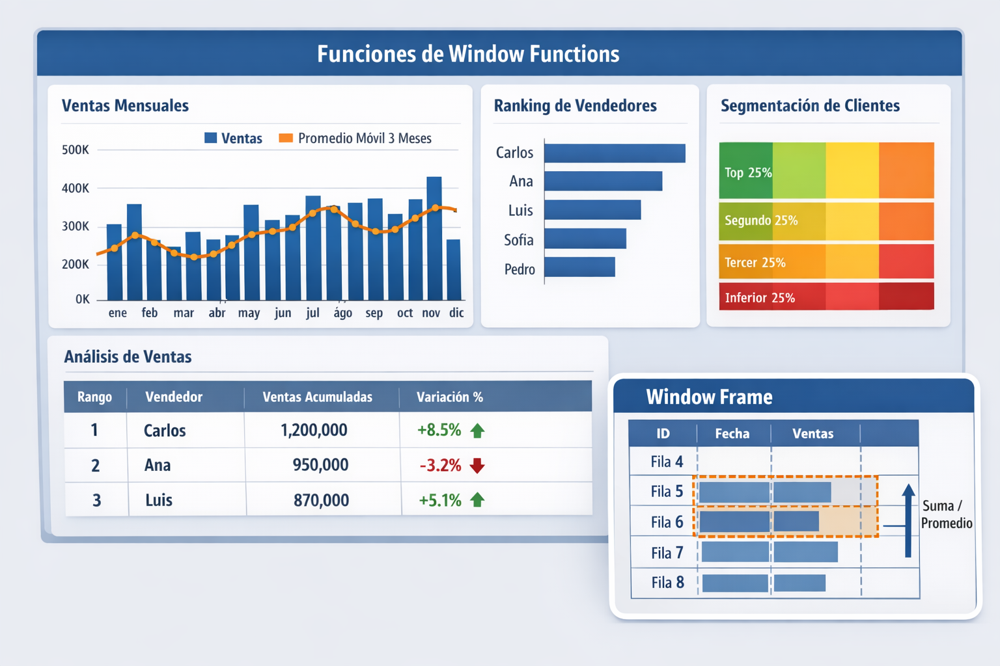

# Práctica 3.2 Aplicación de Funciones de Ventana

<br/>

## Objetivos

Al completar esta práctica, serás capaz de:

- Comprender el concepto de window frame, particiones y ordenamiento en funciones de ventana usando la cláusula `OVER (PARTITION BY ... ORDER BY ...)`.
- Aplicar funciones de ranking `ROW_NUMBER()`, `RANK()` y `DENSE_RANK()` para clasificar registros dentro de particiones sin usar subconsultas.
- Usar `LAG()` y `LEAD()` para comparaciones entre filas consecutivas y calcular la variación porcentual de ventas mes a mes por vendedor.
- Calcular promedios móviles de 3 y 6 meses usando `OVER` con `ROWS BETWEEN` para suavizar series de tiempo.
- Aplicar funciones de distribución `NTILE()`, `PERCENT_RANK()` y `CUME_DIST()` para segmentación de clientes.
- Reutilizar definiciones de ventana con la cláusula `WINDOW` para simplificar consultas con múltiples funciones de ventana.

<br/>
<br/>

## Objetivo Visual

<br/>

<p align="center">
  
</p>


<br/>
<br/>

## Prerrequisitos

### Conocimiento Requerido

- Práctica 3.1 completado exitosamente (dataset de ventas con datos temporales de 24 meses disponible)
- Comprensión sólida de `GROUP BY`, funciones agregadas (`SUM`, `AVG`, `COUNT`) y filtros `WHERE`
- Familiaridad con la sintaxis básica de `SELECT`, `JOIN` y `ORDER BY`
- Conocimiento de los conceptos de subconsultas y CTEs cubiertos en la Lección 3.1
- Comprensión básica de funciones de fecha en PostgreSQL (`DATE_TRUNC`, `EXTRACT`)

<br/>

### Acceso Requerido

- Contenedor Docker de PostgreSQL 16 en ejecución.
- Acceso a pgAdmin 4 o psql CLI con conexión activa a la base de datos `ventas_db`.
- Base de datos `ventas_db` con el esquema y datos de la práctica 3.1 cargados.

<br/>
<br/>


### Configuración Inicial

Antes de comenzar, verifica que el entorno de la práctica 3.1 esté operativo:

```bash
# Verificar que el contenedor PostgreSQL esté corriendo
docker ps --filter "name=curso_postgres"

# Si el contenedor no está activo, iniciarlo
docker start curso_postgres

```

<br/>
<br/>

## Instrucciones

### Paso 1: Preparar el Dataset y Verificar la Estructura de Tablas

1. Conéctate a la base de datos `ventas_db` desde psql:

   ```bash
   docker exec -it curso_postgres psql -U postgres -d ventas_db
   ```
<br/>

2. Verifica la estructura del esquema disponible:

   ```sql
   -- Lista tablas disponibles en el esquema público
   \dt public.*

   -- Lista views disponible en el esquema público
   \dv public.*
   
   ```
<br/>

3. Verifica la cobertura temporal de los datos de ventas:

   ```sql
   -- Resumen de cobertura temporal del dataset
   SELECT 
       MIN(fecha_venta)                          AS fecha_inicio,
       MAX(fecha_venta)                          AS fecha_fin,
       COUNT(DISTINCT DATE_TRUNC('month', fecha_venta)) AS meses_disponibles,
       COUNT(*)                                  AS total_registros
   FROM ventas;

   -- Resumen de productos
   SELECT count(*) from v_productos;
   ```

4. En caso de no tener las tablas o vista ventas o productos, crea las vistas con las siguientes instrucciones.

    ```sql
    CREATE OR REPLACE VIEW ventas AS
    SELECT
        d.id_detalle        AS venta_id,
        o.id_cliente        AS cliente_id,
        o.id_vendedor       AS vendedor_id,
        d.id_producto       AS producto_id,
        o.fecha_orden       AS fecha_venta,
        d.cantidad,
        d.precio_venta,
        (d.cantidad * d.precio_venta) AS monto_total
    FROM detalle_ordenes d
    JOIN ordenes o ON d.id_orden = o.id_orden;

    -- Vista v_productos
    CREATE OR REPLACE VIEW v_productos AS
    SELECT
        p.id_producto AS producto_id,
        p.nombre AS nombre_producto,
        c.nombre_categoria AS categoria
    FROM productos p
    JOIN categorias c ON p.id_categoria = c.id_categoria;

    -- Verifica la cantidad de Ordenes
    SELECT count(*) from ordenes;

    -- Inserta ordenes solo si es un número menor a 2030
    INSERT INTO ordenes (
        id_cliente,
        id_vendedor,
        fecha_orden
    )
    SELECT
        (SELECT id_cliente FROM clientes ORDER BY RANDOM() LIMIT 1),
        (SELECT id_vendedor FROM vendedores ORDER BY RANDOM() LIMIT 1),
        CURRENT_DATE - (RANDOM() * 730)::INT * INTERVAL '1 day'
    FROM generate_series(1, 2000);


    -- Verifica la cantidad de Ordenes
    SELECT count(*) from detalle_ordenes;

    -- Inserta detalle de ordenes solo si es menor a 5614

    INSERT INTO detalle_ordenes (
        id_orden,
        id_producto,
        cantidad,
        precio_venta
    )
    SELECT
        o.id_orden,
        (SELECT id_producto FROM productos ORDER BY RANDOM() LIMIT 1),
        (RANDOM() * 10 + 1)::INT,
        ROUND((RANDOM() * 500 + 50)::NUMERIC, 2)
    FROM ordenes o
    ORDER BY RANDOM()
    LIMIT 5000;

    -- Verificación

    SELECT count(*) from detalle_ordenes;

  -- Inserta detalle de ordenes solo si es menor a 5614

    INSERT INTO detalle_ordenes (
        id_orden,
        id_producto,
        cantidad,
        precio_venta
    )
    SELECT
        o.id_orden,
        (SELECT id_producto FROM productos ORDER BY RANDOM() LIMIT 1),
        (RANDOM() * 10 + 1)::INT,
        ROUND((RANDOM() * 500 + 50)::NUMERIC, 2)
    FROM ordenes o
    ORDER BY RANDOM()
    LIMIT 3000;

    -- Verificación
    
    SELECT count(*) from detalle_ordenes;
  
    -- Inserta detalle de ordenes solo si es menor a 5614

    INSERT INTO detalle_ordenes (
        id_orden,
        id_producto,
        cantidad,
        precio_venta
    )
    SELECT
        o.id_orden,
        (SELECT id_producto FROM productos ORDER BY RANDOM() LIMIT 1),
        (RANDOM() * 10 + 1)::INT,
        ROUND((RANDOM() * 500 + 50)::NUMERIC, 2)
    FROM ordenes o
    ORDER BY RANDOM()
    LIMIT 1500;

    -- Verificación
    SELECT count(*) from detalle_ordenes;
  
   ```


<br/>

4. Si tienes menos de 24 meses de datos, ejecuta el siguiente script para enriquecer el dataset con datos temporales adicionales:

   ```sql
   -- Script de enriquecimiento temporal: genera ventas para completar 24 meses
   -- EJECUTAR SOLO SI meses_disponibles < 24
   INSERT INTO ventas (
       cliente_id,
       vendedor_id,
       producto_id,
       fecha_venta,
       cantidad,
       precio_unitario,
       monto_total
   )
   SELECT
       (RANDOM() * 99 + 1)::INT                          AS cliente_id,
       (RANDOM() * 9 + 1)::INT                           AS vendedor_id,
       (RANDOM() * 49 + 1)::INT                          AS producto_id,
       CURRENT_DATE - (RANDOM() * 730)::INT * INTERVAL '1 day' AS fecha_venta,
       (RANDOM() * 10 + 1)::INT                          AS cantidad,
       ROUND((RANDOM() * 500 + 50)::NUMERIC, 2)          AS precio_unitario,
       ROUND(((RANDOM() * 10 + 1) * (RANDOM() * 500 + 50))::NUMERIC, 2) AS monto_total
   FROM generate_series(1, 5000);

   -- Confirmar la inserción
   SELECT COUNT(*) AS total_registros FROM ventas;
   ```

<br/>

5. Verifica la estructura de las tablas relacionadas que usaremos:

   ```sql
   -- Verificar estructura de tablas de dimensión
   SELECT 
       table_name,
       column_name,
       data_type
   FROM information_schema.columns
   WHERE table_schema = 'public'
     AND table_name IN ('ventas', 'clientes', 'vendedores', 'productos')
   ORDER BY table_name, ordinal_position;
   ```
<br/>

**Verificación:**

- La columna `meses_disponibles` debe mostrar al menos 24
- `total_registros` debe ser mayor a 5,000 para que los ejercicios de ranking sean significativos
- Las tablas `ventas`, `clientes`, `vendedores` y `productos` deben estar presentes


<br/>
<br/>


### Paso 2: Fundamentos de Window Functions — Sintaxis OVER y PARTITION BY

1. Primero, observa cómo funciona una agregación tradicional con `GROUP BY` (colapsa filas):

   ```sql
   -- Agregación tradicional: colapsa a una fila por mes
   SELECT 
       DATE_TRUNC('month', fecha_venta) AS mes,
       SUM(monto_total)                 AS total_ventas_mes
   FROM ventas
   GROUP BY DATE_TRUNC('month', fecha_venta)
   ORDER BY mes
   LIMIT 6;
   ```

<br/>

2. Ahora, aplica la misma lógica con una función de ventana (preserva todas las filas):

   ```sql
   -- Window function: cada fila mantiene su detalle + el total del mes
   SELECT 
       venta_id,
       fecha_venta,
       monto_total,
       SUM(monto_total) OVER (
           PARTITION BY DATE_TRUNC('month', fecha_venta)
       ) AS total_ventas_mes,
       ROUND(
           monto_total / SUM(monto_total) OVER (
               PARTITION BY DATE_TRUNC('month', fecha_venta)
           ) * 100, 2
       ) AS pct_del_mes
   FROM ventas
   ORDER BY fecha_venta, venta_id
   LIMIT 10;
   ```

<br/>

3. Compara el efecto de agregar `ORDER BY` dentro de la cláusula `OVER` (genera una suma acumulada):

   ```sql
   -- SUM acumulado por mes con ORDER BY dentro de OVER
   SELECT 
       venta_id,
       fecha_venta,
       monto_total,
       SUM(monto_total) OVER (
           PARTITION BY DATE_TRUNC('month', fecha_venta)
           ORDER BY fecha_venta, venta_id
       ) AS suma_acumulada_mes
   FROM ventas
   ORDER BY fecha_venta, venta_id
   LIMIT 15;
   ```

<br/>

4. Observa cómo el `window frame` por defecto cambia cuando se incluye `ORDER BY`:

   ```sql
   -- Demostración del window frame implícito
   -- Con ORDER BY, el frame por defecto es RANGE BETWEEN UNBOUNDED PRECEDING AND CURRENT ROW
   -- Sin ORDER BY, el frame por defecto es ROWS BETWEEN UNBOUNDED PRECEDING AND UNBOUNDED FOLLOWING
   SELECT 
       venta_id,
       fecha_venta,
       monto_total,
       -- Sin ORDER BY: suma de TODAS las filas de la partición (total del mes)
       SUM(monto_total) OVER (
           PARTITION BY DATE_TRUNC('month', fecha_venta)
       ) AS total_mes_completo,
       -- Con ORDER BY: suma acumulada hasta la fila actual
       SUM(monto_total) OVER (
           PARTITION BY DATE_TRUNC('month', fecha_venta)
           ORDER BY venta_id
       ) AS suma_acumulada
   FROM ventas
   WHERE DATE_TRUNC('month', fecha_venta) = DATE_TRUNC('month', CURRENT_DATE - INTERVAL '1 month')
   ORDER BY venta_id
   LIMIT 8;
   ```

<br/>

5. Observa el `pct_del_mes` 

```sql
WITH detalle AS (
    SELECT 
        DATE_TRUNC('month', fecha_venta) AS mes,
        venta_id,
        monto_total,
        ROUND(
            monto_total / SUM(monto_total) OVER (
                PARTITION BY DATE_TRUNC('month', fecha_venta)
            ) * 100, 2
        ) AS pct_del_mes
    FROM ventas
)
SELECT
    mes,
    COUNT(*) AS num_ventas,
    ROUND(SUM(monto_total), 2) AS total_monto,
    SUM(pct_del_mes) AS suma_pct
FROM detalle
GROUP BY mes
ORDER BY mes;
```

<br/>

**Verificación:**

- La columna `total_mes_completo` debe mostrar el mismo valor para todas las filas del mismo mes
- La columna `suma_acumulada` debe ir incrementándose fila a fila
- La columna `pct_del_mes` debe sumar aproximadamente 100% por mes

<br/>
<br/>


### Paso 3: Funciones de Ranking — ROW_NUMBER, RANK y DENSE_RANK


1. Primero, crea una vista materializada con ventas agregadas por producto y categoría para facilitar los ejercicios de ranking:

   ```sql
   -- Vista de ventas por producto  
   CREATE OR REPLACE VIEW v_ventas_por_producto AS
    SELECT 
        p.id_producto,
        p.nombre,
        p.id_categoria,
        COUNT(v.venta_id)       AS total_transacciones,
        SUM(v.monto_total)      AS total_ventas,
        AVG(v.monto_total)      AS ticket_promedio,
        SUM(v.cantidad)         AS unidades_vendidas
    FROM ventas v
    JOIN productos p ON v.producto_id = p.id_producto
    GROUP BY p.id_producto, p.nombre, p.id_categoria;
   ```

<br/>

2. Aplica `ROW_NUMBER()` para obtener un ranking único por categoría (sin empates posibles):

   ```sql
   -- ROW_NUMBER: ranking único, no permite empates
   -- Útil cuando necesitas exactamente los top-N sin repeticiones
    SELECT 
        id_categoria,
        nombre,
        total_ventas,
        ROW_NUMBER() OVER (
            PARTITION BY id_categoria 
            ORDER BY total_ventas DESC
        ) AS ranking_unico
    FROM v_ventas_por_producto
    ORDER BY id_categoria, ranking_unico;
   ```
<br/>

3. Aplica `RANK()` y `DENSE_RANK()` para comparar su comportamiento con empates:

   ```sql
   -- Comparación de ROW_NUMBER vs RANK vs DENSE_RANK
   -- Observa la diferencia cuando hay valores iguales de total_ventas
    SELECT 
        id_categoria,
        nombre,
        ROUND(total_ventas::NUMERIC, 2) AS total_ventas,
        ROW_NUMBER()  OVER (PARTITION BY id_categoria ORDER BY total_ventas DESC) AS row_num,
        RANK()        OVER (PARTITION BY id_categoria ORDER BY total_ventas DESC) AS rank_val,
        DENSE_RANK()  OVER (PARTITION BY id_categoria ORDER BY total_ventas DESC) AS dense_rank_val
    FROM v_ventas_por_producto
    ORDER BY id_categoria, total_ventas DESC;
   ```
<br/>

4. Usa `ROW_NUMBER()` para obtener el **Top 3 productos por categoría** sin subconsultas anidadas (técnica CTE + window function):

   ```sql
   -- Top 3 productos por categoría usando CTE + ROW_NUMBER
   -- Esta es una de las combinaciones más poderosas en SQL analítico
    WITH productos_rankeados AS (
        SELECT 
            id_categoria,
            nombre,
            ROUND(total_ventas::NUMERIC, 2)     AS total_ventas,
            ROUND(ticket_promedio::NUMERIC, 2)  AS ticket_promedio,
            unidades_vendidas,
            ROW_NUMBER() OVER (
                PARTITION BY id_categoria 
                ORDER BY total_ventas DESC
            ) AS ranking
        FROM v_ventas_por_producto
    )
    SELECT 
        id_categoria,
        ranking,
        nombre,
        total_ventas,
        ticket_promedio,
        unidades_vendidas
    FROM productos_rankeados
    WHERE ranking <= 3
    ORDER BY id_categoria, ranking;
   ```

<br/>

5. Compara `RANK()` vs `DENSE_RANK()` con un ejemplo explícito que fuerza empates:

   ```sql
   -- Ejemplo que ilustra la diferencia entre RANK y DENSE_RANK
   -- Creamos un escenario con valores idénticos de ventas para ver el comportamiento
    WITH ejemplo_empates AS (
        SELECT 
            id_categoria,
            nombre,
            -- Redondeamos a miles para forzar algunos empates artificiales
            ROUND(total_ventas / 1000) * 1000 AS ventas_redondeadas
        FROM v_ventas_por_producto
    )
    SELECT 
        id_categoria,
        nombre,
        ventas_redondeadas,
        RANK()       OVER (PARTITION BY id_categoria ORDER BY ventas_redondeadas DESC) AS rank_con_salto,
        DENSE_RANK() OVER (PARTITION BY id_categoria ORDER BY ventas_redondeadas DESC) AS rank_sin_salto
    FROM ejemplo_empates
    ORDER BY id_categoria, ventas_redondeadas DESC
    LIMIT 20;
<br/>

**Verificación:**

- `ROW_NUMBER()` nunca repite valores dentro de una partición.
- `RANK()` repite el número cuando hay empates y salta el siguiente (ej: 1, 2, 2, 4)
- `DENSE_RANK()` repite el número cuando hay empates pero NO salta (ej: 1, 2, 2, 3)
- El Top 3 por categoría debe mostrar exactamente 3 productos por cada categoría disponible

<br/>
<br/>


### Paso 4: LAG() y LEAD() — Variación Porcentual de Ventas Mes a Mes

1. Primero, crea una vista con las ventas mensuales agregadas por vendedor:

   ```sql
   -- Vista de ventas mensuales por vendedor
    CREATE OR REPLACE VIEW v_ventas_mensuales_vendedor AS
    SELECT 
        ve.id_vendedor AS vendedor_id,
        ve.nombre || ' ' || ve.apellido AS nombre_vendedor,
        DATE_TRUNC('month', v.fecha_venta)::DATE AS mes,
        COUNT(v.venta_id)                         AS total_transacciones,
        ROUND(SUM(v.monto_total)::NUMERIC, 2)     AS total_ventas,
        ROUND(AVG(v.monto_total)::NUMERIC, 2)     AS ticket_promedio
    FROM ventas v
    JOIN vendedores ve ON v.vendedor_id = ve.id_vendedor
    GROUP BY ve.id_vendedor, ve.nombre, DATE_TRUNC('month', v.fecha_venta)
    ORDER BY ve.id_vendedor, mes;
   ```
<br/>

2. Aplica `LAG()` para obtener las ventas del mes anterior de cada vendedor:

   ```sql
   -- LAG(): accede al valor de la fila anterior dentro de la partición
   SELECT 
       vendedor_id,
       nombre_vendedor,
       mes,
       total_ventas,
       LAG(total_ventas) OVER (
           PARTITION BY vendedor_id 
           ORDER BY mes
       ) AS ventas_mes_anterior
   FROM v_ventas_mensuales_vendedor
   ORDER BY vendedor_id, mes
   LIMIT 15;
   ```
<br/>

3. Calcula la **variación porcentual mes a mes** para cada vendedor:

   ```sql
   -- Variación porcentual de ventas mes a mes por vendedor
   WITH ventas_con_lag AS (
       SELECT 
           vendedor_id,
           nombre_vendedor,
           mes,
           total_ventas,
           LAG(total_ventas) OVER (
               PARTITION BY vendedor_id 
               ORDER BY mes
           ) AS ventas_mes_anterior
       FROM v_ventas_mensuales_vendedor
   )
   SELECT 
       vendedor_id,
       nombre_vendedor,
       mes,
       total_ventas,
       ventas_mes_anterior,
       CASE 
           WHEN ventas_mes_anterior IS NULL THEN NULL
           WHEN ventas_mes_anterior = 0     THEN NULL
           ELSE ROUND(
               (total_ventas - ventas_mes_anterior) / ventas_mes_anterior * 100, 2
           )
       END AS variacion_pct,
       CASE 
           WHEN ventas_mes_anterior IS NULL THEN '— (primer mes)'
           WHEN total_ventas > ventas_mes_anterior THEN '▲ Crecimiento'
           WHEN total_ventas < ventas_mes_anterior THEN '▼ Decrecimiento'
           ELSE '= Sin cambio'
       END AS tendencia
   FROM ventas_con_lag
   ORDER BY vendedor_id, mes;
   ```
<br/>

4. Usa `LEAD()` para ver las ventas del mes siguiente (útil para proyecciones):

   ```sql
   -- LEAD(): accede al valor de la fila siguiente
   -- Útil para comparar el mes actual con el próximo período
   SELECT 
       nombre_vendedor,
       mes,
       total_ventas,
       LEAD(total_ventas) OVER (
           PARTITION BY vendedor_id 
           ORDER BY mes
       ) AS ventas_mes_siguiente,
       LEAD(total_ventas, 2) OVER (
           PARTITION BY vendedor_id 
           ORDER BY mes
       ) AS ventas_en_2_meses
   FROM v_ventas_mensuales_vendedor
   ORDER BY vendedor_id, mes
   LIMIT 12;
   ```

<br/>

5. Combina `LAG()` y `LEAD()` para identificar los **mejores meses de cada vendedor** (mes donde las ventas superan tanto al mes anterior como al siguiente):

   ```sql
   -- Identificar "picos locales": meses donde las ventas son mayores 
   -- que el mes anterior Y el mes siguiente (máximos locales)
   WITH ventas_contexto AS (
       SELECT 
           nombre_vendedor,
           mes,
           total_ventas,
           LAG(total_ventas)  OVER (PARTITION BY vendedor_id ORDER BY mes) AS mes_anterior,
           LEAD(total_ventas) OVER (PARTITION BY vendedor_id ORDER BY mes) AS mes_siguiente
       FROM v_ventas_mensuales_vendedor
   )
   SELECT 
       nombre_vendedor,
       mes,
       total_ventas,
       mes_anterior,
       mes_siguiente,
       'PICO LOCAL' AS clasificacion
   FROM ventas_contexto
   WHERE mes_anterior    IS NOT NULL
     AND mes_siguiente   IS NOT NULL
     AND total_ventas    > mes_anterior
     AND total_ventas    > mes_siguiente
   ORDER BY nombre_vendedor, mes;
   ```
<br/>

**Verificación:**

- El primer mes de cada vendedor debe mostrar `NULL` en `ventas_mes_anterior` (no hay período previo)
- La variación porcentual positiva indica crecimiento, negativa indica decrecimiento
- `LEAD()` con offset 2 debe mostrar `NULL` en los dos últimos meses de cada vendedor

<br/>
<br/>


### Paso 5: Promedios Móviles con ROWS BETWEEN

1. Comprende la sintaxis de `ROWS BETWEEN` con un ejemplo básico:

   ```sql
   -- Sintaxis de ROWS BETWEEN explicada con comentarios
   -- ROWS BETWEEN N PRECEDING AND CURRENT ROW = ventana de N+1 filas (N anteriores + actual)
   -- ROWS BETWEEN UNBOUNDED PRECEDING AND CURRENT ROW = todas las filas anteriores + actual
   -- ROWS BETWEEN 1 PRECEDING AND 1 FOLLOWING = fila anterior + actual + fila siguiente

   SELECT 
       nombre_vendedor,
       mes,
       total_ventas,
       -- Promedio móvil de 3 meses (mes actual + 2 anteriores)
       ROUND(AVG(total_ventas) OVER (
           PARTITION BY vendedor_id
           ORDER BY mes
           ROWS BETWEEN 2 PRECEDING AND CURRENT ROW
       )::NUMERIC, 2) AS promedio_movil_3m,
       -- Promedio móvil de 6 meses (mes actual + 5 anteriores)
       ROUND(AVG(total_ventas) OVER (
           PARTITION BY vendedor_id
           ORDER BY mes
           ROWS BETWEEN 5 PRECEDING AND CURRENT ROW
       )::NUMERIC, 2) AS promedio_movil_6m
   FROM v_ventas_mensuales_vendedor
   ORDER BY vendedor_id, mes;
   ```

<br/>

2. Agrega el conteo de filas en la ventana para verificar que los primeros meses usan menos períodos:

   ```sql
   -- Verificación: contar cuántas filas entran en la ventana
   -- Los primeros meses tendrán menos de N filas disponibles
   SELECT 
       nombre_vendedor,
       mes,
       total_ventas,
       COUNT(*) OVER (
           PARTITION BY vendedor_id
           ORDER BY mes
           ROWS BETWEEN 2 PRECEDING AND CURRENT ROW
       ) AS filas_en_ventana_3m,
       ROUND(AVG(total_ventas) OVER (
           PARTITION BY vendedor_id
           ORDER BY mes
           ROWS BETWEEN 2 PRECEDING AND CURRENT ROW
       )::NUMERIC, 2) AS promedio_movil_3m
   FROM v_ventas_mensuales_vendedor
   ORDER BY vendedor_id, mes
   LIMIT 10;
   ```

<br/>

3. Crea un análisis completo de tendencias con ventas originales, promedio móvil y comparación:

   ```sql
   -- Análisis completo de tendencias de ventas con promedios móviles
   WITH analisis_tendencias AS (
       SELECT 
           nombre_vendedor,
           mes,
           total_ventas,
           ROUND(AVG(total_ventas) OVER (
               PARTITION BY vendedor_id
               ORDER BY mes
               ROWS BETWEEN 2 PRECEDING AND CURRENT ROW
           )::NUMERIC, 2) AS promedio_movil_3m,
           ROUND(AVG(total_ventas) OVER (
               PARTITION BY vendedor_id
               ORDER BY mes
               ROWS BETWEEN 5 PRECEDING AND CURRENT ROW
           )::NUMERIC, 2) AS promedio_movil_6m,
           -- Promedio global del vendedor (sin window frame = toda la partición)
           ROUND(AVG(total_ventas) OVER (
               PARTITION BY vendedor_id
           )::NUMERIC, 2) AS promedio_global_vendedor
       FROM v_ventas_mensuales_vendedor
   )
   SELECT 
       nombre_vendedor,
       mes,
       total_ventas,
       promedio_movil_3m,
       promedio_movil_6m,
       promedio_global_vendedor,
       -- Señal: el mes actual está por encima o por debajo del promedio móvil de 6 meses
       CASE 
           WHEN total_ventas > promedio_movil_6m THEN 'Por encima del promedio'
           WHEN total_ventas < promedio_movil_6m THEN 'Por debajo del promedio'
           ELSE 'En el promedio'
       END AS señal_tendencia
   FROM analisis_tendencias
   ORDER BY nombre_vendedor, mes;
   ```

<br/>

4. Aplica promedios móviles a nivel global (todas las ventas de la empresa, sin partición por vendedor):

   ```sql
   -- Promedio móvil de ventas totales de la empresa (sin PARTITION BY)
   WITH ventas_empresa_mes AS (
       SELECT 
           DATE_TRUNC('month', fecha_venta)::DATE AS mes,
           ROUND(SUM(monto_total)::NUMERIC, 2)    AS ventas_totales
       FROM ventas
       GROUP BY DATE_TRUNC('month', fecha_venta)
   )
   SELECT 
       mes,
       ventas_totales,
       ROUND(AVG(ventas_totales) OVER (
           ORDER BY mes
           ROWS BETWEEN 2 PRECEDING AND CURRENT ROW
       )::NUMERIC, 2) AS promedio_movil_3m,
       ROUND(AVG(ventas_totales) OVER (
           ORDER BY mes
           ROWS BETWEEN 5 PRECEDING AND CURRENT ROW
       )::NUMERIC, 2) AS promedio_movil_6m,
       -- Suma acumulada de ventas del año
       SUM(ventas_totales) OVER (
           PARTITION BY EXTRACT(YEAR FROM mes)
           ORDER BY mes
           ROWS BETWEEN UNBOUNDED PRECEDING AND CURRENT ROW
       ) AS ventas_acumuladas_anio
   FROM ventas_empresa_mes
   ORDER BY mes;

   ```
<br/>

**Verificación:**

- En el primer mes, los tres promedios móviles deben ser iguales a `ventas_totales`.
- En el segundo mes, el promedio de 3 meses y 6 meses deben ser iguales.
- A partir del séptimo mes, el promedio de 6 meses debe ser diferente al de 3 meses.
- `ventas_acumuladas_anio` debe reiniciarse a 0 al cambiar de año.

<br/>
<br/>


### Paso 6: Funciones de Distribución — NTILE, PERCENT_RANK y CUME_DIST

1. Crea una vista con el resumen de compras por cliente:

   ```sql
   -- Vista de resumen de compras por cliente
    CREATE OR REPLACE VIEW v_resumen_clientes AS
    SELECT 
        c.id_cliente as cliente_id,
        c.nombre || ' ' || c.apellido as nombre_cliente,
        c.ciudad,
        COUNT(v.venta_id)                         AS total_compras,
        ROUND(SUM(v.monto_total)::NUMERIC, 2)     AS total_gastado,
        ROUND(AVG(v.monto_total)::NUMERIC, 2)     AS ticket_promedio,
        MAX(v.fecha_venta)                         AS ultima_compra,
        MIN(v.fecha_venta)                         AS primera_compra
    FROM clientes c
    LEFT JOIN ventas v ON c.id_cliente = v.cliente_id
    GROUP BY c.id_cliente, c.nombre, c.ciudad;
   ```

<br/>

2. Aplica `NTILE(4)` para segmentar clientes en cuartiles según su gasto total:

   ```sql
   -- Segmentación de clientes en cuartiles con NTILE(4)
   -- Cuartil 4 = clientes de mayor valor (top 25%)
   -- Cuartil 1 = clientes de menor valor (bottom 25%)
   SELECT 
       cliente_id,
       nombre_cliente,
       total_gastado,
       total_compras,
       NTILE(4) OVER (
           ORDER BY total_gastado DESC
       ) AS cuartil,
       CASE NTILE(4) OVER (ORDER BY total_gastado DESC)
           WHEN 1 THEN 'Platinum (Top 25%)'
           WHEN 2 THEN 'Gold (25-50%)'
           WHEN 3 THEN 'Silver (50-75%)'
           WHEN 4 THEN 'Bronze (Bottom 25%)'
       END AS segmento_valor
   FROM v_resumen_clientes
   WHERE total_gastado IS NOT NULL
   ORDER BY total_gastado DESC;
   ```

<br/>

3. Usa `PERCENT_RANK()` para calcular el percentil exacto de cada cliente:

   ```sql
   -- PERCENT_RANK(): posición relativa del cliente en la distribución
   -- Valor entre 0 y 1: 0 = el más bajo, 1 = el más alto
   -- Fórmula: (rank - 1) / (total_filas - 1)
   SELECT 
       cliente_id,
       nombre_cliente,
       total_gastado,
       ROUND(PERCENT_RANK() OVER (
           ORDER BY total_gastado
       )::NUMERIC * 100, 2) AS percentil,
       ROUND(CUME_DIST() OVER (
           ORDER BY total_gastado
       )::NUMERIC * 100, 2) AS distribucion_acumulada_pct
   FROM v_resumen_clientes
   WHERE total_gastado IS NOT NULL
   ORDER BY total_gastado DESC
   LIMIT 15;
   ```

<br/>

4. Combina `NTILE`, `PERCENT_RANK` y `CUME_DIST` en un análisis completo de segmentación:

   ```sql
   -- Análisis completo de segmentación de clientes
   WITH segmentacion_completa AS (
       SELECT 
           cliente_id,
           nombre_cliente,
           ciudad,
           total_gastado,
           total_compras,
           ticket_promedio,
           ultima_compra,
           -- Segmentación en cuartiles
           NTILE(4) OVER (ORDER BY total_gastado DESC) AS cuartil,
           -- Percentil del cliente (0-100)
           ROUND(PERCENT_RANK() OVER (ORDER BY total_gastado)::NUMERIC * 100, 1) AS percentil,
           -- Porcentaje de clientes con gasto igual o menor
           ROUND(CUME_DIST() OVER (ORDER BY total_gastado)::NUMERIC * 100, 1)    AS cume_dist_pct,
           -- Ranking absoluto
           RANK() OVER (ORDER BY total_gastado DESC) AS ranking_global
       FROM v_resumen_clientes
       WHERE total_gastado IS NOT NULL
   )
   SELECT 
       cliente_id,
       nombre_cliente,
       ciudad,
       total_gastado,
       total_compras,
       ticket_promedio,
       ultima_compra,
       ranking_global,
       cuartil,
       CASE cuartil
           WHEN 1 THEN 'Platinum'
           WHEN 2 THEN 'Gold'
           WHEN 3 THEN 'Silver'
           WHEN 4 THEN 'Bronze'
       END AS segmento_valor,
       percentil,
       cume_dist_pct
   FROM segmentacion_completa
   ORDER BY ranking_global;
   ```

<br/>

5. Genera un resumen estadístico por cuartil para validar la segmentación:

   ```sql
   -- Resumen estadístico por cuartil de clientes
   WITH clientes_segmentados AS (
       SELECT 
           total_gastado,
           total_compras,
           ticket_promedio,
           NTILE(4) OVER (ORDER BY total_gastado DESC) AS cuartil
       FROM v_resumen_clientes
       WHERE total_gastado IS NOT NULL
   )
   SELECT 
       cuartil,
       CASE cuartil
           WHEN 1 THEN 'Platinum (Top 25%)'
           WHEN 2 THEN 'Gold (25-50%)'
           WHEN 3 THEN 'Silver (50-75%)'
           WHEN 4 THEN 'Bronze (Bottom 25%)'
       END AS segmento,
       COUNT(*)                                         AS num_clientes,
       ROUND(MIN(total_gastado)::NUMERIC, 2)            AS min_gasto,
       ROUND(MAX(total_gastado)::NUMERIC, 2)            AS max_gasto,
       ROUND(AVG(total_gastado)::NUMERIC, 2)            AS promedio_gasto,
       ROUND(SUM(total_gastado)::NUMERIC, 2)            AS gasto_total_segmento,
       ROUND(AVG(total_compras)::NUMERIC, 1)            AS promedio_compras,
       ROUND(AVG(ticket_promedio)::NUMERIC, 2)          AS ticket_promedio_segmento
   FROM clientes_segmentados
   GROUP BY cuartil
   ORDER BY cuartil;
   ```

<br/>

**Verificación:**

- Cada cuartil debe tener aproximadamente el mismo número de clientes (±1 por redondeo)
- El gasto mínimo del cuartil 1 debe ser mayor que el máximo del cuartil 2
- `PERCENT_RANK()` del cliente con menor gasto debe ser 0.00
- `CUME_DIST()` del cliente con mayor gasto debe ser 1.00 (100%)


<br/>
<br/>


### Paso 7: Cláusula WINDOW — Reutilización de Definiciones de Ventana

1. Observa primero una consulta sin cláusula `WINDOW` (con repetición de definiciones):

   ```sql
   -- SIN cláusula WINDOW: repetición de la misma definición en cada función
   -- Difícil de mantener si necesitas cambiar la partición o el orden
   SELECT 
       nombre_vendedor,
       mes,
       total_ventas,
       SUM(total_ventas)   OVER (PARTITION BY vendedor_id ORDER BY mes ROWS BETWEEN UNBOUNDED PRECEDING AND CURRENT ROW) AS acumulado,
       AVG(total_ventas)   OVER (PARTITION BY vendedor_id ORDER BY mes ROWS BETWEEN 2 PRECEDING AND CURRENT ROW)        AS promedio_3m,
       MAX(total_ventas)   OVER (PARTITION BY vendedor_id ORDER BY mes ROWS BETWEEN 2 PRECEDING AND CURRENT ROW)        AS max_3m,
       MIN(total_ventas)   OVER (PARTITION BY vendedor_id ORDER BY mes ROWS BETWEEN 2 PRECEDING AND CURRENT ROW)        AS min_3m,
       ROW_NUMBER()        OVER (PARTITION BY vendedor_id ORDER BY mes)                                                  AS num_mes
   FROM v_ventas_mensuales_vendedor
   ORDER BY vendedor_id, mes
   LIMIT 10;
   ```

<br/>

2. Reescribe la misma consulta usando la cláusula `WINDOW` para eliminar la repetición:

   ```sql
   -- CON cláusula WINDOW: definición única, referenciada múltiples veces
   -- Más limpio, más fácil de mantener y modificar
   SELECT 
       nombre_vendedor,
       mes,
       total_ventas,
       SUM(total_ventas) OVER ventana_acumulada      AS acumulado,
       AVG(total_ventas) OVER ventana_movil_3m       AS promedio_3m,
       MAX(total_ventas) OVER ventana_movil_3m       AS max_3m,
       MIN(total_ventas) OVER ventana_movil_3m       AS min_3m,
       ROW_NUMBER()      OVER ventana_base            AS num_mes
   FROM v_ventas_mensuales_vendedor
   WINDOW
       ventana_base        AS (PARTITION BY vendedor_id ORDER BY mes),
       ventana_acumulada   AS (PARTITION BY vendedor_id ORDER BY mes ROWS BETWEEN UNBOUNDED PRECEDING AND CURRENT ROW),
       ventana_movil_3m    AS (PARTITION BY vendedor_id ORDER BY mes ROWS BETWEEN 2 PRECEDING AND CURRENT ROW)
   ORDER BY vendedor_id, mes
   LIMIT 10;
   ```

<br/>

3. Crea una consulta analítica completa que combine todas las técnicas aprendidas usando la cláusula `WINDOW`:

   ```sql
   -- Reporte analítico completo de rendimiento de vendedores
   -- Combina: ranking, LAG/LEAD, promedios móviles y cláusula WINDOW
   WITH reporte_vendedores AS (
       SELECT 
           nombre_vendedor,
           mes,
           total_ventas,
           total_transacciones,
           ticket_promedio,
           -- Ranking mensual de vendedores
           RANK()       OVER ventana_ranking        AS ranking_mes,
           -- Variación respecto al mes anterior
           LAG(total_ventas) OVER ventana_base      AS ventas_mes_anterior,
           -- Promedio móvil de 3 meses
           ROUND(AVG(total_ventas) OVER ventana_movil_3m ::NUMERIC, 2) AS promedio_movil_3m,
           -- Ventas acumuladas en el año
           SUM(total_ventas) OVER ventana_anual     AS ventas_acumuladas_anio,
           -- Porcentaje del total mensual de la empresa
           ROUND(
               total_ventas / SUM(total_ventas) OVER ventana_mes * 100, 2
           ) AS pct_total_empresa
       FROM v_ventas_mensuales_vendedor
       WINDOW
           ventana_base     AS (PARTITION BY vendedor_id ORDER BY mes),
           ventana_ranking  AS (PARTITION BY mes ORDER BY total_ventas DESC),
           ventana_movil_3m AS (PARTITION BY vendedor_id ORDER BY mes ROWS BETWEEN 2 PRECEDING AND CURRENT ROW),
           ventana_anual    AS (
               PARTITION BY vendedor_id, EXTRACT(YEAR FROM mes) 
               ORDER BY mes 
               ROWS BETWEEN UNBOUNDED PRECEDING AND CURRENT ROW
           ),
           ventana_mes      AS (PARTITION BY mes)
   )
   SELECT 
       nombre_vendedor,
       TO_CHAR(mes, 'YYYY-MM')             AS periodo,
       total_ventas,
       ranking_mes,
       ventas_mes_anterior,
       CASE 
           WHEN ventas_mes_anterior IS NULL THEN NULL
           ELSE ROUND((total_ventas - ventas_mes_anterior) / ventas_mes_anterior * 100, 2)
       END                                  AS variacion_pct,
       promedio_movil_3m,
       ventas_acumuladas_anio,
       pct_total_empresa
   FROM reporte_vendedores
   ORDER BY mes, ranking_mes;
   ```

<br/>

4. Guarda el reporte como una vista para uso posterior en la práctica de Power BI:

   ```sql
   -- Crear vista del reporte de rendimiento de vendedores
   -- Esta vista será usada en la práctica 6.1 de Power BI
   CREATE OR REPLACE VIEW v_reporte_rendimiento_vendedores AS
   WITH reporte_base AS (
       SELECT 
           vendedor_id,
           nombre_vendedor,
           mes,
           total_ventas,
           total_transacciones,
           ticket_promedio,
           RANK()       OVER (PARTITION BY mes ORDER BY total_ventas DESC)                                                  AS ranking_mes,
           LAG(total_ventas) OVER (PARTITION BY vendedor_id ORDER BY mes)                                                   AS ventas_mes_anterior,
           ROUND(AVG(total_ventas) OVER (PARTITION BY vendedor_id ORDER BY mes ROWS BETWEEN 2 PRECEDING AND CURRENT ROW)::NUMERIC, 2) AS promedio_movil_3m,
           SUM(total_ventas) OVER (PARTITION BY vendedor_id, EXTRACT(YEAR FROM mes) ORDER BY mes ROWS BETWEEN UNBOUNDED PRECEDING AND CURRENT ROW) AS ventas_acumuladas_anio,
           ROUND(total_ventas / SUM(total_ventas) OVER (PARTITION BY mes) * 100, 2)                                        AS pct_total_empresa
       FROM v_ventas_mensuales_vendedor
   )
   SELECT 
       vendedor_id,
       nombre_vendedor,
       mes,
       total_ventas,
       total_transacciones,
       ticket_promedio,
       ranking_mes,
       ventas_mes_anterior,
       CASE 
           WHEN ventas_mes_anterior IS NULL OR ventas_mes_anterior = 0 THEN NULL
           ELSE ROUND((total_ventas - ventas_mes_anterior) / ventas_mes_anterior * 100, 2)
       END AS variacion_pct,
       promedio_movil_3m,
       ventas_acumuladas_anio,
       pct_total_empresa
   FROM reporte_base;

   -- Verificar que la vista se creó correctamente
   SELECT COUNT(*) AS total_filas FROM v_reporte_rendimiento_vendedores;
   ```

<br/>

**Verificación:**

- La cláusula `WINDOW` debe definirse al final de la consulta, antes de `ORDER BY`
- Los alias de ventana definidos en `WINDOW` son referenciables en cualquier función de ventana del `SELECT`
- La vista `v_reporte_rendimiento_vendedores` debe crearse sin errores y devolver filas
- Ambas versiones de la consulta (con y sin `WINDOW`) deben producir resultados idénticos

<br/>
<br/>


### Paso 8: Ejercicio Integrador — Dashboard Analítico de Ventas

1. Ejecuta la consulta integradora que combina todas las técnicas de la práctica:

   ```sql
   -- CONSULTA INTEGRADORA: Reporte ejecutivo de ventas
   -- Combina: ranking de productos, variación temporal, promedios móviles y segmentación
   
    WITH 
    -- CTE 1: Ventas mensuales por categoría de producto
    ventas_categoria_mes AS (
        SELECT 
            p.id_categoria as categoria,
            DATE_TRUNC('month', v.fecha_venta)::DATE AS mes,
            ROUND(SUM(v.monto_total)::NUMERIC, 2)    AS total_ventas,
            COUNT(DISTINCT v.cliente_id)              AS clientes_unicos,
            COUNT(v.venta_id)                         AS num_transacciones
        FROM ventas v
        JOIN productos p ON v.producto_id = p.id_producto
        GROUP BY p.id_categoria, DATE_TRUNC('month', v.fecha_venta)
    ),
    -- CTE 2: Métricas con funciones de ventana aplicadas
    metricas_ventana AS (
        SELECT 
            categoria,
            mes,
            total_ventas,
            clientes_unicos,
            num_transacciones,
            -- Ranking de categoría por mes
            RANK() OVER (PARTITION BY mes ORDER BY total_ventas DESC)              AS ranking_categoria_mes,
            -- Variación respecto al mes anterior
            LAG(total_ventas) OVER (PARTITION BY categoria ORDER BY mes)           AS ventas_mes_anterior,
            -- Promedio móvil de 3 meses
            ROUND(AVG(total_ventas) OVER (
                PARTITION BY categoria ORDER BY mes 
                ROWS BETWEEN 2 PRECEDING AND CURRENT ROW
            )::NUMERIC, 2)                                                          AS promedio_movil_3m,
            -- Participación en ventas totales del mes
            ROUND(total_ventas / SUM(total_ventas) OVER (PARTITION BY mes) * 100, 2) AS market_share_pct,
            -- Ventas acumuladas del año por categoría
            SUM(total_ventas) OVER (
                PARTITION BY categoria, EXTRACT(YEAR FROM mes)
                ORDER BY mes
                ROWS BETWEEN UNBOUNDED PRECEDING AND CURRENT ROW
            )                                                                        AS ventas_acumuladas_anio,
            -- Percentil de la categoría en el mes
            ROUND(PERCENT_RANK() OVER (PARTITION BY mes ORDER BY total_ventas)::NUMERIC * 100, 1) AS percentil_mes
        FROM ventas_categoria_mes
    )
    -- Consulta final: selección y formateo de resultados
    SELECT 
        categoria,
        TO_CHAR(mes, 'YYYY-MM')                                AS periodo,
        total_ventas,
        ranking_categoria_mes,
        market_share_pct,
        -- Variación porcentual mes a mes
        CASE 
            WHEN ventas_mes_anterior IS NULL THEN 'N/A'
            ELSE CONCAT(
                ROUND((total_ventas - ventas_mes_anterior) / ventas_mes_anterior * 100, 2)::TEXT,
                '%'
            )
        END                                                     AS variacion_mom,
        promedio_movil_3m,
        ROUND(ventas_acumuladas_anio::NUMERIC, 2)               AS ventas_ytd,
        clientes_unicos,
        num_transacciones,
        percentil_mes
    FROM metricas_ventana
    ORDER BY mes, ranking_categoria_mes;
   ```

<br/>

2. Guarda los resultados del reporte ejecutivo como una vista:

   ```sql
   -- Guardar el reporte ejecutivo como vista para Power BI
   CREATE OR REPLACE VIEW v_reporte_ejecutivo_ventas AS
    WITH ventas_categoria_mes AS (
        SELECT 
            p.id_categoria as categoria,
            DATE_TRUNC('month', v.fecha_venta)::DATE AS mes,
            ROUND(SUM(v.monto_total)::NUMERIC, 2)    AS total_ventas,
            COUNT(DISTINCT v.cliente_id)              AS clientes_unicos,
            COUNT(v.venta_id)                         AS num_transacciones
        FROM ventas v
        JOIN productos p ON v.producto_id = p.id_producto
        GROUP BY p.id_categoria, DATE_TRUNC('month', v.fecha_venta)
    )
    SELECT 
        categoria,
        mes,
        total_ventas,
        clientes_unicos,
        num_transacciones,
        RANK() OVER (PARTITION BY mes ORDER BY total_ventas DESC)                   AS ranking_categoria_mes,
        LAG(total_ventas) OVER (PARTITION BY categoria ORDER BY mes)                AS ventas_mes_anterior,
        ROUND(AVG(total_ventas) OVER (
            PARTITION BY categoria ORDER BY mes 
            ROWS BETWEEN 2 PRECEDING AND CURRENT ROW
        )::NUMERIC, 2)                                                               AS promedio_movil_3m,
        ROUND(total_ventas / SUM(total_ventas) OVER (PARTITION BY mes) * 100, 2)   AS market_share_pct,
        SUM(total_ventas) OVER (
            PARTITION BY categoria, EXTRACT(YEAR FROM mes)
            ORDER BY mes
            ROWS BETWEEN UNBOUNDED PRECEDING AND CURRENT ROW
        )                                                                             AS ventas_ytd
    FROM ventas_categoria_mes;


   -- Verificar la vista
   SELECT * FROM v_reporte_ejecutivo_ventas ORDER BY mes, ranking_categoria_mes LIMIT 12;
   ```

<br/>

**Verificación:**

- El reporte debe mostrar datos para todos los meses disponibles
- El `market_share_pct` de todas las categorías en el mismo mes debe sumar 100%
- La vista `v_reporte_ejecutivo_ventas` debe crearse sin errores


<br/>
<br/>


## Validación y Pruebas

### Criterios de Éxito

- [ ] La vista `v_ventas_por_producto` existe y devuelve datos correctos de ventas por producto
- [ ] La vista `v_ventas_mensuales_vendedor` existe y cubre al menos 24 meses
- [ ] La vista `v_resumen_clientes` existe con segmentación correcta de clientes
- [ ] `ROW_NUMBER()`, `RANK()` y `DENSE_RANK()` producen resultados diferenciados ante empates
- [ ] `LAG()` devuelve `NULL` correctamente en el primer período de cada partición
- [ ] Los promedios móviles de 3 meses usan exactamente 3 filas a partir del tercer período
- [ ] `NTILE(4)` divide los clientes en 4 grupos de igual tamaño (±1)
- [ ] La cláusula `WINDOW` produce resultados idénticos a la versión sin `WINDOW`
- [ ] Las vistas `v_reporte_rendimiento_vendedores` y `v_reporte_ejecutivo_ventas` existen y son consultables

<br/>

### Procedimiento de Pruebas

1. Verificar que todas las vistas de la práctica existen:

   ```sql
   -- Listar todas las vistas creadas  
   SELECT 
       table_name AS vista,
       table_type
   FROM information_schema.tables
   WHERE table_schema = 'public'
     AND table_type = 'VIEW'
     AND table_name IN (
         'v_ventas_por_producto',
         'v_ventas_mensuales_vendedor',
         'v_resumen_clientes',
         'v_reporte_rendimiento_vendedores',
         'v_reporte_ejecutivo_ventas'
     )
   ORDER BY table_name;

   ```

<br/>

>**Resultado Esperado:** 5 filas, una por cada vista listada.

<br/>

2. Validar el comportamiento de `RANK()` vs `DENSE_RANK()`:

   ```sql
   -- Test: verificar que RANK salta números y DENSE_RANK no
    WITH ranking_calculado AS (
        SELECT 
            id_categoria as categoria,
            total_ventas,
            RANK() OVER (PARTITION BY id_categoria ORDER BY total_ventas DESC) AS rank_val,
            DENSE_RANK() OVER (PARTITION BY id_categoria ORDER BY total_ventas DESC) AS dense_rank_val
        FROM v_ventas_por_producto
    )
    SELECT 
        categoria,
        MAX(rank_val) AS max_rank,
        MAX(dense_rank_val) AS max_dense_rank,
        COUNT(*) AS total_productos
    FROM ranking_calculado
    GROUP BY categoria
    LIMIT 5;
   ```
<br/>

>**Resultado Esperado:** `max_rank` debe ser igual a `total_productos`; `max_dense_rank` puede ser menor si hay empates.

<br/>

3. Validar que `NTILE(4)` divide equitativamente:

   ```sql
   -- Test: verificar distribución equitativa de cuartiles
    WITH clientes_cuartil AS (
        SELECT
            NTILE(4) OVER (ORDER BY total_gastado DESC) AS cuartil
        FROM v_resumen_clientes
        WHERE total_gastado IS NOT NULL
    )
    SELECT
        cuartil,
        COUNT(*) AS clientes_en_cuartil
    FROM clientes_cuartil
    GROUP BY cuartil
    ORDER BY cuartil;
   ```

<br/>

   ```sql
    SELECT
        cuartil,
        COUNT(*) AS clientes_en_cuartil
    FROM (
        SELECT
            NTILE(4) OVER (ORDER BY total_gastado DESC) AS cuartil
        FROM v_resumen_clientes
        WHERE total_gastado IS NOT NULL
    ) t
    GROUP BY cuartil
    ORDER BY cuartil;
   ```

<br/>

 >**Resultado Esperado:** Los 4 cuartiles deben tener el mismo número de clientes (±1).
 >**Nota:** 
 > Las funciones de ventana no pueden utilizarse directamente en cláusulas GROUP BY.
 > Para realizar agregaciones sobre resultados de funciones de ventana, se debe usar una CTE o subconsulta.

<br/>

4. Validar que los promedios móviles de 3 meses son correctos:

   ```sql
   -- Test: verificar que el promedio móvil del mes 3 usa exactamente 3 meses
   WITH test_movil AS (
       SELECT 
           nombre_vendedor,
           mes,
           total_ventas,
           COUNT(*) OVER (
               PARTITION BY vendedor_id ORDER BY mes 
               ROWS BETWEEN 2 PRECEDING AND CURRENT ROW
           ) AS filas_en_ventana
       FROM v_ventas_mensuales_vendedor
   )
   SELECT 
       nombre_vendedor,
       COUNT(*) FILTER (WHERE filas_en_ventana = 1) AS meses_con_1_fila,
       COUNT(*) FILTER (WHERE filas_en_ventana = 2) AS meses_con_2_filas,
       COUNT(*) FILTER (WHERE filas_en_ventana = 3) AS meses_con_3_filas
   FROM test_movil
   GROUP BY nombre_vendedor
   ORDER BY nombre_vendedor;
   ```
<br/>

 >**Resultado Esperado:** Cada vendedor debe tener exactamente 1 mes con 1 fila, 1 mes con 2 filas, y el resto con 3 filas.

<br/>

5. Validar la consistencia de la cláusula `WINDOW`:

   ```sql
   -- Test: verificar que la versión con WINDOW produce los mismos resultados
   -- que la versión sin WINDOW
   WITH sin_window AS (
       SELECT 
           nombre_vendedor, mes,
           SUM(total_ventas) OVER (PARTITION BY vendedor_id ORDER BY mes ROWS BETWEEN UNBOUNDED PRECEDING AND CURRENT ROW) AS acumulado
       FROM v_ventas_mensuales_vendedor
   ),
   con_window AS (
       SELECT 
           nombre_vendedor, mes,
           SUM(total_ventas) OVER w AS acumulado
       FROM v_ventas_mensuales_vendedor
       WINDOW w AS (PARTITION BY vendedor_id ORDER BY mes ROWS BETWEEN UNBOUNDED PRECEDING AND CURRENT ROW)
   )
   SELECT COUNT(*) AS diferencias_encontradas
   FROM sin_window sw
   JOIN con_window cw ON sw.nombre_vendedor = cw.nombre_vendedor AND sw.mes = cw.mes
   WHERE sw.acumulado <> cw.acumulado;
   ```
 <br/>

 >**Resultado Esperado:** `diferencias_encontradas = 0` (ambas versiones son idénticas).


<br/>
<br/>


## Solución de Problemas

### Problema 1: Error "window function calls cannot be nested"

**Síntomas:**
- PostgreSQL lanza el error: `ERROR: window function calls cannot be nested`
- Ocurre al intentar usar una función de ventana dentro de otra función de ventana

<br/>

**Causa:**
PostgreSQL no permite anidar funciones de ventana directamente. Por ejemplo, no puedes escribir `SUM(AVG(monto) OVER (...)) OVER (...)`. Esto es una limitación del estándar SQL.

<br/>

**Solución:**
Usa una CTE o subconsulta para calcular el primer nivel de ventana y luego aplica el segundo nivel sobre ese resultado:

<br/>

```sql
-- INCORRECTO (genera error):
-- SELECT SUM(AVG(monto_total) OVER (PARTITION BY mes)) OVER (ORDER BY mes) FROM ventas;

-- CORRECTO: usar CTE para separar los niveles
WITH primer_nivel AS (
    SELECT 
        DATE_TRUNC('month', fecha_venta) AS mes,
        AVG(monto_total) OVER (
            PARTITION BY DATE_TRUNC('month', fecha_venta)
        ) AS promedio_mes
    FROM ventas
)
SELECT 
    mes,
    promedio_mes,
    SUM(promedio_mes) OVER (ORDER BY mes) AS suma_acumulada_promedios
FROM primer_nivel
GROUP BY mes, promedio_mes
ORDER BY mes;
```

<br/>
<br/>


### Problema 2: LAG() devuelve NULL en filas que no son la primera

**Síntomas:**
- `LAG()` devuelve `NULL` para más filas de las esperadas
- El resultado parece correcto para algunos vendedores pero no para otros

<br/>

**Causa:**
El `PARTITION BY` en la función de ventana no coincide con la granularidad de los datos. Si hay vendedores sin ventas en algunos meses, esos meses no aparecen en la vista y `LAG()` salta al mes disponible anterior (que puede no ser el inmediatamente anterior en el calendario).

<br/>

**Solución:**
Genera una serie completa de meses con `generate_series()` y usa `LEFT JOIN` para rellenar los meses sin ventas con cero:

<br/>

```sql
-- Generar serie completa de meses para evitar gaps en LAG()
WITH meses_completos AS (
    SELECT 
        ve.vendedor_id,
        ve.nombre_vendedor,
        gs.mes::DATE AS mes
    FROM vendedores ve
    CROSS JOIN generate_series(
        DATE_TRUNC('month', (SELECT MIN(fecha_venta) FROM ventas)),
        DATE_TRUNC('month', (SELECT MAX(fecha_venta) FROM ventas)),
        INTERVAL '1 month'
    ) AS gs(mes)
),
ventas_reales AS (
    SELECT 
        vendedor_id,
        DATE_TRUNC('month', fecha_venta)::DATE AS mes,
        SUM(monto_total) AS total_ventas
    FROM ventas
    GROUP BY vendedor_id, DATE_TRUNC('month', fecha_venta)
)
SELECT 
    mc.nombre_vendedor,
    mc.mes,
    COALESCE(vr.total_ventas, 0) AS total_ventas,
    LAG(COALESCE(vr.total_ventas, 0)) OVER (
        PARTITION BY mc.vendedor_id ORDER BY mc.mes
    ) AS ventas_mes_anterior
FROM meses_completos mc
LEFT JOIN ventas_reales vr ON mc.vendedor_id = vr.vendedor_id AND mc.mes = vr.mes
ORDER BY mc.vendedor_id, mc.mes;
```

<br/>
<br/>


### Problema 3: NTILE() produce cuartiles de tamaños muy diferentes

**Síntomas:**
- Los cuartiles generados por `NTILE(4)` tienen cantidades muy desiguales de clientes
- Un cuartil tiene 30 clientes y otro tiene solo 10

<br/>

**Causa:**
`NTILE()` divide las filas en N grupos de igual tamaño. Si hay clientes con `total_gastado = NULL`, estos se excluyen del cálculo. Si el filtro `WHERE total_gastado IS NOT NULL` no está aplicado, los `NULL` pueden distorsionar la distribución.

<br/>

**Solución:**
Siempre filtrar los valores `NULL` antes de aplicar `NTILE()`:

```sql
-- Verificar cuántos clientes tienen total_gastado NULL
SELECT 
    COUNT(*) FILTER (WHERE total_gastado IS NULL)     AS clientes_sin_compras,
    COUNT(*) FILTER (WHERE total_gastado IS NOT NULL) AS clientes_con_compras,
    COUNT(*)                                           AS total_clientes
FROM v_resumen_clientes;

-- Aplicar NTILE solo a clientes con compras registradas
SELECT 
    cliente_id,
    nombre_cliente,
    total_gastado,
    NTILE(4) OVER (ORDER BY total_gastado DESC) AS cuartil
FROM v_resumen_clientes
WHERE total_gastado IS NOT NULL  -- ← CRÍTICO: excluir NULL
ORDER BY total_gastado DESC;
```

<br/>
<br/>


### Problema 4: El promedio móvil no muestra el número correcto de períodos

**Síntomas:**
- Los primeros meses del promedio móvil de 6 meses muestran valores iguales al promedio de 3 meses
- No hay diferencia visible entre `promedio_movil_3m` y `promedio_movil_6m` en los primeros meses

<br/>

**Causa:**
Este comportamiento es **correcto y esperado**. En los primeros 5 meses, no hay suficientes filas anteriores para llenar una ventana de 6 meses, por lo que PostgreSQL usa las filas disponibles. Esto se llama "ventana parcial" o "warm-up period".

<br/>

**Solución:**
Si se necesita que el promedio móvil solo se calcule cuando hay suficientes períodos, usar `CASE` con `COUNT()`:

<br/>

```sql
-- Promedio móvil de 6 meses solo cuando hay 6 meses disponibles
SELECT 
    nombre_vendedor,
    mes,
    total_ventas,
    -- Contar filas disponibles en la ventana
    COUNT(*) OVER (
        PARTITION BY vendedor_id ORDER BY mes 
        ROWS BETWEEN 5 PRECEDING AND CURRENT ROW
    ) AS filas_disponibles,
    -- Mostrar promedio solo cuando hay 6 meses completos
    CASE 
        WHEN COUNT(*) OVER (
            PARTITION BY vendedor_id ORDER BY mes 
            ROWS BETWEEN 5 PRECEDING AND CURRENT ROW
        ) = 6
        THEN ROUND(AVG(total_ventas) OVER (
            PARTITION BY vendedor_id ORDER BY mes 
            ROWS BETWEEN 5 PRECEDING AND CURRENT ROW
        )::NUMERIC, 2)
        ELSE NULL  -- No mostrar promedio si no hay 6 meses completos
    END AS promedio_movil_6m_completo
FROM v_ventas_mensuales_vendedor
ORDER BY vendedor_id, mes;
```

<br/>
<br/>


## Limpieza

Al finalizar la práctica, las vistas creadas son parte del dataset que se reutilizará en las prácticas siguientes. **No elimines las vistas** a menos que necesites reiniciar la práctica desde cero.

<br/>

```sql
-- OPCIONAL: Eliminar vistas solo si necesitas reiniciar la práctica
-- ADVERTENCIA: Estas vistas son necesarias para prácticas posteriores

-- DROP VIEW IF EXISTS v_reporte_ejecutivo_ventas;
-- DROP VIEW IF EXISTS v_reporte_rendimiento_vendedores;
-- DROP VIEW IF EXISTS v_resumen_clientes;
-- DROP VIEW IF EXISTS v_ventas_mensuales_vendedor;
-- DROP VIEW IF EXISTS v_ventas_por_producto;
-- DROP VIEW IF EXISTS v_productos;
-- DROP VIEW IF EXISTS ventas;

-- Verificar qué vistas existen actualmente
SELECT table_name, table_type
FROM information_schema.tables
WHERE table_schema = 'public'
  AND table_type = 'VIEW'
ORDER BY table_name;
```

<br/>

> **Advertencia:** Las vistas `v_reporte_rendimiento_vendedores` y `v_reporte_ejecutivo_ventas` son utilizadas en el **Práctica 6.1** de Power BI. Eliminarlas impedirá conectar los dashboards de Power BI correctamente. Si debes eliminarlas, asegúrate de recrearlas antes de continuar con la prática 6.1

> **Nota de Seguridad:** Esta práctica utiliza credenciales simplificadas (`usuario: postgres`, `contraseña: postgres`) exclusivamente para entornos de desarrollo local. **Nunca uses estas credenciales en entornos de producción.** En producción, usa contraseñas robustas, roles con privilegios mínimos y conexiones SSL.

<br/>
<br/>


## Resumen

### Lo que Lograste

- Comprendiste la diferencia fundamental entre funciones de ventana y funciones de agregación con `GROUP BY`: las funciones de ventana preservan el detalle de cada fila mientras aplican cálculos sobre un conjunto de filas relacionadas.
- Aplicaste `ROW_NUMBER()`, `RANK()` y `DENSE_RANK()` para clasificar productos dentro de categorías, observando su comportamiento diferenciado ante empates
- Calculaste variaciones porcentuales mes a mes usando `LAG()` e identificaste picos locales combinando `LAG()` y `LEAD()` en una misma consulta.
- Implementaste promedios móviles de 3 y 6 meses con `ROWS BETWEEN` para suavizar series de tiempo y detectar tendencias en ventas.
- Segmentaste clientes en cuartiles con `NTILE(4)` y calculaste percentiles con `PERCENT_RANK()` y `CUME_DIST()` para análisis de distribución.
- Simplificaste consultas complejas con múltiples funciones de ventana usando la cláusula `WINDOW` para definir ventanas reutilizables.
- Creaste 5 vistas analíticas que serán reutilizadas en prácticas posteriores, incluyendo el práctica de Power BI.

<br/>
<br/>

### Conceptos Clave

- **Window Frame:** Define el subconjunto de filas sobre el que opera la función de ventana. Sin `ORDER BY`, el frame incluye toda la partición. Con `ORDER BY`, el frame por defecto va desde el inicio de la partición hasta la fila actual.
- **PARTITION BY:** Divide el resultado en grupos independientes, similar a `GROUP BY` pero sin colapsar filas. Cada partición tiene su propio contexto de cálculo.
- **ROWS BETWEEN N PRECEDING AND CURRENT ROW:** Define una ventana deslizante de N+1 filas para promedios móviles y otras métricas de series de tiempo.
- **LAG/LEAD:** Permiten acceder a valores de filas anteriores o siguientes dentro de una partición, esenciales para cálculos de variación temporal.
- **NTILE vs PERCENT_RANK vs CUME_DIST:** Tres formas complementarias de analizar la distribución de valores; `NTILE` divide en grupos iguales, `PERCENT_RANK` da la posición relativa y `CUME_DIST` da el porcentaje acumulado.
- **Cláusula WINDOW:** Permite definir ventanas con nombre para reutilizarlas en múltiples funciones, mejorando la legibilidad y el mantenimiento del código SQL.


<br/>
<br/>


### Reto Final 

**Nivel de Dificultad: Intermedio-Avanzado**

Sin consultar la solución del instructor, escribe una consulta SQL que responda la siguiente pregunta de negocio:

¿Cuáles son los 3 vendedores con mayor crecimiento acumulado en los últimos 6 meses disponibles del dataset? Para cada vendedor, muestra: su ranking de crecimiento, el total de ventas en los últimos 6 meses, el total de ventas en los 6 meses anteriores, la variación porcentual entre ambos períodos, y su posición percentil respecto a todos los vendedores.


**Restricciones:**
- Debes usar al menos una CTE y al menos una función de ventana.
- No puedes usar subconsultas anidadas en el `WHERE`.
- El resultado debe estar ordenado de mayor a menor crecimiento.
- Debes manejar correctamente el caso de vendedores sin ventas en alguno de los períodos.


<br/>
<br/>


## Recursos Adicionales

- **Documentación oficial de PostgreSQL – Window Functions:** Referencia completa de todas las funciones de ventana disponibles en PostgreSQL 16, incluyendo sintaxis de `OVER`, `PARTITION BY`, `ORDER BY` y definición de frames. Disponible en: [https://www.postgresql.org/docs/current/functions-window.html](https://www.postgresql.org/docs/current/functions-window.html).

- **Documentación oficial de PostgreSQL – Window Function Tutorial:** Tutorial oficial con ejemplos paso a paso de funciones de ventana, explicando la diferencia con `GROUP BY` y casos de uso comunes. Disponible en: [https://www.postgresql.org/docs/current/tutorial-window.html](https://www.postgresql.org/docs/current/tutorial-window.html).

- **Documentación oficial de PostgreSQL – SELECT Syntax (cláusula WINDOW):** Referencia de la sintaxis completa de `SELECT` incluyendo la cláusula `WINDOW` para definición de ventanas con nombre. Disponible en: [https://www.postgresql.org/docs/current/sql-select.html#SQL-WINDOW](https://www.postgresql.org/docs/current/sql-select.html#SQL-WINDOW).

- **Mode Analytics SQL Tutorial – Window Functions:** Tutorial práctico con visualizaciones que explican el concepto de ventana deslizante y casos de uso analíticos reales. Disponible en: [https://mode.com/sql-tutorial/sql-window-functions/](https://mode.com/sql-tutorial/sql-window-functions/).

- **Use The Index, Luke – Window Functions:** Explicación técnica del impacto en rendimiento de las funciones de ventana y cómo el optimizador de PostgreSQL las procesa. Disponible en: [https://use-the-index-luke.com/sql/analytical-queries/window-functions](https://use-the-index-luke.com/sql/analytical-queries/window-functions).