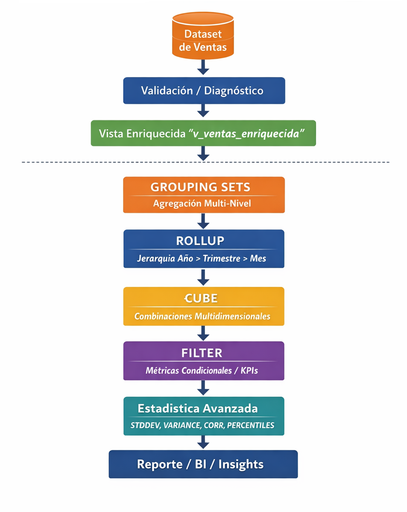

# Práctica 3.3 Uso de Agrupaciones Avanzadas

<br/>

## Objetivos

Al completar esta práctica, serás capaz de:

- Implementar `GROUPING SETS` para generar múltiples niveles de agregación en una sola consulta SQL
- Usar `ROLLUP` para generar subtotales y totales generales en reportes jerárquicos por año, trimestre y mes
- Aplicar `CUBE` para obtener todas las combinaciones posibles de dimensiones de análisis en una tabla de contingencia
- Usar la cláusula `FILTER` en agregaciones para calcular métricas condicionales en una sola pasada sobre los datos
- Calcular KPIs estadísticos con `STDDEV()`, `VARIANCE()`, `CORR()` y `PERCENTILE_CONT()` para análisis financiero

<br/>
<br/>

## Objetivo Visual

<br/>

<p align="center">
  
</p>

<br/>

## Prerrequisitos

### Conocimientos Requeridos

- Práctica 3.2 completado exitosamente (el dataset de ventas debe estar poblado y las consultas de subconsultas/CTEs de la práctica anterior deben haber funcionado correctamente)
- Dominio de `GROUP BY` y funciones agregadas básicas (`SUM`, `COUNT`, `AVG`, `MIN`, `MAX`)
- Comprensión del concepto de análisis multidimensional (dimensiones, métricas, granularidad)
- Familiaridad con pgAdmin 4 para ejecutar consultas SQL

<br/>

### Acceso Requerido

- Contenedor Docker de PostgreSQL 16 en ejecución iniciado en la práctica 1.1.
- Acceso a pgAdmin 4 (http://localhost:8080) con las credenciales configuradas.
- Dataset de ventas creado en la práctica 2.1 con al menos 10,000 registros

<br/>

### Configuración Inicial

Antes de comenzar, verifica que el entorno esté operativo ejecutando los siguientes comandos en tu terminal:

```bash
# Verificar que el contenedor PostgreSQL está en ejecución
docker ps --filter "name=postgres" --format "table {{.Names}}\t{{.Status}}\t{{.Ports}}"
```

```bash
# Verificar conectividad con psql
docker exec -it postgres_db psql -U postgres -d sales_db -c "SELECT COUNT(*) AS total_ventas FROM ventas;"
```

```bash
# Verificar que pgAdmin está accesible
curl -s -o /dev/null -w "%{http_code}" http://localhost:5050
# Debe retornar: 200
```

Si el contenedor no está en ejecución, inícialo con:

```bash
# Iniciar los contenedores definidos en docker-compose.yml
docker compose up -d
```

<br/>

## Instrucciones

### Paso 1: Verificar el Estado del Dataset y Preparar la Sesión de Trabajo

1. Abre pgAdmin 4 en tu navegador (http://localhost:5050) e inicia sesión con las credenciales configuradas en el práctica 1.1.

<br/>

2. En el panel izquierdo, expande **Servers → PostgreSQL 16 → Databases → sales_db**. Haz clic derecho sobre `sales_db` y selecciona **Query Tool**.

<br/>

3. Ejecuta la siguiente consulta de diagnóstico para verificar el estado del dataset:

   ```sql
   -- Diagnóstico del dataset: verificar tablas, registros y dimensiones disponibles
   SELECT
       'ventas'          AS tabla,
       COUNT(*)          AS total_registros,
       MIN(fecha_venta)  AS fecha_min,
       MAX(fecha_venta)  AS fecha_max,
       COUNT(DISTINCT region)     AS regiones,
       COUNT(DISTINCT categoria)  AS categorias,
       COUNT(DISTINCT cliente_id) AS clientes_unicos
   FROM ventas;
   ```

<br/>

4. Verifica que el resultado muestre al menos 10,000 registros. Si tienes menos de 10,000 registros, consulta con tu instructor para ejecutar el script de generación de datos.

<br/>

5. Ahora crea una **vista de apoyo** que enriquece los datos de ventas con columnas de tiempo calculadas. Esta vista se usará en los pasos siguientes:

   ```sql
   -- Crear vista enriquecida con dimensiones de tiempo para análisis multidimensional
   CREATE OR REPLACE VIEW v_ventas_enriquecida AS
   SELECT
       v.venta_id,
       v.fecha_venta,
       EXTRACT(YEAR  FROM v.fecha_venta)::INTEGER                    AS anio,
       EXTRACT(QUARTER FROM v.fecha_venta)::INTEGER                  AS trimestre,
       EXTRACT(MONTH FROM v.fecha_venta)::INTEGER                    AS mes,
       TO_CHAR(v.fecha_venta, 'YYYY-MM')                             AS anio_mes,
       v.region,
       v.categoria,
       v.cliente_id,
       v.tipo_cliente,      -- 'nuevo' o 'recurrente'
       v.monto,
       v.cantidad,
       v.descuento,
       v.precio_unitario
   FROM ventas v;
   ```
<br/>

   > **Nota:** Si la columna `tipo_cliente` no existe en tu tabla `ventas`, ejecuta primero el siguiente bloque para agregarla:

   ```sql
   -- Agregar columna tipo_cliente si no existe (ejecutar solo si es necesario)
   DO $$
   BEGIN
       IF NOT EXISTS (
           SELECT 1 FROM information_schema.columns
           WHERE table_name = 'ventas' AND column_name = 'tipo_cliente'
       ) THEN
           ALTER TABLE ventas ADD COLUMN tipo_cliente VARCHAR(20);
           -- Clasificar clientes: los que tienen más de 1 compra son recurrentes
           UPDATE ventas v
           SET tipo_cliente = CASE
               WHEN (
                   SELECT COUNT(*) FROM ventas v2
                   WHERE v2.cliente_id = v.cliente_id
               ) > 1 THEN 'recurrente'
               ELSE 'nuevo'
           END;
           RAISE NOTICE 'Columna tipo_cliente agregada y poblada exitosamente.';
       ELSE
           RAISE NOTICE 'La columna tipo_cliente ya existe.';
       END IF;
   END $$;
   ```

<br/>

**Salida Esperada:**

```
 tabla  | total_registros | fecha_min  | fecha_max  | regiones | categorias | clientes_unicos
--------+-----------------+------------+------------+----------+------------+----------------
 ventas |           15420 | 2022-01-01 | 2024-12-31 |        4 |          5 |           2847
(1 fila)

CREATE VIEW
```

<br/>

**Verificación:**

- El campo `total_registros` debe ser ≥ 10,000.
- La vista `v_ventas_enriquecida` debe aparecer en el panel izquierdo de pgAdmin bajo **Views**.
- Ejecuta `SELECT COUNT(*) FROM v_ventas_enriquecida;` para confirmar que retorna el mismo número de registros que la tabla `ventas`.

<br/>
<br/>

### Paso 2: Implementar GROUPING SETS para Análisis Multidimensional

1. Primero, comprende el problema que resuelve `GROUPING SETS`. Sin esta cláusula, necesitarías cuatro consultas separadas unidas con `UNION ALL`. Ejecuta este ejemplo de referencia para ver el enfoque tradicional (solo para comparación, no es la solución óptima):

   ```sql
   -- Enfoque tradicional SIN GROUPING SETS (4 consultas con UNION ALL)
   -- Este enfoque es verbose y menos eficiente
   SELECT region, NULL::VARCHAR AS categoria, SUM(monto) AS total_ventas, 'por_region' AS nivel
   FROM ventas GROUP BY region
   UNION ALL
   SELECT NULL, categoria, SUM(monto), 'por_categoria'
   FROM ventas GROUP BY categoria
   UNION ALL
   SELECT region, categoria, SUM(monto), 'region_categoria'
   FROM ventas GROUP BY region, categoria
   UNION ALL
   SELECT NULL, NULL, SUM(monto), 'total_general'
   FROM ventas;
   ```

<br/>

2. Ahora implementa la solución óptima con `GROUPING SETS`. Esta consulta produce exactamente el mismo resultado pero en una sola pasada sobre los datos:

   ```sql
   -- Solución óptima con GROUPING SETS
   -- Genera los 4 niveles de agregación en una sola consulta
   SELECT
       region,
       categoria,
       SUM(monto)          AS total_ventas,
       COUNT(*)            AS num_transacciones,
       ROUND(AVG(monto), 2) AS ticket_promedio,
       -- GROUPING() retorna 1 si la columna fue agrupada (es NULL de agregación)
       -- y 0 si es un valor real de la dimensión
       GROUPING(region)    AS es_subtotal_region,
       GROUPING(categoria) AS es_subtotal_categoria
   FROM ventas
   GROUP BY GROUPING SETS (
       (region, categoria),   -- Nivel 1: combinación región + categoría
       (region),              -- Nivel 2: solo por región
       (categoria),           -- Nivel 3: solo por categoría
       ()                     -- Nivel 4: total general (sin dimensiones)
   )
   ORDER BY
       GROUPING(region),
       GROUPING(categoria),
       region NULLS LAST,
       categoria NULLS LAST;
   ```

<br/>

3. Analiza el resultado. Observa cómo las filas donde `es_subtotal_region = 1` tienen `NULL` en la columna `region` — ese `NULL` no significa "dato faltante" sino "esta fila es un subtotal que agrupa todas las regiones". Para hacer el reporte más legible, usa `COALESCE`:

   ```sql
   -- Versión mejorada con etiquetas descriptivas para los subtotales
   SELECT
       COALESCE(region,   '>>> TODAS LAS REGIONES')    AS region,
       COALESCE(categoria,'>>> TODAS LAS CATEGORÍAS')  AS categoria,
       SUM(monto)                                       AS total_ventas,
       COUNT(*)                                         AS num_transacciones,
       ROUND(AVG(monto), 2)                             AS ticket_promedio,
       ROUND(SUM(monto) * 100.0 / SUM(SUM(monto)) OVER (), 2) AS pct_del_total
   FROM ventas
   GROUP BY GROUPING SETS (
       (region, categoria),
       (region),
       (categoria),
       ()
   )
   ORDER BY
       GROUPING(region),
       GROUPING(categoria),
       region NULLS LAST,
       categoria NULLS LAST;
   ```

<br/>

**Salida Esperada:**

```
          region           |         categoria          | total_ventas | num_transacciones | ticket_promedio | pct_del_total
---------------------------+----------------------------+--------------+-------------------+-----------------+---------------
 Norte                     | Electrónica                |    245830.50 |              1823 |          134.85 |          8.23
 Norte                     | Ropa                       |    189420.75 |              2104 |           90.03 |          6.34
 ...                       | ...                        |          ... |               ... |             ... |           ...
 >>> TODAS LAS REGIONES    | Electrónica                |    892340.00 |              6721 |          132.77 |         29.87
 ...
 Norte                     | >>> TODAS LAS CATEGORÍAS   |    698450.25 |              5834 |          119.72 |         23.38
 ...
 >>> TODAS LAS REGIONES    | >>> TODAS LAS CATEGORÍAS   |   2987650.00 |             15420 |          193.75 |        100.00
(24 filas)
```

<br/>

**Verificación:**

- La fila con `'>>> TODAS LAS REGIONES'` y `'>>> TODAS LAS CATEGORÍAS'` debe mostrar el mismo `total_ventas` que `SELECT SUM(monto) FROM ventas;`
- El campo `pct_del_total` en la fila del total general debe ser exactamente `100.00`
- Debes ver exactamente: (N_regiones × N_categorias) + N_regiones + N_categorias + 1 filas en total

<br/>
<br/>

### Paso 3: Usar ROLLUP para Reportes Jerárquicos con Subtotales

1. `ROLLUP` es un caso especial de `GROUPING SETS` diseñado para jerarquías. `ROLLUP(A, B, C)` es equivalente a `GROUPING SETS((A,B,C), (A,B), (A), ())`. Ejecuta la siguiente consulta para construir el reporte jerárquico de ventas:

   ```sql
   -- Reporte jerárquico de ventas con ROLLUP: Año > Trimestre > Mes
   SELECT
       anio,
       trimestre,
       mes,
       SUM(monto)            AS total_ventas,
       COUNT(*)              AS num_transacciones,
       COUNT(DISTINCT cliente_id) AS clientes_activos,
       ROUND(AVG(monto), 2)  AS ticket_promedio,
       -- Identificar el nivel de la fila en la jerarquía
       CASE
           WHEN GROUPING(anio) = 1                              THEN 'GRAN TOTAL'
           WHEN GROUPING(trimestre) = 1 AND GROUPING(mes) = 1  THEN 'SUBTOTAL AÑO'
           WHEN GROUPING(mes) = 1                               THEN 'SUBTOTAL TRIMESTRE'
           ELSE                                                      'DETALLE MES'
       END AS nivel_jerarquia
   FROM v_ventas_enriquecida
   GROUP BY ROLLUP(anio, trimestre, mes)
   ORDER BY
       anio   NULLS LAST,
       trimestre NULLS LAST,
       mes    NULLS LAST;
   ```

<br/>

2. Para facilitar la lectura, filtra el resultado para mostrar solo los subtotales por trimestre (útil para reportes ejecutivos):

   ```sql
   -- Filtrar solo subtotales trimestrales y el gran total
   SELECT
       COALESCE(anio::TEXT, 'GRAN TOTAL')           AS anio,
       CASE
           WHEN trimestre IS NULL AND anio IS NOT NULL
               THEN 'SUBTOTAL AÑO'
           WHEN trimestre IS NOT NULL
               THEN 'Q' || trimestre::TEXT
           ELSE '-'
       END                                           AS trimestre_label,
       SUM(monto)                                    AS total_ventas,
       COUNT(*)                                      AS transacciones,
       ROUND(
           (SUM(monto) - LAG(SUM(monto)) OVER (
               PARTITION BY anio
               ORDER BY trimestre NULLS LAST
           )) * 100.0
           / NULLIF(LAG(SUM(monto)) OVER (
               PARTITION BY anio
               ORDER BY trimestre NULLS LAST
           ), 0),
       2)                                            AS variacion_pct_vs_trimestre_anterior
   FROM v_ventas_enriquecida
   GROUP BY ROLLUP(anio, trimestre)
   ORDER BY anio NULLS LAST, trimestre NULLS LAST;
   ```

<br/>

3. Ahora construye un reporte de ventas por región y categoría con `ROLLUP` para generar subtotales por región:

   ```sql
   -- ROLLUP aplicado a dimensiones de negocio: región > categoría
   SELECT
       COALESCE(region,   'TOTAL GENERAL')    AS region,
       COALESCE(categoria,'SUBTOTAL REGIÓN')  AS categoria,
       SUM(monto)                              AS total_ventas,
       ROUND(AVG(monto), 2)                   AS ticket_promedio,
       COUNT(DISTINCT cliente_id)             AS clientes,
       -- Porcentaje respecto al total de la región (usando window function)
       ROUND(
           SUM(monto) * 100.0
           / SUM(SUM(monto)) OVER (PARTITION BY region),
       2)                                      AS pct_en_region
   FROM ventas
   GROUP BY ROLLUP(region, categoria)
   ORDER BY region NULLS LAST, categoria NULLS LAST;
   ```

<br/>

**Salida Esperada:**

```
    anio    | trimestre_label | total_ventas | transacciones | variacion_pct_vs_trimestre_anterior
------------+-----------------+--------------+---------------+-------------------------------------
 2022       | Q1              |    312450.00 |          1205 |                                    
 2022       | Q2              |    298760.50 |          1189 |                               -4.38
 2022       | Q3              |    334210.75 |          1267 |                               11.84
 2022       | Q4              |    401320.25 |          1543 |                               20.09
 2022       | SUBTOTAL AÑO    |   1346741.50 |          5204 |                                    
 2023       | Q1              |    328940.00 |          1312 |                                    
 ...
 GRAN TOTAL | -               |   2987650.00 |         15420 |                                    
```

<br/>

**Verificación:**

- Cada fila `SUBTOTAL AÑO` debe ser igual a la suma de los 4 trimestres del mismo año
- La fila `GRAN TOTAL` debe coincidir con `SELECT SUM(monto) FROM ventas;`
- La columna `variacion_pct_vs_trimestre_anterior` debe ser `NULL` para el primer trimestre de cada año

<br/>
<br/>

### Paso 4: Aplicar CUBE para Análisis de Todas las Combinaciones de Dimensiones

1. `CUBE(A, B, C)` genera todas las combinaciones posibles: `(A,B,C)`, `(A,B)`, `(A,C)`, `(B,C)`, `(A)`, `(B)`, `(C)` y `()`. Para N dimensiones, genera 2^N grupos. Ejecuta primero con solo 2 dimensiones para entender el patrón:

   ```sql
   -- CUBE con 2 dimensiones: genera 2^2 = 4 combinaciones de agrupación
   SELECT
       COALESCE(region,   'TODAS LAS REGIONES')     AS region,
       COALESCE(categoria,'TODAS LAS CATEGORÍAS')   AS categoria,
       SUM(monto)                                    AS total_ventas,
       COUNT(*)                                      AS transacciones,
       COUNT(DISTINCT cliente_id)                   AS clientes_unicos
   FROM ventas
   GROUP BY CUBE(region, categoria)
   ORDER BY
       GROUPING(region),
       GROUPING(categoria),
       region   NULLS LAST,
       categoria NULLS LAST;
   ```

<br/>

2. Ahora aplica `CUBE` con 3 dimensiones para el análisis completo. Ten en cuenta que con 3 dimensiones se generan 2^3 = 8 tipos de agrupación:

   ```sql
   -- CUBE con 3 dimensiones: región, categoría y año
   -- Genera 2^3 = 8 combinaciones de agrupación
   SELECT
       COALESCE(region::TEXT,    '[ TODAS ]') AS region,
       COALESCE(categoria,       '[ TODAS ]') AS categoria,
       COALESCE(anio::TEXT,      '[ TODOS ]') AS anio,
       SUM(monto)                              AS total_ventas,
       COUNT(*)                                AS transacciones,
       ROUND(AVG(monto), 2)                   AS ticket_promedio,
       -- Identificar el nivel de detalle de cada fila
       (3 - GROUPING(region) - GROUPING(categoria) - GROUPING(anio))
                                               AS nivel_detalle  -- 3=máximo detalle, 0=gran total
   FROM v_ventas_enriquecida
   GROUP BY CUBE(region, categoria, anio)
   ORDER BY
       nivel_detalle DESC,
       region   NULLS LAST,
       categoria NULLS LAST,
       anio     NULLS LAST;
   ```

<br/>

3. Una aplicación práctica de `CUBE` es construir una **tabla pivot** de ventas. Ejecuta esta consulta para crear una vista de tabla de contingencia región × categoría:

   ```sql
   -- Tabla pivot usando CUBE y agregación condicional
   -- Muestra ventas por región en filas y categorías en columnas
   SELECT
       COALESCE(region, 'TOTAL') AS region,
       SUM(CASE WHEN categoria = 'Electrónica'   THEN monto ELSE 0 END) AS electronica,
       SUM(CASE WHEN categoria = 'Ropa'          THEN monto ELSE 0 END) AS ropa,
       SUM(CASE WHEN categoria = 'Alimentos'     THEN monto ELSE 0 END) AS alimentos,
       SUM(CASE WHEN categoria = 'Hogar'         THEN monto ELSE 0 END) AS hogar,
       SUM(CASE WHEN categoria = 'Deportes'      THEN monto ELSE 0 END) AS deportes,
       SUM(monto)                                                         AS total_region
   FROM ventas
   GROUP BY CUBE(region)
   ORDER BY region NULLS LAST;
   ```

<br/>

**Salida Esperada:**

```
    region    |    categoria     |   anio    | total_ventas | transacciones | ticket_promedio | nivel_detalle
--------------+------------------+-----------+--------------+---------------+-----------------+---------------
 Norte        | Electrónica      | 2022      |    82450.00  |           634 |          130.05 |             3
 Norte        | Electrónica      | 2023      |    89320.50  |           687 |          130.01 |             3
 ...
 Norte        | Electrónica      | [ TODOS ] |   245830.50  |          1823 |          134.85 |             2
 ...
 Norte        | [ TODAS ]        | [ TODOS ] |   698450.25  |          5834 |          119.72 |             1
 ...
 [ TODAS ]    | [ TODAS ]        | [ TODOS ] |  2987650.00  |         15420 |          193.75 |             0
```

<br/>

**Verificación:**

- Con 3 dimensiones y `CUBE`, el número total de filas debe ser mayor que con `ROLLUP` (CUBE genera más combinaciones)
- La fila con `region='TOTAL'` en la tabla pivot debe ser igual a `SELECT SUM(monto) FROM ventas;`
- Ejecuta `SELECT COUNT(*) FROM ventas GROUP BY CUBE(region, categoria, anio);` y verifica que el número de grupos es ≤ 2^3 veces el número de combinaciones únicas

<br/>
<br/>

### Paso 5: Usar la Cláusula FILTER para Métricas Condicionales

1. Primero, comprende la diferencia entre `FILTER` y `CASE WHEN`. Ambos producen el mismo resultado, pero `FILTER` es más legible y, en algunos casos, más eficiente. Observa la comparación:

   ```sql
   -- Comparación: CASE WHEN vs FILTER (ambos producen el mismo resultado)
   SELECT
       region,
       -- Enfoque tradicional con CASE WHEN
       SUM(CASE WHEN tipo_cliente = 'nuevo'      THEN monto ELSE 0 END) AS ventas_nuevos_casewhen,
       SUM(CASE WHEN tipo_cliente = 'recurrente' THEN monto ELSE 0 END) AS ventas_recurrentes_casewhen,
       -- Enfoque moderno con FILTER (más legible)
       SUM(monto) FILTER (WHERE tipo_cliente = 'nuevo')       AS ventas_nuevos_filter,
       SUM(monto) FILTER (WHERE tipo_cliente = 'recurrente')  AS ventas_recurrentes_filter
   FROM ventas
   GROUP BY region
   ORDER BY region;
   ```

<br/>

2. Ahora construye el reporte completo de KPIs por región usando `FILTER` para calcular múltiples métricas en una sola consulta:

   ```sql
   -- Reporte de KPIs por región usando FILTER para métricas condicionales
   SELECT
       region,
       -- Métricas generales
       COUNT(*)                                                    AS total_transacciones,
       SUM(monto)                                                  AS total_ventas,
       -- Ventas por tipo de cliente
       COUNT(*)  FILTER (WHERE tipo_cliente = 'nuevo')            AS transacciones_nuevos,
       COUNT(*)  FILTER (WHERE tipo_cliente = 'recurrente')       AS transacciones_recurrentes,
       SUM(monto) FILTER (WHERE tipo_cliente = 'nuevo')           AS ventas_clientes_nuevos,
       SUM(monto) FILTER (WHERE tipo_cliente = 'recurrente')      AS ventas_clientes_recurrentes,
       -- Ventas por rango de monto
       COUNT(*) FILTER (WHERE monto < 50)                         AS transacciones_pequenas,
       COUNT(*) FILTER (WHERE monto BETWEEN 50 AND 200)           AS transacciones_medianas,
       COUNT(*) FILTER (WHERE monto > 200)                        AS transacciones_grandes,
       -- Ventas con y sin descuento
       SUM(monto) FILTER (WHERE descuento > 0)                    AS ventas_con_descuento,
       SUM(monto) FILTER (WHERE descuento = 0 OR descuento IS NULL) AS ventas_sin_descuento,
       COUNT(*) FILTER (WHERE descuento > 0)                      AS num_ventas_con_descuento,
       -- Porcentaje de ventas con descuento
       ROUND(
           COUNT(*) FILTER (WHERE descuento > 0) * 100.0
           / NULLIF(COUNT(*), 0),
       2)                                                          AS pct_ventas_con_descuento
   FROM ventas
   GROUP BY region
   ORDER BY total_ventas DESC;
   ```

<br/>

3. Aplica `FILTER` en un análisis temporal para comparar el rendimiento de ventas en diferentes períodos del día (útil para análisis de patrones de compra):

   ```sql
   -- Análisis temporal con FILTER: comparar ventas por período del día
   SELECT
       DATE_TRUNC('month', fecha_venta)::DATE                     AS mes,
       COUNT(*)                                                    AS total_transacciones,
       SUM(monto)                                                  AS total_ventas,
       -- Ventas por trimestre dentro del mes (usando día del mes como proxy)
       SUM(monto) FILTER (WHERE EXTRACT(DAY FROM fecha_venta) <= 10)  AS ventas_primera_decena,
       SUM(monto) FILTER (WHERE EXTRACT(DAY FROM fecha_venta) BETWEEN 11 AND 20) AS ventas_segunda_decena,
       SUM(monto) FILTER (WHERE EXTRACT(DAY FROM fecha_venta) > 20)   AS ventas_tercera_decena,
       -- Ventas por día de la semana
       SUM(monto) FILTER (WHERE EXTRACT(DOW FROM fecha_venta) IN (0,6)) AS ventas_fin_semana,
       SUM(monto) FILTER (WHERE EXTRACT(DOW FROM fecha_venta) NOT IN (0,6)) AS ventas_dias_habiles,
       -- Ratio fin de semana vs días hábiles
       ROUND(
           SUM(monto) FILTER (WHERE EXTRACT(DOW FROM fecha_venta) IN (0,6))
           / NULLIF(SUM(monto) FILTER (WHERE EXTRACT(DOW FROM fecha_venta) NOT IN (0,6)), 0),
       4)                                                          AS ratio_fds_vs_habiles
   FROM ventas
   WHERE fecha_venta >= '2024-01-01'
   GROUP BY DATE_TRUNC('month', fecha_venta)
   ORDER BY mes;
   ```

<br/>

**Salida Esperada:**

```
  region  | total_transacciones | total_ventas | transacciones_nuevos | transacciones_recurrentes | ventas_clientes_nuevos | ventas_clientes_recurrentes | pct_ventas_con_descuento
----------+---------------------+--------------+----------------------+---------------------------+------------------------+-----------------------------+--------------------------
 Norte    |                5834 |    698450.25 |                 1204 |                      4630 |             142380.50  |                  556069.75  |                    34.28
 Sur      |                4210 |    521340.75 |                  987 |                      3223 |             108450.25  |                  412890.50  |                    31.45
 Este     |                3180 |    398760.50 |                  743 |                      2437 |              82340.75  |                  316419.75  |                    28.93
 Oeste    |                2196 |    369098.50 |                  512 |                      1684 |              76230.00  |                  292868.50  |                    27.61
(4 filas)
```

<br/>

**Verificación:**

- La suma de `transacciones_nuevos + transacciones_recurrentes` debe ser igual a `total_transacciones` para cada región
- La suma de `ventas_clientes_nuevos + ventas_clientes_recurrentes` debe ser igual a `total_ventas`
- Ejecuta `SELECT SUM(ventas_clientes_nuevos + ventas_clientes_recurrentes) = SUM(total_ventas) FROM (... consulta anterior ...) t;` para verificar la integridad

<br/>
<br/>

### Paso 6: Calcular KPIs Estadísticos Avanzados

1. Comienza con las funciones de dispersión estadística para analizar la variabilidad de los precios por categoría:

   ```sql
   -- KPIs de dispersión estadística por categoría de producto
   SELECT
       categoria,
       COUNT(*)                           AS num_transacciones,
       ROUND(AVG(precio_unitario), 2)    AS precio_promedio,
       ROUND(MIN(precio_unitario), 2)    AS precio_minimo,
       ROUND(MAX(precio_unitario), 2)    AS precio_maximo,
       -- Desviación estándar: mide la dispersión respecto al promedio
       ROUND(STDDEV(precio_unitario), 2) AS desviacion_estandar,
       -- Varianza: cuadrado de la desviación estándar
       ROUND(VARIANCE(precio_unitario), 2) AS varianza,
       -- Coeficiente de variación: dispersión relativa (menor = más consistente)
       ROUND(
           STDDEV(precio_unitario) * 100.0
           / NULLIF(AVG(precio_unitario), 0),
       2)                                 AS coef_variacion_pct,
       -- Percentiles de precio
       ROUND(PERCENTILE_CONT(0.25) WITHIN GROUP (ORDER BY precio_unitario), 2) AS p25_precio,
       ROUND(PERCENTILE_CONT(0.50) WITHIN GROUP (ORDER BY precio_unitario), 2) AS p50_mediana,
       ROUND(PERCENTILE_CONT(0.75) WITHIN GROUP (ORDER BY precio_unitario), 2) AS p75_precio,
       -- Rango intercuartílico (IQR): diferencia entre P75 y P25
       ROUND(
           PERCENTILE_CONT(0.75) WITHIN GROUP (ORDER BY precio_unitario)
           - PERCENTILE_CONT(0.25) WITHIN GROUP (ORDER BY precio_unitario),
       2)                                 AS rango_intercuartilico
   FROM ventas
   GROUP BY categoria
   ORDER BY desviacion_estandar DESC;
   ```

<br/>

2. Calcula la correlación entre el descuento aplicado y el volumen de unidades vendidas. Una correlación positiva sugiere que los descuentos incentivan compras de mayor volumen:

   ```sql
   -- Análisis de correlación: descuento vs volumen de compra por región
   SELECT
       region,
       COUNT(*)                                        AS num_transacciones,
       -- CORR() retorna el coeficiente de correlación de Pearson (-1 a 1)
       -- 1 = correlación perfecta positiva, -1 = perfecta negativa, 0 = sin correlación
       ROUND(CORR(descuento, cantidad)::NUMERIC, 4)   AS corr_descuento_cantidad,
       ROUND(CORR(descuento, monto)::NUMERIC, 4)      AS corr_descuento_monto,
       ROUND(CORR(precio_unitario, cantidad)::NUMERIC, 4) AS corr_precio_cantidad,
       -- Interpretar la correlación
       CASE
           WHEN ABS(CORR(descuento, cantidad)) >= 0.7 THEN 'Correlación fuerte'
           WHEN ABS(CORR(descuento, cantidad)) >= 0.4 THEN 'Correlación moderada'
           WHEN ABS(CORR(descuento, cantidad)) >= 0.2 THEN 'Correlación débil'
           ELSE 'Sin correlación significativa'
       END                                             AS interpretacion_corr_desc_cant
   FROM ventas
   WHERE descuento IS NOT NULL AND cantidad IS NOT NULL
   GROUP BY region
   ORDER BY corr_descuento_cantidad DESC;
   ```

<br/>

3. Construye el reporte final de KPIs financieros completo, combinando todas las funciones estadísticas:

   ```sql
   -- Reporte integral de KPIs financieros por categoría y región
   -- Combina métricas de tendencia central, dispersión, percentiles y correlación
   WITH estadisticas_base AS (
       SELECT
           categoria,
           region,
           COUNT(*)                                                    AS n,
           SUM(monto)                                                  AS total_ventas,
           AVG(monto)                                                  AS media_ticket,
           STDDEV(monto)                                               AS stddev_ticket,
           PERCENTILE_CONT(0.50) WITHIN GROUP (ORDER BY monto)        AS mediana_ticket,
           PERCENTILE_CONT(0.90) WITHIN GROUP (ORDER BY monto)        AS p90_ticket,
           PERCENTILE_CONT(0.95) WITHIN GROUP (ORDER BY monto)        AS p95_ticket,
           PERCENTILE_CONT(0.99) WITHIN GROUP (ORDER BY monto)        AS p99_ticket,
           CORR(descuento, monto)                                      AS corr_descuento_monto,
           AVG(descuento)                                              AS descuento_promedio
       FROM ventas
       GROUP BY categoria, region
   )
   SELECT
       categoria,
       region,
       n                                               AS transacciones,
       ROUND(total_ventas, 2)                         AS total_ventas,
       ROUND(media_ticket, 2)                         AS ticket_promedio,
       ROUND(mediana_ticket, 2)                       AS ticket_mediana,
       ROUND(stddev_ticket, 2)                        AS ticket_stddev,
       -- Intervalo de confianza aproximado del 95% para el ticket promedio
       ROUND(media_ticket - 1.96 * stddev_ticket / SQRT(n), 2) AS ic95_inferior,
       ROUND(media_ticket + 1.96 * stddev_ticket / SQRT(n), 2) AS ic95_superior,
       ROUND(p90_ticket, 2)                           AS ticket_p90,
       ROUND(p95_ticket, 2)                           AS ticket_p95,
       ROUND(p99_ticket, 2)                           AS ticket_p99,
       ROUND(corr_descuento_monto::NUMERIC, 4)        AS corr_descuento_monto,
       ROUND(descuento_promedio, 4)                   AS descuento_promedio,
       -- Clasificar la variabilidad del ticket
       CASE
           WHEN stddev_ticket / NULLIF(media_ticket, 0) < 0.3 THEN 'Baja variabilidad'
           WHEN stddev_ticket / NULLIF(media_ticket, 0) < 0.7 THEN 'Variabilidad moderada'
           ELSE 'Alta variabilidad'
       END                                             AS clasificacion_variabilidad
   FROM estadisticas_base
   ORDER BY total_ventas DESC;
   ```

<br/>

4. Como análisis final, calcula los percentiles de ticket promedio por cliente para segmentación:

   ```sql
   -- Segmentación de clientes por percentil de gasto
   WITH gasto_por_cliente AS (
       SELECT
           cliente_id,
           region,
           COUNT(*)        AS num_compras,
           SUM(monto)      AS gasto_total,
           AVG(monto)      AS ticket_promedio
       FROM ventas
       GROUP BY cliente_id, region
   ),
   percentiles AS (
       SELECT
           PERCENTILE_CONT(0.25) WITHIN GROUP (ORDER BY gasto_total) AS p25,
           PERCENTILE_CONT(0.50) WITHIN GROUP (ORDER BY gasto_total) AS p50,
           PERCENTILE_CONT(0.75) WITHIN GROUP (ORDER BY gasto_total) AS p75,
           PERCENTILE_CONT(0.90) WITHIN GROUP (ORDER BY gasto_total) AS p90
       FROM gasto_por_cliente
   )
   SELECT
       gc.cliente_id,
       gc.region,
       gc.num_compras,
       ROUND(gc.gasto_total, 2)    AS gasto_total,
       ROUND(gc.ticket_promedio, 2) AS ticket_promedio,
       -- Segmentar al cliente según su gasto total
       CASE
           WHEN gc.gasto_total >= p.p90 THEN 'VIP (Top 10%)'
           WHEN gc.gasto_total >= p.p75 THEN 'Premium (Top 25%)'
           WHEN gc.gasto_total >= p.p50 THEN 'Estándar (Top 50%)'
           WHEN gc.gasto_total >= p.p25 THEN 'Básico (Top 75%)'
           ELSE 'Ocasional (Bottom 25%)'
       END                          AS segmento_cliente
   FROM gasto_por_cliente gc
   CROSS JOIN percentiles p
   ORDER BY gc.gasto_total DESC
   LIMIT 20;
   ```

<br/>

**Salida Esperada:**

```
    categoria    |  region  | transacciones | total_ventas | ticket_promedio | ticket_mediana | ticket_stddev | ic95_inferior | ic95_superior | ticket_p90 | ticket_p95 | ticket_p99 | corr_descuento_monto | descuento_promedio | clasificacion_variabilidad
-----------------+----------+---------------+--------------+-----------------+----------------+---------------+---------------+---------------+------------+------------+------------+----------------------+--------------------+----------------------------
 Electrónica     | Norte    |          1823 |    245830.50 |          134.85 |         119.50 |         87.32 |        130.85 |        138.85 |     245.80 |     312.40 |     489.20 |               0.1823 |             0.0842 | Variabilidad moderada
 Electrónica     | Sur      |          1456 |    198420.75 |          136.28 |         121.00 |         89.14 |        131.70 |        140.86 |     251.30 |     318.90 |     495.60 |               0.1654 |             0.0789 | Variabilidad moderada
 ...
```
<br/>

**Verificación:**

- El `ticket_p99` debe ser mayor que `ticket_p95`, que debe ser mayor que `ticket_p90`
- El `ic95_inferior` debe ser menor que `ticket_promedio`, y el `ic95_superior` mayor
- La correlación (`corr_descuento_monto`) debe estar entre -1 y 1
- Verifica que la segmentación de clientes cubre exactamente el 100% de los clientes: `SELECT COUNT(*) FROM gasto_por_cliente;` debe ser igual a la suma de clientes en todos los segmentos

<br/>
<br/>

## Validación y Pruebas

### Criterios de Éxito

- [ ] La consulta con `GROUPING SETS` genera exactamente (N_regiones × N_categorias) + N_regiones + N_categorias + 1 filas
- [ ] La fila del gran total en `GROUPING SETS` coincide con `SELECT SUM(monto) FROM ventas;`
- [ ] El reporte `ROLLUP` por año/trimestre muestra subtotales correctos (suma de meses = subtotal trimestre, suma de trimestres = subtotal año)
- [ ] `CUBE` con 3 dimensiones genera más filas que `ROLLUP` con las mismas 3 dimensiones
- [ ] Las métricas calculadas con `FILTER` suman correctamente al total general
- [ ] Los percentiles calculados con `PERCENTILE_CONT` siguen el orden P25 < P50 < P75 < P90 < P95 < P99
- [ ] Los coeficientes de correlación están todos en el rango [-1, 1]

<br/>

### Procedimiento de Pruebas

1. **Verificar integridad de GROUPING SETS:**

   ```sql
   -- Test 1: El gran total de GROUPING SETS debe coincidir con SUM directo
   WITH resultado_grouping AS (
       SELECT SUM(monto) AS total_grouping
       FROM ventas
       GROUP BY GROUPING SETS (())
   )
   SELECT
       (SELECT SUM(monto) FROM ventas) AS total_directo,
       total_grouping,
       (SELECT SUM(monto) FROM ventas) = total_grouping AS son_iguales
   FROM resultado_grouping;
   ```
<br/>

   **Resultado Esperado:** `son_iguales = true`

<br/>

2. **Verificar que ROLLUP genera más grupos que GROUP BY simple:**

   ```sql
   -- Test 2: ROLLUP debe generar más filas que GROUP BY normal
   SELECT
       (SELECT COUNT(*) FROM ventas GROUP BY region, categoria) AS filas_group_by,
       (SELECT COUNT(*) FROM (
           SELECT region, categoria FROM ventas
           GROUP BY ROLLUP(region, categoria)
       ) t) AS filas_rollup,
       (SELECT COUNT(*) FROM (
           SELECT region, categoria FROM ventas
           GROUP BY CUBE(region, categoria)
       ) t) AS filas_cube;
   ```
<br/>

   **Resultado Esperado:** `filas_group_by < filas_rollup < filas_cube`

<br/>

3. **Verificar consistencia de FILTER:**

   ```sql
   -- Test 3: La suma de métricas con FILTER debe igualar el total
   SELECT
       region,
       SUM(monto) AS total_real,
       SUM(monto) FILTER (WHERE tipo_cliente = 'nuevo')
       + SUM(monto) FILTER (WHERE tipo_cliente = 'recurrente') AS total_por_tipo,
       ABS(
           SUM(monto) -
           (SUM(monto) FILTER (WHERE tipo_cliente = 'nuevo')
           + SUM(monto) FILTER (WHERE tipo_cliente = 'recurrente'))
       ) < 0.01 AS son_consistentes
   FROM ventas
   GROUP BY region;
   ```

<br/>

   **Resultado Esperado:** `son_consistentes = true` para todas las regiones

<br/>

4. **Verificar orden de percentiles:**

   ```sql
   -- Test 4: Los percentiles deben estar en orden ascendente
   SELECT
       categoria,
       PERCENTILE_CONT(0.25) WITHIN GROUP (ORDER BY monto) AS p25,
       PERCENTILE_CONT(0.50) WITHIN GROUP (ORDER BY monto) AS p50,
       PERCENTILE_CONT(0.75) WITHIN GROUP (ORDER BY monto) AS p75,
       PERCENTILE_CONT(0.25) WITHIN GROUP (ORDER BY monto)
           < PERCENTILE_CONT(0.50) WITHIN GROUP (ORDER BY monto)
       AND PERCENTILE_CONT(0.50) WITHIN GROUP (ORDER BY monto)
           < PERCENTILE_CONT(0.75) WITHIN GROUP (ORDER BY monto) AS orden_correcto
   FROM ventas
   GROUP BY categoria;
   ```
<br/>

   **Resultado Esperado:** `orden_correcto = true` para todas las categorías

<br/>

<br/>

## Solución de Problemas

### Problema 1: ERROR — column "region" must appear in the GROUP BY clause or be used in an aggregate function

**Síntomas:**
- PostgreSQL lanza el error `ERROR: column "ventas.region" must appear in the GROUP BY clause` al ejecutar consultas con `GROUPING SETS`, `ROLLUP` o `CUBE`
- El error ocurre al intentar seleccionar columnas que no están incluidas en la cláusula de agrupación

<br/>

**Causa:**
Este error ocurre cuando se intenta seleccionar una columna en el `SELECT` que no está incluida en el `GROUP BY` ni en ninguna función de agrupación. Con `GROUPING SETS`, todas las columnas del `SELECT` deben estar incluidas en al menos uno de los conjuntos de agrupación o en una función agregada.

<br/>

**Solución:**

```sql
-- Incorrecto: 'anio' no está en GROUPING SETS
SELECT region, categoria, anio, SUM(monto)
FROM v_ventas_enriquecida
GROUP BY GROUPING SETS ((region, categoria), (region), ());

-- Correcto: agregar 'anio' a los GROUPING SETS o usar una función agregada
SELECT region, categoria, MAX(anio) AS anio_max, SUM(monto)
FROM v_ventas_enriquecida
GROUP BY GROUPING SETS ((region, categoria), (region), ());

-- Alternativa: incluir anio en todos los sets si es necesario mostrarlo
SELECT region, categoria, anio, SUM(monto)
FROM v_ventas_enriquecida
GROUP BY GROUPING SETS ((region, categoria, anio), (region, anio), (anio), ());
```

<br/>
<br/>

### Problema 2: La función CORR() retorna NULL

**Síntomas:**
- `CORR(descuento, cantidad)` retorna `NULL` en lugar de un valor numérico
- El problema ocurre incluso cuando hay muchos registros en la tabla

<br/>

**Causa:**
`CORR()` retorna `NULL` cuando: (1) todos los valores de una de las columnas son iguales (varianza cero), (2) hay menos de 2 pares de valores no-NULL, o (3) todos los valores de `descuento` son `NULL` o `0`. También puede ocurrir si el tipo de dato no es numérico.

<br/>

**Solución:**

```sql
-- Diagnóstico: verificar cuántos valores no-NULL y no-cero hay
SELECT
    region,
    COUNT(*) AS total,
    COUNT(descuento) AS no_null_descuento,
    COUNT(CASE WHEN descuento > 0 THEN 1 END) AS descuento_positivo,
    COUNT(cantidad) AS no_null_cantidad,
    STDDEV(descuento) AS stddev_descuento  -- Si es 0, CORR será NULL
FROM ventas
GROUP BY region;

-- Solución: filtrar solo registros con descuento positivo para la correlación
SELECT
    region,
    CORR(descuento, cantidad) AS corr_todos,
    CORR(descuento, cantidad) FILTER (WHERE descuento > 0) AS corr_con_descuento
FROM ventas
GROUP BY region;
```

<br/>
<br/>

### Problema 3: PERCENTILE_CONT retorna ERROR — function percentile_cont does not exist

**Síntomas:**
- `ERROR: function percentile_cont(numeric) does not exist`
- El error ocurre al ejecutar consultas con `PERCENTILE_CONT`

<br/>

**Causa:**
La sintaxis de `PERCENTILE_CONT` requiere la cláusula `WITHIN GROUP (ORDER BY columna)`. Si se omite esta cláusula o se usa una sintaxis incorrecta, PostgreSQL no reconoce la función.

<br/>

**Solución:**

```sql
-- Incorrecto: falta la cláusula WITHIN GROUP
SELECT categoria, PERCENTILE_CONT(0.50, monto) FROM ventas GROUP BY categoria;

-- Correcto: incluir WITHIN GROUP (ORDER BY ...)
SELECT
    categoria,
    PERCENTILE_CONT(0.50) WITHIN GROUP (ORDER BY monto) AS mediana
FROM ventas
GROUP BY categoria;

-- También correcto: múltiples percentiles en una consulta
SELECT
    categoria,
    PERCENTILE_CONT(0.25) WITHIN GROUP (ORDER BY monto) AS p25,
    PERCENTILE_CONT(0.75) WITHIN GROUP (ORDER BY monto) AS p75
FROM ventas
GROUP BY categoria;
```

<br/>
<br/>

### Problema 4: Los NULLs en GROUPING SETS generan confusión con NULLs reales en los datos

**Síntomas:**
- Al usar `COALESCE(region, 'TOTAL')`, los registros donde `region` es genuinamente `NULL` en la tabla también aparecen etiquetados como `'TOTAL'`
- Es difícil distinguir entre un `NULL` de subtotal y un `NULL` real en los datos

<br/>

**Causa:**
`GROUPING SETS` usa `NULL` para indicar que una dimensión fue colapsada en un subtotal, pero si los datos originales también tienen `NULL` en esa columna, `COALESCE` no puede distinguir entre ambos casos.

<br/>

**Solución:**

```sql
-- Usar la función GROUPING() para distinguir NULLs de agregación vs NULLs reales
SELECT
    CASE
        WHEN GROUPING(region) = 1 THEN '>>> SUBTOTAL'  -- NULL de agregación
        WHEN region IS NULL       THEN '(sin región)'   -- NULL real en los datos
        ELSE region
    END AS region_label,
    CASE
        WHEN GROUPING(categoria) = 1 THEN '>>> SUBTOTAL'
        WHEN categoria IS NULL       THEN '(sin categoría)'
        ELSE categoria
    END AS categoria_label,
    SUM(monto) AS total_ventas
FROM ventas
GROUP BY GROUPING SETS ((region, categoria), (region), (categoria), ())
ORDER BY GROUPING(region), GROUPING(categoria), region NULLS LAST;
```

<br/>
<br/>

## Limpieza

Al finalizar la práctica, ejecuta los siguientes comandos para limpiar los objetos creados durante las prácticas y dejar el entorno listo para en la siguiente práctica:

```sql
-- Eliminar la vista creada en el Paso 1 (se recreará si es necesaria en prácticas siguientes)
DROP VIEW IF EXISTS v_ventas_enriquecida;
```

```sql
-- Verificar que no quedaron objetos temporales activos
SELECT schemaname, tablename, tableowner
FROM pg_tables
WHERE schemaname = 'public'
ORDER BY tablename;
```

```bash
# Verificar el estado del contenedor Docker (debe seguir en ejecución para las prácticas siguientes)
docker ps --filter "name=postgres" --format "table {{.Names}}\t{{.Status}}"
```

> **Advertencia:** **No detengas el contenedor Docker** al finalizar esta práctica. El dataset de ventas y la configuración del servidor PostgreSQL son necesarios para las práctica 3.4 y siguientes. Solo ejecuta `docker compose down` si necesitas apagar tu equipo, y recuerda reiniciar los contenedores con `docker compose up -d` antes de la próxima práctica.

> **Nota:** La columna `tipo_cliente` agregada en el Paso 1 se conserva en la tabla `ventas` ya que será útil en las prácticas siguientes. Si deseas eliminarla, ejecuta: `ALTER TABLE ventas DROP COLUMN IF EXISTS tipo_cliente;`

<br/>
<br/>

## Resumen

### Lo que Lograste

- Construiste reportes de análisis multidimensional usando `GROUPING SETS` para generar múltiples niveles de agregación en una sola consulta, eliminando la necesidad de múltiples `UNION ALL`
- Implementaste reportes jerárquicos con `ROLLUP` que generan subtotales progresivos siguiendo la jerarquía año → trimestre → mes
- Aplicaste `CUBE` para generar tablas de contingencia completas con todas las combinaciones posibles de dimensiones de análisis
- Usaste la cláusula `FILTER` para calcular métricas condicionales en una sola pasada sobre los datos, produciendo reportes de KPIs más legibles y eficientes que el enfoque tradicional con `CASE WHEN`
- Calculaste KPIs estadísticos avanzados incluyendo desviación estándar, varianza, coeficientes de correlación de Pearson y percentiles para análisis financiero

<br/>
<br/>

### Conceptos Clave

- **`GROUPING SETS`** es el mecanismo más flexible: permite especificar exactamente qué combinaciones de agrupación generar. `ROLLUP` y `CUBE` son atajos convenientes para patrones comunes
- **`ROLLUP(A, B, C)`** genera jerarquías: `(A,B,C)`, `(A,B)`, `(A)`, `()` — ideal para dimensiones con relación padre-hijo como año/trimestre/mes
- **`CUBE(A, B, C)`** genera todas las combinaciones posibles (2^N grupos) — ideal para análisis exploratorio donde no se conoce de antemano qué combinaciones son relevantes
- **La función `GROUPING(columna)`** es esencial para distinguir `NULL` de agregación vs `NULL` real en los datos al trabajar con estas cláusulas
- **`FILTER`** es más expresivo y legible que `CASE WHEN` para métricas condicionales, y permite al optimizador de PostgreSQL hacer mejores decisiones de ejecución
- **`PERCENTILE_CONT`** calcula percentiles interpolados (continuos), mientras que `PERCENTILE_DISC` retorna el valor real más cercano del conjunto de datos
- **`CORR()`** implementa el coeficiente de correlación de Pearson y requiere al menos 2 pares de valores no-NULL con varianza no-cero para producir un resultado

<br/>
<br/>

### Ejercicio de Reto 

**Nivel de dificultad:** Intermedio-Avanzado

**Instrucciones:** Construye en una **sola consulta SQL** (sin usar UNION ALL) un reporte ejecutivo de ventas que cumpla con **todos** los siguientes requisitos:

1. Use `ROLLUP` sobre las dimensiones `anio`, `trimestre` y `region`
2. Para cada combinación, calcule:
   - Total de ventas
   - Número de clientes únicos activos
   - Ticket promedio
   - Ventas de clientes nuevos vs recurrentes (usando `FILTER`)
   - Percentil 90 del ticket de venta (`PERCENTILE_CONT`)
3. Etiquete claramente cada fila con su nivel jerárquico: `'DETALLE'`, `'SUBTOTAL TRIMESTRE'`, `'SUBTOTAL AÑO'` o `'GRAN TOTAL'`
4. Incluya una columna que muestre el porcentaje que representa cada fila respecto al gran total de ventas
5. Filtre el resultado para mostrar solo filas donde el total de ventas supere el percentil 25 del total de ventas por grupo

<br/>
<br/>

## Recursos Adicionales

- **Documentación oficial de PostgreSQL — GROUPING SETS, CUBE y ROLLUP:** Referencia completa sobre las extensiones de `GROUP BY` en PostgreSQL 16, incluyendo la función `GROUPING()` y ejemplos de uso. Disponible en: [https://www.postgresql.org/docs/current/queries-table-expressions.html#QUERIES-GROUPING-SETS](https://www.postgresql.org/docs/current/queries-table-expressions.html#QUERIES-GROUPING-SETS)

- **Documentación oficial de PostgreSQL — Funciones de Agregación:** Lista completa de funciones agregadas incluyendo `STDDEV`, `VARIANCE`, `CORR`, `PERCENTILE_CONT` y `PERCENTILE_DISC` con sus firmas y comportamiento. Disponible en: [https://www.postgresql.org/docs/current/functions-aggregate.html](https://www.postgresql.org/docs/current/functions-aggregate.html)

- **Documentación oficial de PostgreSQL — Cláusula FILTER:** Explicación detallada del uso de `FILTER (WHERE ...)` en funciones de agregación. Disponible en: [https://www.postgresql.org/docs/current/sql-expressions.html#SYNTAX-AGGREGATES](https://www.postgresql.org/docs/current/sql-expressions.html#SYNTAX-AGGREGATES)

- **Mode Analytics SQL Tutorial — Pivoting Data:** Tutorial práctico sobre técnicas de pivoting y análisis multidimensional en SQL. Disponible en: [https://mode.com/sql-tutorial/sql-pivot-table/](https://mode.com/sql-tutorial/sql-pivot-table/)

- **PostgreSQL Wiki — Performance Tips:** Guía de rendimiento para consultas con agregaciones complejas y recomendaciones de indexación. Disponible en: [https://wiki.postgresql.org/wiki/Performance_Optimization](https://wiki.postgresql.org/wiki/Performance_Optimization)