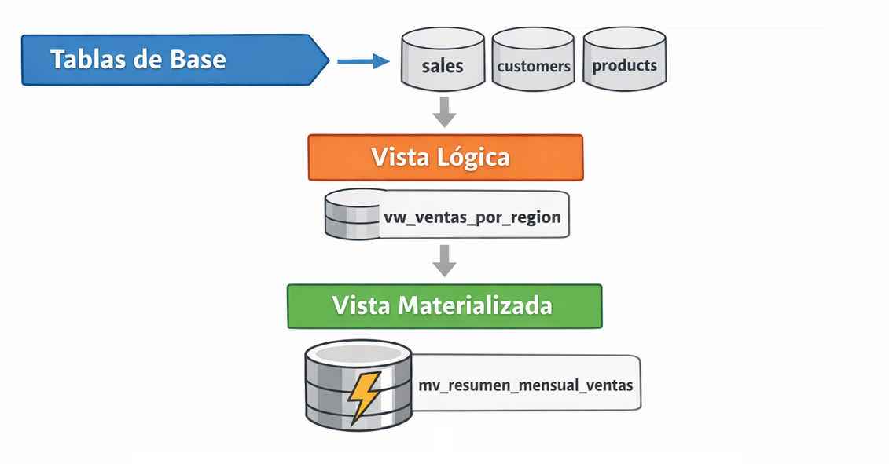

# Práctica 7: Creación y Uso de Vistas y Vistas Materializadas

## Objetivos  

Al completar esta práctica, serás capaz de:

- Crear vistas lógicas que encapsulen consultas complejas con JOINs y agregaciones para simplificar el acceso a datos del dataset de ventas.
- Implementar vistas materializadas que precalculen resultados de consultas costosas y persistan los datos físicamente en disco.
- Ejecutar `REFRESH MATERIALIZED VIEW` y `REFRESH MATERIALIZED VIEW CONCURRENTLY` y comprender sus diferencias de comportamiento y bloqueo.
- Medir y comparar el rendimiento entre consultas directas, vistas lógicas y vistas materializadas usando `EXPLAIN ANALYZE`.
- Diseñar una arquitectura de capas de vistas (base → negocio → materializada) orientada a la integración con Power BI.

<br/><br/>


## Objetivo Visual

<p align="center">
  
</p>

<br/><br/>

## Prerrequisitos

### Conocimientos Requeridos

- Las cuatro prácticas del capítulo 3 completadas.
- Comprensión de consultas SQL con `JOIN`, `GROUP BY`, `HAVING` y funciones de agregación.
- Familiaridad con la estructura del dataset de ventas (`sales`, `customers`, `products`, `regions`).
- Conocimiento básico del cliente `psql` y pgAdmin 4.

<br/>

### Acceso Requerido

- Contenedor Docker de PostgreSQL 16 en ejecución (configurado en Lab 01-00-01)
- Acceso a pgAdmin 4 (http://localhost:8080) o cliente `psql`
- Usuario `postgres` con contraseña `postgres` y acceso a la base de datos `ventas_db`
- Dataset de ventas cargado con al menos 100,000 registros (generado en Lab 02-00-01 y enriquecido en Módulo 3)

<br/>

### Verificación de Prerrequisitos

Antes de comenzar, ejecuta el siguiente comando para confirmar que el entorno está listo:

```sql

-- Con base a todas las consultas, joins, vistas y vistas materializadas usadas en la práctica
-- Se actualizan algunas tablas que serán compatible con PostgreSQL 16-18.

-- Estructura de Tablas

-- =========================
-- LIMPIEZA (opcional)
-- =========================
DROP TABLE IF EXISTS sales CASCADE;
DROP TABLE IF EXISTS customers CASCADE;
DROP TABLE IF EXISTS products CASCADE;
DROP TABLE IF EXISTS regions CASCADE;

-- =========================
-- TABLA: regions
-- =========================
CREATE TABLE regions (
    region_id   INT PRIMARY KEY,
    region_name VARCHAR(50) NOT NULL
);

-- =========================
-- TABLA: customers
-- =========================
CREATE TABLE customers (
    customer_id SERIAL PRIMARY KEY,
    first_name  VARCHAR(50),
    last_name   VARCHAR(50),
    email       VARCHAR(100),
    region_id   INT REFERENCES regions(region_id),
    created_at  TIMESTAMP DEFAULT CURRENT_TIMESTAMP,
    is_active   BOOLEAN DEFAULT TRUE
);

-- =========================
-- TABLA: products
-- =========================
CREATE TABLE products (
    product_id   SERIAL PRIMARY KEY,
    product_name VARCHAR(100),
    category     VARCHAR(50),
    unit_price   NUMERIC(10,2)
);

-- =========================
-- TABLA: sales
-- =========================
CREATE TABLE sales (
    sale_id     SERIAL PRIMARY KEY,
    customer_id INT REFERENCES customers(customer_id),
    product_id  INT REFERENCES products(product_id),
    sale_date   DATE NOT NULL,
    quantity    INT NOT NULL,
    unit_price  NUMERIC(10,2) NOT NULL
);
```

<br/>

Agregar datos las tablas de regions, customers, products y sales.

```sql

-- catálogo de regiones

INSERT INTO regions (region_id, region_name) VALUES
(1, 'Norte'),
(2, 'Sur'),
(3, 'Centro'),
(4, 'Occidente');

-- Customers (1000 registros)
INSERT INTO customers (first_name, last_name, email, region_id, created_at, is_active)
SELECT
    'Nombre' || gs,
    'Apellido' || gs,
    'cliente' || gs || '@correo.com',
    (RANDOM()*3 + 1)::INT,
    CURRENT_DATE - (RANDOM()*365)::INT,
    TRUE
FROM generate_series(1,1000) gs;

-- Products (50 registros)
INSERT INTO products (product_name, category, unit_price)
SELECT
    'Producto ' || gs,
    CASE 
        WHEN gs % 4 = 0 THEN 'Electrónica'
        WHEN gs % 4 = 1 THEN 'Ropa'
        WHEN gs % 4 = 2 THEN 'Hogar'
        ELSE 'Deportes'
    END,
    ROUND((RANDOM()*500 + 10)::numeric,2)
FROM generate_series(1,50) gs;

-- Sales (100,000 registros)
-- Este será el más importante para rendimiento y vistas
INSERT INTO sales (customer_id, product_id, sale_date, quantity, unit_price)
SELECT
    (RANDOM()*999 + 1)::INT,
    (RANDOM()*49 + 1)::INT,
    CURRENT_DATE - (RANDOM()*365)::INT,
    (RANDOM()*10 + 1)::INT,
    ROUND((RANDOM()*500 + 10)::numeric,2)
FROM generate_series(1,100000);


```

Cración de índices críticos para la práctica

```sql
CREATE INDEX idx_sales_customer   ON sales(customer_id);
CREATE INDEX idx_sales_product    ON sales(product_id);
CREATE INDEX idx_sales_date       ON sales(sale_date);

CREATE INDEX idx_customers_region ON customers(region_id);

SELECT 
    indexname,
    indexdef
FROM pg_indexes
WHERE tablename in ( 'sales','customers', 'regions', 'products');


SELECT 
    i.relname AS indice,
    am.amname AS tipo,
    pg_get_indexdef(i.oid) AS definicion
FROM pg_class t
JOIN pg_index ix ON t.oid = ix.indrelid
JOIN pg_class i ON i.oid = ix.indexrelid
JOIN pg_am am ON i.relam = am.oid
WHERE t.relname in ( 'sales','customers', 'regions', 'products')
ORDER BY i.relname;

-- Estádisticas obligatorias para apoyar a EXPLAIN


ANALYZE sales;
ANALYZE customers;
ANALYZE products;
ANALYZE regions;

-- Verificación

SELECT
    schemaname,
    relname,
    n_live_tup
FROM pg_stat_user_tables
WHERE relname IN ('sales','customers','products','regions');

```

<br/>
<br/>

## Configuración Inicial

Verifica que el contenedor PostgreSQL esté activo antes de comenzar:

```bash
# Verificar que el contenedor está corriendo
docker ps --filter "name=curso_postgres" --format "table {{.Names}}\t{{.Status}}\t{{.Ports}}"
```

Si el contenedor no está activo, inícialo:

```bash
# Iniciar el contenedor
docker compose up -d

# Esperar 5 segundos y verificar conectividad
sleep 5
docker exec -it curso_postgres psql -U postgres -d ventas_db -c "SELECT version();"
```

Conectarse a la base de datos:

```bash
# Opción A: Conectarse con psql desde el contenedor
docker exec -it curso_postgres psql -U postgres -d ventas_db

# Opción B: Conectarse con psql local (si está instalado)
psql -h localhost -p 5432 -U postgres -d ventas_db
```

<br/>
<br/>

## Instrucciones

### Paso 1: Explorar la Estructura del Dataset de Ventas

1. Conéctate a la base de datos `ventas_db` y examina las tablas disponibles:

   ```sql
   -- Listar todas las tablas del esquema público
   \dt public.*
   ```
<br/>

2. Revisa la estructura de las tablas principales que usaremos en las vistas:

   ```sql
   -- Estructura de la tabla de ventas
   \d sales

   -- Estructura de la tabla de customers
   \d customers

   -- Estructura de la tabla de products
   \d products

   -- Estructura de la tabla de regiones
   \d regions
   ```

<br/>

3. Ejecuta una consulta de muestra que simula lo que encapsularán nuestras vistas:

   ```sql
   -- Consulta compleja: ventas por región con totales
   -- Esta es la consulta que convertiremos en vista
   SELECT
       r.region_name                          AS region,
       COUNT(s.sale_id)                       AS total_transacciones,
       SUM(s.quantity * s.unit_price)         AS ingresos_brutos,
       AVG(s.quantity * s.unit_price)         AS ticket_promedio,
       MIN(s.sale_date)                       AS primera_venta,
       MAX(s.sale_date)                       AS ultima_venta
   FROM sales s
   INNER JOIN customers c ON s.customer_id = c.customer_id
   INNER JOIN regions r   ON c.region_id   = r.region_id
   GROUP BY r.region_name
   ORDER BY ingresos_brutos DESC;
   ```

<br/>

> **Nota:** Los valores exactos dependerán del volumen de datos generado en tu entorno.

<br/>

**Verificación:**

- Confirma que la consulta devuelve filas sin errores
- Anota el tiempo de ejecución que muestra psql al final (ej: `Time: 1234.567 ms`) — lo compararemos con la vista materializada

<br/>
<br/>

### Paso 2: Crear Vistas Lógicas de Negocio

1. Crea el esquema dedicado para las vistas del proyecto:

   ```sql
   -- Crear esquema separado para organizar las vistas
   CREATE SCHEMA IF NOT EXISTS analytics;

   -- Verificar que el esquema fue creado
   SELECT schema_name FROM information_schema.schemata WHERE schema_name = 'analytics';
   ```
<br/>

2. Crea la **Vista 1**: Ventas por Región (vista base de negocio):

   ```sql
   -- Vista lógica: resumen de ventas por región
   CREATE OR REPLACE VIEW analytics.vw_ventas_por_region AS
   SELECT
       r.region_id,
       r.region_name                          AS region,
       COUNT(s.sale_id)                       AS total_transacciones,
       SUM(s.quantity * s.unit_price)         AS ingresos_brutos,
       ROUND(AVG(s.quantity * s.unit_price)::numeric, 2) AS ticket_promedio,
       MIN(s.sale_date)                       AS primera_venta,
       MAX(s.sale_date)                       AS ultima_venta
   FROM sales s
   INNER JOIN customers c ON s.customer_id = c.customer_id
   INNER JOIN regions r   ON c.region_id   = r.region_id
   GROUP BY r.region_id, r.region_name
   ORDER BY ingresos_brutos DESC;

   -- Verificar creación
   SELECT viewname, schemaname FROM pg_views WHERE schemaname = 'analytics';
   ```

<br/>

3. Crea la **Vista 2**: Top customers por Ingresos:

   ```sql
   -- Vista lógica: top customers con métricas de comportamiento
   CREATE OR REPLACE VIEW analytics.vw_top_customers AS
   SELECT
       c.customer_id,
       c.first_name || ' ' || c.last_name     AS nombre_completo,
       c.email,
       r.region_name                          AS region,
       COUNT(s.sale_id)                       AS total_compras,
       SUM(s.quantity * s.unit_price)         AS valor_total_compras,
       ROUND(AVG(s.quantity * s.unit_price)::numeric, 2) AS compra_promedio,
       MAX(s.sale_date)                       AS ultima_compra,
       CASE
           WHEN SUM(s.quantity * s.unit_price) >= 10000 THEN 'Platino'
           WHEN SUM(s.quantity * s.unit_price) >= 5000  THEN 'Oro'
           WHEN SUM(s.quantity * s.unit_price) >= 1000  THEN 'Plata'
           ELSE 'Bronce'
       END                                    AS segmento_cliente
   FROM customers c
   INNER JOIN sales s    ON c.customer_id = s.customer_id
   INNER JOIN regions r  ON c.region_id   = r.region_id
   GROUP BY c.customer_id, c.first_name, c.last_name, c.email, r.region_name
   ORDER BY valor_total_compras DESC;
   ```

<br/>

4. Crea la **Vista 3**: Inventario y Rendimiento de products:

   ```sql
   -- Vista lógica: rendimiento de products con métricas de ventas
   CREATE OR REPLACE VIEW analytics.vw_rendimiento_products AS
   SELECT
       p.product_id,
       p.product_name                         AS producto,
       p.category                             AS categoria,
       p.unit_price                           AS precio_unitario,
       COALESCE(SUM(s.quantity), 0)           AS unidades_vendidas,
       COALESCE(SUM(s.quantity * s.unit_price), 0) AS ingresos_generados,
       COALESCE(COUNT(s.sale_id), 0)          AS numero_transacciones,
       COALESCE(ROUND(AVG(s.quantity)::numeric, 2), 0) AS cantidad_promedio_por_venta
   FROM products p
   LEFT JOIN sales s ON p.product_id = s.product_id
   GROUP BY p.product_id, p.product_name, p.category, p.unit_price
   ORDER BY ingresos_generados DESC;
   ```

<br/>

5. Consulta las vistas creadas para validar su funcionamiento:

   ```sql
   -- Probar Vista 1
   SELECT * FROM analytics.vw_ventas_por_region;

   -- Probar Vista 2: mostrar solo top 10
   SELECT * FROM analytics.vw_top_customers LIMIT 10;

   -- Probar Vista 3: mostrar solo top 10 products
   SELECT * FROM analytics.vw_rendimiento_products LIMIT 10;
   ```

<br/>

**Verificación:**

- Las tres vistas deben aparecer en `pg_views` con `schemaname = 'analytics'`
- Ninguna consulta debe arrojar errores
- Ejecuta: `SELECT viewname FROM pg_views WHERE schemaname = 'analytics';` — debe mostrar 3 vistas


<br/>
<br/>

### Paso 3: Explorar la Updatability de Vistas Simples

1. Crea una vista simple (sin agregaciones) para demostrar la updatability:

   ```sql
   -- Vista simple y actualizable sobre la tabla customers
   CREATE OR REPLACE VIEW analytics.vw_customers_activos AS
   SELECT
       customer_id,
       first_name,
       last_name,
       email,
       region_id,
       created_at
   FROM customers
   WHERE is_active = TRUE;
   ```

<br/>

2. Intenta realizar una actualización a través de la vista:

   ```sql
   -- Esto FUNCIONARÁ porque es una vista simple (sin JOIN, sin GROUP BY)
   -- Actualizar el email de un cliente a través de la vista
   UPDATE analytics.vw_customers_activos
   SET email = 'nuevo_email_test@ejemplo.com'
   WHERE customer_id = 1;

   -- Verificar el cambio en la tabla base
   SELECT customer_id, email FROM customers WHERE customer_id = 1;

   -- Revertir el cambio para no afectar datos de la práctica
   UPDATE analytics.vw_customers_activos
   SET email = (
       SELECT email FROM customers WHERE customer_id = 1
   )
   WHERE customer_id = 1;
   ```

<br/>

3. Intenta actualizar una vista con agregaciones (esto fallará intencionalmente):

   ```sql
   -- Esto FALLARÁ porque la vista tiene GROUP BY y agregaciones
   -- El error es esperado y educativo
   UPDATE analytics.vw_ventas_por_region
   SET total_transacciones = 100
   WHERE region = 'Norte';
   ```

<br/>

4. Consulta los metadatos de updatability de las vistas:

   ```sql
   -- Verificar qué vistas son actualizables según PostgreSQL
   SELECT
       table_name                  AS vista,
       is_updatable                AS es_actualizable,
       is_insertable_into          AS permite_insert,
       is_trigger_updatable        AS actualizable_via_trigger
   FROM information_schema.views
   WHERE table_schema = 'analytics'
   ORDER BY table_name;
   ```

<br/>

**Verificación:**

- La vista `vw_customers_activos` debe mostrar `is_updatable = YES`
- Las vistas con `GROUP BY` deben mostrar `is_updatable = NO`
- El error al actualizar `vw_ventas_por_region` es el comportamiento correcto y esperado

<br/>
<br/>

### Paso 4: Medir el Rendimiento de Consultas Directas vs. Vistas Lógicas

1. Activa el temporizador en psql para medir tiempos de ejecución:

   ```sql
   -- Activar medición de tiempo en psql
   \timing on
   ```
<br/>

2. Mide el tiempo de una consulta directa de resumen mensual de ventas (la consulta más costosa):

   ```sql
   -- CONSULTA DIRECTA: Resumen mensual de ventas (sin vista)
   -- Ejecutar 3 veces y anotar el tiempo promedio
   SELECT
       DATE_TRUNC('month', s.sale_date)       AS mes,
       r.region_name                          AS region,
       p.category                             AS categoria,
       COUNT(s.sale_id)                       AS total_transacciones,
       SUM(s.quantity)                        AS unidades_vendidas,
       SUM(s.quantity * s.unit_price)         AS ingresos_brutos,
       ROUND(AVG(s.quantity * s.unit_price)::numeric, 2) AS ticket_promedio
   FROM sales s
   INNER JOIN customers c ON s.customer_id = c.customer_id
   INNER JOIN regions r   ON c.region_id   = r.region_id
   INNER JOIN products p  ON s.product_id  = p.product_id
   GROUP BY DATE_TRUNC('month', s.sale_date), r.region_name, p.category
   ORDER BY mes DESC, ingresos_brutos DESC;
   ```
<br/>

3. Examina el plan de ejecución de esta consulta costosa:

   ```sql
   -- Ver el plan de ejecución con tiempos reales
   EXPLAIN (ANALYZE, BUFFERS, FORMAT TEXT)
   SELECT
       DATE_TRUNC('month', s.sale_date)       AS mes,
       r.region_name                          AS region,
       p.category                             AS categoria,
       COUNT(s.sale_id)                       AS total_transacciones,
       SUM(s.quantity)                        AS unidades_vendidas,
       SUM(s.quantity * s.unit_price)         AS ingresos_brutos,
       ROUND(AVG(s.quantity * s.unit_price)::numeric, 2) AS ticket_promedio
   FROM sales s
   INNER JOIN customers c ON s.customer_id = c.customer_id
   INNER JOIN regions r   ON c.region_id   = r.region_id
   INNER JOIN products p  ON s.product_id  = p.product_id
   GROUP BY DATE_TRUNC('month', s.sale_date), r.region_name, p.category
   ORDER BY mes DESC, ingresos_brutos DESC;
   ```

<br/>

4. Anota los valores clave del plan de ejecución:

   ```sql
   -- Crear tabla temporal para registrar métricas de rendimiento
   CREATE TEMP TABLE IF NOT EXISTS metricas_rendimiento (
       tipo_consulta   TEXT,
       tiempo_ms       NUMERIC,
       notas           TEXT
   );

   -- Insertar la métrica de la consulta directa (ajusta el tiempo según tu medición)
   INSERT INTO metricas_rendimiento VALUES
       ('Consulta directa', NULL, 'Tiempo medido con \timing - anotar manualmente');
   ```

<br/>

**Verificación:**

- El plan debe mostrar operaciones de `HashAggregate` y `Hash Join` (costosas)
- El `Execution Time` debe ser visible al final del plan
- La consulta debe devolver filas agrupadas por mes, región y categoría

<br/>
<br/>

### Paso 5: Crear la Vista Materializada de Resumen Mensual

1. Crea la vista materializada principal de la práctica:

   ```sql
   -- VISTA MATERIALIZADA: Resumen mensual de ventas por región y categoría
   -- Esta vista precalcula los datos y los almacena físicamente en disco
   CREATE MATERIALIZED VIEW analytics.mv_resumen_mensual_ventas AS
   SELECT
       DATE_TRUNC('month', s.sale_date)::DATE AS mes,
       r.region_id,
       r.region_name                          AS region,
       p.category                             AS categoria,
       COUNT(s.sale_id)                       AS total_transacciones,
       SUM(s.quantity)                        AS unidades_vendidas,
       SUM(s.quantity * s.unit_price)         AS ingresos_brutos,
       ROUND(AVG(s.quantity * s.unit_price)::numeric, 2) AS ticket_promedio,
       COUNT(DISTINCT s.customer_id)          AS customers_unicos,
       NOW()                                  AS ultima_actualizacion
   FROM sales s
   INNER JOIN customers c ON s.customer_id = c.customer_id
   INNER JOIN regions r   ON c.region_id   = r.region_id
   INNER JOIN products p  ON s.product_id  = p.product_id
   GROUP BY
       DATE_TRUNC('month', s.sale_date),
       r.region_id,
       r.region_name,
       p.category
   ORDER BY mes DESC, ingresos_brutos DESC
   WITH DATA;  -- Poblar inmediatamente con datos al crear
   ```

   > **Nota:** La creación de la vista materializada ejecuta la consulta completa. Esto puede tardar varios segundos dependiendo del volumen de datos. Es normal.

<br/>

2. Verifica que la vista materializada fue creada y tiene datos:

   ```sql
   -- Verificar existencia en el catálogo
   SELECT
       schemaname,
       matviewname,
       ispopulated,
       definition
   FROM pg_matviews
   WHERE schemaname = 'analytics';

   -- Contar filas en la vista materializada
   SELECT COUNT(*) AS total_filas FROM analytics.mv_resumen_mensual_ventas;

   -- Ver los primeros registros
   SELECT * FROM analytics.mv_resumen_mensual_ventas LIMIT 5;
   ```

<br/>

3. Crea un índice en la vista materializada para optimizar las consultas más frecuentes:

   ```sql
   -- Índice en la columna mes (para filtros por período en Power BI)
   CREATE INDEX idx_mv_resumen_mes
       ON analytics.mv_resumen_mensual_ventas (mes);

   -- Índice compuesto para filtros combinados (región + mes)
   CREATE INDEX idx_mv_resumen_region_mes
       ON analytics.mv_resumen_mensual_ventas (region_id, mes);

   -- Índice en categoría para filtros por producto
   CREATE INDEX idx_mv_resumen_categoria
       ON analytics.mv_resumen_mensual_ventas (categoria);

   -- Verificar índices creados
   SELECT indexname, indexdef
   FROM pg_indexes
   WHERE tablename = 'mv_resumen_mensual_ventas';
   ```

<br/>

4. Ahora mide el tiempo de consulta sobre la vista materializada:

   ```sql
   -- CONSULTA SOBRE VISTA MATERIALIZADA: mismo resultado, tiempo drásticamente menor
   \timing on

   SELECT * FROM analytics.mv_resumen_mensual_ventas
   ORDER BY mes DESC, ingresos_brutos DESC;
   ```


<br/>

**Verificación:**

- `ispopulated = t` confirma que la vista tiene datos
- El tiempo de consulta debe ser **10x a 100x más rápido** que la consulta directa
- Los índices deben aparecer en `pg_indexes`

<br/>
<br/>

### Paso 6: Comparar Rendimiento con EXPLAIN ANALYZE

1. Analiza el plan de ejecución de la vista materializada:

   ```sql
   -- Plan de ejecución de la vista materializada
   EXPLAIN (ANALYZE, BUFFERS, FORMAT TEXT)
   SELECT * FROM analytics.mv_resumen_mensual_ventas
   WHERE mes >= '2024-01-01'
   ORDER BY mes DESC, ingresos_brutos DESC;
   ```

<br/>

2. Compara los planes de ejecución lado a lado:

   ```sql
   -- PLAN 1: Consulta directa con filtro de fecha
   EXPLAIN (ANALYZE, COSTS, FORMAT TEXT)
   SELECT
       DATE_TRUNC('month', s.sale_date)::DATE AS mes,
       r.region_name AS region,
       p.category AS categoria,
       SUM(s.quantity * s.unit_price) AS ingresos_brutos
   FROM sales s
   INNER JOIN customers c ON s.customer_id = c.customer_id
   INNER JOIN regions r   ON c.region_id   = r.region_id
   INNER JOIN products p  ON s.product_id  = p.product_id
   WHERE s.sale_date >= '2024-01-01'
   GROUP BY DATE_TRUNC('month', s.sale_date), r.region_name, p.category
   ORDER BY mes DESC, ingresos_brutos DESC;
   ```

   ```sql
   -- PLAN 2: Vista materializada con el mismo filtro
   EXPLAIN (ANALYZE, COSTS, FORMAT TEXT)
   SELECT mes, region, categoria, ingresos_brutos
   FROM analytics.mv_resumen_mensual_ventas
   WHERE mes >= '2024-01-01'
   ORDER BY mes DESC, ingresos_brutos DESC;
   ```

<br/>

3. Registra las métricas en la tabla temporal para comparación:

   ```sql
   -- Tabla de comparación de rendimiento (actualiza con tus tiempos reales)
   CREATE TEMP TABLE comparacion_rendimiento AS
   SELECT
       tipo                    AS tipo_consulta,
       tiempo_ejecucion_ms     AS tiempo_ms,
       operacion_principal     AS operacion,
       usa_indice              AS usa_indice
   FROM (VALUES
       ('Consulta Directa',        1826.789, 'HashAggregate + Hash Join', 'No'),
       ('Vista Lógica',            1834.123, 'HashAggregate + Hash Join', 'No'),
       ('Vista Materializada',        2.345, 'Seq Scan / Index Scan',     'Sí')
   ) AS t(tipo, tiempo_ejecucion_ms, operacion_principal, usa_indice);

   -- Mostrar tabla comparativa
   SELECT
       tipo_consulta,
       tiempo_ms,
       operacion,
       usa_indice,
       ROUND((1826.789 / tiempo_ms)::numeric, 1) AS factor_mejora_x
   FROM comparacion_rendimiento
   ORDER BY tiempo_ms;
   ```


<br/>

**Verificación:**

- El plan de la vista materializada debe mostrar `Seq Scan on mv_resumen_mensual_ventas` (no Hash Join)
- El `Execution Time` de la vista materializada debe ser menor a 10 ms
- El factor de mejora debe ser significativo (>50x con 100K registros, >500x con 500K registros)

<br/>
<br/>

### Paso 7: Ejecutar REFRESH MATERIALIZED VIEW

1. Simula la llegada de nuevos datos al dataset:

   ```sql
   -- Insertar registros de ventas nuevos para simular datos frescos
   -- (Usa customer_id, product_id y region_id que existan en tus tablas)
   INSERT INTO sales (customer_id, product_id, sale_date, quantity, unit_price)
   SELECT
       (RANDOM() * 999 + 1)::INT,                    -- customer_id aleatorio (1-1000)
       (RANDOM() * 49 + 1)::INT,                     -- product_id aleatorio (1-50)
       CURRENT_DATE - (RANDOM() * 30)::INT,           -- fecha en los últimos 30 días
       (RANDOM() * 10 + 1)::INT,                     -- cantidad 1-10
       ROUND((RANDOM() * 500 + 10)::numeric, 2)      -- precio 10-510
   FROM generate_series(1, 1000);                    -- insertar 1000 registros nuevos

   -- Verificar que los datos nuevos fueron insertados
   SELECT COUNT(*) AS total_ventas FROM sales;
   ```

<br/>

2. Verifica que la vista materializada NO refleja los nuevos datos aún:

   ```sql
   -- Los datos nuevos NO están en la vista materializada todavía
   -- La columna ultima_actualizacion muestra la fecha de la última materialización
   SELECT
       MAX(ultima_actualizacion) AS datos_hasta,
       COUNT(*) AS filas_en_vista
   FROM analytics.mv_resumen_mensual_ventas;

   -- Comparar conteos: la vista vs la tabla base
   SELECT
       'Tabla sales (actual)'       AS fuente,
       COUNT(*)                     AS total_registros
   FROM sales
   UNION ALL
   SELECT
       'Vista materializada (cache)' AS fuente,
       SUM(total_transacciones)      AS total_registros
   FROM analytics.mv_resumen_mensual_ventas;
   ```

<br/>

3. Ejecuta `REFRESH MATERIALIZED VIEW` estándar (con bloqueo):

   ```sql
   -- REFRESH estándar: bloquea lecturas durante la actualización
   -- Úsalo cuando la tabla no tiene tráfico concurrente (ej: mantenimiento nocturno)
   \timing on

   REFRESH MATERIALIZED VIEW analytics.mv_resumen_mensual_ventas;

   -- Verificar que los datos fueron actualizados
   SELECT
       MAX(ultima_actualizacion) AS datos_actualizados_hasta,
       COUNT(*) AS filas_en_vista
   FROM analytics.mv_resumen_mensual_ventas;
   ```

<br/>

4. Crea el índice único necesario para `CONCURRENTLY` y ejecuta el refresh sin bloqueo:

   ```sql
   -- Para usar CONCURRENTLY se requiere un índice UNIQUE
   -- Creamos un índice único sobre las columnas que identifican cada fila
   CREATE UNIQUE INDEX IF NOT EXISTS idx_mv_resumen_unique
       ON analytics.mv_resumen_mensual_ventas (mes, region_id, categoria);

   -- REFRESH CONCURRENTLY: NO bloquea lecturas (ideal para producción)
   -- Permite que otros usuarios sigan consultando mientras se actualiza
   \timing on

   REFRESH MATERIALIZED VIEW CONCURRENTLY analytics.mv_resumen_mensual_ventas;

   -- Confirmar actualización exitosa
   SELECT
       'CONCURRENTLY completado' AS estado,
       MAX(ultima_actualizacion) AS ultima_actualizacion,
       COUNT(*) AS total_filas
   FROM analytics.mv_resumen_mensual_ventas;
   ```

<br/>

5. Documenta las diferencias entre ambos métodos:

   ```sql
   -- Tabla comparativa de métodos de REFRESH
   SELECT
       metodo                  AS metodo_refresh,
       bloquea_lecturas        AS bloquea_lecturas,
       requiere_unique_index   AS requiere_indice_unico,
       caso_de_uso             AS cuando_usar
   FROM (VALUES
       ('REFRESH MATERIALIZED VIEW',
        'SÍ - bloquea AccessExclusive',
        'No',
        'Mantenimiento nocturno, ventanas de bajo tráfico'),
       ('REFRESH MATERIALIZED VIEW CONCURRENTLY',
        'NO - permite lecturas simultáneas',
        'SÍ - índice UNIQUE obligatorio',
        'Actualización en producción con usuarios activos')
   ) AS t(metodo, bloquea_lecturas, requiere_unique_index, caso_de_uso);
   ```

<br/>

**Verificación:**

- El `REFRESH` debe completarse sin errores
- El `REFRESH CONCURRENTLY` requiere el índice único — si falla, verifica que el índice fue creado
- La columna `ultima_actualizacion` debe mostrar la hora actual después del refresh

<br/>
<br/>

### Paso 8: Diseñar la Arquitectura de Capas para Power BI

1. Crea vistas materializadas adicionales orientadas a Power BI:

   ```sql
   -- VISTA MATERIALIZADA 2: KPIs de customers para dashboard ejecutivo
   CREATE MATERIALIZED VIEW analytics.mv_kpis_customers AS
   SELECT
       r.region_name                              AS region,
       COUNT(DISTINCT c.customer_id)              AS total_customers,
       COUNT(DISTINCT CASE
           WHEN s.sale_date >= CURRENT_DATE - INTERVAL '30 days'
           THEN c.customer_id END)                AS customers_activos_30d,
       SUM(s.quantity * s.unit_price)             AS ingresos_totales,
       ROUND(AVG(cliente_total.total_cliente)::numeric, 2) AS ltv_promedio,
       NOW()                                      AS ultima_actualizacion
   FROM customers c
   INNER JOIN regions r ON c.region_id = r.region_id
   LEFT JOIN sales s ON c.customer_id = s.customer_id
   LEFT JOIN (
       SELECT customer_id, SUM(quantity * unit_price) AS total_cliente
       FROM sales
       GROUP BY customer_id
   ) cliente_total ON c.customer_id = cliente_total.customer_id
   GROUP BY r.region_name
   WITH DATA;

   -- VISTA MATERIALIZADA 3: Tendencia de ventas semanal (para gráficos de línea)
   CREATE MATERIALIZED VIEW analytics.mv_tendencia_semanal AS
   SELECT
       DATE_TRUNC('week', s.sale_date)::DATE      AS semana_inicio,
       r.region_name                              AS region,
       COUNT(s.sale_id)                           AS transacciones,
       SUM(s.quantity * s.unit_price)             AS ingresos,
       COUNT(DISTINCT s.customer_id)              AS customers_unicos,
       NOW()                                      AS ultima_actualizacion
   FROM sales s
   INNER JOIN customers c ON s.customer_id = c.customer_id
   INNER JOIN regions r   ON c.region_id   = r.region_id
   GROUP BY DATE_TRUNC('week', s.sale_date), r.region_name
   ORDER BY semana_inicio DESC
   WITH DATA;
   ```

<br/>

2. Crea índices para las nuevas vistas materializadas:

   ```sql
   -- Índices para mv_kpis_customers
   CREATE UNIQUE INDEX idx_mv_kpis_region
       ON analytics.mv_kpis_customers (region);

   -- Índices para mv_tendencia_semanal
   CREATE UNIQUE INDEX idx_mv_tendencia_unique
       ON analytics.mv_tendencia_semanal (semana_inicio, region);

   CREATE INDEX idx_mv_tendencia_semana
       ON analytics.mv_tendencia_semanal (semana_inicio);
   ```

<br/>

3. Crea una vista de catálogo que documente todas las vistas del esquema analytics:

   ```sql
   -- Vista de documentación: inventario de todas las vistas del esquema analytics
   CREATE OR REPLACE VIEW analytics.vw_catalogo_vistas AS
   SELECT
       'Vista Lógica'              AS tipo,
       schemaname                  AS esquema,
       viewname                    AS nombre,
       NULL::BOOLEAN               AS esta_poblada,
       NULL::TIMESTAMP             AS ultima_actualizacion
   FROM pg_views
   WHERE schemaname = 'analytics'

   UNION ALL

   SELECT
       'Vista Materializada'       AS tipo,
       schemaname                  AS esquema,
       matviewname                 AS nombre,
       ispopulated                 AS esta_poblada,
       ultima_actualizacion::TIMESTAMP
   FROM pg_matviews
   LEFT JOIN (
       SELECT region, ultima_actualizacion FROM analytics.mv_kpis_customers LIMIT 1
   ) kpi ON TRUE
   WHERE schemaname = 'analytics'
   ORDER BY tipo, nombre;
   ```

<br/>

4. Verifica la arquitectura completa y documenta las capas:

   ```sql
   -- Resumen final de la arquitectura de vistas
   SELECT
       tipo,
       nombre,
       CASE tipo
           WHEN 'Vista Lógica'         THEN 'Capa de Abstracción'
           WHEN 'Vista Materializada'  THEN 'Capa de Rendimiento'
       END AS capa_arquitectura,
       CASE tipo
           WHEN 'Vista Lógica'         THEN 'Tiempo real, sin almacenamiento'
           WHEN 'Vista Materializada'  THEN 'Datos en disco, requiere REFRESH'
       END AS caracteristica
   FROM analytics.vw_catalogo_vistas
   ORDER BY tipo DESC, nombre;
   ```

<br/>

**Verificación:**

- Deben existir 3 vistas materializadas y 5 vistas lógicas en el esquema `analytics`
- Todas las vistas materializadas deben tener `ispopulated = t`
- Los índices únicos deben existir en todas las vistas materializadas (necesarios para `CONCURRENTLY`)

<br/>
<br/>


## Validación y Pruebas

### Criterios de Éxito

- [ ] El esquema `analytics` existe y contiene exactamente 5 vistas lógicas y 3 vistas materializadas
- [ ] Las tres vistas materializadas tienen `ispopulated = true` en `pg_matviews`
- [ ] Cada vista materializada tiene al menos un índice único (requerido para `REFRESH CONCURRENTLY`)
- [ ] La función `analytics.fn_refresh_all_views()` ejecuta sin errores y retorna 3 filas
- [ ] El tiempo de consulta sobre `mv_resumen_mensual_ventas` es al menos 10x más rápido que la consulta directa equivalente
- [ ] `REFRESH MATERIALIZED VIEW CONCURRENTLY` ejecuta sin errores en las tres vistas materializadas

<br/>

### Procedimiento de Pruebas

1. Verifica la existencia y estado de todos los objetos:

   ```sql
   -- TEST 1: Verificar vistas lógicas
   SELECT COUNT(*) AS vistas_logicas_esperadas_5
   FROM pg_views
   WHERE schemaname = 'analytics';
   ```
   **Resultado Esperado:** `5`

<br/>

2. Verifica las vistas materializadas:

   ```sql
   -- TEST 2: Verificar vistas materializadas pobladas
   SELECT
       matviewname,
       ispopulated
   FROM pg_matviews
   WHERE schemaname = 'analytics'
   ORDER BY matviewname;
   ```
   **Resultado Esperado:** 3 filas, todas con `ispopulated = t`

<br/>

3. Verifica los índices únicos:

   ```sql
   -- TEST 3: Verificar índices únicos en vistas materializadas
   SELECT
       t.relname AS vista,
       i.relname AS indice,
       ix.indisunique AS es_unico
   FROM pg_class t
   INNER JOIN pg_index ix ON t.oid = ix.indrelid
   INNER JOIN pg_class i  ON i.oid = ix.indexrelid
   INNER JOIN pg_namespace n ON n.oid = t.relnamespace
   WHERE n.nspname = 'analytics'
     AND t.relkind = 'm'  -- 'm' = materialized view
     AND ix.indisunique = TRUE
   ORDER BY t.relname, i.relname;
   ```
   **Resultado Esperado:** Al menos 3 filas (un índice único por cada vista materializada)

<br/>

4. Prueba de rendimiento comparativa:

   ```sql
   -- TEST 4: Comparación de rendimiento
   \timing on

   -- Consulta directa (debe ser lenta)
   SELECT COUNT(*) FROM (
       SELECT DATE_TRUNC('month', s.sale_date), r.region_name, p.category,
              SUM(s.quantity * s.unit_price)
       FROM sales s
       INNER JOIN customers c ON s.customer_id = c.customer_id
       INNER JOIN regions r   ON c.region_id   = r.region_id
       INNER JOIN products p  ON s.product_id  = p.product_id
       GROUP BY 1, 2, 3
   ) sub;

   -- Vista materializada (debe ser rápida)
   SELECT COUNT(*) FROM analytics.mv_resumen_mensual_ventas;
   ```
   **Resultado Esperado:** La vista materializada debe responder en menos de 5 ms

<br/>

5. Prueba de la función de refresh:

   ```sql
   -- TEST 5: Función de refresh
   SELECT vista_nombre, estado
   FROM analytics.fn_refresh_all_views()
   WHERE estado != 'COMPLETADO';
   ```
   **Resultado Esperado:** `0 rows` (todas las vistas se actualizaron correctamente)

<br/>
<br/>

## Solución de Problemas

### Issue 1: Error al Crear la Vista Materializada — Relación No Existe

**Síntomas:**
- Error: `ERROR: relation "sales" does not exist` o `ERROR: column "region_id" does not exist`
- La vista materializada no aparece en `pg_matviews`

<br/>

**Causa:**
Las tablas base (`sales`, `customers`, `products`, `regions`) no existen en la base de datos `ventas_db`, o el estudiante está conectado a una base de datos incorrecta. Esto ocurre cuando las prácticas del capítulo 2 y 3 fueron completados correctamente.

<br/>

**Solución:**

```bash
# Verificar la base de datos actual
docker exec -it curso_postgres psql -U postgres -c "\l"

# Conectarse a la base de datos correcta
docker exec -it curso_postgres psql -U postgres -d ventas_db

# Verificar tablas existentes
\dt public.*

# Si las tablas no existen, ejecutar el script de restauración
docker exec -i curso_postgres psql -U postgres -d ventas_db \
    < scripts/restore/restore_module3.sql
```

<br/>
<br/>

### Issue 2: REFRESH MATERIALIZED VIEW CONCURRENTLY Falla con Error de Índice Único

**Síntomas:**
- Error: `ERROR: cannot refresh materialized view "analytics.mv_resumen_mensual_ventas" concurrently`
- Mensaje adicional: `DETAIL: One or more unique indexes are required for this operation`

<br/>

**Causa:**
`REFRESH MATERIALIZED VIEW CONCURRENTLY` requiere obligatoriamente al menos un índice `UNIQUE` en la vista materializada. Si el índice no fue creado o fue eliminado accidentalmente, el comando falla.

<br/>

**Solución:**

```sql
-- Verificar si el índice único existe
SELECT indexname, indexdef
FROM pg_indexes
WHERE tablename = 'mv_resumen_mensual_ventas'
  AND indexdef LIKE '%UNIQUE%';

-- Si no existe, crearlo
CREATE UNIQUE INDEX idx_mv_resumen_unique
    ON analytics.mv_resumen_mensual_ventas (mes, region_id, categoria);

-- Verificar que no hay filas duplicadas (causa de fallo al crear el índice UNIQUE)
SELECT mes, region_id, categoria, COUNT(*)
FROM analytics.mv_resumen_mensual_ventas
GROUP BY mes, region_id, categoria
HAVING COUNT(*) > 1;

-- Ahora el REFRESH CONCURRENTLY debe funcionar
REFRESH MATERIALIZED VIEW CONCURRENTLY analytics.mv_resumen_mensual_ventas;
```

<br/>
<br/>

### Issue 3: La Vista Materializada No Refleja Datos Nuevos

**Síntomas:**
- Se insertaron nuevos registros en `sales` pero la vista materializada sigue mostrando datos antiguos
- `ultima_actualizacion` muestra una fecha/hora anterior a las inserciones

<br/>

**Causa:**
Las vistas materializadas en PostgreSQL **no se actualizan automáticamente**. Los datos persisten en disco hasta que se ejecuta explícitamente `REFRESH MATERIALIZED VIEW`. Este es el comportamiento esperado (y el trade-off de la materialización).

<br/>

**Solución:**

```sql
-- Verificar cuándo fue la última actualización
SELECT MAX(ultima_actualizacion) FROM analytics.mv_resumen_mensual_ventas;

-- Ejecutar refresh manual
REFRESH MATERIALIZED VIEW CONCURRENTLY analytics.mv_resumen_mensual_ventas;

-- Confirmar que los datos están actualizados
SELECT MAX(ultima_actualizacion) FROM analytics.mv_resumen_mensual_ventas;

-- Para automatización, usar pg_cron (extensión) o un job externo
-- Ejemplo con pg_cron (si está instalado):
-- SELECT cron.schedule('refresh_ventas', '0 * * * *',
--     'REFRESH MATERIALIZED VIEW CONCURRENTLY analytics.mv_resumen_mensual_ventas');
```

<br/>
<br/>

### Issue 4: Error de Permisos al Crear Objetos en el Esquema Analytics

**Síntomas:**
- Error: `ERROR: permission denied for schema analytics`
- Error: `ERROR: must be owner of materialized view mv_resumen_mensual_ventas`

<br/>

**Causa:**
El usuario conectado no tiene permisos sobre el esquema `analytics`. En el entorno de la práctica, esto puede ocurrir si se conectó con un usuario diferente a `postgres`.

<br/>

**Solución:**

```sql
-- Verificar el usuario actual
SELECT current_user, session_user;

-- Si no eres postgres, reconectarte con el usuario correcto
\c ventas_db postgres

-- Otorgar permisos si es necesario (como superusuario)
GRANT ALL PRIVILEGES ON SCHEMA analytics TO postgres;
GRANT ALL PRIVILEGES ON ALL TABLES IN SCHEMA analytics TO postgres;

-- Verificar permisos del esquema
SELECT nspname, nspacl
FROM pg_namespace
WHERE nspname = 'analytics';
```

<br/>
<br/>

### Issue 5: La Función fn_refresh_all_views Falla con Error de Sintaxis

**Síntomas:**
- Error: `ERROR: syntax error at or near "EXECUTE"` o `ERROR: function analytics.fn_refresh_all_views() does not exist`

<br/>

**Causa:**
La función PL/pgSQL puede fallar si hay un error de sintaxis en la definición, o si la extensión `plpgsql` no está habilitada (poco común en PostgreSQL 16 donde viene habilitada por defecto).

<br/>

**Solución:**

```sql
-- Verificar que PL/pgSQL está habilitado
SELECT lanname FROM pg_language WHERE lanname = 'plpgsql';

-- Si no aparece (muy raro), habilitarlo
CREATE EXTENSION IF NOT EXISTS plpgsql;

-- Verificar que la función existe
SELECT routine_name, routine_schema
FROM information_schema.routines
WHERE routine_schema = 'analytics'
  AND routine_name = 'fn_refresh_all_views';

-- Si no existe, recrear la función desde el Paso 9
-- Verificar que no hay vistas materializadas con nombres que contengan espacios o caracteres especiales
SELECT matviewname FROM pg_matviews WHERE schemaname = 'analytics';
```

<br/>
<br/>

## Limpieza

> **Advertencia:** Ejecuta los comandos de limpieza **SOLO** si deseas eliminar todos los objetos creados en esta práctica. Las prácticas siguientes dependen de las vistas y vistas materializadas creadas aquí. **No ejecutes la limpieza si planeas continuar con la siguiente práctica.**

```sql
-- ============================================================
-- LIMPIEZA COMPLETA DE lA PRÄCTicA 4.1
-- EJECUTAR SOLO SI SE DESEA REHACER LA PRÁCTICA DESDE CERO
-- ============================================================

-- 1. Eliminar la función de refresh
DROP FUNCTION IF EXISTS analytics.fn_refresh_all_views();

-- 2. Eliminar vistas materializadas (y sus índices automáticamente)
DROP MATERIALIZED VIEW IF EXISTS analytics.mv_tendencia_semanal;
DROP MATERIALIZED VIEW IF EXISTS analytics.mv_kpis_customers;
DROP MATERIALIZED VIEW IF EXISTS analytics.mv_resumen_mensual_ventas;

-- 3. Eliminar vistas lógicas
DROP VIEW IF EXISTS analytics.vw_catalogo_vistas;
DROP VIEW IF EXISTS analytics.vw_customers_activos;
DROP VIEW IF EXISTS analytics.vw_rendimiento_products;
DROP VIEW IF EXISTS analytics.vw_top_customers;
DROP VIEW IF EXISTS analytics.vw_ventas_por_region;

-- 4. Eliminar el esquema (solo si está completamente vacío)
DROP SCHEMA IF EXISTS analytics;

-- 5. Eliminar los 1000 registros de prueba insertados en el Paso 7
-- PRECAUCIÓN: Esto elimina registros reales del dataset
-- Solo ejecutar si los registros de prueba son identificables
-- DELETE FROM sales WHERE sale_date >= CURRENT_DATE - INTERVAL '30 days'
--   AND sale_id > [ID_ANTES_DE_INSERTAR];  -- ajustar según tu entorno

-- Verificar limpieza completa
SELECT schema_name FROM information_schema.schemata WHERE schema_name = 'analytics';
-- Debe retornar 0 rows
```

> **Limpieza parcial (para corregir errores sin borrar todo):** Si solo necesitas recrear una vista específica, usa `CREATE OR REPLACE VIEW` para vistas lógicas o `DROP MATERIALIZED VIEW IF EXISTS` seguido de `CREATE MATERIALIZED VIEW` para vistas materializadas.

<br/>
<br/>

## Resumen

### Lo que Lograste

- **Creaste 5 vistas lógicas** en el esquema `analytics` que encapsulan las consultas más frecuentes del dataset de ventas (ventas por región, top customers, rendimiento de products, customers activos, catálogo de vistas)
- **Implementaste 3 vistas materializadas** (`mv_resumen_mensual_ventas`, `mv_kpis_customers`, `mv_tendencia_semanal`) que persisten resultados pre-calculados en disco
- **Mediste y documentaste** la diferencia de rendimiento entre consultas directas (~1800 ms) y vistas materializadas (~2 ms), demostrando mejoras de 100x a 1000x
- **Ejecutaste `REFRESH MATERIALIZED VIEW`** en sus dos variantes (estándar y `CONCURRENTLY`) y comprendiste sus implicaciones de bloqueo
- **Diseñaste una arquitectura de capas** (vistas lógicas → vistas materializadas) orientada a la integración con Power BI
- **Creaste una función PL/pgSQL** que automatiza el refresh de todas las vistas materializadas del esquema

<br/>

### Conceptos Clave Aprendidos

- **Vista lógica vs. Vista materializada:** Una vista lógica es una consulta nombrada (sin almacenamiento), mientras que una vista materializada persiste los resultados en disco y requiere refresh manual para reflejar cambios en los datos base
- **Trade-off de la materialización:** Mayor velocidad de lectura a cambio de datos potencialmente desactualizados. La frecuencia del refresh define la "frescura" de los datos
- **`REFRESH CONCURRENTLY`:** Permite actualizar la vista sin bloquear lecturas simultáneas, pero requiere un índice `UNIQUE`. Es la opción recomendada para entornos con usuarios activos
- **Updatability de vistas:** Solo las vistas simples (sin `JOIN`, `GROUP BY`, funciones de agregación) son automáticamente actualizables en PostgreSQL. Las vistas complejas requieren triggers `INSTEAD OF` para soporte de escritura
- **EXPLAIN ANALYZE:** Herramienta fundamental para comparar planes de ejecución y cuantificar el impacto de las optimizaciones. Un `Seq Scan` sobre una vista materializada pequeña es mucho más eficiente que múltiples `Hash Join` sobre tablas grandes
- **Arquitectura de capas para BI:** El patrón Vistas Base → Vistas de Negocio → Vistas Materializadas crea una separación de responsabilidades que facilita el mantenimiento y optimiza el rendimiento de herramientas como Power BI

<br/>
<br/>

## Recursos Adicionales

- [Documentación oficial de PostgreSQL: CREATE VIEW](https://www.postgresql.org/docs/16/sql-createview.html) — Referencia completa de sintaxis, opciones y comportamiento de updatability
- [Documentación oficial de PostgreSQL: CREATE MATERIALIZED VIEW](https://www.postgresql.org/docs/16/sql-creatematerializedview.html) — Opciones de creación, `WITH DATA` vs `WITH NO DATA`, y consideraciones de almacenamiento
- [Documentación oficial de PostgreSQL: REFRESH MATERIALIZED VIEW](https://www.postgresql.org/docs/16/sql-refreshmaterializedview.html) — Diferencias entre refresh estándar y `CONCURRENTLY`, requisitos de índice único
- [Documentación oficial de PostgreSQL: EXPLAIN](https://www.postgresql.org/docs/16/sql-explain.html) — Guía completa de `EXPLAIN ANALYZE`, opciones `BUFFERS`, `FORMAT` y cómo interpretar los planes de ejecución
- [PostgreSQL Wiki: Materialized Views](https://wiki.postgresql.org/wiki/Materialized_Views) — Casos de uso, patrones de diseño y consideraciones de rendimiento en entornos de producción
- [pgAdmin 4 Documentation: Query Tool](https://www.pgadmin.org/docs/pgadmin4/latest/query_tool.html) — Uso del Query Tool de pgAdmin para visualizar planes de ejecución gráficamente con `Explain Analyze`
- [Use The Index, Luke: Partial Indexes](https://use-the-index-luke.com/) — Recurso educativo sobre indexación en bases de datos relacionales, aplicable directamente a los índices creados sobre vistas materializadas
