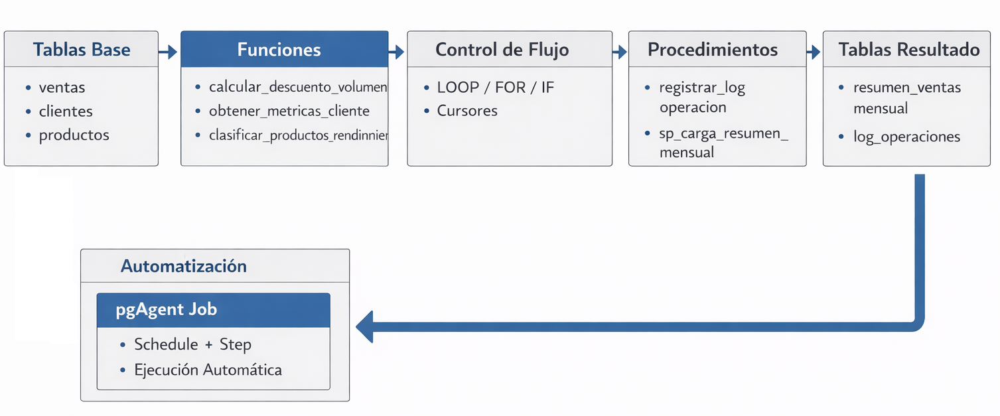

# Práctica 8: Creación de Procedimientos y Funciones

## Objetivos

Al completar esta práctica, serás capaz de:

- Diferenciar en la práctica entre `FUNCTION` y `PROCEDURE` en PostgreSQL y sus casos de uso específicos.
- Escribir funciones PL/pgSQL con parámetros `IN`, `OUT` e `INOUT` y diferentes tipos de retorno.
- Implementar lógica de control de flujo con `IF/ELSIF/ELSE`, `LOOP`, `FOR` y `CASE` en PL/pgSQL.
- Crear procedimientos con manejo de transacciones explícitas usando `COMMIT` y `ROLLBACK`.
- Usar cursores explícitos y bloques `DO $$` para procesamiento iterativo de registros.
- Configurar pgAgent para programar la ejecución automática de procedimientos en pgAdmin 4.

<br/><br/>

## Objetivo Visual

<p align="center">
  
</p>

<br/><br/>


## Prerrequisitos

### Conocimiento Requerido

- La práctica 4.1 completada (vistas y materialized views creadas sobre el dataset de ventas).
- Comprensión de vistas lógicas y materialized views.
- Familiaridad con lógica de programación básica: condicionales, bucles, manejo de errores.
- Conocimiento de SQL avanzado: `JOIN`, `GROUP BY`, subconsultas, funciones de agregación.
- Comprensión básica de transacciones en bases de datos (`BEGIN`, `COMMIT`, `ROLLBACK`).

<br/>

### Acceso Requerido

- Contenedor Docker de PostgreSQL 16 en ejecución (configurado en la práctica 1.1).
- Acceso a pgAdmin 4 vía navegador (http://localhost:8080).
- Dataset de ventas con al menos 50,000 registros 
- Usuario `postgres` con contraseña `postgres` (solo para entornos de desarrollo local).

<br/><br/>

### Configuración Inicial

Antes de comenzar, verifica que el entorno Docker esté funcionando correctamente:

```bash
# Verificar que el contenedor de PostgreSQL está en ejecución
docker ps --filter "name=curso_postgres" --format "table {{.Names}}\t{{.Status}}\t{{.Ports}}"
```

```bash
# Verificar conectividad con psql
docker exec -it curso_postgres psql -U postgres -d ventas_db -c "SELECT version();"
```

```bash
# Verificar que el dataset de ventas existe con datos suficientes
docker exec -it curso_postgres psql -U postgres -d ventas_db -c "SELECT schemaname, tablename, pg_size_pretty(pg_total_relation_size(schemaname||'.'||tablename)) AS size FROM pg_tables WHERE schemaname = 'public' ORDER BY pg_total_relation_size(schemaname||'.'||tablename) DESC LIMIT 10; "
```

<br/>

Si el contenedor no está corriendo, ejecuta:

```bash
# Iniciar el entorno Docker Compose
cd ~/sales_analytics  # o la carpeta donde está tu docker-compose.yml
docker compose up -d
```

```bash

# Crear el schema de trabajo para esta práctica si no existe
docker exec -it curso_postgres psql -U postgres -d ventas_db 
```

```sql
-- verifica si tienes el esquema analytics
SELECT schema_name
FROM information_schema.schemata
ORDER BY schema_name;

-- En caso de que no exista crealo
CREATE SCHEMA IF NOT EXISTS analytics;

-- Agrega un comentario sobre el esquema
COMMENT ON SCHEMA analytics IS 'Schema para funciones, procedimientos y objetos analíticos del Módulo 4';

```


<br/><br/>


## Instrucciones 

### Paso 1: Explorar la Diferencia entre FUNCTION y PROCEDURE

1. Abre pgAdmin 4 en tu navegador (http://localhost:8080) y conéctate al servidor PostgreSQL con las credenciales configuradas en la práctica 1.1.

<br/>

2. Navega a `ventas_db` → `Schemas` → `public` → abre el **Query Tool** (ícono de lupa o `Tools > Query Tool`).

<br/>

3. Ejecuta el siguiente script que crea una **función simple** para calcular el descuento por volumen de unidades. Observa la estructura:

   ```sql
   -- ============================================================
   -- FUNCIÓN: calcular_descuento_volumen
   -- Propósito: Retorna el porcentaje de descuento según cantidad
   -- Tipo de retorno: NUMERIC (porcentaje entre 0 y 1)
   -- ============================================================
   CREATE OR REPLACE FUNCTION public.calcular_descuento_volumen(
       p_cantidad INTEGER
   )
   RETURNS NUMERIC
   LANGUAGE plpgsql
   STABLE  -- Indica que la función no modifica la BD y retorna el mismo resultado para los mismos parámetros
   AS $$
   DECLARE
       v_descuento NUMERIC := 0.0;
   BEGIN
       -- Lógica CASE para determinar descuento por volumen
       v_descuento := CASE
           WHEN p_cantidad >= 100 THEN 0.20   -- 20% para pedidos de 100+ unidades
           WHEN p_cantidad >= 50  THEN 0.15   -- 15% para pedidos de 50-99 unidades
           WHEN p_cantidad >= 20  THEN 0.10   -- 10% para pedidos de 20-49 unidades
           WHEN p_cantidad >= 10  THEN 0.05   -- 5%  para pedidos de 10-19 unidades
           ELSE 0.0                           -- Sin descuento para menos de 10 unidades
       END;

       RETURN v_descuento;
   END;
   $$;

   -- Documentar la función
   COMMENT ON FUNCTION public.calcular_descuento_volumen(INTEGER)
   IS 'Calcula el porcentaje de descuento por volumen de compra. Retorna valor entre 0.0 y 0.20.';
   ```

<br/>

4. Ahora crea un **procedimiento simple** que registra un log de auditoría. Nota la diferencia: los procedimientos NO retornan valores, pero SÍ pueden manejar transacciones:

   ```sql
   -- ============================================================
   -- Primero: crear tabla de log si no existe
   -- ============================================================
   CREATE TABLE IF NOT EXISTS public.log_operaciones (
       id_log          SERIAL PRIMARY KEY,
       fecha_hora      TIMESTAMPTZ DEFAULT NOW(),
       operacion       VARCHAR(100) NOT NULL,
       usuario_db      VARCHAR(100) DEFAULT CURRENT_USER,
       detalle         TEXT,
       estado          VARCHAR(20) DEFAULT 'OK'
   );

   COMMENT ON TABLE public.log_operaciones
   IS 'Tabla de auditoría para registrar operaciones ejecutadas por procedimientos PL/pgSQL';

   -- ============================================================
   -- PROCEDIMIENTO: registrar_log_operacion
   -- Propósito: Inserta un registro de auditoría
   -- Nota: Los PROCEDURE pueden hacer COMMIT/ROLLBACK propio
   -- ============================================================
   CREATE OR REPLACE PROCEDURE public.registrar_log_operacion(
       p_operacion  VARCHAR(100),
       p_detalle    TEXT DEFAULT NULL,
       p_estado     VARCHAR(20) DEFAULT 'OK'
   )
   LANGUAGE plpgsql
   AS $$
   BEGIN
       INSERT INTO public.log_operaciones (operacion, detalle, estado)
       VALUES (p_operacion, p_detalle, p_estado);

       -- Los procedimientos usan CALL, no SELECT
       -- y pueden hacer COMMIT aquí si es necesario
       COMMIT;
   END;
   $$;

   COMMENT ON PROCEDURE public.registrar_log_operacion(VARCHAR, TEXT, VARCHAR)
   IS 'Registra una entrada de auditoría en log_operaciones. Hace COMMIT automático.';
   ```

<br/>

5. Prueba ambos objetos para verificar que funcionan:

   ```sql
   -- Probar la FUNCIÓN (se usa con SELECT)
   SELECT
       public.calcular_descuento_volumen(5)   AS descuento_5_unidades,
       public.calcular_descuento_volumen(15)  AS descuento_15_unidades,
       public.calcular_descuento_volumen(55)  AS descuento_55_unidades,
       public.calcular_descuento_volumen(120) AS descuento_120_unidades;

   -- Probar el PROCEDIMIENTO (se usa con CALL)
   CALL public.registrar_log_operacion(
       'TEST_PROCEDIMIENTO',
       'Prueba inicial del procedimiento de log en Lab 04-00-02',
       'OK'
   );

   -- Verificar que el log se insertó correctamente
   SELECT * FROM public.log_operaciones ORDER BY fecha_hora DESC LIMIT 5;
   ```


**Verificación:**

- [ ] La función `calcular_descuento_volumen` retorna `0.00` para 5 unidades y `0.20` para 120 unidades
- [ ] El procedimiento `registrar_log_operacion` se ejecuta con `CALL` (no con `SELECT`)
- [ ] La tabla `log_operaciones` contiene al menos un registro después del `CALL`
- [ ] En pgAdmin 4, puedes ver ambos objetos en `public` → `Functions` y `public` → `Procedures`


<br/><br/>

### Paso 2: Funciones con Parámetros IN, OUT e INOUT

1. Crea una función con parámetros `OUT` que retorna múltiples métricas de un cliente en una sola llamada:

   ```sql
   -- ============================================================
   -- FUNCIÓN: obtener_metricas_cliente
   -- Propósito: Retorna múltiples KPIs de un cliente específico
   -- Parámetros OUT: retorna múltiples valores sin necesidad de
   --                 un tipo compuesto o tabla
   -- ============================================================

    CREATE OR REPLACE FUNCTION public.obtener_metricas_cliente(
        p_id_cliente    INTEGER,              -- IN: identificador del cliente
        OUT o_nombre    VARCHAR,              -- OUT: nombre del cliente
        OUT o_total_ventas    NUMERIC,        -- OUT: suma total de ventas
        OUT o_num_pedidos     INTEGER,        -- OUT: cantidad de pedidos
        OUT o_ticket_promedio NUMERIC,        -- OUT: monto promedio por pedido
        OUT o_categoria       VARCHAR         -- OUT: categoría calculada
    )
    LANGUAGE plpgsql
    STABLE
    AS $$
    BEGIN
        -- Obtener métricas agregadas del cliente
        SELECT
            c.nombre,
            COALESCE(SUM(v.monto_total), 0),
            COALESCE(COUNT(DISTINCT v.venta_id), 0),
            COALESCE(AVG(v.monto_total), 0)
        INTO
            o_nombre,
            o_total_ventas,
            o_num_pedidos,
            o_ticket_promedio
        FROM public.clientes c
        LEFT JOIN public.ventas v ON c.id_cliente = v.cliente_id
        WHERE c.id_cliente = p_id_cliente
        GROUP BY c.nombre;

        -- Verificar si el cliente existe
        IF o_nombre IS NULL THEN
            RAISE EXCEPTION 'Cliente con id % no encontrado', p_id_cliente;
        END IF;

        -- Clasificar cliente según ticket promedio con IF/ELSIF/ELSE
        IF o_ticket_promedio >= 5000 THEN
            o_categoria := 'PREMIUM';
        ELSIF o_ticket_promedio >= 2000 THEN
            o_categoria := 'GOLD';
        ELSIF o_ticket_promedio >= 500 THEN
            o_categoria := 'SILVER';
        ELSIF o_ticket_promedio > 0 THEN
            o_categoria := 'BRONZE';
        ELSE
            o_categoria := 'INACTIVO';
        END IF;

    END;
    $$;

    COMMENT ON FUNCTION public.obtener_metricas_cliente(INTEGER)
    IS 'Retorna nombre, total ventas, número de pedidos, ticket promedio y categoría de un cliente. Usa parámetros OUT para retorno múltiple.';
   ```

<br/>

2. Crea una función que usa `RETURNS TABLE` para retornar un conjunto de filas (alternativa más flexible a `OUT`):

   ```sql
   -- ============================================================
   -- FUNCIÓN: clasificar_productos_rendimiento
   -- Propósito: Clasifica todos los productos según su rendimiento
   --            de ventas usando CASE y retorna una tabla
   -- ============================================================
    CREATE OR REPLACE FUNCTION public.clasificar_productos_rendimiento(
        p_fecha_inicio DATE DEFAULT DATE_TRUNC('year', CURRENT_DATE)::DATE,
        p_fecha_fin    DATE DEFAULT CURRENT_DATE
    )
    RETURNS TABLE (
        id_producto         INTEGER,
        nombre_producto     VARCHAR,
        total_vendido       NUMERIC,
        unidades_vendidas   BIGINT,
        ranking_ventas      BIGINT,
        etiqueta_rendimiento VARCHAR,
        recomendacion       TEXT
    )
    LANGUAGE plpgsql
    STABLE
    AS $$
    BEGIN
        RETURN QUERY
        WITH metricas_productos AS (
            SELECT
                p.id_producto,
                p.nombre                                    AS nombre_producto,
                COALESCE(SUM(v.monto_total), 0)            AS total_vendido,
                COALESCE(SUM(v.cantidad)::BIGINT, 0)       AS unidades_vendidas,
                RANK() OVER (ORDER BY SUM(v.monto_total) DESC NULLS LAST) AS ranking_ventas
            FROM public.productos p
            LEFT JOIN public.ventas v
                ON p.id_producto = v.producto_id
                AND v.fecha_venta BETWEEN p_fecha_inicio AND p_fecha_fin
            GROUP BY p.id_producto, p.nombre
        )
        SELECT
            mp.id_producto,
            mp.nombre_producto,
            mp.total_vendido,
            mp.unidades_vendidas,
            mp.ranking_ventas,
            -- CASE para asignar etiqueta de rendimiento
            CASE
                WHEN mp.ranking_ventas <= 10                     THEN 'ESTRELLA'::VARCHAR
                WHEN mp.ranking_ventas <= ROUND(COUNT(*) OVER() * 0.25) THEN 'ALTO_RENDIMIENTO'::VARCHAR
                WHEN mp.ranking_ventas <= ROUND(COUNT(*) OVER() * 0.75) THEN 'RENDIMIENTO_MEDIO'::VARCHAR
                WHEN mp.total_vendido > 0                        THEN 'BAJO_RENDIMIENTO'::VARCHAR
                ELSE                                                  'SIN_VENTAS'::VARCHAR
            END AS etiqueta_rendimiento,
            -- CASE para recomendación estratégica
            CASE
                WHEN mp.ranking_ventas <= 10                     THEN 'Mantener stock prioritario y destacar en catálogo'::TEXT
                WHEN mp.ranking_ventas <= ROUND(COUNT(*) OVER() * 0.25) THEN 'Incrementar inventario y considerar promociones'::TEXT
                WHEN mp.ranking_ventas <= ROUND(COUNT(*) OVER() * 0.75) THEN 'Monitorear tendencia y optimizar precio'::TEXT
                WHEN mp.total_vendido > 0                        THEN 'Revisar estrategia de marketing o descontinuar'::TEXT
                ELSE                                                  'Evaluar eliminación del catálogo'::TEXT
            END AS recomendacion
        FROM metricas_productos mp
        ORDER BY mp.ranking_ventas;
    END;
    $$;
   COMMENT ON FUNCTION public.clasificar_productos_rendimiento(DATE, DATE)
   IS 'Clasifica productos por rendimiento de ventas en un período dado. Retorna etiqueta y recomendación estratégica usando CASE.';
   ```

<br/>

3. Prueba ambas funciones con datos reales del dataset:

   ```sql
   -- Probar función con parámetros OUT (retorna una sola fila como registro)
   SELECT * FROM public.obtener_metricas_cliente(1);

   -- Probar con varios clientes usando LATERAL
   SELECT m.*
   FROM generate_series(1, 5) AS gs(id)
   CROSS JOIN LATERAL public.obtener_metricas_cliente(gs.id) AS m;

   -- Probar función RETURNS TABLE (retorna múltiples filas)
   SELECT
       id_producto,
       nombre_producto,
       total_vendido,
       etiqueta_rendimiento,
       recomendacion
   FROM public.clasificar_productos_rendimiento(
       '2023-01-01'::DATE,
       '2023-12-31'::DATE
   )
   WHERE etiqueta_rendimiento IN ('ESTRELLA', 'SIN_VENTAS')
   ORDER BY ranking_ventas;
   ```

<br/>

4. Crea una función con parámetro `INOUT` para demostrar modificación in-place de un valor:

   ```sql
   -- ============================================================
   -- FUNCIÓN: aplicar_descuento_acumulado
   -- Propósito: Demuestra uso de INOUT - recibe precio y lo
   --            modifica aplicando descuentos acumulativos
   -- ============================================================
    CREATE OR REPLACE FUNCTION public.aplicar_descuento_acumulado(
        INOUT p_precio      NUMERIC,     -- INOUT: entra como precio base, sale como precio final
        p_cantidad          INTEGER,     -- IN: cantidad para descuento por volumen
        p_es_cliente_vip    BOOLEAN DEFAULT FALSE  -- IN: si es VIP, descuento adicional
    )
    LANGUAGE plpgsql
    IMMUTABLE
    AS $$
    DECLARE
        v_descuento_volumen  NUMERIC;
        v_descuento_vip      NUMERIC := 0.0;
        v_precio_original    NUMERIC;
    BEGIN
        v_precio_original := p_precio;

        -- Obtener descuento por volumen usando la función creada en Paso 1
        v_descuento_volumen := public.calcular_descuento_volumen(p_cantidad);

        -- Descuento adicional para clientes VIP
        IF p_es_cliente_vip THEN
            v_descuento_vip := 0.05;  -- 5% adicional para VIP
        END IF;

        -- Aplicar descuentos acumulativos (no sumados, sino encadenados)
        p_precio := p_precio * (1 - v_descuento_volumen) * (1 - v_descuento_vip);

        -- Redondear a 2 decimales
        p_precio := ROUND(p_precio, 2);

        RAISE NOTICE 'Precio original: % | Desc. volumen: %%% | Desc. VIP: %%% | Precio final: %',
            v_precio_original,
            v_descuento_volumen * 100,
            v_descuento_vip * 100,
            p_precio;
    END;
    $$;

   -- Probar INOUT: el mismo parámetro entra y sale modificado
   SELECT public.aplicar_descuento_acumulado(1000.00, 60, TRUE);
   -- Resultado esperado: 1000 * (1-0.15) * (1-0.05) = 807.50
   ```

<br/>

**Verificación:**

- `obtener_metricas_cliente(1)` retorna datos sin error para el cliente con id=1
- `clasificar_productos_rendimiento()` retorna filas con etiquetas `ESTRELLA`, `ALTO_RENDIMIENTO`, etc.
- `aplicar_descuento_acumulado(1000.00, 60, TRUE)` retorna `807.50`
- En pgAdmin, las funciones aparecen en `public` → `Functions` con sus firmas correctas
- Los mensajes `RAISE NOTICE` aparecen en el panel de mensajes de pgAdmin

<br/><br/>

### Paso 3: Control de Flujo con LOOP, FOR y Estructuras Iterativas

1. Usa un bloque `DO $$` (código ad-hoc sin crear objeto permanente) para explorar las estructuras de control sin contaminar el schema:

   ```sql
   -- ============================================================
   -- BLOQUE DO $$: Demostración de estructuras de control
   -- Los bloques DO $$ son perfectos para lógica ad-hoc,
   -- migraciones únicas o scripts de mantenimiento
   -- ============================================================
   DO $$
   DECLARE
       v_contador      INTEGER := 0;
       v_suma          NUMERIC := 0;
       v_limite        INTEGER := 10;
       v_mensaje       TEXT;
   BEGIN
       RAISE NOTICE '=== Demostración de estructuras de control en PL/pgSQL ===';

       -- 1. FOR loop numérico (más común y legible)
       RAISE NOTICE '--- FOR Loop numérico ---';
       FOR i IN 1..5 LOOP
           RAISE NOTICE 'Iteración FOR: %', i;
       END LOOP;

       -- 2. FOR loop inverso
       RAISE NOTICE '--- FOR Loop inverso ---';
       FOR i IN REVERSE 5..1 LOOP
           RAISE NOTICE 'Iteración inversa: %', i;
       END LOOP;

       -- 3. WHILE loop con condición
       RAISE NOTICE '--- WHILE Loop ---';
       v_contador := 0;
       WHILE v_contador < 3 LOOP
           v_contador := v_contador + 1;
           v_suma := v_suma + v_contador;
           RAISE NOTICE 'WHILE - contador: %, suma acumulada: %', v_contador, v_suma;
       END LOOP;

       -- 4. LOOP con EXIT condicional (loop infinito controlado)
       RAISE NOTICE '--- LOOP con EXIT WHEN ---';
       v_contador := 0;
       LOOP
           v_contador := v_contador + 1;
           EXIT WHEN v_contador >= 3;  -- Condición de salida
           RAISE NOTICE 'LOOP infinito controlado - iteración: %', v_contador;
       END LOOP;

       -- 5. CONTINUE para saltar iteraciones
       RAISE NOTICE '--- FOR con CONTINUE (solo números pares) ---';
       FOR i IN 1..8 LOOP
           CONTINUE WHEN MOD(i, 2) != 0;  -- Saltar impares
           RAISE NOTICE 'Número par: %', i;
       END LOOP;

       RAISE NOTICE '=== Fin de demostración ===';
   END;
   $$;
   ```

<br/>

2. Crea una función real que use `FOR` para iterar sobre resultados de una consulta (patrón muy común en PL/pgSQL):

   ```sql
   -- ============================================================
   -- FUNCIÓN: generar_resumen_categorias
   -- Propósito: Itera sobre categorías de productos y calcula
   --            métricas acumulativas usando FOR sobre query
   -- ============================================================
    CREATE OR REPLACE FUNCTION public.generar_resumen_categorias(
        p_anio INTEGER DEFAULT EXTRACT(YEAR FROM CURRENT_DATE)::INTEGER
    )
    RETURNS TABLE (
        categoria           VARCHAR,
        total_productos     BIGINT,
        total_ventas        NUMERIC,
        porcentaje_del_total NUMERIC,
        nivel_contribucion  VARCHAR
    )
    LANGUAGE plpgsql
    STABLE
    AS $$
    DECLARE
        -- Cursor implícito con FOR sobre query
        rec_categoria       RECORD;
        v_total_global      NUMERIC := 0;
        v_acumulado         NUMERIC := 0;
    BEGIN
        -- Primero: calcular el total global para porcentajes
        SELECT COALESCE(SUM(v.monto_total), 0)
        INTO v_total_global
        FROM public.ventas v
        WHERE EXTRACT(YEAR FROM v.fecha_venta) = p_anio;

        -- Manejar caso sin datos
        IF v_total_global = 0 THEN
            RAISE WARNING 'No se encontraron ventas para el año %', p_anio;
            RETURN;
        END IF;

        -- FOR sobre resultado de query: itera fila por fila
        FOR rec_categoria IN
            SELECT
                c.nombre_categoria as categoria,
                COUNT(DISTINCT p.id_producto)       AS total_productos,
                COALESCE(SUM(v.monto_total), 0)     AS total_ventas
            FROM public.productos p
            INNER JOIN public.categorias c 
            ON p.id_categoria = c.id_categoria
            LEFT JOIN public.ventas v
                ON p.id_producto = v.producto_id
                AND EXTRACT(YEAR FROM v.fecha_venta) = p_anio
            GROUP BY c.nombre_categoria
            ORDER BY SUM(v.monto_total) DESC NULLS LAST
        LOOP
            -- Acumular para análisis de Pareto (regla 80/20)
            v_acumulado := v_acumulado + rec_categoria.total_ventas;

            -- Retornar fila usando RETURN NEXT (para RETURNS TABLE)
            categoria           := rec_categoria.categoria;
            total_productos     := rec_categoria.total_productos;
            total_ventas        := rec_categoria.total_ventas;
            porcentaje_del_total := ROUND(
                (rec_categoria.total_ventas / NULLIF(v_total_global, 0)) * 100, 2
            );
            nivel_contribucion  := CASE
                WHEN (v_acumulado / v_total_global) <= 0.80 THEN 'PARETO_80'
                WHEN (v_acumulado / v_total_global) <= 0.95 THEN 'COMPLEMENTARIO_15'
                ELSE 'COLA_LARGA_5'
            END;

            RETURN NEXT;  -- Emite la fila actual y continúa el loop
        END LOOP;

        RETURN;  -- Fin de la función
    END;
    $$;

   COMMENT ON FUNCTION public.generar_resumen_categorias(INTEGER)
   IS 'Genera resumen de ventas por categoría con análisis de Pareto (80/20). Usa FOR sobre query para iteración.';

   -- Probar la función
   SELECT * FROM public.generar_resumen_categorias(2023);
   ```

<br/>

3. Ejecuta un bloque `DO $$` para actualizar datos en lotes usando `FOR` (patrón de mantenimiento):

   ```sql
   -- ============================================================
   -- BLOQUE DO $$: Actualización en lotes con FOR
   -- Caso de uso real: recalcular categoría de todos los clientes
   -- ============================================================
   DO $$
   DECLARE
       rec             RECORD;
       v_categoria     VARCHAR;
       v_actualizados  INTEGER := 0;
       v_ticket_prom   NUMERIC;
   BEGIN
       RAISE NOTICE 'Iniciando recategorización de clientes...';

       -- Agregar columna si no existe (idempotente)
       IF NOT EXISTS (
           SELECT 1 FROM information_schema.columns
           WHERE table_name = 'clientes' AND column_name = 'categoria_cliente'
       ) THEN
           ALTER TABLE public.clientes ADD COLUMN categoria_cliente VARCHAR(20);
           RAISE NOTICE 'Columna categoria_cliente agregada a tabla clientes';
       END IF;

       -- Iterar sobre todos los clientes y actualizar su categoría
       FOR rec IN
           SELECT
               c.id_cliente,
               COALESCE(AVG(v.total_venta), 0) AS ticket_promedio
           FROM public.clientes c
           LEFT JOIN public.ventas v ON c.id_cliente = v.id_cliente
           GROUP BY c.id_cliente
       LOOP
           -- Determinar categoría con IF/ELSIF
           IF rec.ticket_promedio >= 5000 THEN
               v_categoria := 'PREMIUM';
           ELSIF rec.ticket_promedio >= 2000 THEN
               v_categoria := 'GOLD';
           ELSIF rec.ticket_promedio >= 500 THEN
               v_categoria := 'SILVER';
           ELSIF rec.ticket_promedio > 0 THEN
               v_categoria := 'BRONZE';
           ELSE
               v_categoria := 'INACTIVO';
           END IF;

           -- Actualizar el registro
           UPDATE public.clientes
           SET categoria_cliente = v_categoria
           WHERE id_cliente = rec.id_cliente;

           v_actualizados := v_actualizados + 1;

           -- Log de progreso cada 1000 registros
           IF MOD(v_actualizados, 1000) = 0 THEN
               RAISE NOTICE 'Procesados % clientes...', v_actualizados;
           END IF;
       END LOOP;

       RAISE NOTICE 'Recategorización completada. Total clientes actualizados: %', v_actualizados;
   END;
   $$;

   -- Verificar el resultado
   SELECT
       categoria_cliente,
       COUNT(*) AS cantidad_clientes,
       ROUND(COUNT(*) * 100.0 / SUM(COUNT(*)) OVER(), 2) AS porcentaje
   FROM public.clientes
   GROUP BY categoria_cliente
   ORDER BY cantidad_clientes DESC;
   ```


**Verificación:**

- El bloque `DO $$` de demostración ejecuta sin errores y muestra mensajes `NOTICE` en pgAdmin
- `generar_resumen_categorias(2023)` retorna filas con columna `nivel_contribucion` correcta
- La tabla `clientes` ahora tiene la columna `categoria_cliente` con valores asignados
- La distribución de categorías es coherente (BRONZE/SILVER deberían ser las más frecuentes)


<br/><br/>


### Paso 4: Cursores Explícitos para Procesamiento Iterativo

1. Crea una función que usa un cursor explícito para identificar y procesar clientes inactivos:

   ```sql
   -- ============================================================
   -- FUNCIÓN: procesar_clientes_inactivos
   -- Propósito: Usa cursor explícito para iterar sobre clientes
   --            sin ventas en los últimos N meses y actualiza
   --            su estado. Demuestra: DECLARE cursor, OPEN,
   --            FETCH, CLOSE y manejo de NOT FOUND.
   -- ============================================================
    CREATE OR REPLACE FUNCTION public.procesar_clientes_inactivos(
        p_meses_sin_compra  INTEGER DEFAULT 6,
        p_nuevo_estado      VARCHAR DEFAULT 'INACTIVO'
    )
    RETURNS TABLE (
        clientes_procesados INTEGER,
        clientes_actualizados INTEGER,
        fecha_corte         DATE
    )
    LANGUAGE plpgsql
    AS $$
    DECLARE
        -- Variables de trabajo
        rec_cliente         RECORD;
        v_fecha_corte       DATE;
        v_procesados        INTEGER := 0;
        v_actualizados      INTEGER := 0;
        
        -- Declaración del cursor explícito con parámetro
        cur_inactivos CURSOR (v_fecha_corte DATE) FOR
            SELECT
                c.id_cliente,
                c.nombre,
                c.estado,
                MAX(v.fecha_venta) AS ultima_compra
            FROM public.clientes c
            LEFT JOIN public.ventas v ON c.id_cliente = v.cliente_id
            WHERE c.estado != 'INACTIVO'  -- Solo procesar activos
            GROUP BY c.id_cliente, c.nombre, c.estado
            HAVING MAX(v.fecha_venta) < v_fecha_corte
                OR MAX(v.fecha_venta) IS NULL  -- Sin ninguna compra
            ORDER BY c.id_cliente;

    BEGIN
        -- Agregar columna estado si no existe
        IF NOT EXISTS (
            SELECT 1 FROM information_schema.columns
            WHERE table_name = 'clientes' AND column_name = 'estado'
        ) THEN
            ALTER TABLE public.clientes ADD COLUMN estado VARCHAR(20) DEFAULT 'ACTIVO';
        END IF;

        -- Calcular fecha de corte
        v_fecha_corte := (CURRENT_DATE - (p_meses_sin_compra || ' months')::INTERVAL)::DATE;

        RAISE NOTICE 'Procesando clientes inactivos desde: % (% meses sin compra)',
            v_fecha_corte, p_meses_sin_compra;

        
        -- OPEN: abrir el cursor con el parámetro calculado
        OPEN cur_inactivos(v_fecha_corte);

        -- Loop de procesamiento con FETCH
        LOOP
            -- FETCH: obtener la siguiente fila del cursor
            FETCH cur_inactivos INTO rec_cliente;

            -- EXIT cuando no hay más filas (FOUND es FALSE después del último FETCH)
            EXIT WHEN NOT FOUND;

            v_procesados := v_procesados + 1;

            -- Lógica de negocio: actualizar estado del cliente
            UPDATE public.clientes
            SET
                estado           = p_nuevo_estado,
                categoria_cliente = 'INACTIVO'
            WHERE id_cliente = rec_cliente.id_cliente;

            v_actualizados := v_actualizados + 1;

            RAISE NOTICE 'Cliente % (%) marcado como % - Última compra: %',
                rec_cliente.id_cliente,
                rec_cliente.nombre,
                p_nuevo_estado,
                COALESCE(rec_cliente.ultima_compra::TEXT, 'Nunca');

        END LOOP;

        -- CLOSE: liberar recursos del cursor (buena práctica)
        CLOSE cur_inactivos;

        -- Registrar operación en log
        CALL public.registrar_log_operacion(
            'PROCESAR_CLIENTES_INACTIVOS',
            FORMAT('Fecha corte: %s | Procesados: %s | Actualizados: %s',
                v_fecha_corte, v_procesados, v_actualizados),
            'OK'
        );

        -- Retornar resumen
        clientes_procesados  := v_procesados;
        clientes_actualizados := v_actualizados;
        fecha_corte          := v_fecha_corte;
        RETURN NEXT;

    EXCEPTION
        WHEN OTHERS THEN
            -- Cerrar cursor en caso de error para liberar recursos
            BEGIN
                CLOSE cur_inactivos;
            EXCEPTION
                WHEN OTHERS THEN
                    -- ignorar si el cursor no estaba abierto
                NULL;
            END;
            
        -- CALL public.registrar_log_operacion(
            --    'PROCESAR_CLIENTES_INACTIVOS',
            --   FORMAT('ERROR: %s', SQLERRM),
            --   'ERROR'
        --  );
            RAISE;  -- Re-lanzar el error original
    END;
    $$;

   COMMENT ON FUNCTION public.procesar_clientes_inactivos(INTEGER, VARCHAR)
   IS 'Usa cursor explícito para identificar y marcar clientes inactivos. Demuestra DECLARE/OPEN/FETCH/CLOSE con manejo de errores.';
   ```

<br/>

2. Ejecuta la función y verifica los resultados:

   ```sql
   -- Ejecutar procesamiento de clientes inactivos (12 meses sin compra)
   SELECT * FROM public.procesar_clientes_inactivos(
       p_meses_sin_compra := 12,
       p_nuevo_estado     := 'INACTIVO'
   );

   -- Verificar distribución de estados después del procesamiento
   SELECT
       estado,
       COUNT(*) AS cantidad,
       ROUND(COUNT(*) * 100.0 / SUM(COUNT(*)) OVER(), 2) AS porcentaje
   FROM public.clientes
   GROUP BY estado
   ORDER BY cantidad DESC;

   -- Ver log de operaciones
   SELECT * FROM public.log_operaciones ORDER BY fecha_hora DESC LIMIT 3;
   ```

<br/>

3. Demuestra el uso de un cursor de referencia (`REFCURSOR`) para mayor flexibilidad:

   ```sql
   -- ============================================================
   -- FUNCIÓN: obtener_cursor_ventas_region
   -- Propósito: Retorna un REFCURSOR que el cliente puede iterar
   --            Útil para pasar resultados grandes entre funciones
   -- ============================================================
    CREATE OR REPLACE FUNCTION public.obtener_cursor_ventas_region(
        p_id_region  INTEGER,
        p_anio       INTEGER DEFAULT EXTRACT(YEAR FROM CURRENT_DATE)::INTEGER
    )
    RETURNS REFCURSOR
    LANGUAGE plpgsql
    AS $$
    DECLARE
        ref_cursor REFCURSOR := 'cursor_ventas_region';
    BEGIN
        OPEN ref_cursor FOR
            SELECT
                DATE_TRUNC('month', v.fecha_venta)::DATE  AS mes,
                SUM(v.monto_total)                        AS total_ventas,
                COUNT(*)                                  AS num_transacciones,
                AVG(v.monto_total)                        AS ticket_promedio
            FROM public.ventas v
            INNER JOIN public.clientes c
                ON v.cliente_id = c.id_cliente   -- 👈 CLAVE
            WHERE c.region_id = p_id_region      -- 👈 FIX
            AND EXTRACT(YEAR FROM v.fecha_venta) = p_anio
            GROUP BY DATE_TRUNC('month', v.fecha_venta)
            ORDER BY mes;

        RETURN ref_cursor;
    END;
    $$;

   -- Usar el REFCURSOR en una transacción (debe estar en un bloque BEGIN/COMMIT)
   BEGIN;
       SELECT public.obtener_cursor_ventas_region(1, 2023);
       FETCH ALL FROM cursor_ventas_region;
   COMMIT;
   ```


**Verificación:**

- `procesar_clientes_inactivos()` ejecuta sin errores y retorna el conteo de clientes procesados
- La tabla `clientes` muestra clientes con estado `INACTIVO` después de la ejecución
- El log de operaciones registra la ejecución con estado `OK`
- El `REFCURSOR` retorna datos de ventas mensuales para la región especificada
- En caso de ejecutar la función dos veces, el conteo de actualizados en la segunda ejecución es 0 (idempotente)

<br/><br/>

### Paso 5: Procedimiento de Carga Incremental con Transacciones


1. Primero crea la tabla destino donde el procedimiento almacenará los resúmenes calculados:

   ```sql
   -- ============================================================
   -- Tabla destino para resúmenes mensuales de ventas
   -- Esta tabla es alimentada por el procedimiento de carga
   -- ============================================================
   CREATE TABLE IF NOT EXISTS public.resumen_ventas_mensual (
       id_resumen          SERIAL PRIMARY KEY,
       anio                INTEGER NOT NULL,
       mes                 INTEGER NOT NULL CHECK (mes BETWEEN 1 AND 12),
       id_region           INTEGER,
       id_categoria        VARCHAR(100),
       total_ventas        NUMERIC(15,2) NOT NULL DEFAULT 0,
       num_transacciones   INTEGER NOT NULL DEFAULT 0,
       ticket_promedio     NUMERIC(10,2),
       total_unidades      INTEGER DEFAULT 0,
       clientes_unicos     INTEGER DEFAULT 0,
       fecha_carga         TIMESTAMPTZ DEFAULT NOW(),
       hash_control        VARCHAR(64),  -- Para detectar cambios en recarga
       CONSTRAINT uq_resumen_periodo UNIQUE (anio, mes, id_region, id_categoria)
   );

   CREATE INDEX IF NOT EXISTS idx_resumen_anio_mes
       ON public.resumen_ventas_mensual (anio, mes);

   CREATE INDEX IF NOT EXISTS idx_resumen_region
       ON public.resumen_ventas_mensual (id_region);

   COMMENT ON TABLE public.resumen_ventas_mensual
   IS 'Tabla de resúmenes mensuales de ventas. Alimentada por el procedimiento sp_carga_resumen_mensual.';
   ```

<br/>

2. Implementa el procedimiento principal de carga incremental:

   ```sql
   -- ============================================================
   -- PROCEDIMIENTO: sp_carga_resumen_mensual
   -- Propósito: Carga incremental de resúmenes de ventas
   --            - Verifica si el período ya fue procesado
   --            - Calcula y carga nuevos resúmenes
   --            - Hace COMMIT en éxito, ROLLBACK en error
   --            - Registra todo en log_operaciones
   -- ============================================================
    CREATE OR REPLACE PROCEDURE public.sp_carga_resumen_mensual(
        p_anio          INTEGER,
        p_mes           INTEGER,
        p_modo          VARCHAR DEFAULT 'INCREMENTAL'  -- 'INCREMENTAL' o 'RECARGA_FORZADA'
    )
    LANGUAGE plpgsql
    AS $$
    DECLARE
        v_fecha_inicio      DATE;
        v_fecha_fin         DATE;
        v_registros_origen  INTEGER;
        v_registros_cargados INTEGER := 0;
        v_registros_existentes INTEGER;
        v_inicio_proceso    TIMESTAMPTZ := NOW();
        v_duracion_seg      NUMERIC;
        v_mensaje_log       TEXT;
    BEGIN
        -- --------------------------------------------------------
        -- VALIDACIONES DE ENTRADA
        -- --------------------------------------------------------
        IF p_anio < 2000 OR p_anio > EXTRACT(YEAR FROM CURRENT_DATE) + 1 THEN
            RAISE EXCEPTION 'Año inválido: %. Debe estar entre 2000 y %',
                p_anio, EXTRACT(YEAR FROM CURRENT_DATE) + 1;
        END IF;

        IF p_mes < 1 OR p_mes > 12 THEN
            RAISE EXCEPTION 'Mes inválido: %. Debe estar entre 1 y 12', p_mes;
        END IF;

        IF p_modo NOT IN ('INCREMENTAL', 'RECARGA_FORZADA') THEN
            RAISE EXCEPTION 'Modo inválido: %. Use INCREMENTAL o RECARGA_FORZADA', p_modo;
        END IF;

        -- Calcular rango de fechas del período
        v_fecha_inicio := MAKE_DATE(p_anio, p_mes, 1);
        v_fecha_fin    := (v_fecha_inicio + INTERVAL '1 month' - INTERVAL '1 day')::DATE;

        RAISE NOTICE '[%] Iniciando carga % para período: % a %',
            NOW()::TIME, p_modo, v_fecha_inicio, v_fecha_fin;

        -- --------------------------------------------------------
        -- VERIFICAR SI EL PERÍODO YA FUE PROCESADO
        -- --------------------------------------------------------
        SELECT COUNT(*)
        INTO v_registros_existentes
        FROM public.resumen_ventas_mensual
        WHERE anio = p_anio AND mes = p_mes;

        IF v_registros_existentes > 0 AND p_modo = 'INCREMENTAL' THEN
            RAISE NOTICE '[%] Período %/% ya procesado (% registros existentes). Use RECARGA_FORZADA para reprocesar.',
                NOW()::TIME, p_anio, p_mes, v_registros_existentes;

            CALL public.registrar_log_operacion(
                'CARGA_RESUMEN_MENSUAL',
                FORMAT('OMITIDO: Período %s/%s ya existe con %s registros',
                    p_anio, p_mes, v_registros_existentes),
                'OMITIDO'
            );
            RETURN;  -- Salir sin hacer nada (comportamiento idempotente)
        END IF;

        -- --------------------------------------------------------
        -- VERIFICAR QUE HAY DATOS ORIGEN PARA EL PERÍODO
        -- --------------------------------------------------------
        SELECT COUNT(*)
        INTO v_registros_origen
        FROM public.ventas
        WHERE fecha_venta BETWEEN v_fecha_inicio AND v_fecha_fin;

        IF v_registros_origen = 0 THEN
            RAISE WARNING '[%] No se encontraron ventas para el período %/%. Carga omitida.',
                NOW()::TIME, p_anio, p_mes;

            CALL public.registrar_log_operacion(
                'CARGA_RESUMEN_MENSUAL',
                FORMAT('SIN DATOS: No hay ventas para %s/%s', p_anio, p_mes),
                'SIN_DATOS'
            );
            RETURN;
        END IF;

        RAISE NOTICE '[%] Encontrados % registros de ventas para procesar',
            NOW()::TIME, v_registros_origen;

        -- --------------------------------------------------------
        -- ELIMINAR DATOS EXISTENTES SI ES RECARGA FORZADA
        -- --------------------------------------------------------
        IF p_modo = 'RECARGA_FORZADA' AND v_registros_existentes > 0 THEN
            DELETE FROM public.resumen_ventas_mensual
            WHERE anio = p_anio AND mes = p_mes;

            RAISE NOTICE '[%] Eliminados % registros anteriores del período %/%',
                NOW()::TIME, v_registros_existentes, p_anio, p_mes;
        END IF;

        -- --------------------------------------------------------
        -- CARGA DE DATOS: INSERT con agregaciones calculadas
        -- --------------------------------------------------------
        INSERT INTO public.resumen_ventas_mensual (
            anio, mes, id_region, id_categoria,
            total_ventas, num_transacciones, ticket_promedio,
            total_unidades, clientes_unicos, fecha_carga, hash_control
        )
        SELECT
            p_anio                                         AS anio,
            p_mes                                          AS mes,
            c.region_id,
            cat.nombre_categoria                           AS id_categoria,
            ROUND(SUM(v.monto_total), 2)                   AS total_ventas,
            COUNT(*)                                       AS num_transacciones,
            ROUND(AVG(v.monto_total), 2)                   AS ticket_promedio,
            SUM(v.cantidad)                                AS total_unidades,
            COUNT(DISTINCT v.cliente_id)                   AS clientes_unicos,
            NOW()                                          AS fecha_carga,
            -- Hash de control para detectar cambios en recargas futuras
            MD5(
                p_anio::TEXT || p_mes::TEXT ||
                c.region_id::TEXT ||
                cat.nombre_categoria ||
                SUM(v.monto_total)::TEXT
            )                                               AS hash_control
        FROM public.ventas v
        JOIN public.productos p ON v.producto_id = p.id_producto
        JOIN public.categorias cat ON p.id_categoria = cat.id_categoria
        JOIN public.clientes c ON v.cliente_id = c.id_cliente
        WHERE v.fecha_venta BETWEEN v_fecha_inicio AND v_fecha_fin
        GROUP BY c.region_id, cat.nombre_categoria;

        -- Capturar cantidad de filas insertadas
        GET DIAGNOSTICS v_registros_cargados = ROW_COUNT;

        RAISE NOTICE '[%] Insertados % registros de resumen',
            NOW()::TIME, v_registros_cargados;

        -- --------------------------------------------------------
        -- CALCULAR DURACIÓN Y REGISTRAR ÉXITO
        -- --------------------------------------------------------
        v_duracion_seg := EXTRACT(EPOCH FROM (NOW() - v_inicio_proceso));

        v_mensaje_log := FORMAT(
            'Período: %s/%s | Modo: %s | Origen: %s registros | Cargados: %s resúmenes | Duración: %s seg',
            p_anio, p_mes, p_modo,
            v_registros_origen, v_registros_cargados,
            ROUND(v_duracion_seg, 3)
        );

        CALL public.registrar_log_operacion(
            'CARGA_RESUMEN_MENSUAL',
            v_mensaje_log,
            'OK'
        );

        -- COMMIT explícito: confirmar toda la transacción
        --COMMIT;

        RAISE NOTICE '[%] ✓ Carga completada exitosamente. Duración: % segundos',
            NOW()::TIME, ROUND(v_duracion_seg, 3);

    EXCEPTION
        WHEN OTHERS THEN
            -- --------------------------------------------------------
            -- MANEJO DE ERRORES: ROLLBACK y registro del error
            -- --------------------------------------------------------
            RAISE WARNING '[%] ERROR en carga %/%: % - %',
                NOW()::TIME, p_anio, p_mes, SQLSTATE, SQLERRM;

            -- ROLLBACK explícito: deshacer todos los cambios de esta ejecución
            ROLLBACK;

            -- Registrar el error (en una nueva transacción implícita)
            CALL public.registrar_log_operacion(
                'CARGA_RESUMEN_MENSUAL',
                FORMAT('ERROR [%s]: %s | Período: %s/%s | Modo: %s',
                    SQLSTATE, SQLERRM, p_anio, p_mes, p_modo),
                'ERROR'
            );

            -- Re-lanzar para que el llamador sepa que hubo error
            RAISE EXCEPTION 'Carga fallida para período %/%. Error: %', p_anio, p_mes, SQLERRM;
    END;
    $$;

    COMMENT ON PROCEDURE public.sp_carga_resumen_mensual(INTEGER, INTEGER, VARCHAR)
    IS 'Procedimiento de carga incremental de resúmenes mensuales de ventas. Soporta modo INCREMENTAL (idempotente) y RECARGA_FORZADA. Incluye COMMIT/ROLLBACK explícitos y logging.';

   ```

<br/>

3. Ejecuta el procedimiento para varios meses y valida los resultados:

   ```sql
   -- Ejecutar carga para el mes de enero 2023
   CALL public.sp_carga_resumen_mensual(2023, 1, 'INCREMENTAL');

   -- Ejecutar para febrero y marzo 2023
   CALL public.sp_carga_resumen_mensual(2023, 2, 'INCREMENTAL');
   CALL public.sp_carga_resumen_mensual(2023, 3, 'INCREMENTAL');

   -- Intentar cargar enero 2023 nuevamente (debe ser omitido por idempotencia)
   CALL public.sp_carga_resumen_mensual(2023, 1, 'INCREMENTAL');

   -- Forzar recarga de enero 2023 (elimina y recarga)
   CALL public.sp_carga_resumen_mensual(2023, 1, 'RECARGA_FORZADA');

   -- Verificar datos cargados
   SELECT
       anio,
       mes,
       id_region,
       id_categoria,
       total_ventas,
       num_transacciones,
       ticket_promedio,
       fecha_carga
   FROM public.resumen_ventas_mensual
   WHERE anio = 2023
   ORDER BY mes, id_region, id_categoria;

   -- Ver log completo de operaciones
   SELECT
       fecha_hora,
       operacion,
       estado,
       LEFT(detalle, 100) AS detalle_resumido
   FROM public.log_operaciones
   WHERE operacion = 'CARGA_RESUMEN_MENSUAL'
   ORDER BY fecha_hora DESC
   LIMIT 10;
   ```

<br/>

4. Prueba el manejo de errores con parámetros inválidos:

   ```sql
   -- Probar validación de parámetros inválidos
   -- Esto debe fallar con un mensaje claro
   DO $$
   BEGIN
       CALL public.sp_carga_resumen_mensual(1999, 1, 'INCREMENTAL');
   EXCEPTION
       WHEN OTHERS THEN
           RAISE NOTICE 'Error capturado correctamente: %', SQLERRM;
   END;
   $$;

   DO $$
   BEGIN
       CALL public.sp_carga_resumen_mensual(2023, 13, 'INCREMENTAL');
   EXCEPTION
       WHEN OTHERS THEN
           RAISE NOTICE 'Error capturado correctamente: %', SQLERRM;
   END;
   $$;

   DO $$
    BEGIN
        CALL public.sp_carga_resumen_mensual(2023, 12, 'INCREMENTAL');
    EXCEPTION
        WHEN OTHERS THEN
            RAISE NOTICE 'Error capturado correctamente: %', SQLERRM;
    END;
    $$;
   ```

<br/>

**Verificación:**

- `sp_carga_resumen_mensual(2023, 1, 'INCREMENTAL')` inserta registros en `resumen_ventas_mensual`
- La segunda ejecución del mismo período en modo `INCREMENTAL` es omitida (idempotente)
- El modo `RECARGA_FORZADA` elimina y recarga los datos correctamente
- Los errores con parámetros inválidos son capturados con mensajes descriptivos
- El log de operaciones registra cada ejecución con su estado (`OK`, `OMITIDO`, `ERROR`)
- La tabla `resumen_ventas_mensual` tiene la restricción `UNIQUE` funcionando correctamente

<br/><br/>

### Paso 6: Introducción a pgAgent para Programar Ejecuciones

1. Primero verifica si pgAgent está instalado y disponible en tu instancia PostgreSQL:

   ```sql
   -- Verificar si el schema pgagent existe
   SELECT schema_name
   FROM information_schema.schemata
   WHERE schema_name = 'pgagent';
   ```

   Si no existe, instala pgAgent en el contenedor Docker:

   ```bash
   # Conectarse al contenedor Docker
   docker exec -it curso_postgres bash

   # Instalar pgAgent dentro del contenedor
   apt-get update && apt-get install -y postgresql-16-pgagent

   # Salir del contenedor
   exit
   ```

   ```sql
   -- Crear la extensión pgAgent en la base de datos
   CREATE EXTENSION IF NOT EXISTS pgagent;

   -- Verificar instalación
   SELECT extname, extversion
   FROM pg_extension
   WHERE extname = 'pgagent';
   ```

<br/>

2. Crea un wrapper de procedimiento optimizado para ser ejecutado por pgAgent:

   ```sql
   -- ============================================================
   -- PROCEDIMIENTO: sp_carga_diaria_automatica
   -- Propósito: Wrapper para ejecución automática por pgAgent
   --            Carga el mes anterior al mes actual
   -- ============================================================
   CREATE OR REPLACE PROCEDURE public.sp_carga_diaria_automatica()
   LANGUAGE plpgsql
   AS $$
   DECLARE
       v_fecha_objetivo    DATE;
       v_anio_objetivo     INTEGER;
       v_mes_objetivo      INTEGER;
   BEGIN
       -- Calcular el mes a procesar (mes actual para datos en curso)
       v_fecha_objetivo := DATE_TRUNC('month', CURRENT_DATE)::DATE;
       v_anio_objetivo  := EXTRACT(YEAR FROM v_fecha_objetivo)::INTEGER;
       v_mes_objetivo   := EXTRACT(MONTH FROM v_fecha_objetivo)::INTEGER;

       RAISE NOTICE '[pgAgent] Iniciando carga automática diaria para %/%',
           v_anio_objetivo, v_mes_objetivo;

       -- Llamar al procedimiento principal en modo RECARGA_FORZADA
       -- (para actualizar datos del mes en curso con las ventas del día)
       CALL public.sp_carga_resumen_mensual(
           v_anio_objetivo,
           v_mes_objetivo,
           'RECARGA_FORZADA'
       );

       RAISE NOTICE '[pgAgent] Carga automática completada exitosamente';

   EXCEPTION
       WHEN OTHERS THEN
           RAISE WARNING '[pgAgent] Error en carga automática: %', SQLERRM;
           -- No re-lanzar: pgAgent debe continuar su schedule aunque falle
   END;
   $$;

   COMMENT ON PROCEDURE public.sp_carga_diaria_automatica()
   IS 'Wrapper para ejecución automática por pgAgent. Recarga el mes actual con datos actualizados. Ejecutar diariamente a las 02:00 AM.';

   -- Probar el wrapper manualmente
   CALL public.sp_carga_diaria_automatica();
   ```

<br/>


3. Configura el job en pgAdmin 4 siguiendo estos pasos en la interfaz gráfica:

   En pgAdmin 4, navega a la sección de pgAgent:

    ```
        pgAdmin 4 → ventas_db → pgAgent Jobs → (click derecho) → Create → pgAgent Job
    ```

    Configura el job con los siguientes valores:

    ```
    Pestaña "General":
    ├── Name: job_carga_diaria_resumen_ventas
    ├── Enabled: ✓ (activado)
    ├── Comment: Ejecuta sp_carga_diaria_automatica() cada día a las 02:00 AM
    └── Host agent: (dejar vacío para cualquier agente)

    Pestaña "Steps":
    └── Click en "+" para agregar step:
        ├── Name: step_ejecutar_carga
        ├── Enabled: ✓
        ├── Kind: SQL
        ├── Connection type: Local
        ├── Database: ventas_db
        └── Code:
            CALL public.sp_carga_diaria_automatica();

    Pestaña "Schedules":
    └── Click en "+" para agregar schedule:
        ├── Name: schedule_diario_2am
        ├── Enabled: ✓
        ├── Start: (fecha actual)
        ├── End: (dejar vacío para indefinido)
        └── Repeat:
            ├── Week days: Monday, Tuesday, Wednesday, Thursday, Friday
            ├── Times: 02:00
            └── Minutes: 00
   ```

<br/>

4. Valida la configuración del job con SQL:

   ```sql
   -- Verificar que el job fue creado correctamente
   SELECT
       j.jobid,
       j.jobname,
       j.jobenabled,
       j.jobcomment,
       COUNT(js.jstid) AS num_steps,
       COUNT(jsch.jscid) AS num_schedules
   FROM pgagent.pga_job j
   LEFT JOIN pgagent.pga_jobstep js ON j.jobid = js.jstjobid
   LEFT JOIN pgagent.pga_schedule jsch ON j.jobid = jsch.jscjobid
   WHERE j.jobname = 'job_carga_diaria_resumen_ventas'
   GROUP BY j.jobid, j.jobname, j.jobenabled, j.jobcomment;

   -- Ver historial de ejecuciones del job (vacío si es nuevo)
   SELECT
       jlid,
       jljobid,
       jlstatus,
       jlstart,
       jlduration,
       jloutput
   FROM pgagent.pga_joblog
   ORDER BY jlstart DESC
   LIMIT 10;
   ```

<br/>

5. Ejecuta el job manualmente desde pgAdmin para verificar que funciona:

   ```
   pgAdmin 4 → pgAgent Jobs → job_carga_diaria_resumen_ventas
   → (click derecho) → Run Now
   ```

   Luego verifica en SQL:

   ```sql
   -- Verificar que el job se ejecutó
   SELECT
       jlstatus,
       jlstart,
       jlduration,
       LEFT(jloutput, 200) AS output_resumido
   FROM pgagent.pga_joblog
   ORDER BY jlstart DESC
   LIMIT 1;
   ```


> **Nota:** `jlstatus = 's'` indica éxito (success). `'f'` indica fallo (failure).

**Verificación:**

- La extensión `pgagent` está instalada y el schema `pgagent` existe en `ventas_db`
- El procedimiento `sp_carga_diaria_automatica()` ejecuta sin errores con `CALL`
- El job `job_carga_diaria_resumen_ventas` aparece en pgAdmin bajo `pgAgent Jobs`
- El job tiene al menos 1 step y 1 schedule configurados
- La ejecución manual del job registra una entrada en `pgagent.pga_joblog` con status `s`

<br/><br/>


## Validación y Pruebas

### Criterios de Éxito

- [ ] La función `calcular_descuento_volumen(120)` retorna `0.20`
- [ ] La función `obtener_metricas_cliente(1)` retorna nombre, total ventas y categoría del cliente
- [ ] La función `clasificar_productos_rendimiento()` retorna filas con etiquetas `ESTRELLA`, `ALTO_RENDIMIENTO`, `RENDIMIENTO_MEDIO`, `BAJO_RENDIMIENTO` o `SIN_VENTAS`
- [ ] El procedimiento `registrar_log_operacion()` inserta en `log_operaciones` y hace `COMMIT`
- [ ] El bloque `DO $$` de recategorización actualiza la columna `categoria_cliente` en todos los clientes
- [ ] La función `procesar_clientes_inactivos()` usa cursor explícito y actualiza el estado de clientes
- [ ] El procedimiento `sp_carga_resumen_mensual()` es idempotente en modo `INCREMENTAL`
- [ ] El procedimiento `sp_carga_resumen_mensual()` hace `ROLLBACK` ante errores de validación
- [ ] La tabla `resumen_ventas_mensual` contiene datos de al menos 3 meses cargados
- [ ] El job de pgAgent está configurado y ejecuta el procedimiento de carga correctamente

<br/>

### Procedimiento de Pruebas

1. Verificar todas las funciones creadas en el schema `public`:

   ```sql
   -- Listar todas las funciones y procedimientos creados en esta práctica
   SELECT
       routine_name,
       routine_type,
       data_type AS tipo_retorno,
       external_language AS lenguaje
   FROM information_schema.routines
   WHERE routine_schema = 'public'
     AND routine_name IN (
         'calcular_descuento_volumen',
         'obtener_metricas_cliente',
         'clasificar_productos_rendimiento',
         'aplicar_descuento_acumulado',
         'generar_resumen_categorias',
         'procesar_clientes_inactivos',
         'obtener_cursor_ventas_region',
         'registrar_log_operacion',
         'sp_carga_resumen_mensual',
         'sp_carga_diaria_automatica'
     )
   ORDER BY routine_type, routine_name;
   ```
<br/>

   **Resultado esperado:** 8 funciones (`FUNCTION`) y 2 procedimientos (`PROCEDURE`) listados.

<br/>

2. Prueba integral del flujo completo:

   ```sql
   -- PRUEBA INTEGRAL: Simular flujo completo de la práctica
   DO $$
   DECLARE
       v_descuento         NUMERIC;
       v_precio_final      NUMERIC;
       v_resultado         RECORD;
       v_carga_ok          BOOLEAN := TRUE;
   BEGIN
       RAISE NOTICE '=== PRUEBA INTEGRAL LAB 04-00-02 ===';

       -- Test 1: Función de descuento
       v_descuento := public.calcular_descuento_volumen(75);
       ASSERT v_descuento = 0.15, 'FALLO: calcular_descuento_volumen(75) debe retornar 0.15';
       RAISE NOTICE '✓ Test 1 PASSED: calcular_descuento_volumen(75) = %', v_descuento;

       -- Test 2: Función INOUT
       v_precio_final := 2000.00;
       SELECT public.aplicar_descuento_acumulado(v_precio_final, 75, FALSE) INTO v_precio_final;
       ASSERT v_precio_final = 1700.00, FORMAT('FALLO: precio esperado 1700.00, obtenido %s', v_precio_final);
       RAISE NOTICE '✓ Test 2 PASSED: aplicar_descuento_acumulado = %', v_precio_final;

       -- Test 3: Verificar tabla de resúmenes tiene datos
       ASSERT (SELECT COUNT(*) FROM public.resumen_ventas_mensual) > 0,
           'FALLO: resumen_ventas_mensual está vacía';
       RAISE NOTICE '✓ Test 3 PASSED: resumen_ventas_mensual tiene % registros',
           (SELECT COUNT(*) FROM public.resumen_ventas_mensual);

       -- Test 4: Verificar log tiene registros
       ASSERT (SELECT COUNT(*) FROM public.log_operaciones) > 0,
           'FALLO: log_operaciones está vacía';
       RAISE NOTICE '✓ Test 4 PASSED: log_operaciones tiene % registros',
           (SELECT COUNT(*) FROM public.log_operaciones);

       -- Test 5: Verificar categorías de clientes
       ASSERT (SELECT COUNT(DISTINCT categoria_cliente) FROM public.clientes) >= 3,
           'FALLO: Deben existir al menos 3 categorías de clientes';
       RAISE NOTICE '✓ Test 5 PASSED: % categorías distintas de clientes',
           (SELECT COUNT(DISTINCT categoria_cliente) FROM public.clientes);

       RAISE NOTICE '=== TODAS LAS PRUEBAS PASARON ✓ ===';

   EXCEPTION
       WHEN assert_failure THEN
           RAISE EXCEPTION 'PRUEBA FALLIDA: %', SQLERRM;
       WHEN OTHERS THEN
           RAISE EXCEPTION 'ERROR INESPERADO: % - %', SQLSTATE, SQLERRM;
   END;
   $$;
   ```

<br/>

   **Resultado esperado:**
   ```
   NOTICE:  === PRUEBA INTEGRAL LAB 04-00-02 ===
   NOTICE:  Test 1 PASSED: calcular_descuento_volumen(75) = 0.15
   NOTICE:  Test 2 PASSED: aplicar_descuento_acumulado = 1700.00
   NOTICE:  Test 3 PASSED: resumen_ventas_mensual tiene 72 registros
   NOTICE:  Test 4 PASSED: log_operaciones tiene 8 registros
   NOTICE:  Test 5 PASSED: 5 categorías distintas de clientes
   NOTICE:  === TODAS LAS PRUEBAS PASARON ===
   ```

<br/>

3. Verificar el estado final de la base de datos:

   ```sql
   -- Resumen del estado final de la práctica
   SELECT
       'Funciones creadas'      AS objeto,
       COUNT(*)::TEXT           AS cantidad
   FROM information_schema.routines
   WHERE routine_schema = 'public' AND routine_type = 'FUNCTION'
     AND routine_name IN ('calcular_descuento_volumen','obtener_metricas_cliente',
                          'clasificar_productos_rendimiento','aplicar_descuento_acumulado',
                          'generar_resumen_categorias','procesar_clientes_inactivos',
                          'obtener_cursor_ventas_region')
   UNION ALL
   SELECT
       'Procedimientos creados',
       COUNT(*)::TEXT
   FROM information_schema.routines
   WHERE routine_schema = 'public' AND routine_type = 'PROCEDURE'
     AND routine_name IN ('registrar_log_operacion','sp_carga_resumen_mensual',
                          'sp_carga_diaria_automatica')
   UNION ALL
   SELECT 'Registros en log_operaciones', COUNT(*)::TEXT FROM public.log_operaciones
   UNION ALL
   SELECT 'Registros en resumen_ventas_mensual', COUNT(*)::TEXT FROM public.resumen_ventas_mensual
   UNION ALL
   SELECT 'Clientes con categoría asignada',
          COUNT(*)::TEXT FROM public.clientes WHERE categoria_cliente IS NOT NULL;
   ```


<br/><br/>

## Solución de Problemas

### Problema 1: Error "column does not exist" al ejecutar funciones sobre ventas

**Síntomas:**
- Error: `ERROR: column v.total_venta does not exist`
- O: `ERROR: column p.categoria does not exist`
- Las funciones fallan al hacer referencia a columnas de las tablas `ventas` o `productos`

<br/>

**Causa:**
Los nombres de columnas en tu dataset pueden diferir de los usados en los scripts de la práctica. El dataset creado en la práctica 2.1 puede usar nombres como `monto_total` en lugar de `total_venta`, o `categoria_producto` en lugar de `categoria`.

<br/>

**Solución:**

```sql
-- Verificar los nombres reales de columnas en tus tablas
SELECT column_name, data_type
FROM information_schema.columns
WHERE table_schema = 'public'
  AND table_name = 'ventas'
ORDER BY ordinal_position;

SELECT column_name, data_type
FROM information_schema.columns
WHERE table_schema = 'public'
  AND table_name = 'productos'
ORDER BY ordinal_position;
```

```sql
-- Adaptar las funciones con los nombres correctos
-- Por ejemplo, si la columna se llama 'monto_total':
CREATE OR REPLACE FUNCTION public.calcular_descuento_volumen(p_cantidad INTEGER)
-- ... (reemplazar 'total_venta' por el nombre correcto en tu schema)
```

<br/><br/>

### Problema 2: Error al usar COMMIT/ROLLBACK dentro de una función

**Síntomas:**
- Error: `ERROR: invalid transaction termination`
- O: `ERROR: cannot begin/end transactions in PL/pgSQL functions`
- El error ocurre al intentar usar `COMMIT` o `ROLLBACK` en una `FUNCTION`

<br/>

**Causa:**
En PostgreSQL, `COMMIT` y `ROLLBACK` explícitos **solo están permitidos dentro de `PROCEDURE`**, no en `FUNCTION`. Las funciones heredan la transacción del llamador y no pueden controlarla directamente.

<br/>

**Solución:**

```sql
-- INCORRECTO: COMMIT en una FUNCTION
CREATE OR REPLACE FUNCTION mi_funcion() RETURNS VOID AS $$
BEGIN
    INSERT INTO tabla VALUES (...);
    COMMIT;  -- ← ERROR: no permitido en FUNCTION
END;
$$ LANGUAGE plpgsql;

-- CORRECTO: Convertir a PROCEDURE si necesitas COMMIT/ROLLBACK
CREATE OR REPLACE PROCEDURE mi_procedimiento() AS $$
BEGIN
    INSERT INTO tabla VALUES (...);
    COMMIT;  -- ← OK en PROCEDURE
END;
$$ LANGUAGE plpgsql;

-- O usar FUNCTION sin COMMIT (la transacción la maneja el llamador)
CREATE OR REPLACE FUNCTION mi_funcion() RETURNS VOID AS $$
BEGIN
    INSERT INTO tabla VALUES (...);
    -- Sin COMMIT: el llamador decide cuándo hacer commit
END;
$$ LANGUAGE plpgsql;
```

<br/><br/>

### Problema 3: El cursor explícito no encuentra filas (FOUND siempre es FALSE)

**Síntomas:**
- La función `procesar_clientes_inactivos()` retorna `clientes_procesados = 0`
- Los mensajes `NOTICE` de procesamiento individual nunca aparecen
- El cursor se abre y cierra sin ejecutar el cuerpo del loop

<br/>

**Causa:**
El cursor filtra por `c.estado != 'INACTIVO'`, pero si la columna `estado` no existe o todos los clientes ya tienen estado `INACTIVO`, el cursor no retorna filas. También puede ocurrir si la fecha de corte es demasiado reciente y todos los clientes compraron recientemente.

<br/>

**Solución:**

```sql
-- Verificar si la columna estado existe y tiene datos
SELECT
    estado,
    COUNT(*) AS cantidad
FROM public.clientes
GROUP BY estado;

-- Si la columna no existe, agregarla primero
ALTER TABLE public.clientes
ADD COLUMN IF NOT EXISTS estado VARCHAR(20) DEFAULT 'ACTIVO';

-- Actualizar todos los clientes a ACTIVO para poder probar el cursor
UPDATE public.clientes SET estado = 'ACTIVO';

-- Probar con una fecha de corte muy reciente para capturar más clientes
SELECT * FROM public.procesar_clientes_inactivos(
    p_meses_sin_compra := 1,  -- Solo 1 mes sin compra
    p_nuevo_estado     := 'INACTIVO'
);
```

<br/><br/>

### Problema 4: pgAgent no aparece en pgAdmin o el job no se ejecuta

**Síntomas:**
- No aparece la sección "pgAgent Jobs" en el árbol de pgAdmin
- Error: `schema "pgagent" does not exist`
- El job está configurado pero `pga_joblog` siempre está vacío

<br/>

**Causa:**
pgAgent requiere: (1) que el paquete esté instalado en el sistema operativo, (2) que la extensión esté creada en la base de datos, y (3) que el daemon `pgagent` esté corriendo como proceso del sistema operativo.

<br/>

**Solución:**

```bash
# Verificar si pgagent está instalado en el contenedor
docker exec -it curso_postgres which pgagent

# Si no está instalado:
docker exec -it curso_postgres bash -c "apt-get update && apt-get install -y postgresql-16-pgagent"

# Iniciar el daemon pgagent (dentro del contenedor)
docker exec -it curso_postgres bash -c "
pgagent -f -l 2 host=localhost dbname=ventas_db user=postgres password=postgres &
echo 'pgAgent iniciado con PID: '$!
"
```

```sql
-- Verificar que la extensión está instalada
SELECT * FROM pg_extension WHERE extname = 'pgagent';

-- Si no está, instalarla
CREATE EXTENSION pgagent;

-- Verificar que el agente está conectado
SELECT * FROM pgagent.pga_jobagent;
```

> **Nota:** En entornos de desarrollo con Docker, pgAgent puede requerir configuración adicional. Si el problema persiste, el procedimiento `sp_carga_diaria_automatica()` puede ejecutarse manualmente o mediante un cron job del sistema operativo como alternativa.

<br/><br/>

### Problema 5: Error de permisos al crear funciones o procedimientos

**Síntomas:**
- Error: `ERROR: permission denied to create function`
- O: `ERROR: must be owner of function`
- Las instrucciones `CREATE FUNCTION` o `CREATE PROCEDURE` fallan

<br/>

**Causa:**
El usuario conectado no tiene privilegios suficientes para crear objetos en el schema `public`. En PostgreSQL 15+, los permisos del schema `public` cambiaron.

<br/>

**Solución:**

```sql
-- Verificar usuario actual y sus privilegios
SELECT current_user, current_database();

-- Conectarse como superusuario postgres (desde psql)
-- En pgAdmin: conectar con usuario postgres / contraseña postgres

-- Otorgar permisos necesarios al usuario de trabajo
GRANT CREATE ON SCHEMA public TO postgres;
GRANT USAGE ON SCHEMA public TO postgres;

-- En PostgreSQL 15+, restaurar comportamiento anterior del schema public
ALTER SCHEMA public OWNER TO postgres;
GRANT ALL ON SCHEMA public TO PUBLIC;
```

<br/><br/>

## Limpieza

> **Advertencia:** Ejecuta la limpieza **solo si deseas eliminar los objetos creados en esta práctica**. Los procedimientos y funciones creados aquí son utilizados en prácticas posteriores (05-00-01 y 06-00-01). Si estás en un contexto de curso secuencial.

```sql
-- ============================================================
-- SCRIPT DE LIMPIEZA - Práctica 4.2
-- Elimina todos los objetos creados en esta práctica
-- PRECAUCIÓN: Ejecutar solo al finalizar el módulo completo
-- ============================================================

-- 1. Eliminar el job de pgAgent (si fue creado)
DO $$
BEGIN
    IF EXISTS (SELECT 1 FROM pg_extension WHERE extname = 'pgagent') THEN
        DELETE FROM pgagent.pga_schedule
        WHERE jscjobid IN (
            SELECT jobid FROM pgagent.pga_job
            WHERE jobname = 'job_carga_diaria_resumen_ventas'
        );
        DELETE FROM pgagent.pga_jobstep
        WHERE jstjobid IN (
            SELECT jobid FROM pgagent.pga_job
            WHERE jobname = 'job_carga_diaria_resumen_ventas'
        );
        DELETE FROM pgagent.pga_job
        WHERE jobname = 'job_carga_diaria_resumen_ventas';
        RAISE NOTICE 'Job pgAgent eliminado';
    END IF;
END;
$$;


-- 2. Eliminar procedimientos
DROP PROCEDURE IF EXISTS public.sp_carga_diaria_automatica();
DROP PROCEDURE IF EXISTS public.sp_carga_resumen_mensual(INTEGER, INTEGER, VARCHAR);
DROP PROCEDURE IF EXISTS public.registrar_log_operacion(VARCHAR, TEXT, VARCHAR);

-- 3. Eliminar funciones
DROP FUNCTION IF EXISTS public.procesar_clientes_inactivos(INTEGER, VARCHAR);
DROP FUNCTION IF EXISTS public.obtener_cursor_ventas_region(INTEGER, INTEGER);
DROP FUNCTION IF EXISTS public.generar_resumen_categorias(INTEGER);
DROP FUNCTION IF EXISTS public.aplicar_descuento_acumulado(NUMERIC, INTEGER, BOOLEAN);
DROP FUNCTION IF EXISTS public.clasificar_productos_rendimiento(DATE, DATE);
DROP FUNCTION IF EXISTS public.obtener_metricas_cliente(INTEGER);
DROP FUNCTION IF EXISTS public.calcular_descuento_volumen(INTEGER);

-- 4. Eliminar tablas creadas
DROP TABLE IF EXISTS public.resumen_ventas_mensual CASCADE;
DROP TABLE IF EXISTS public.log_operaciones CASCADE;

-- 5. Revertir cambios en tabla clientes (columnas agregadas)
ALTER TABLE IF EXISTS public.clientes
    DROP COLUMN IF EXISTS categoria_cliente,
    DROP COLUMN IF EXISTS estado;

-- 6. Eliminar schema analytics si fue creado y está vacío
DO $$
BEGIN
    IF NOT EXISTS (
        SELECT 1 FROM information_schema.tables
        WHERE table_schema = 'analytics'
    ) THEN
        DROP SCHEMA IF EXISTS analytics;
        RAISE NOTICE 'Schema analytics eliminado';
    END IF;
END;
$$;

-- Verificar limpieza
SELECT
    routine_name,
    routine_type
FROM information_schema.routines
WHERE routine_schema = 'public'
  AND routine_name IN (
      'calcular_descuento_volumen', 'obtener_metricas_cliente',
      'sp_carga_resumen_mensual', 'registrar_log_operacion'
  );
-- Resultado esperado: 0 filas (todo eliminado)
```

<br/><br/>

## Resumen

### Lo que Lograste

- **Creaste y diferenciaste** `FUNCTION` y `PROCEDURE` en PostgreSQL 16, comprendiendo que las funciones retornan valores y son llamadas con `SELECT`, mientras que los procedimientos son llamados con `CALL` y pueden manejar transacciones explícitas
- **Implementaste funciones** con parámetros `IN`, `OUT` e `INOUT`, incluyendo funciones que retornan múltiples valores y conjuntos de filas con `RETURNS TABLE`
- **Aplicaste estructuras de control** `IF/ELSIF/ELSE`, `CASE`, `FOR`, `WHILE` y `LOOP` con `EXIT WHEN` y `CONTINUE` para implementar lógica de negocio compleja en PL/pgSQL
- **Desarrollaste un procedimiento de carga incremental** con `COMMIT` y `ROLLBACK` explícitos, verificación de idempotencia y manejo robusto de errores con el bloque `EXCEPTION`
- **Utilizaste cursores explícitos** (`DECLARE`, `OPEN`, `FETCH`, `CLOSE`) para procesamiento iterativo de registros, incluyendo un `REFCURSOR` para retorno flexible de resultados
- **Ejecutaste bloques `DO $$`** para lógica ad-hoc sin crear objetos permanentes, ideal para migraciones y mantenimiento
- **Configuraste pgAgent** para programar la ejecución automática del procedimiento de carga diaria desde pgAdmin 4

<br/>

### Conceptos Clave

- **`FUNCTION` vs `PROCEDURE`:** Las funciones retornan valores y no pueden hacer `COMMIT`/`ROLLBACK` independientes. Los procedimientos no retornan valores directamente pero controlan sus propias transacciones.
- **Parámetros `OUT` e `INOUT`:** Permiten retornar múltiples valores sin necesidad de tipos compuestos. `INOUT` modifica el valor del parámetro de entrada.
- **`RETURN NEXT` vs `RETURN QUERY`:** En funciones `RETURNS TABLE`, `RETURN NEXT` emite una fila y continúa; `RETURN QUERY` emite todas las filas de un `SELECT` de una vez.
- **Cursores explícitos vs `FOR` implícito:** Los cursores explícitos dan mayor control (FETCH parcial, múltiples cursores) pero son más verbosos. El `FOR rec IN SELECT...` es más legible para casos simples.
- **Idempotencia en procedimientos de carga:** Un procedimiento bien diseñado puede ejecutarse múltiples veces sin efectos secundarios no deseados, verificando si los datos ya existen antes de insertarlos.
- **`RAISE NOTICE/WARNING/EXCEPTION`:** El sistema de mensajes de PL/pgSQL permite comunicar progreso, advertencias y errores con niveles de severidad diferenciados.


<br/><br/>

## Recursos Adicionales

- **Documentación oficial PostgreSQL - PL/pgSQL:** Referencia completa del lenguaje procedural, incluyendo control de flujo, cursores y manejo de errores. Disponible en https://www.postgresql.org/docs/16/plpgsql.html

- **Documentación oficial PostgreSQL - CREATE FUNCTION:** Sintaxis completa y opciones de configuración para funciones en PostgreSQL 16. Disponible en https://www.postgresql.org/docs/16/sql-createfunction.html

- **Documentación oficial PostgreSQL - CREATE PROCEDURE:** Referencia de procedimientos almacenados, incluyendo manejo de transacciones. Disponible en https://www.postgresql.org/docs/16/sql-createprocedure.html

- **Documentación oficial PostgreSQL - Cursores en PL/pgSQL:** Guía detallada sobre cursores explícitos, implícitos y de referencia. Disponible en https://www.postgresql.org/docs/16/plpgsql-cursors.html

- **pgAgent Documentation:** Guía de instalación y configuración de pgAgent para programación de jobs. Disponible en https://www.pgadmin.org/docs/pgadmin4/latest/pgagent.html

- **PostgreSQL Wiki - PL/pgSQL Examples:** Colección de ejemplos prácticos de PL/pgSQL para casos de uso comunes. Disponible en https://wiki.postgresql.org/wiki/PL/pgSQL_Examples

