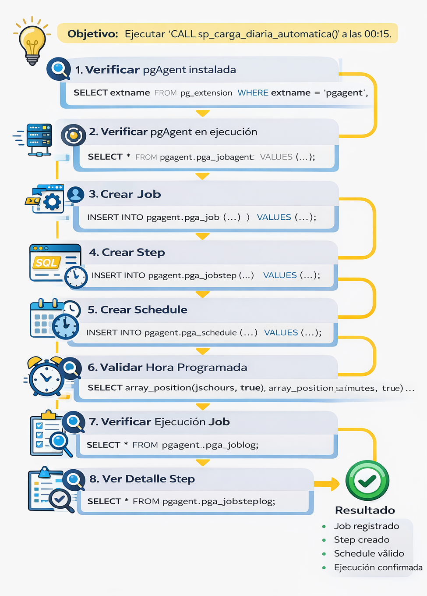

# Práctica 4.3 (Opcional): Creación de Jobs con pgAgent usando SQL

<br/>

## Objetivo

Al finalizar esta práctica, serás capaz de definir y programar un job en PostgreSQL utilizando pgAgent mediante instrucciones SQL, incluyendo la creación del job, steps, schedule y la validación de su ejecución.

<br/><br/>

## Objetivo Visual

<p align="center">
  
</p>

<br/><br/>

## Escenario

Se requiere automatizar la ejecución del procedimiento:

```sql
CALL public.sp_carga_diaria_automatica();
```

El cual deberá ejecutarse diariamente a las **00:15** utilizando pgAgent.

<br/><br/>


## Tabla de ayuda

| ¿Para qué sirve?            | Ejemplo rápido                                        |
| --------------------------- | ----------------------------------------------------- |
| Verificar extensión pgAgent | `SELECT * FROM pg_extension WHERE extname='pgagent';` |
| Validar agente activo       | `SELECT * FROM pgagent.pga_jobagent;`                 |
| Crear job                   | `INSERT INTO pgagent.pga_job ...`                     |
| Crear step                  | `INSERT INTO pgagent.pga_jobstep ...`                 |
| Crear schedule              | `INSERT INTO pgagent.pga_schedule ...`                |
| Validar hora programada     | `array_position(jschours,true)`                       |
| Ver ejecución               | `SELECT * FROM pgagent.pga_joblog;`                   |

<br/><br/>


## Instrucciones

### Paso 1. Verificar que pgAgent esté instalado

En PostgreSQL, pgAgent no es parte nativa. Es una herramienta externa mantenida por el equipo de pgAdmin

```sql
SELECT extname
FROM pg_extension
WHERE extname = 'pgagent';
```

<br/><br/>

### Paso 2. Verificar que pgAgent esté en ejecución

```sql
SELECT *
FROM pgagent.pga_jobagent;
```

> Debe devolver al menos una fila, en caso contrario, levanta el proceso en segundo plano y vuelve a ejecutar la consulta sobr pgagent.pga_jobagent.

```bash
docker exec -it curso_postgres bash

pgagent -f -l 2 host=localhost dbname=ventas_db user=postgres password=postgres &
```

<br/><br/>

### Paso 3. Crear el job

```sql
INSERT INTO pgagent.pga_job (
    jobjclid,
    jobname,
    jobdesc,
    jobhostagent,
    jobenabled
)
VALUES (
    1,
    'job_carga_diaria_resumen_ventas',
    'Ejecuta sp_carga_diaria_automatica()',
    '',
    true
);
```

<br/><br/>

### Paso 4. Crear el step

```sql
INSERT INTO pgagent.pga_jobstep (
    jstjobid,
    jstname,
    jstdesc,
    jstenabled,
    jstkind,
    jstconnstr,
    jstdbname,
    jstonerror,
    jstcode
)
SELECT
    jobid,
    'step_ejecutar_carga',
    'Ejecución automática diaria',
    true,
    's',
    '',
    'ventas_db',
    'f',
    'CALL public.sp_carga_diaria_automatica();'
FROM pgagent.pga_job
WHERE jobname = 'job_carga_diaria_resumen_ventas';
```

<br/><br/>

### Paso 5. Crear el schedule (00:15)

```sql
INSERT INTO pgagent.pga_schedule (
    jscjobid,
    jscname,
    jscdesc,
    jscenabled,
    jscstart,
    jscend,
    jscminutes,
    jschours,
    jscweekdays,
    jscmonthdays,
    jscmonths
)
SELECT
    jobid,
    'schedule_diario_0015',
    'Ejecución diaria a las 00:15',
    true,
    now(),
    NULL,
    ARRAY[
        false,false,false,false,false,false,false,false,false,false,
        false,false,false,false,false,true,false,false,false,false,
        false,false,false,false,false,false,false,false,false,false,
        false,false,false,false,false,false,false,false,false,false,
        false,false,false,false,false,false,false,false,false,false,
        false,false,false,false,false,false,false,false,false,false
    ],
    ARRAY[
        true,false,false,false,false,false,false,false,false,false,
        false,false,false,false,false,false,false,false,false,false,
        false,false,false,false
    ],
    ARRAY[true,true,true,true,true,true,true],
    ARRAY[
        true,true,true,true,true,true,true,true,true,true,true,true,
        true,true,true,true,true,true,true,true,true,true,true,true,
        true,true,true,true,true,true,true,true
    ],
    ARRAY[
        true,true,true,true,true,true,true,true,true,true,true,true
    ]
FROM pgagent.pga_job
WHERE jobname = 'job_carga_diaria_resumen_ventas';
```

<br/><br/>

### Paso 6. Validar la hora programada

```sql
SELECT 
    j.jobname,
    array_position(s.jschours, true)   AS hora,
    array_position(s.jscminutes, true) AS minuto
FROM pgagent.pga_job j
JOIN pgagent.pga_schedule s
    ON j.jobid = s.jscjobid;
```

<br/><br/>

>**Resultado esperado:**

```text
hora = 0
minuto = 15
```

<br/><br/>


### Paso 7. Verificar ejecución del job

```sql
SELECT 
    j.jobname,
    l.jlgstart,
    l.jlgduration,
    l.jlgstatus
FROM pgagent.pga_joblog l
JOIN pgagent.pga_job j
    ON l.jlgjobid = j.jobid
ORDER BY l.jlgstart DESC;
```

<br/>

>**Nota:** 

| Valor | Significado       |
| ----- | ----------------- |
| s     | Ejecución exitosa |
| f     | Error             |
| r     | En ejecución      |


<br/><br/>


### Paso 8. Ver detalle del step

```sql
SELECT 
    j.jobname,
    s.jstname,
    l.jslstart,
    l.jslstatus,
    l.jslresult
FROM pgagent.pga_jobsteplog l
JOIN pgagent.pga_joblog jl
    ON l.jsljlgid = jl.jlgid
JOIN pgagent.pga_job j
    ON jl.jlgjobid = j.jobid
JOIN pgagent.pga_jobstep s
    ON s.jstjobid = j.jobid
ORDER BY l.jslstart DESC;
```

<br/><br/>


## Resultado esperado

Al finalizar la práctica:

* El job debe estar registrado en `pga_job`
* Debe existir al menos un step en `pga_jobstep`
* Debe existir un schedule válido en `pga_schedule`
* El job debe ejecutarse automáticamente a las **00:15**
* Debe existir al menos un registro en `pga_joblog` con estado `s`

<br/><br/>


## Verificación final

Ejecuta:

```sql
SELECT COUNT(*) AS ejecuciones FROM pgagent.pga_joblog;

\d pgagent.pga_job
\d pgagent.pga_jobstep
\d pgagent.pga_schedule
```

<br/>

> Debe ser mayor que 0

<br/><br/>


## Conclusión

En esta práctica aprendiste a:

* Definir jobs sin usar pgAdmin.
* Configurar ejecución automática mediante arrays de tiempo.
* Validar ejecución mediante logs.
* Interpretar resultados de pgAgent.

<br/><br/>


## Observación clave

```text
pgAgent requiere SIEMPRE:
- [ ] extensión instalada
- [ ] daemon ejecutándose
- [ ] job habilitado
- [ ] schedule válido
```

<br/><br/>

## Documentación oficial de pgAgent

- [pgAgent Documentation](https://www.pgadmin.org/docs/pgadmin4/latest/pgagent.html)  
- [Código fuente oficial](https://github.com/pgadmin-org/pgagent)  