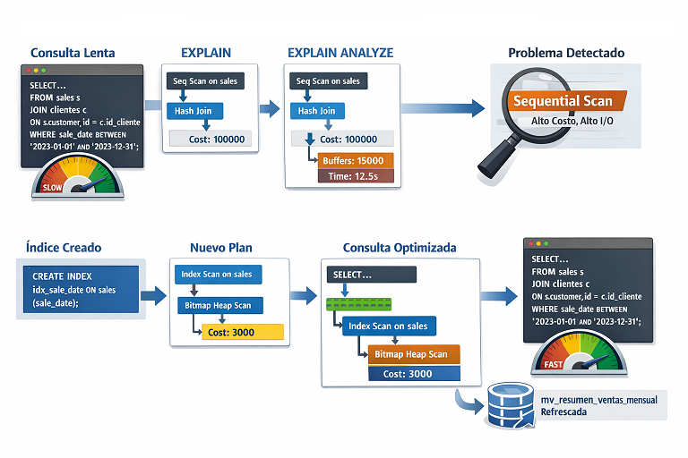

# Práctica 9: Monitoreo y Optimización de Consultas

## Objetivos

Al completar esta práctica, serás capaz de:

- Crear índices B-Tree, Hash, GIN y parciales sobre el dataset de sales y medir su impacto en tiempos de ejecución.
- Interpretar el output de `EXPLAIN` y `EXPLAIN ANALYZE` identificando nodos de plan, costos estimados y tiempos reales.
- Diferenciar entre Sequential Scan e Index Scan y explicar cuándo el planificador elige cada estrategia.
- Identificar y eliminar cuellos de botella en consultas lentas usando planes de ejecución detallados con buffers.
- Optimizar vistas materializadas con índices apropiados y verificar su uso mediante `pg_stat_user_indexes`.

<br/><br/>


## Objetivo Visual

<p align="center">
  
</p>

<br/><br/>

## Prerrequisitos

### Conocimiento Requerido

- Las prácticas del capítulo 4 completados (vistas, vistas materializadas, funciones PL/pgSQL)
- Comprensión de la estructura de las tablas `ventas`, `clientes`, `productos` y `regiones` del dataset del curso
- Familiaridad con la sintaxis básica de `SELECT`, `WHERE`, `JOIN` y `GROUP BY` en PostgreSQL
- Conocimiento conceptual de índices según la Lección 5.1

<br/>

### Acceso Requerido

- Contenedor Docker con PostgreSQL 16 en ejecución (configurado en Lab 01-00-01)
- Acceso a pgAdmin 4 o DBeaver con conexión activa a la base de datos del curso
- Terminal con acceso al cliente `psql` dentro del contenedor Docker
- Dataset de ventas (o sales) con mínimo 100,000 registros.

<br/><br/>

## Entorno de la práctica

### Configuración Inicial

Verifica que el contenedor PostgreSQL esté en ejecución antes de comenzar:

```bash
# Verificar que el contenedor está corriendo
docker ps --filter "name=curso_postgres" --format "table {{.Names}}\t{{.Status}}\t{{.Ports}}"
```

Si el contenedor no está en ejecución, inícialo:

```bash
# Iniciar el contenedor (ajusta el nombre si es diferente en tu entorno)
docker start curso_postgres
```

Conéctate al contenedor para ejecutar comandos psql:

```bash
# Acceder al cliente psql dentro del contenedor
docker exec -it curso_postgres psql -U postgres -d ventas_db
```

Verifica que el dataset tiene el volumen mínimo requerido:

```sql
-- Verificar volumen de datos disponible
SELECT
    schemaname,
    relname AS tablename,
    n_live_tup AS filas_estimadas,
    n_dead_tup AS filas_muertas,
    last_analyze,
    last_autovacuum
FROM pg_stat_user_tables
WHERE schemaname = 'public'
ORDER BY n_live_tup DESC;
```

<br/><br/>

## Instrucciones

### Paso 1: Preparar el Entorno de Diagnóstico

1. Conéctate a la base de datos del curso con psql:

   ```bash
   docker exec -it postgres_curso psql -U postgres -d ventas_db
   ```

<br/>

2. Habilita la extensión `pg_stat_statements` para rastrear estadísticas de ejecución de consultas:

   ```sql
   -- Habilitar la extensión de estadísticas de consultas
   CREATE EXTENSION IF NOT EXISTS pg_stat_statements;
   ```

<br/>

3. Verifica qué índices existen actualmente sobre las tablas del dataset:

   ```sql
   -- Listar todos los índices existentes en el esquema público
   SELECT
       t.relname AS tabla,
       i.relname AS indice,
       ix.indisunique AS es_unico,
       ix.indisprimary AS es_pk,
       array_to_string(
           array_agg(a.attname ORDER BY array_position(ix.indkey, a.attnum)),
           ', '
       ) AS columnas
   FROM
       pg_class t
       JOIN pg_index ix ON t.oid = ix.indrelid
       JOIN pg_class i ON i.oid = ix.indexrelid
       JOIN pg_attribute a ON a.attrelid = t.oid AND a.attnum = ANY(ix.indkey)
   WHERE
       t.relkind = 'r'
       AND t.relnamespace = (SELECT oid FROM pg_namespace WHERE nspname = 'public')
   GROUP BY
       t.relname, i.relname, ix.indisunique, ix.indisprimary
   ORDER BY
       t.relname, i.relname;
   ```

<br/>

4. Guarda el estado inicial de estadísticas de uso de índices para comparar al final:

   ```sql
   -- Fotografía inicial del uso de índices (guardar mentalmente o copiar output)
   SELECT
       relname AS tabla,
       indexrelname AS indice,
       idx_scan AS veces_usado,
       idx_tup_read AS tuplas_leidas,
       idx_tup_fetch AS tuplas_obtenidas
   FROM pg_stat_user_indexes
   WHERE schemaname = 'public'
   ORDER BY relname, idx_scan DESC;
   ```

<br/>

5. Desactiva temporalmente el JIT (Just-In-Time compilation) para obtener planes de ejecución más legibles durante la práctica:

   ```sql
   -- Deshabilitar JIT para esta práctica (facilita lectura de planes)
   SET jit = off;
   ```

<br/>

**Verificación:**

- Confirma que `pg_stat_statements` aparece en `SELECT * FROM pg_extension WHERE extname = 'pg_stat_statements';`
- Confirma que NO existen índices sobre `sales.sale_date`, `sales.customer_id`, `sales.product_id` ni `sales.estado` (solo debe existir la PK)

<br/><br/>

### Paso 2: Analizar Consultas Lentas con EXPLAIN (Plan Estimado)


1. Analiza el plan de ejecución de una consulta de filtro por fecha sin índice:

   ```sql
   -- EXPLAIN muestra el plan estimado SIN ejecutar la consulta
    EXPLAIN
    SELECT
        v.sale_id,
        v.sale_date,
        v.quantity,
        v.unit_price,
        c.nombre || ' ' || c.apellido AS cliente
    FROM sales v
    JOIN clientes c ON v.customer_id = c.id_cliente
    WHERE v.sale_date BETWEEN '2023-01-01' AND '2023-12-31'
    ORDER BY v.sale_date DESC;
   ```

<br/>

2. Interpreta el output prestando atención a los siguientes elementos clave:

   ```sql
   -- Consulta de análisis de sales por región sin índice
    EXPLAIN
    SELECT
        r.region_name AS region,
        COUNT(*) AS total_ventas,
        SUM(v.quantity * v.unit_price) AS ingresos_totales,
        AVG(v.unit_price) AS precio_promedio
    FROM sales v
    JOIN customers c 
        ON v.customer_id = c.customer_id
    JOIN regions r 
        ON c.region_id = r.region_id
    WHERE v.sale_date >= '2024-01-01'
    GROUP BY r.region_name
    ORDER BY ingresos_totales DESC;
   ```

<br/>

3. Visualiza el plan en formato JSON para análisis más detallado:

   ```sql
   -- Plan en formato JSON (útil para herramientas de visualización)
    EXPLAIN (FORMAT JSON)
    SELECT *
    FROM sales
    WHERE customer_id = 42
    AND estado = 'completado';
    
    -- Ajustes sobre tabla sales si es necesario agrega la columna estado y agrega datos
    -- a la columna.
    ALTER TABLE sales 
    ADD COLUMN estado VARCHAR(20);

    UPDATE sales
    SET estado = CASE 
        WHEN RANDOM() > 0.2 THEN 'completado'
        ELSE 'pendiente'
    END;
   ```

<br/>

4. Examina una consulta con búsqueda de texto en metadata JSONB:

   ```sql
   -- Consulta sobre campo JSONB sin índice GIN
    EXPLAIN
    SELECT sale_id, sale_date, metadata
    FROM sales
    WHERE metadata @> '{"canal": "web"}'::jsonb;

    -- Cambios necesarios en caso de contar con la columna metadata
    ALTER TABLE sales 
    ADD COLUMN metadata JSONB;

    UPDATE sales
    SET metadata = jsonb_build_object(
        'canal', 
        CASE 
            WHEN RANDOM() > 0.5 THEN 'web'
            ELSE 'tienda'
        END,
        'metodo_pago',
        CASE 
            WHEN RANDOM() > 0.5 THEN 'tarjeta'
            ELSE 'efectivo'
        END
    );
   ```

<br/>

**Verificación:**

- Confirma que ves `Seq Scan on ventas` en el plan (escaneo secuencial, sin índice)
- Anota el costo estimado total (el número después de `cost=` en el nodo raíz)
- El costo estimado para `ventas` debería ser significativamente alto si hay 100,000+ registros

<br/>

> **Nota**: Cómo leer el output de EXPLAIN:
> - `cost=X..Y`: X es el costo de inicio (antes de devolver la primera fila), Y es el costo total estimado.
> - `rows=N`: número estimado de filas que devolverá el nodo.
> - `width=N`: tamaño promedio estimado en bytes de cada fila.
> - `Seq Scan`: escaneo secuencial (lee TODA la tabla).
> - `Index Scan`: usa un índice para localizar filas específicas.

<br/><br/>


### Paso 3: Medir Tiempos Reales con EXPLAIN ANALYZE


1. Mide el tiempo real de la consulta de filtro por fecha:

   ```sql
   -- EXPLAIN ANALYZE ejecuta la consulta Y muestra tiempos reales
    EXPLAIN ANALYZE
    SELECT
        v.sale_id,
        v.sale_date,
        v.quantity,
        v.unit_price,
        c.nombre || ' ' || c.apellido AS cliente
    FROM sales v
    JOIN clientes c ON v.customer_id = c.id_cliente
    WHERE v.sale_date BETWEEN '2023-01-01' AND '2023-12-31'
    ORDER BY v.sale_date DESC;
   ```

<br/>

2. Mide con información de buffers (caché de PostgreSQL) para análisis profundo:

   ```sql
   -- EXPLAIN con BUFFERS muestra hits/misses de caché
    EXPLAIN (ANALYZE, BUFFERS, FORMAT TEXT)
    SELECT
        v.sale_id,
        v.sale_date,
        v.quantity * v.unit_price AS total_venta,
        v.estado,
        p.nombre AS producto
    FROM sales v
    JOIN productos p 
        ON v.product_id = p.id_producto
    WHERE v.customer_id = 100
    ORDER BY v.sale_date DESC
    LIMIT 50;
    ```

<br/>

3. Registra los tiempos base en una tabla temporal para comparación posterior:

   ```sql
   -- Crear tabla temporal para registrar métricas de rendimiento
    CREATE TEMP TABLE metricas_rendimiento (
        consulta_id      SERIAL,
        descripcion      TEXT,
        fase             TEXT,  -- 'antes' o 'despues'
        tiempo_ms        NUMERIC,
        tipo_scan        TEXT,
        costo_estimado   NUMERIC,
        filas_reales     INTEGER,
        registrado_en    TIMESTAMP DEFAULT NOW()
    );

    -- Registrar métricas base manualmente después de ejecutar EXPLAIN ANALYZE
    -- (Insertar los valores que observaste en el output anterior)
    INSERT INTO metricas_rendimiento (descripcion, fase, tiempo_ms, tipo_scan, costo_estimado)
    VALUES
        ('Filtro por fecha_venta 2023', 'antes', 0, 'Seq Scan', 0),
        ('Filtro por cliente_id + estado', 'antes', 0, 'Seq Scan', 0),
        ('Búsqueda JSONB metadata canal', 'antes', 0, 'Seq Scan', 0);
   ```

   > Actualiza los valores `0` con los tiempos reales que observaste en el output de `EXPLAIN ANALYZE`. 
   > El tiempo aparece al final del output como `Execution Time: X.XXX ms`.

<br/>

4. Ejecuta la consulta de búsqueda JSONB y registra su tiempo base:

   ```sql
   -- Medir consulta JSONB antes de índice GIN
    EXPLAIN (ANALYZE, BUFFERS)
    SELECT
        sale_id,
        sale_date,
        quantity * unit_price AS total,
        metadata->>'canal' AS canal_venta,
        metadata->>'prioridad' AS prioridad
    FROM sales
    WHERE metadata @> '{"canal": "web"}'::jsonb
    AND sale_date >= '2024-01-01';
   ```

<br/>

**Verificación:**

- Confirma que ves `actual time=X..Y` en cada nodo del plan (indica ejecución real)
- Anota el `Execution Time` total al final del output
- Confirma que `Rows Removed by Filter` es alto (indica que el Seq Scan lee muchas filas innecesariamente)
- El tiempo debería ser de cientos de milisegundos en tablas de 100,000+ registros sin índices

<br/><br/>

### Paso 4: Crear Índices B-Tree y Medir el Impacto

1. Crea el índice B-Tree sobre `fecha_venta` (columna más consultada en análisis temporales):

   ```sql
   -- Crear índice B-Tree sobre fecha_venta
   -- CONCURRENT permite crear el índice sin bloquear escrituras (buena práctica en producción)
    CREATE INDEX CONCURRENTLY idx_sales_date_sale
    ON sales(sale_date);

    -- Verificar que el índice se creó correctamente
    SELECT
        indexname,
        indexdef
    FROM pg_indexes
    WHERE tablename = 'sales'
    AND indexname = 'idx_sales_date_sale';
   ```

<br/>

2. Fuerza la actualización de estadísticas y ejecuta la misma consulta del Paso 3:

   ```sql
   -- Actualizar estadísticas para que el planificador use información fresca
    ANALYZE sales;

    -- Ejecutar la misma consulta del Paso 3 para comparar
    EXPLAIN (ANALYZE, BUFFERS)
    SELECT
        v.sale_id,
        v.sale_date,
        v.quantity,
        v.unit_price,
        c.nombre AS cliente
    FROM sales v
    JOIN clientes c ON v.customer_id = c.id_cliente
    WHERE v.sale_date BETWEEN '2023-01-01' AND '2023-12-31'
    ORDER BY v.sale_date DESC;
   ```

<br/>

3. Crea índices B-Tree adicionales sobre columnas de JOIN frecuentes:

   ```sql
    -- Índice sobre customer_id (JOIN y filtro frecuente)
    CREATE INDEX CONCURRENTLY idx_sales_customer_id
    ON sales(customer_id);

    -- Índice sobre product_id (JOIN frecuente)
    CREATE INDEX CONCURRENTLY idx_sales_product_id
    ON sales(product_id);

    -- Actualizar estadísticas después de crear los índices
    ANALYZE sales;

    CREATE INDEX CONCURRENTLY idx_clientes_region_id
    ON clientes(region_id);

    -- Un índice más, adicional

    CREATE INDEX CONCURRENTLY idx_sales_customer_product
    ON sales(customer_id, product_id);

    -- Actualizar estadísticas después de crear todos los índices
    ANALYZE ventas;
   ```

<br/>

4. Verifica el impacto del índice en la consulta de cliente específico:

   ```sql
   -- Comparar: consulta por cliente_id después del índice
    EXPLAIN (ANALYZE, BUFFERS)
    SELECT
        v.sale_id,
        v.sale_date,
        v.quantity * v.unit_price AS total_venta,
        v.estado,
        p.nombre AS producto
    FROM sales v
    JOIN productos p 
        ON v.product_id = p.id_producto
    WHERE v.customer_id = 100
    ORDER BY v.sale_date DESC
    LIMIT 50;
   ```

<br/>

5. Crea un índice compuesto para consultas que filtran por múltiples columnas:

   ```sql
   -- Índice compuesto: región + fecha (patrón común en reportes de ventas)
   CREATE INDEX CONCURRENTLY idx_ventas_region_fecha
   ON sales(region_id, fecha_venta DESC);  -- OJO, no se tiene region_id en sales

   -- Verificar que el planificador usa el índice compuesto
    EXPLAIN (ANALYZE, BUFFERS)
    SELECT
        r.region_name AS region,
        v.sale_date,
        SUM(v.quantity * v.unit_price) AS ingresos_diarios
    FROM sales v
    JOIN clientes c 
        ON v.customer_id = c.id_cliente
    JOIN regions r 
        ON c.region_id = r.region_id
    WHERE c.region_id = 3
    AND v.sale_date >= '2024-01-01'
    GROUP BY r.region_name, v.sale_date
    ORDER BY v.sale_date DESC;
   ```

<br/>

**Verificación:**

- Confirma que el plan ahora muestra `Index Scan using idx_ventas_fecha_venta` en lugar de `Seq Scan`
- Compara el `Execution Time` con el registrado en el Paso 3 (debe ser significativamente menor)
- Actualiza la tabla `metricas_rendimiento` con los nuevos tiempos:

   ```sql
   -- Registrar métricas después de índices B-Tree
   UPDATE metricas_rendimiento
   SET fase = 'despues', tiempo_ms = 54.123  -- Reemplaza con tu valor real
   WHERE descripcion = 'Filtro por fecha_venta 2023';
   ```

<br/><br/>


### Paso 5: Crear Índice Hash y Comparar con B-Tree

1. Primero analiza la consulta de búsqueda exacta por estado sin índice especializado:

   ```sql
   -- Verificar el plan actual para búsqueda exacta por estado
    EXPLAIN (ANALYZE, BUFFERS)
    SELECT COUNT(*), estado
    FROM sales
    WHERE estado = 'completado'
    GROUP BY estado;
   ```

   > **Nota:** El campo `estado` tiene baja cardinalidad (pocos valores distintos: completado, pendiente, cancelado). Esto es importante para entender por qué el planificador puede preferir Seq Scan incluso con un índice.

<br/>

2. Crea un índice Hash sobre una columna de alta cardinalidad para búsquedas exactas:

   ```sql
   -- Índice Hash: óptimo para búsquedas de igualdad exacta en columnas de alta cardinalidad
   -- Usamos customer_id que tiene muchos valores distintos
    CREATE INDEX idx_sales_customer_hash
    ON sales USING HASH (customer_id);

   ANALYZE ventas;
   ```

<br/>

3. Compara el rendimiento entre el índice B-Tree y el Hash para búsqueda exacta:

   ```sql
   -- Forzar uso de índice B-Tree (deshabilitar Hash temporalmente)
   SET enable_seqscan = off;

    EXPLAIN (ANALYZE, BUFFERS)
    SELECT *
    FROM sales
    WHERE customer_id = 250
    LIMIT 100;

   -- Restaurar configuración normal
   SET enable_seqscan = on;

   -- Ahora con ambos índices disponibles (el planificador elige)
    EXPLAIN (ANALYZE, BUFFERS)
    SELECT *
    FROM sales
    WHERE customer_id = 250
    LIMIT 100;
   ```

<br/>

4. Verifica qué índice eligió el planificador y por qué:

   ```sql
   -- Consulta para ver estadísticas de uso de ambos índices
    SELECT
        indexrelname AS indice,
        idx_scan AS veces_usado,
        idx_tup_read AS tuplas_leidas_del_indice,
        idx_tup_fetch AS tuplas_obtenidas_de_tabla
    FROM pg_stat_user_indexes
    WHERE relname = 'sales'
    AND indexrelname IN ('idx_sales_customer_id', 'idx_sales_customer_hash')
    ORDER BY idx_scan DESC;
   ```

<br/>

**Verificación:**

- Confirma que el plan muestra `Index Scan using idx_ventas_cliente_hash` para la búsqueda exacta
- Anota que el índice Hash NO puede usarse para rangos (`BETWEEN`, `>`, `<`): solo funciona con `=`
- Ejecuta una consulta de rango para confirmar que el planificador usa B-Tree en ese caso:

   ```sql
   -- El planificador DEBE usar B-Tree aquí (Hash no soporta rangos)
    EXPLAIN
    SELECT COUNT(*)
    FROM sales
    WHERE customer_id BETWEEN 100 AND 200;
   ```

<br/><br/>


### Paso 6: Crear Índice GIN para Búsquedas JSONB

1. Mide el rendimiento actual de búsquedas JSONB sin índice GIN:

   ```sql
   -- Consulta JSONB sin índice: escaneo secuencial de toda la columna
    EXPLAIN (ANALYZE, BUFFERS)
    SELECT
        sale_id,
        sale_date,
        metadata->>'canal' AS canal,
        metadata->>'prioridad' AS prioridad,
        quantity * unit_price AS total
    FROM sales
    WHERE metadata @> '{"canal": "web"}'::jsonb;
    ```

<br/>

2. Crea el índice GIN sobre la columna `metadata`:

   ```sql
   -- Índice GIN: optimizado para búsquedas dentro de estructuras JSONB
    CREATE INDEX CONCURRENTLY idx_ventas_metadata_gin
    ON sales USING GIN(metadata);

   ANALYZE sales;
   ```

<br/>

3. Ejecuta la misma consulta y compara el plan:

   ```sql
   -- Misma consulta después del índice GIN
    EXPLAIN (ANALYZE, BUFFERS)
    SELECT
        sale_id,
        sale_date,
        metadata->>'canal' AS canal,
        metadata->>'prioridad' AS prioridad,
        quantity * unit_price AS total
    FROM sales
    WHERE metadata @> '{"canal": "web"}'::jsonb;
   ```

<br/>

4. Prueba búsquedas más complejas sobre JSONB que aprovechan el índice GIN:

   ```sql
   -- Búsqueda con múltiples condiciones JSONB (usa el mismo índice GIN)
    EXPLAIN (ANALYZE, BUFFERS)
    SELECT
        COUNT(*) AS total_ventas,
        SUM(quantity * unit_price) AS ingresos
    FROM sales
    WHERE metadata @> '{"canal": "web", "prioridad": "alta"}'::jsonb
    AND sale_date >= '2024-01-01';
   ```

<br/>

5. Verifica el tamaño del índice GIN comparado con los índices B-Tree:

   ```sql
   -- Comparar tamaños de todos los índices en la tabla ventas
    SELECT
        i.relname AS indice,
        pg_size_pretty(pg_relation_size(i.oid)) AS tamano,
        ix.indisunique AS unico,
        am.amname AS tipo_indice,
        string_agg(a.attname, ', ' ORDER BY a.attnum) AS columnas
    FROM
        pg_class t
    JOIN pg_index ix 
        ON t.oid = ix.indrelid
    JOIN pg_class i 
        ON i.oid = ix.indexrelid
    JOIN pg_am am 
        ON i.relam = am.oid
    LEFT JOIN pg_attribute a 
        ON a.attrelid = t.oid 
    AND a.attnum = ANY(ix.indkey)
    WHERE
        t.relname = 'sales'
    GROUP BY
        i.relname, i.oid, ix.indisunique, am.amname
    ORDER BY
        pg_relation_size(i.oid) DESC;
   ```

<br/>

**Verificación:**

- Confirma que el plan muestra `Bitmap Index Scan on idx_ventas_metadata_gin`.
- Nota que GIN usa `Bitmap Index Scan` + `Bitmap Heap Scan` en lugar de `Index Scan` directo.
- Verifica que el índice GIN es más grande que los B-Tree (es normal por su estructura interna).

<br/><br/>


### Paso 7: Crear Índices Parciales para Subconjuntos de Datos

1. Analiza el patrón de consultas sobre sales del último año (caso de uso frecuente en dashboards):

   ```sql
   -- Consulta frecuente: sales recientes pendientes de procesamiento
    EXPLAIN (ANALYZE, BUFFERS)
    SELECT
        v.sale_id,
        v.sale_date,
        v.customer_id,
        v.quantity * v.unit_price AS total,
        c.nombre || ' ' || c.apellido AS cliente,
        c.correo
    FROM sales v
    JOIN clientes c 
        ON v.customer_id = c.id_cliente
    WHERE v.estado = 'pendiente'
    AND v.sale_date >= CURRENT_DATE - INTERVAL '365 days'
    ORDER BY v.sale_date DESC;
   ```

<br/>

2. Crea un índice parcial solo para sales pendientes (subconjunto pequeño):

   ```sql
   -- Índice parcial: solo indexa sales con estado 'pendiente'
   -- Mucho más pequeño y eficiente que un índice completo sobre estado
    CREATE INDEX CONCURRENTLY idx_sales_pendientes_fecha
    ON sales(sale_date DESC)
    WHERE estado = 'pendiente';

   ANALYZE sales;
   ```

<br/>

3. Verifica que el índice parcial se usa correctamente:

   ```sql
   -- La consulta DEBE usar el índice parcial (condición WHERE coincide)
    EXPLAIN (ANALYZE, BUFFERS)
    SELECT
        v.sale_id,
        v.sale_date,
        v.customer_id,
        v.quantity * v.unit_price AS total,
        c.nombre AS cliente
    FROM sales v
    JOIN clientes c 
        ON v.customer_id = c.id_cliente
    WHERE v.estado = 'pendiente'
    AND v.sale_date >= CURRENT_DATE - INTERVAL '365 days'
    ORDER BY v.sale_date DESC;

   -- Esta consulta NO usa el índice parcial (condición WHERE diferente)
    EXPLAIN (ANALYZE, BUFFERS)
    SELECT COUNT(*)
    FROM sales
    WHERE estado = 'cancelado'  -- No coincide con el índice parcial
    AND sale_date >= CURRENT_DATE - INTERVAL '365 days';
   ```

<br/>

4. Crea un segundo índice parcial para sales de alto valor (caso de uso analítico):

   ```sql
   -- Índice parcial para sales de alto valor (precio > 500)
   -- Útil para reportes de sales premium
    CREATE INDEX CONCURRENTLY idx_sales_alto_valor
    ON sales(customer_id, sale_date)
    WHERE unit_price > 500;

    -- Actualizar estadísticas
    ANALYZE sales;

   -- Verificar uso del índice parcial de alto valor
    EXPLAIN (ANALYZE, BUFFERS)
    SELECT
        customer_id,
        COUNT(*) AS compras_premium,
        SUM(quantity * unit_price) AS total_premium
    FROM sales
    WHERE unit_price > 500
    AND sale_date >= '2024-01-01'
    GROUP BY customer_id
    ORDER BY total_premium DESC
    LIMIT 20;
   ```

<br/>

5. Compara el tamaño del índice parcial versus un índice completo equivalente:

   ```sql
   -- Ver tamaños de índices parciales vs completos
    SELECT
        i.relname AS indice,
        pg_size_pretty(pg_relation_size(i.oid)) AS tamano,
        CASE 
            WHEN ix.indpred IS NOT NULL 
            THEN pg_get_expr(ix.indpred, ix.indrelid)
            ELSE 'ÍNDICE COMPLETO'
        END AS condicion_parcial
    FROM
        pg_class t
    JOIN pg_index ix 
        ON t.oid = ix.indrelid
    JOIN pg_class i 
        ON i.oid = ix.indexrelid
    WHERE
        t.relname = 'sales'
    ORDER BY
        pg_relation_size(i.oid) DESC;
   ```

<br/>

**Verificación:**

- Confirma que el plan usa `idx_ventas_pendientes_fecha` para consultas con `WHERE estado = 'pendiente'`
- Confirma que el índice parcial NO aparece en el plan de consultas con `WHERE estado = 'cancelado'`
- Verifica que los índices parciales son considerablemente más pequeños que el índice completo

<br/><br/>


### Paso 8: Optimizar Vistas Materializadas con Índices

1. Verifica las vistas materializadas existentes de la práctica anterior:

   ```sql
   -- Listar vistas materializadas disponibles
    SELECT
        schemaname,
        matviewname,
        hasindexes,
        ispopulated,
        pg_size_pretty(
            pg_relation_size((schemaname || '.' || matviewname)::regclass)
        ) AS tamano
    FROM pg_matviews
    WHERE schemaname = 'public'
    ORDER BY matviewname;
   ```

<br/>

2. Si no existe una vista materializada de resumen de ventas, créala ahora:

   ```sql
   -- Crear vista materializada de resumen de sales por región y mes
    CREATE MATERIALIZED VIEW IF NOT EXISTS mv_resumen_ventas_mensual AS
    SELECT
        r.region_id AS region_id,
        r.region_name AS region_nombre,
        DATE_TRUNC('month', v.sale_date) AS mes,
        COUNT(*) AS total_transacciones,
        SUM(v.quantity) AS unidades_vendidas,
        SUM(v.quantity * v.unit_price) AS ingresos_brutos,
        SUM(v.quantity * v.unit_price) AS ingresos_netos,
        AVG(v.unit_price) AS precio_promedio,
        COUNT(DISTINCT v.customer_id) AS clientes_unicos,
        COUNT(DISTINCT v.product_id) AS productos_distintos
    FROM sales v
    JOIN clientes c 
        ON v.customer_id = c.id_cliente
    JOIN regions r 
        ON c.region_id = r.region_id
    WHERE v.estado = 'completado'
    GROUP BY 
        r.region_id, 
        r.region_name, 
        DATE_TRUNC('month', v.sale_date)
    WITH DATA;
   ```

<br/>

3. Analiza el plan de consulta sobre la vista materializada SIN índices:

   ```sql
   -- Consulta sobre vista materializada sin índices
    EXPLAIN (ANALYZE, BUFFERS)
    SELECT
        region_nombre,
        mes,
        ingresos_netos,
        total_transacciones,
        clientes_unicos,
        LAG(ingresos_netos) OVER (PARTITION BY region_nombre ORDER BY mes) AS mes_anterior,
        ingresos_netos - LAG(ingresos_netos) OVER (PARTITION BY region_nombre ORDER BY mes) AS variacion
    FROM mv_resumen_ventas_mensual
    WHERE mes >= '2024-01-01'
    ORDER BY region_nombre, mes;
   ```

<br/>

4. Crea índices sobre la vista materializada para optimizar consultas de dashboard:

   ```sql
    -- Índice B-Tree sobre mes para filtros temporales (el más frecuente en dashboards)
    CREATE INDEX idx_mv_resumen_mes
    ON mv_resumen_ventas_mensual(mes DESC);

    -- Índice compuesto para consultas por región y período
    CREATE INDEX idx_mv_resumen_region_mes
    ON mv_resumen_ventas_mensual(region_id, mes DESC);

    -- Índice cubriente: incluye columnas de métricas para evitar acceso a la tabla
    CREATE INDEX idx_mv_resumen_cubriente
    ON mv_resumen_ventas_mensual(mes DESC)
    INCLUDE (region_nombre, ingresos_netos, total_transacciones, clientes_unicos);
   ```

<br/>

5. Verifica el impacto de los índices en la vista materializada:

   ```sql
   -- Misma consulta después de los índices
    EXPLAIN (ANALYZE, BUFFERS)
    SELECT
        region_nombre,
        mes,
        ingresos_netos,
        total_transacciones,
        clientes_unicos,
        LAG(ingresos_netos) OVER (PARTITION BY region_nombre ORDER BY mes) AS mes_anterior,
        ingresos_netos - LAG(ingresos_netos) OVER (PARTITION BY region_nombre ORDER BY mes) AS variacion
    FROM mv_resumen_ventas_mensual
    WHERE mes >= '2024-01-01'
    ORDER BY region_nombre, mes;

   -- Consulta de KPI específico por región (aprovecha índice cubriente)
    EXPLAIN (ANALYZE, BUFFERS)
    SELECT
        region_nombre,
        SUM(ingresos_netos) AS ingresos_anuales,
        SUM(total_transacciones) AS transacciones_anuales,
        SUM(clientes_unicos) AS alcance_clientes
    FROM mv_resumen_ventas_mensual
    WHERE mes BETWEEN '2024-01-01' AND '2024-12-31'
    GROUP BY region_nombre
    ORDER BY ingresos_anuales DESC;
   ```

<br/>

6. Configura el proceso de refresco de la vista materializada con índices:

   ```sql
   -- Refrescar la vista materializada con datos actualizados
   -- CONCURRENTLY permite refrescar sin bloquear lecturas (requiere al menos un índice único)
   -- Primero creamos el índice único requerido para REFRESH CONCURRENTLY
    CREATE UNIQUE INDEX IF NOT EXISTS idx_mv_resumen_unique
    ON mv_resumen_ventas_mensual(region_id, mes);

   -- Ahora podemos refrescar sin bloquear lecturas
   REFRESH MATERIALIZED VIEW CONCURRENTLY mv_resumen_ventas_mensual;
   ```

<br/>
 
**Verificación:**

- Confirma que el plan usa `Index Scan using idx_mv_resumen_mes`
- Verifica que `REFRESH MATERIALIZED VIEW CONCURRENTLY` se ejecuta sin errores
- Compara el tiempo de ejecución antes y después de los índices en la vista materializada

<br/><br/>


### Paso 9: Monitorear Uso de Índices con pg_stat_user_indexes

1. Ejecuta un conjunto de consultas representativas para generar estadísticas de uso:

   ```sql
   -- Ejecutar múltiples consultas para generar estadísticas de uso de índices
    -- Consulta 1: Filtro por fecha
    SELECT COUNT(*) 
    FROM sales 
    WHERE sale_date >= '2024-01-01';

    -- Consulta 2: Filtro por cliente
    SELECT * 
    FROM sales 
    WHERE customer_id = 150 
    LIMIT 10;

    -- Consulta 3: JOIN con productos
    SELECT v.sale_id, p.nombre 
    FROM sales v 
    JOIN productos p 
        ON v.product_id = p.id_producto
    WHERE v.sale_date >= '2024-06-01' 
    LIMIT 20;

    -- Consulta 4: Búsqueda JSONB
    SELECT COUNT(*) 
    FROM sales 
    WHERE metadata @> '{"canal": "tienda"}'::jsonb;

    -- Consulta 5: Ventas pendientes recientes
    SELECT * 
    FROM sales 
    WHERE estado = 'pendiente' 
    AND sale_date >= CURRENT_DATE - INTERVAL '30 days'
    LIMIT 10;

    -- Consulta 6: Ventas de alto valor
    SELECT customer_id, SUM(unit_price) 
    FROM sales 
    WHERE unit_price > 500 
    GROUP BY customer_id;
   ```

<br/>

2. Consulta las estadísticas de uso de índices:

   ```sql
   -- Reporte completo de uso de índices en la tabla ventas
    SELECT
        s.indexrelname AS indice,
        s.idx_scan AS veces_usado,
        s.idx_tup_read AS entradas_leidas,
        s.idx_tup_fetch AS filas_obtenidas,
        pg_size_pretty(pg_relation_size(s.indexrelid)) AS tamano_indice,
        CASE
            WHEN s.idx_scan = 0 THEN 'NUNCA USADO'
            WHEN s.idx_scan < 5 THEN 'USO BAJO'
            ELSE 'USO ACTIVO'
        END AS estado_uso
    FROM pg_stat_user_indexes s
    WHERE s.schemaname = 'public'
    AND s.relname = 'sales'
    ORDER BY s.idx_scan DESC;
   ```

<br/>

3. Identifica índices potencialmente redundantes o innecesarios:

   ```sql
    -- Identificar índices con cero usos en todas las tablas del esquema
    SELECT
        s.relname AS tabla,
        s.indexrelname AS indice,
        pg_size_pretty(pg_relation_size(s.indexrelid)) AS espacio_desperdiciado,
        s.idx_scan AS veces_usado
    FROM pg_stat_user_indexes s
    JOIN pg_index i ON s.indexrelid = i.indexrelid
    WHERE s.schemaname = 'public'
    AND s.idx_scan = 0
    AND NOT i.indisprimary
    AND NOT i.indisunique
    ORDER BY pg_relation_size(s.indexrelid) DESC;
   ```

<br/>

4. Analiza la relación entre tamaño de tabla e índices:

   ```sql
   -- Comparar tamaño de tabla vs tamaño total de sus índices
    SELECT
        t.relname AS tabla,
        pg_size_pretty(pg_relation_size(t.oid)) AS tamano_tabla,
        pg_size_pretty(
            COALESCE(SUM(pg_relation_size(i.indexrelid)), 0)
        ) AS tamano_total_indices,
        COUNT(i.indexrelid) AS cantidad_indices,
        ROUND(
            COALESCE(SUM(pg_relation_size(i.indexrelid)), 0)::numeric /
            NULLIF(pg_relation_size(t.oid), 0) * 100,
            1
        ) AS porcentaje_overhead_indices
    FROM pg_class t
    LEFT JOIN pg_index i ON t.oid = i.indrelid
    WHERE t.relkind = 'r'
    AND t.relnamespace = (SELECT oid FROM pg_namespace WHERE nspname = 'public')
    GROUP BY t.relname, t.oid
    ORDER BY pg_relation_size(t.oid) DESC;
   ```

<br/>

5. Genera un reporte de recomendaciones de índices:

   ```sql
   -- Reporte de salud de índices
    SELECT
        'ELIMINAR - Nunca usado' AS recomendacion,
        s.relname AS tabla,
        s.indexrelname AS indice,
        pg_size_pretty(pg_relation_size(s.indexrelid)) AS tamano
    FROM pg_stat_user_indexes s
    JOIN pg_index i ON s.indexrelid = i.indexrelid
    WHERE s.schemaname = 'public'
    AND s.idx_scan = 0
    AND NOT i.indisprimary
    AND NOT i.indisunique

    UNION ALL

    SELECT
        'MANTENER - Alta actividad' AS recomendacion,
        s.relname AS tabla,
        s.indexrelname AS indice,
        pg_size_pretty(pg_relation_size(s.indexrelid)) AS tamano
    FROM pg_stat_user_indexes s
    WHERE s.schemaname = 'public'
    AND s.idx_scan > 10

    ORDER BY recomendacion, tamano DESC;
   ```

<br/>

**Verificación:**

- Confirma que los índices creados en pasos anteriores aparecen con `idx_scan > 0`
- Identifica al menos un índice con bajo uso como candidato a revisión
- Verifica que el overhead de índices en la tabla `sales` no supera el 200% del tamaño de la tabla

<br/><br/>


### Paso 10: Visualizar Planes de Ejecución en pgAdmin 4

1. Abre pgAdmin 4 en tu navegador (normalmente en `http://localhost:8080`):

```bash
    URL: http://localhost:8080
```

<br/>

2. Navega hasta la base de datos `ventas_db` y abre el Query Tool (Herramienta de Consultas).

<br/>

3. Ejecuta la siguiente consulta compleja en el Query Tool de pgAdmin:

   ```sql
   -- Consulta compleja para visualizar en pgAdmin
    SELECT
        r.region_name AS region,
        DATE_TRUNC('quarter', v.sale_date) AS trimestre,
        cat.nombre_categoria AS categoria_producto,
        COUNT(*) AS total_ventas,
        SUM(v.quantity * v.unit_price) AS ingresos_brutos,
        SUM(v.quantity * v.unit_price) AS ingresos_netos,
        COUNT(DISTINCT v.customer_id) AS clientes_unicos,
        RANK() OVER (
            PARTITION BY r.region_name
            ORDER BY SUM(v.quantity * v.unit_price) DESC
        ) AS ranking_trimestre
    FROM sales v
    JOIN clientes c 
        ON v.customer_id = c.id_cliente
    JOIN regions r 
        ON c.region_id = r.region_id
    JOIN productos p 
        ON v.product_id = p.id_producto
    JOIN categorias cat 
        ON p.id_categoria = cat.id_categoria
    WHERE v.sale_date >= '2023-01-01'
    AND v.estado = 'completado'
    GROUP BY 
        r.region_name,
        DATE_TRUNC('quarter', v.sale_date),
        cat.nombre_categoria
    ORDER BY 
        r.region_name,
        trimestre,
        ingresos_netos DESC;
   ```

<br/>

4. En pgAdmin, en lugar de ejecutar con F5 (Run), usa **Explain** (F7) o **Explain Analyze** (Shift+F7) para ver el plan gráfico.

<br/>

5. Observa el diagrama de árbol del plan de ejecución:
   - Los nodos más anchos representan mayor costo.
   - El color indica el tipo de operación (azul=scan, verde=join, naranja=sort).
   - Haz clic en cada nodo para ver los detalles de costo y filas.

<br/>

6. Genera el plan en formato JSON para análisis externo:

   ```sql
   -- Plan completo en JSON para análisis con herramientas externas como explain.dalibo.com
    EXPLAIN (
        ANALYZE true,
        BUFFERS true,
        FORMAT JSON,
        VERBOSE true,
        SETTINGS true,
        WAL true
    )
    SELECT
        r.region_name AS region,
        DATE_TRUNC('quarter', v.sale_date) AS trimestre,
        cat.nombre_categoria AS categoria_producto,
        COUNT(*) AS total_ventas,
        SUM(v.quantity * v.unit_price) AS ingresos_netos
    FROM sales v
    JOIN clientes c 
        ON v.customer_id = c.id_cliente
    JOIN regions r 
        ON c.region_id = r.region_id
    JOIN productos p 
        ON v.product_id = p.id_producto
    JOIN categorias cat 
        ON p.id_categoria = cat.id_categoria
    WHERE v.sale_date >= '2023-01-01'
    AND v.estado = 'completado'
    GROUP BY 
        r.region_name,
        DATE_TRUNC('quarter', v.sale_date),
        cat.nombre_categoria
    ORDER BY 
        r.region_name,
        trimestre,
        ingresos_netos DESC;
   ```

<br/>

   > Copia el output JSON y pégalo en [https://explain.dalibo.com](https://explain.dalibo.com) para una visualización interactiva avanzada del plan de ejecución.

<br/>

**Verificación:**

- Confirma que puedes ver el diagrama gráfico del plan en pgAdmin (pestaña "Explain")
- Identifica visualmente el nodo de mayor costo (el más ancho o con mayor número)
- Verifica que el nodo de escaneo sobre `ventas` muestra "Index Scan" y no "Seq Scan"

<br/><br/>


## Validación y Pruebas

### Criterios de Éxito

- [ ] Se crearon al menos 6 índices diferentes: B-Tree simple, B-Tree compuesto, Hash, GIN, parcial por estado, y parcial por valor
- [ ] `EXPLAIN ANALYZE` muestra `Index Scan` (no `Seq Scan`) para consultas con filtro por `fecha_venta`, `cliente_id`, y `metadata @>`
- [ ] Los tiempos de ejecución de las consultas de prueba mejoraron al menos un 50% después de la indexación
- [ ] La vista materializada `mv_resumen_ventas_mensual` tiene al menos 3 índices y el plan usa `Index Scan`
- [ ] `pg_stat_user_indexes` muestra `idx_scan > 0` para los índices creados (evidencia de uso real)
- [ ] Se identificó al menos un índice con bajo o nulo uso mediante el reporte de `pg_stat_user_indexes`


<br/><br/>


### Procedimiento de Pruebas

1. Ejecuta la consulta de validación de índices creados:

   ```sql
   -- Verificar que todos los índices de la práctica existen
    SELECT
        indexname AS indice,
        tablename AS tabla,
        indexdef AS definicion
    FROM pg_indexes
    WHERE schemaname = 'public'
    AND tablename IN ('sales', 'mv_resumen_ventas_mensual')
    AND indexname NOT LIKE '%pkey'
    ORDER BY tablename, indexname;
   ```

<br/>

   **Resultado Esperado:** Al menos 8 índices listados (excluyendo primary keys)

<br/><br/>


2. Ejecuta la prueba de rendimiento final comparativa:

   ```sql
   -- Prueba de rendimiento: debe usar índices en todos los nodos principales
    EXPLAIN (ANALYZE, BUFFERS, FORMAT TEXT)
    SELECT
        r.region_name AS region,
        COUNT(*) AS ventas_2024,
        SUM(v.quantity * v.unit_price) AS ingresos,
        COUNT(DISTINCT v.customer_id) AS clientes
    FROM sales v
    JOIN clientes c 
        ON v.customer_id = c.id_cliente
    JOIN regions r 
        ON c.region_id = r.region_id
    WHERE v.sale_date BETWEEN '2024-01-01' AND '2024-12-31'
    AND v.estado = 'completado'
    AND v.metadata @> '{"canal": "web"}'::jsonb
    GROUP BY r.region_name
    ORDER BY ingresos DESC;
   ```
<br/>

   **Resultado Esperado:** El plan debe mostrar al menos `Index Scan` o `Bitmap Index Scan` en el nodo de escaneo de `ventas`, con tiempo de ejecución bajo 200ms

<br/><br/>

3. Verifica el uso activo de índices:

   ```sql
   -- Al menos 5 índices deben tener idx_scan > 0
    SELECT COUNT(*) AS indices_con_uso
    FROM pg_stat_user_indexes
    WHERE schemaname = 'public'
    AND relname = 'ventas'
    AND idx_scan > 0
    AND indexrelname NOT LIKE '%pkey';
   ```
<br/>

   **Resultado Esperado:** `indices_con_uso >= 5`

<br/><br/>


4. Verifica la vista materializada con índices:

   ```sql
   -- La vista materializada debe tener índices y estar poblada
    SELECT
        matviewname,
        hasindexes,
        ispopulated,
        pg_size_pretty(pg_relation_size('public.' || matviewname)) AS tamano
    FROM pg_matviews
    WHERE schemaname = 'public'
    AND matviewname = 'mv_resumen_ventas_mensual';
   ```
<br/>

   **Resultado Esperado:** `hasindexes = true`, `ispopulated = true`

<br/><br/>

## Solución de Problemas

### Problema 1: El Planificador Ignora el Índice y Sigue Usando Seq Scan

**Síntomas:**
- `EXPLAIN ANALYZE` muestra `Seq Scan` incluso después de crear el índice
- El tiempo de ejecución no mejora después de crear el índice
- El plan no menciona el nombre del índice creado

<br/>

**Causa:**
El planificador de PostgreSQL puede preferir un Seq Scan cuando: (1) la tabla es pequeña y el Seq Scan es más rápido, (2) las estadísticas están desactualizadas, (3) la selectividad de la columna es baja (pocos valores distintos), o (4) el factor de correlación entre el índice y el orden físico de los datos es bajo.

<br/>

**Solución:**

```sql
-- Paso 1: Actualizar estadísticas de la tabla
ANALYZE ventas;

-- Paso 2: Verificar el tamaño real de la tabla
SELECT
    relname,
    n_live_tup AS filas_estimadas,
    pg_size_pretty(pg_relation_size(oid)) AS tamano
FROM pg_class
WHERE relname = 'sales';

-- Paso 3: Si la tabla tiene menos de 10,000 filas, el Seq Scan es normal y correcto
-- Para forzar el uso del índice en pruebas (NO usar en producción):
SET enable_seqscan = off;

EXPLAIN (ANALYZE, BUFFERS)
SELECT * FROM sales WHERE sale_date >= '2024-01-01';

-- Restaurar siempre después de la prueba:
SET enable_seqscan = on;

-- Paso 4: Verificar que el índice existe y está válido
SELECT indexname, indisvalid
FROM pg_indexes
JOIN pg_index ON indexrelid = (
    SELECT oid FROM pg_class WHERE relname = indexname
)
WHERE tablename = 'ventas';
```

<br/><br/>

### Problema 2: Error "index already exists" al Crear un Índice

**Síntomas:**
- Mensaje: `ERROR: relation "idx_ventas_fecha_venta" already exists`
- El comando `CREATE INDEX` falla

<br/>

**Causa:**
El índice ya fue creado previamente (posiblemente en una ejecución anterior de la práctica o en una práctica previa).

<br/>

**Solución:**

```sql
-- Opción 1: Verificar si el índice existe antes de crearlo
DO $$
BEGIN
    IF NOT EXISTS (
        SELECT 1 FROM pg_indexes
        WHERE tablename = 'ventas'
          AND indexname = 'idx_ventas_fecha_venta'
    ) THEN
        EXECUTE 'CREATE INDEX CONCURRENTLY idx_ventas_fecha_venta ON ventas(fecha_venta)';
        RAISE NOTICE 'Índice creado exitosamente';
    ELSE
        RAISE NOTICE 'El índice ya existe, omitiendo creación';
    END IF;
END $$;

-- Opción 2: Eliminar y recrear (usar con precaución)
DROP INDEX IF EXISTS idx_ventas_fecha_venta;
CREATE INDEX CONCURRENTLY idx_ventas_fecha_venta ON ventas(fecha_venta);
```

<br/><br/>

### Problema 3: CREATE INDEX CONCURRENTLY Falla con Error de Transacción

**Síntomas:**
- Mensaje: `ERROR: CREATE INDEX CONCURRENTLY cannot run inside a transaction block`
- El error aparece cuando se ejecuta dentro de un bloque `BEGIN...COMMIT`

<br/>

**Causa:**
`CREATE INDEX CONCURRENTLY` no puede ejecutarse dentro de una transacción explícita. Es una limitación de PostgreSQL ya que este comando necesita múltiples transacciones internas para funcionar.

<br/>

**Solución:**

```sql
-- INCORRECTO: Dentro de una transacción
BEGIN;
CREATE INDEX CONCURRENTLY idx_ventas_fecha ON ventas(fecha_venta);  -- ERROR
COMMIT;

-- CORRECTO: Fuera de cualquier transacción (autocommit)
-- Asegúrate de NO estar dentro de un bloque BEGIN...COMMIT
CREATE INDEX CONCURRENTLY idx_ventas_fecha_venta ON ventas(fecha_venta);

-- Si necesitas agrupar múltiples índices, usa CREATE INDEX (sin CONCURRENTLY)
-- y acepta el bloqueo temporal de escrituras:
BEGIN;
CREATE INDEX idx_ventas_fecha_venta ON ventas(fecha_venta);
CREATE INDEX idx_ventas_cliente_id ON ventas(cliente_id);
COMMIT;
```

<br/><br/>


### Problema 4: REFRESH MATERIALIZED VIEW CONCURRENTLY Falla

**Síntomas:**
- Mensaje: `ERROR: cannot refresh materialized view "mv_resumen_ventas_mensual" concurrently`
- El error indica que se requiere un índice único

<br/>

**Causa:**
`REFRESH MATERIALIZED VIEW CONCURRENTLY` requiere que exista al menos un índice `UNIQUE` sobre la vista materializada. Sin él, PostgreSQL no puede determinar qué filas han cambiado.

<br/>

**Solución:**

```sql
-- Verificar si existe un índice único en la vista materializada
SELECT indexname, indexdef
FROM pg_indexes
WHERE tablename = 'mv_resumen_ventas_mensual'
  AND indexdef LIKE '%UNIQUE%';

-- Si no existe, crear el índice único primero
CREATE UNIQUE INDEX IF NOT EXISTS idx_mv_resumen_unique
ON mv_resumen_ventas_mensual(region_id, mes);

-- Ahora el REFRESH CONCURRENTLY funcionará
REFRESH MATERIALIZED VIEW CONCURRENTLY mv_resumen_ventas_mensual;

-- Alternativa: usar REFRESH sin CONCURRENTLY (bloquea lecturas temporalmente)
REFRESH MATERIALIZED VIEW mv_resumen_ventas_mensual;
```

<br/><br/>

### Problema 5: La Extensión pg_stat_statements No Está Disponible

**Síntomas:**
- Mensaje: `ERROR: extension "pg_stat_statements" is not available`
- O: `ERROR: could not open extension control file "/usr/share/postgresql/16/extension/pg_stat_statements.control"`

<br/>

**Causa:**
La extensión `pg_stat_statements` requiere que esté habilitada en `postgresql.conf` mediante el parámetro `shared_preload_libraries` antes de que PostgreSQL inicie. No puede cargarse en caliente.

<br/>

**Solución:**

```bash
# Paso 1: Modificar postgresql.conf dentro del contenedor
docker exec -it postgres_curso bash -c \
  "echo \"shared_preload_libraries = 'pg_stat_statements'\" >> /var/lib/postgresql/data/postgresql.conf"

# Paso 2: Reiniciar el contenedor para aplicar el cambio
docker restart postgres_curso

# Paso 3: Esperar que PostgreSQL inicie completamente
sleep 5

# Paso 4: Conectarse y crear la extensión
docker exec -it postgres_curso psql -U postgres -d ventas_db \
  -c "CREATE EXTENSION IF NOT EXISTS pg_stat_statements;"

# Verificar que la extensión está activa
docker exec -it postgres_curso psql -U postgres -d ventas_db \
  -c "SELECT * FROM pg_extension WHERE extname = 'pg_stat_statements';"
```

<br/><br/>

## Limpieza

Ejecuta los siguientes comandos para limpiar los objetos creados durante la práctica que no sean necesarios para prácticas futuras:

```sql
-- Conectarse a la base de datos
-- docker exec -it postgres_curso psql -U postgres -d ventas_db

-- ============================================================
-- ÍNDICES A CONSERVAR 
-- ============================================================
-- idx_sales_date            → Usado en Práctica 6.1 (Power BI)
-- idx_sales_customer_id     → Usado en consultas de dashboard
-- idx_ventas_region_id      → Usado en reportes por región
-- idx_ventas_metadata_gin   → Usado en análisis JSONB
-- idx_mv_resumen_unique     → Requerido para REFRESH CONCURRENTLY

-- ============================================================
-- ÍNDICES OPCIONALES (eliminar si el espacio es una preocupación)
-- ============================================================

-- Eliminar índice Hash (redundante con el B-Tree de cliente_id)
DROP INDEX IF EXISTS idx_sales_customer_hash;

-- Eliminar índice compuesto de región+fecha (conservar si se usa en reportes)
-- DROP INDEX IF EXISTS idx_ventas_region_fecha;

-- ============================================================
-- LIMPIAR OBJETOS TEMPORALES
-- ============================================================

-- Eliminar tabla temporal de métricas (solo existe en la sesión actual)
DROP TABLE IF EXISTS metricas_rendimiento;

-- Restaurar configuración de JIT a su valor por defecto
SET jit = on;

-- ============================================================
-- VERIFICAR ESTADO FINAL
-- ============================================================

-- Confirmar índices que permanecen para prácticas futuras
SELECT
    indexname AS indice,
    tablename AS tabla,
    pg_size_pretty(pg_relation_size(indexname::regclass)) AS tamano
FROM pg_indexes
WHERE schemaname = 'public'
  AND tablename IN ('sales', 'mv_resumen_ventas_mensual')
  AND indexname NOT LIKE '%pkey'
ORDER BY tablename, indexname;
```

<br/><br/>

## Resumen

### Lo que Lograste

- Configuraste el entorno de diagnóstico habilitando `pg_stat_statements` y estableciendo una línea base de rendimiento sin índices.
- Analizaste planes de ejecución con `EXPLAIN` (estimado) y `EXPLAIN ANALYZE` (real) identificando Sequential Scans costosos en tablas de 100,000+ registros.
- Creaste índices B-Tree sobre columnas de filtro frecuente (`fecha_venta`, `cliente_id`, `producto_id`, `region_id`) y verificaste la transición de Seq Scan a Index Scan.
- Implementaste un índice Hash para búsquedas de igualdad exacta y comprendiste su limitación para consultas de rango
- Creaste un índice GIN sobre la columna `metadata` JSONB y observaste el uso de Bitmap Index Scan para búsquedas de contenido dentro de documentos JSON.
- Diseñaste índices parciales para subconjuntos específicos de datos (ventas pendientes, ventas de alto valor), reduciendo el tamaño del índice y mejorando su eficiencia.
- Optimizaste la vista materializada `mv_resumen_ventas_mensual` con índices cubrientes y habilitaste el refresco concurrente sin bloqueo de lecturas.
- Monitoreaste el uso real de índices con `pg_stat_user_indexes` e identificaste índices candidatos para eliminación.

<br/><br/>

### Conceptos Clave Aprendidos

- **Sequential Scan vs. Index Scan:** El planificador elige Seq Scan cuando la tabla es pequeña o la selectividad es baja; Index Scan cuando el índice filtra una fracción pequeña de las filas
- **Costo estimado vs. tiempo real:** `EXPLAIN` muestra costos relativos estimados; `EXPLAIN ANALYZE` muestra tiempos reales de ejecución. Siempre usar `ANALYZE` para diagnóstico real
- **Índices parciales:** Son más pequeños y eficientes que índices completos cuando las consultas siempre incluyen la misma condición de filtro
- **Índice GIN para JSONB:** El operador `@>` (contiene) requiere un índice GIN para ser eficiente; sin él, PostgreSQL debe deserializar cada documento JSON en un Seq Scan
- **Overhead de índices:** Cada índice adicional ralentiza las operaciones de escritura (`INSERT`, `UPDATE`, `DELETE`). El balance lectura/escritura es el criterio central de decisión
- **pg_stat_user_indexes:** La herramienta fundamental para auditar el uso real de índices y eliminar los que no aportan valor


<br/><br/>


## Recursos Adicionales

- **Documentación oficial de PostgreSQL - Índices:** Referencia completa sobre todos los tipos de índices, opciones de creación y comportamiento interno del planificador — [https://www.postgresql.org/docs/16/indexes.html](https://www.postgresql.org/docs/16/indexes.html)
- **Documentación de EXPLAIN:** Descripción detallada de todos los nodos de plan, opciones de formato y parámetros de EXPLAIN ANALYZE — [https://www.postgresql.org/docs/16/sql-explain.html](https://www.postgresql.org/docs/16/sql-explain.html)
- **pg_stat_user_indexes:** Referencia de la vista de sistema para monitoreo de uso de índices — [https://www.postgresql.org/docs/16/monitoring-stats.html#MONITORING-PG-STAT-ALL-INDEXES-VIEW](https://www.postgresql.org/docs/16/monitoring-stats.html#MONITORING-PG-STAT-ALL-INDEXES-VIEW)
- **Use The Index, Luke:** Guía práctica gratuita sobre indexación en bases de datos relacionales con ejemplos en PostgreSQL, incluyendo capítulos sobre planes de ejecución — [https://use-the-index-luke.com](https://use-the-index-luke.com)
- **explain.dalibo.com:** Herramienta web gratuita para visualizar planes de ejecución PostgreSQL en formato JSON de forma gráfica e interactiva — [https://explain.dalibo.com](https://explain.dalibo.com)
- **pgMustard:** Herramienta de análisis de planes de ejecución con recomendaciones automáticas de optimización — [https://www.pgmustard.com](https://www.pgmustard.com)


<br/><br/>
