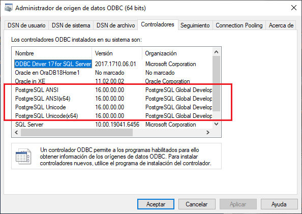
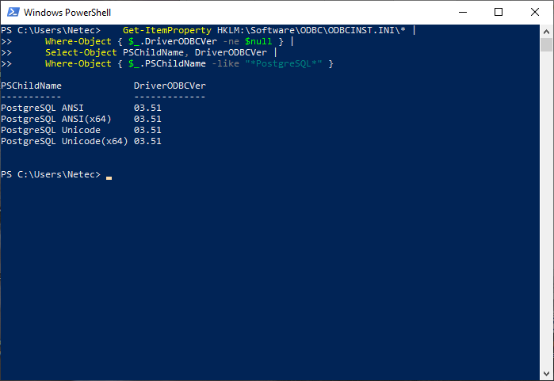
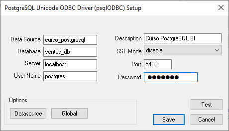
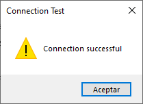
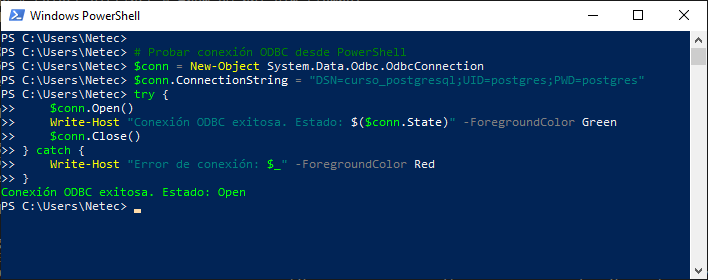
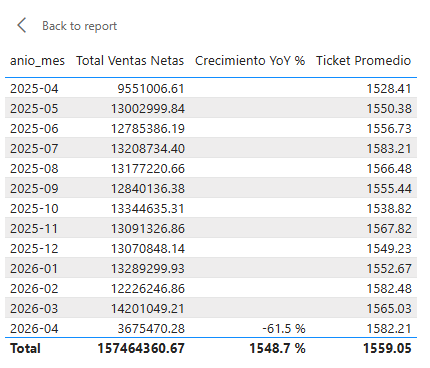
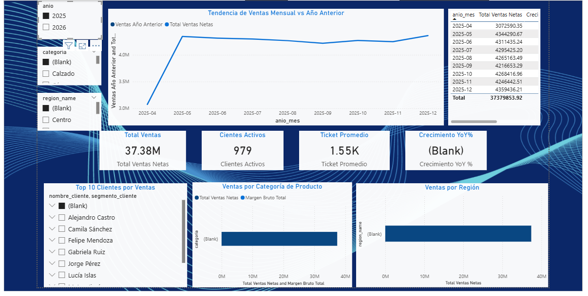

# Práctica 6.1 Integrando PostgreSQL con Power BI

<br/>

## Objetivos

Al completar esta práctica, serás capaz de:

- Establecer una conexión directa entre Power BI Desktop y PostgreSQL usando el conector nativo o driver ODBC.
- Importar y modelar tablas del dataset de ventas creando relaciones en un modelo estrella dentro de Power BI.
- Crear medidas DAX básicas que calculen KPIs equivalentes a los calculados previamente en PostgreSQL.
- Diseñar un dashboard interactivo con visualizaciones de ventas por tiempo, región y categoría.
- Publicar el reporte en Power BI Service y configurar las opciones básicas de actualización y compartición.

<br/>
<br/>

## Prerrequisitos

### Conocimientos Requeridos

- Haber completado todos las prácticas anteriores del curso (1.1 al 5.1) en orden secuencial.
- Comprensión del modelo de datos de ventas construido a lo largo del curso (tablas de hechos y dimensiones).
- Familiaridad con los conceptos básicos de Power BI: Desktop, Service, Power Query y DAX (cubiertos en la capítulo 6).
- Conocimiento de los KPIs calculados en PostgreSQL (Total Ventas, Ticket Promedio, Ventas YoY, Clientes Activos)
- Comprensión del flujo de trabajo de Power BI: Conectar > Transformar > Modelar > Visualizar.

<br/>

### Acceso y Software Requerido

- Power BI Desktop instalado en Windows, descarga gratuita desde [microsoft.com](https://www.microsoft.com/es-es/download/details.aspx?id=58494)
- Cuenta Microsoft personal o corporativa para acceder a Power BI Service (app.powerbi.com).
- Driver ODBC de PostgreSQL (psqlODBC 16.x) instalado en el sistema Windows.
- Contenedor Docker con PostgreSQL 16 ejecutándose.
- Vistas materializadas e índices configurados de la práctica 5.1.
- Dataset de ventas con al menos 100,000 registros cargado en PostgreSQL.

<br/><br/>

## Entorno de Laboratorio

### Configuración Inicial

Antes de comenzar la práctica, verifica que el entorno PostgreSQL esté operativo y que las vistas materializadas de la práctica anterior existan:

<br/>

```bash

# Verificar que el contenedor PostgreSQL esté corriendo
docker ps --filter "name=curso_postgres" --format "table {{.Names}}\t{{.Status}}\t{{.Ports}}"

```

<br/>

```bash

set DOCKER_CLI_HINTS=false

# Conectarse a PostgreSQL y verificar objetos requeridos
docker exec -it curso_postgres psql -U postgres -d ventas_db -c "SELECT schemaname, matviewname, ispopulated FROM pg_matviews ORDER BY matviewname;
"
```

<br/>

```bash

# Verificar el conteo de registros en la tabla principal de ventas
docker exec -it curso_postgres psql -U postgres -d ventas_db -c "SELECT 'sales' AS tabla, COUNT(*) AS total_registros, MIN(sale_date) AS fecha_minima, MAX(sale_date) AS fecha_maxima FROM sales;

```

<br/>

```bash

# Verificar que las tablas de dimensiones existen
docker exec -it curso_postgres psql -U postgres -d ventas_db 
```

```sql
-- Tabla, numero de columnas, estimación de registros
SELECT 
    t.table_name,
    COUNT(c.column_name) AS num_columnas,
    pg_class.reltuples::BIGINT AS cardinalidad_estimada
FROM information_schema.tables t
LEFT JOIN information_schema.columns c
    ON t.table_name = c.table_name
   AND t.table_schema = c.table_schema
JOIN pg_class 
    ON pg_class.relname = t.table_name
JOIN pg_namespace n 
    ON n.oid = pg_class.relnamespace
   AND n.nspname = t.table_schema
WHERE t.table_schema = 'public'
  AND t.table_type = 'BASE TABLE'
GROUP BY t.table_name, pg_class.reltuples
ORDER BY t.table_name;

```
<br/>

> **Notas:**
* **information_schema.tables**: contiene el listado de todas las tablas y vistas accesibles en la base de datos
* **information_schema.columns**: contiene información de todas las columnas de todas las tablas
* **pg_class**: tabla interna de PostgreSQL, contiene información física de las relaciones (tablas, índices, etc.)
* **pg_namespace**: contiene los esquemas de la base de datos.

<br/>

Si el contenedor no está corriendo, inícialo con:

```bash
# Iniciar el contenedor PostgreSQL (si está detenido)
docker start curso_postgres

# Esperar 10 segundos y verificar conectividad
sleep 10
docker exec -it curso_postgres psql -U postgres -d ventas_db -c "SELECT version();"
```

<br/><br/>

## Instrucciones

### Paso 1: Preparar Vistas en PostgreSQL para Power BI

Crear vistas SQL optimizadas que exporten los datos en el formato ideal para Power BI, asegurando que el modelo estrella esté correctamente estructurado y listo para ser importado.

1. Conéctate a PostgreSQL y crea las vistas de dimensiones y hechos necesarias para Power BI:

   ```bash
   docker exec -it curso_postgres psql -U postgres -d ventas_db
   ```

<br/>

2. Crea la vista de la tabla de hechos de ventas (hecho central del modelo estrella):

   ```sql
   -- Vista de hechos de ventas para Power BI
   CREATE OR REPLACE VIEW vw_pbi_hechos_ventas AS
   SELECT
      s.sale_id AS id_venta,
      s.sale_date AS fecha_venta,
      s.customer_id AS id_cliente,
      s.product_id AS id_producto,

      -- No existen en sales
      NULL::INT AS id_vendedor,
      NULL::INT AS id_region,
      0::NUMERIC AS descuento,

      s.quantity AS cantidad,
      s.unit_price AS precio_unitario,

      -- Métricas
      s.quantity * s.unit_price AS monto_bruto,
      s.quantity * s.unit_price AS monto_neto,

      -- Tiempo
      EXTRACT(YEAR FROM s.sale_date)::int AS anio,
      EXTRACT(MONTH FROM s.sale_date)::int AS mes,
      EXTRACT(QUARTER FROM s.sale_date)::int AS trimestre

   FROM sales s;
   ```

<br/>


3. Crea la vista de dimensión tiempo:

   ```sql
   -- Vista de dimensión tiempo para Power BI
   CREATE OR REPLACE VIEW vw_pbi_dim_tiempo AS
   SELECT DISTINCT
      s.sale_date::date                                   AS fecha,
      EXTRACT(YEAR FROM s.sale_date)::int                AS anio,
      EXTRACT(QUARTER FROM s.sale_date)::int             AS trimestre,
      EXTRACT(MONTH FROM s.sale_date)::int               AS mes_numero,
      TRIM(TO_CHAR(s.sale_date, 'TMMonth'))              AS mes_nombre,
      TO_CHAR(s.sale_date, 'YYYY-MM')                    AS anio_mes,
      EXTRACT(WEEK FROM s.sale_date)::int                AS semana_anio,
      EXTRACT(DOW FROM s.sale_date)::int                 AS dia_semana_numero,
      TRIM(TO_CHAR(s.sale_date, 'TMDay'))                AS dia_semana_nombre,

      CASE
         WHEN EXTRACT(DOW FROM s.sale_date) IN (0, 6) THEN false
         ELSE true
      END                                                AS es_dia_laboral,

      CONCAT(
         'T',
         EXTRACT(QUARTER FROM s.sale_date)::int,
         '-',
         EXTRACT(YEAR FROM s.sale_date)::int
      )                                                  AS etiqueta_trimestre

   FROM sales s
   ORDER BY fecha;
   ```

<br/>

4. Crea la vista de dimensión clientes:

   ```sql
   -- Vista de dimensión clientes para Power BI
   CREATE OR REPLACE VIEW vw_pbi_dim_clientes AS
      SELECT
         c.id_cliente,
         CONCAT(c.nombre, ' ', c.apellido)         AS nombre_cliente,
         c.correo                                 AS email,
         c.ciudad,
         c.pais,
         c.categoria_cliente                      AS segmento_cliente,
         c.fecha_registro::date                   AS fecha_registro,
         EXTRACT(YEAR FROM AGE(CURRENT_DATE, c.fecha_registro))::int 
            AS anios_como_cliente
      FROM clientes c;
   ```

<br/>


5. Crea la vista de dimensión productos:

   ```sql
   -- Vista de dimensión productos para Power BI
   CREATE OR REPLACE VIEW vw_pbi_dim_productos AS
   SELECT
      p.id_producto,
      p.nombre                            AS nombre_producto,
      c.nombre_categoria                  AS categoria,
      NULL::VARCHAR                       AS subcategoria,
      p.precio_unitario                   AS precio_base,
      p.precio_unitario                   AS costo_unitario,
      (p.precio_unitario - p.precio_unitario) AS margen_unitario,
      0::NUMERIC                          AS pct_margen
   FROM productos p
   LEFT JOIN categorias c
      ON p.id_categoria = c.id_categoria;
   ```

<br/>

6. Crea la vista de dimensión vendedores:

   ```sql
   -- Vista de dimensión vendedores para Power BI
   CREATE OR REPLACE VIEW vw_pbi_dim_vendedores AS
   SELECT
      v.id_vendedor,
      v.nombre,
      v.apellido,
      CONCAT(v.nombre, ' ', v.apellido) AS nombre_completo,
      v.region,
      v.correo
   FROM vendedores v;
   ```

<br/>


7. Crea la vista de dimensión regiones:

   ```sql
   -- Vista de dimensión regiones para Power BI
   CREATE OR REPLACE VIEW vw_pbi_dim_regiones AS
   SELECT
      r.region_id,
      r.region_name
   FROM regions r;
   ```

<br/>


8. Crea una vista de resumen pre-agregado para el dashboard (mejora el rendimiento en Power BI):

   ```sql
   -- Vista de resumen mensual para KPIs del dashboard
   CREATE OR REPLACE VIEW vw_pbi_resumen_mensual AS
   SELECT
      EXTRACT(YEAR FROM s.sale_date)::int          AS anio,
      EXTRACT(MONTH FROM s.sale_date)::int         AS mes,
      TO_CHAR(s.sale_date, 'YYYY-MM')              AS anio_mes,

      r.region_name                               AS nombre_region,
      cat.nombre_categoria                        AS categoria,

      COUNT(*)                                    AS total_transacciones,
      COUNT(DISTINCT s.customer_id)               AS clientes_activos,

      SUM(s.quantity * s.unit_price)              AS ventas_netas,
      AVG(s.quantity * s.unit_price)              AS ticket_promedio,
      SUM(s.quantity)                             AS unidades_vendidas

   FROM sales s

   -- Cliente → Región
   JOIN customers cu 
      ON s.customer_id = cu.customer_id

   JOIN regions r 
      ON cu.region_id = r.region_id

   -- Producto → Categoría
   JOIN productos p 
      ON s.product_id = p.id_producto

   JOIN categorias cat 
      ON p.id_categoria = cat.id_categoria

   GROUP BY
      EXTRACT(YEAR FROM s.sale_date),
      EXTRACT(MONTH FROM s.sale_date),
      TO_CHAR(s.sale_date, 'YYYY-MM'),
      r.region_name,
      cat.nombre_categoria;
   ```

<br/>


9. Verifica que todas las vistas se crearon correctamente:

   ```sql
   -- Verificar vistas creadas
   SELECT viewname, definition IS NOT NULL AS tiene_definicion
   FROM pg_views
   WHERE schemaname = 'public'
     AND viewname LIKE 'vw_pbi_%'
   ORDER BY viewname;
   ```

<br/>

10. Prueba las vistas con consultas de muestra:

    ```sql
    -- Verificar datos en cada vista
    SELECT 'vw_pbi_hechos_ventas' AS vista, COUNT(*) AS registros FROM vw_pbi_hechos_ventas
    UNION ALL
    SELECT 'vw_pbi_dim_tiempo', COUNT(*) FROM vw_pbi_dim_tiempo
    UNION ALL
    SELECT 'vw_pbi_dim_clientes', COUNT(*) FROM vw_pbi_dim_clientes
    UNION ALL
    SELECT 'vw_pbi_dim_productos', COUNT(*) FROM vw_pbi_dim_productos
    UNION ALL
    SELECT 'vw_pbi_dim_vendedores', COUNT(*) FROM vw_pbi_dim_vendedores
    UNION ALL
    SELECT 'vw_pbi_dim_regiones', COUNT(*) FROM vw_pbi_dim_regiones
    UNION ALL
    SELECT 'vw_pbi_resumen_mensual', COUNT(*) FROM vw_pbi_resumen_mensual
    ORDER BY vista;
    ```

<br/>

11. Sal del cliente psql:

    ```sql
    \q
    ```

<br/>


**Verificación:**

- Confirma que aparecen exactamente 7 vistas con prefijo `vw_pbi_`.
- Verifica que `vw_pbi_hechos_ventas` tiene al menos 100,000 registros.
- Confirma que `vw_pbi_dim_tiempo` tiene registros de fechas sin duplicados.

<br/>
<br/>


### Paso 2: Verificar e Instalar el Driver ODBC de PostgreSQL

Confirmar que el driver ODBC de PostgreSQL está correctamente instalado en Windows para que Power BI pueda establecer la conexión con el contenedor Docker.

1. Abre el **Administrador de orígenes de datos ODBC** en Windows. Presiona `Win + R`, escribe `odbcad32` y presiona Enter. Alternativamente, busca "ODBC" en el menú de inicio.

<br/>


2. En la pestaña **Controladores**, verifica que aparezca `PostgreSQL Unicode` o `PostgreSQL ANSI` en la lista.

<br/>

<p align="center">
  
</p>

<br/>

3. Si el driver NO está instalado, descárgalo e instálalo. Abre PowerShell como administrador y ejecuta:

   ```powershell
   # Verificar si psqlODBC está instalado (PowerShell)
   Get-ItemProperty HKLM:\Software\ODBC\ODBCINST.INI\* |
     Where-Object { $_.DriverODBCVer -ne $null } |
     Select-Object PSChildName, DriverODBCVer |
     Where-Object { $_.PSChildName -like "*PostgreSQL*" }
   ```

<br/>

<p align="center">
  
</p>

<br/>

4. Si el resultado está vacío, descarga e instala psqlODBC desde el sitio oficial. Abre un navegador y ve a: `https://www.postgresql.org/ftp/odbc/versions/msi/` y descarga `psqlodbc_16_00_0000-x64.zip` (o la versión 16.x más reciente).

<br/>

5. Extrae el archivo ZIP y ejecuta el instalador `.msi` como administrador. Acepta todas las opciones predeterminadas.

<br/>

6. Crea un DSN (Data Source Name) de sistema para PostgreSQL. En el Administrador ODBC, ve a la pestaña **DSN de sistema** y haz clic en **Agregar**:

   ```
   Driver:   PostgreSQL Unicode
   Data Source: PostgreSQL_Curso
   Database:    ventas_db
   Server:      localhost
   Port:        5432
   User Name:   postgres
   Password:    postgres
   ```

<br/>

<p align="center">
  
</p>

<br/>


7. Haz clic en **Test** para verificar la conexión. Deberías ver el mensaje "Connection successful".

<br/>

<p align="center">
  
</p>

<br/>

8. Verifica la conectividad desde PowerShell usando el módulo .NET:

   ```powershell
   # Probar conexión ODBC desde PowerShell
   $conn = New-Object System.Data.Odbc.OdbcConnection
   $conn.ConnectionString = "DSN=curso_postgresql;UID=postgres;PWD=postgres"
   try {
      $conn.Open()
      Write-Host "Conexión ODBC exitosa. Estado: $($conn.State)" -ForegroundColor Green
      $conn.Close()
   } catch {
      Write-Host "Error de conexión: $_" -ForegroundColor Red
   }
   ```

<br/>

<p align="center">
  
</p>

<br/>

**Verificación:**

- El Administrador ODBC muestra `PostgreSQL Unicode` en la lista de controladores
- El DSN `PostgreSQL_Curso` aparece en la pestaña "DSN de sistema"
- La prueba de conexión retorna "Connection successful"

<br/>
<br/>

### Paso 3: Conectar Power BI Desktop a PostgreSQL

Establecer la conexión entre Power BI Desktop y el contenedor PostgreSQL, seleccionar las vistas creadas en el Paso 1 e importar los datos al modelo.

1. Abre **Power BI Desktop** desde el menú de inicio de Windows. En la pantalla de bienvenida, cierra el diálogo inicial haciendo clic en la X.

<br/>

2. En la cinta de opciones, haz clic en **Inicio** → **Obtener datos** → **Más...**

<br/>

3. En el cuadro de búsqueda del diálogo "Obtener datos", escribe `PostgreSQL` y selecciona **Base de datos PostgreSQL**. Haz clic en **Conectar**.

   > **Alternativa:** Si el conector nativo no aparece, selecciona **ODBC** y usa el DSN `PostgreSQL_Curso` creado en el Paso 2.

<br/>

4. En el diálogo de conexión, ingresa los siguientes datos:
   ```
   Servidor:   localhost
   Base de datos: ventas_db
   ```
   
   Deja el **Modo de conectividad de datos** en **Importar** (no DirectQuery por ahora). Haz clic en **Aceptar**.

<br/>

5. En el diálogo de autenticación, selecciona **Base de datos** e ingresa:
   ```
   Nombre de usuario: postgres
   Contraseña:        postgres
   ```
   Haz clic en **Conectar**.

<br/>

6. En el **Navegador** que aparece, expande la base de datos `ventas_db` y luego `public`. Selecciona las siguientes vistas marcando la casilla de cada una:
   - `vw_pbi_hechos_ventas`
   - `vw_pbi_dim_tiempo`
   - `vw_pbi_dim_clientes`
   - `vw_pbi_dim_productos`
   - `vw_pbi_dim_vendedores`
   - `vw_pbi_dim_regiones`
   - `vw_pbi_resumen_mensual`

<br/>

7. Haz clic en **Transformar datos** (NO en "Cargar") para abrir Power Query Editor antes de importar.


<br/>

**Verificación:**

- Confirma que las 7 vistas aparecen en el panel "Consultas" de Power Query Editor
- Verifica que `vw_pbi_hechos_ventas` muestra columnas: id_venta, fecha_venta, id_cliente, id_producto, monto_neto, etc.
- Confirma que no hay errores (triángulos rojos) en ninguna consulta

<br/>
<br/>

### Paso 4: Transformar Datos en Power Query

Realizar transformaciones básicas en Power Query para limpiar los datos, corregir tipos de datos y optimizar las tablas antes de cargarlas al modelo de Power BI.


1. En Power Query Editor, selecciona la consulta `vw_pbi_hechos_ventas` en el panel izquierdo.

<br/>

2. Renombra la consulta para que tenga un nombre más limpio: haz clic derecho sobre `vw_pbi_hechos_ventas` en el panel izquierdo → **Cambiar nombre** → escribe `Hechos_Ventas`. Repite para todas las vistas:

   | Nombre original | Nombre nuevo |
   |-----------------|--------------|
   | vw_pbi_hechos_ventas | Hechos_Ventas |
   | vw_pbi_dim_tiempo | Dim_Tiempo |
   | vw_pbi_dim_clientes | Dim_Clientes |
   | vw_pbi_dim_productos | Dim_Productos |
   | vw_pbi_dim_vendedores | Dim_Vendedores |
   | vw_pbi_dim_regiones | Dim_Regiones |
   | vw_pbi_resumen_mensual | Resumen_Mensual |

<br/>

3. Selecciona `Hechos_Ventas`. Verifica que la columna `fecha_venta` sea tipo **Date** (icono de calendario). Si aparece como texto, haz clic en el ícono del tipo de dato en el encabezado de la columna y selecciona **Fecha**.

<br/>

4. En `Hechos_Ventas`, selecciona las columnas `anio`, `mes` y `trimestre` (mantén Ctrl para selección múltiple). Verifica que sean tipo **Número entero**. Haz clic derecho → **Cambiar tipo** → **Número entero** si es necesario.

<br/>

5. Selecciona `Dim_Tiempo`. Verifica que la columna `fecha` sea tipo **Date**. Elimina columnas redundantes que ya están en `Hechos_Ventas`: selecciona `anio`, `mes_numero` (mantén Ctrl) y verifica que no haya duplicados innecesarios.


<br/>

6. Selecciona `Dim_Clientes`. Verifica que `fecha_registro` sea tipo **Date**.

<br/>

7. En `Dim_Productos`, verifica que `precio_base`, `costo_unitario`, `margen_unitario` y `pct_margen` sean tipo **Número decimal**.

<br/>


9. Revisa el panel **Configuración de la consulta** (derecha) para cada tabla y confirma que los pasos aplicados son mínimos y limpios. El objetivo es tener solo los pasos necesarios.

<br/>

10. Haz clic en **Inicio** → **Cerrar y aplicar** para cargar los datos al modelo de Power BI.

   > La carga puede tomar varios minutos si el dataset tiene 100,000+ registros. Es normal.

<br/>

**Verificación:**

- En el panel Datos, haz clic en `Hechos_Ventas` y verifica que el recuento de filas coincide con el de PostgreSQL
- Confirma que los nombres de tablas son los nuevos (sin prefijo `vw_pbi_`)
- Verifica que no hay errores de carga (icono de advertencia en las tablas)

<br/>
<br/>

### Paso 5: Construir el Modelo de Datos en Estrella

Definir las relaciones entre la tabla de hechos y las tablas de dimensiones en la vista de Modelo de Power BI para crear un esquema en estrella funcional y correcto.

1. En Power BI Desktop, haz clic en el ícono **Modelo** en la barra lateral izquierda (el ícono de tres rectángulos conectados).

<br/>

2. Organiza las tablas visualmente en el lienzo de modelo para facilitar la lectura. Coloca `Hechos_Ventas` en el centro y las dimensiones alrededor:
   - `Dim_Tiempo` → arriba izquierda
   - `Dim_Clientes` → arriba derecha
   - `Dim_Productos` → abajo izquierda
   - `Dim_Vendedores` → abajo derecha
   - `Dim_Regiones` → abajo centro
   - `Resumen_Mensual` → esquina superior (tabla auxiliar)

<br/>

3. Crea la relación entre `Hechos_Ventas` y `Dim_Tiempo`. Arrastra la columna `fecha_venta` de `Hechos_Ventas` hasta la columna `fecha` de `Dim_Tiempo`. En el diálogo de relación, configura:
   ```
   Tabla 1: Hechos_Ventas  | Columna: fecha_venta
   Tabla 2: Dim_Tiempo     | Columna: fecha
   Cardinalidad: Varios a uno (*:1)
   Dirección de filtro cruzado: Único (Dim_Tiempo filtra Hechos_Ventas)
   ```
   Haz clic en **Aceptar**.

<br/>

4. Crea la relación entre `Hechos_Ventas` y `Dim_Clientes`:
   ```
   Tabla 1: Hechos_Ventas  | Columna: id_cliente
   Tabla 2: Dim_Clientes   | Columna: id_cliente
   Cardinalidad: Varios a uno (*:1)
   Dirección de filtro cruzado: Único
   ```

<br/>

5. Crea la relación entre `Hechos_Ventas` y `Dim_Productos`:
   ```
   Tabla 1: Hechos_Ventas  | Columna: id_producto
   Tabla 2: Dim_Productos  | Columna: id_producto
   Cardinalidad: Varios a uno (*:1)
   Dirección de filtro cruzado: Único
   ```

<br/>

6. Crea la relación entre `Hechos_Ventas` y `Dim_Vendedores`:
   ```
   Tabla 1: Hechos_Ventas  | Columna: id_vendedor
   Tabla 2: Dim_Vendedores | Columna: id_vendedor
   Cardinalidad: Varios a uno (*:1)
   Dirección de filtro cruzado: Único
   ```

<br/>

7. Crea la relación entre `Hechos_Ventas` y `Dim_Regiones`:
   ```
   Tabla 1: Hechos_Ventas  | Columna: id_region
   Tabla 2: Dim_Regiones   | Columna: id_region
   Cardinalidad: Varios a uno (*:1)
   Dirección de filtro cruzado: Único
   ```

<br/>

8. Verifica el modelo resultante. Deberías ver `Hechos_Ventas` en el centro con 5 líneas de relación conectando a las 5 dimensiones. La tabla `Resumen_Mensual` permanece sin relaciones directas (es una tabla de agregados independiente).

<br/>

9. Haz doble clic en cada línea de relación para verificar que la cardinalidad es `*:1` y la dirección de filtro es la correcta.

<br/>

**Verificación:**

- El modelo muestra exactamente 5 relaciones activas (líneas sólidas)
- No hay relaciones ambiguas o inactivas (líneas punteadas)
- La cardinalidad de todas las relaciones es `*:1` (Muchos a Uno)
- `Resumen_Mensual` aparece sin relaciones en el modelo

<br/>
<br/>

### Paso 6: Crear Medidas DAX para KPIs

Crear medidas DAX que calculen los KPIs clave del dashboard de ventas, equivalentes a los cálculos realizados previamente en PostgreSQL con funciones de ventana y agregaciones.


1. Haz clic en el ícono **Informe** en la barra lateral izquierda para volver a la vista de informe.

<br/>

2. En el panel **Datos** (derecha), haz clic derecho sobre la tabla `Hechos_Ventas` → **Nueva medida**. Se abrirá la barra de fórmulas DAX.

<br/>

3. Crea la medida de **Total Ventas Netas**:

   ```dax
   Total Ventas Netas = 
   SUM(Hechos_Ventas[monto_neto])
   ```
   Presiona Enter. La medida aparece en `Hechos_Ventas` con un ícono de calculadora.

<br/>

4. Crea la medida de **Total Transacciones**:

   ```dax
   Total Transacciones = 
   COUNTROWS(Hechos_Ventas)
   ```

<br/>

5. Crea la medida de **Ticket Promedio**:

   ```dax
   Ticket Promedio = 
   DIVIDE(
       [Total Ventas Netas],
       [Total Transacciones],
       0
   )
   ```

<br/>

6. Crea la medida de **Clientes Activos**:

   ```dax
   Clientes Activos = 
   DISTINCTCOUNT(Hechos_Ventas[id_cliente])
   ```

<br/>

7. Crea la medida de **Unidades Vendidas**:

   ```dax
   Unidades Vendidas = 
   SUM(Hechos_Ventas[cantidad])
   ```

<br/>

8. Crea la medida de **Ventas Año Anterior** usando la función de inteligencia de tiempo de DAX:

   ```dax
   Ventas Año Anterior = 
   CALCULATE(
       [Total Ventas Netas],
       SAMEPERIODLASTYEAR(Dim_Tiempo[fecha])
   )
   ```

<br/>

9. Crea la medida de **Crecimiento YoY %** (equivalente al cálculo de ventana en PostgreSQL):

   ```dax
   Crecimiento YoY % = 
   VAR ventas_actual = [Total Ventas Netas]
   VAR ventas_anterior = [Ventas Año Anterior]
   RETURN
   DIVIDE(
       ventas_actual - ventas_anterior,
       ventas_anterior,
       BLANK()
   )
   ```

<br/>

10. Crea la medida de **Top Producto** (nombre del producto con más ventas en el contexto actual):

    ```dax
    Top Producto = 
    CALCULATE(
        FIRSTNONBLANK(Dim_Productos[nombre_producto], 1),
        TOPN(1,
             SUMMARIZE(
                 Hechos_Ventas,
                 Dim_Productos[nombre_producto],
                 "VentasProducto", [Total Ventas Netas]
             ),
             [VentasProducto],
             DESC
        )
    )
    ```

<br/>

11. Crea la medida de **Margen Bruto Total**:

    ```dax
    Margen Bruto Total = 
    SUMX(
        Hechos_Ventas,
        Hechos_Ventas[cantidad] * 
        (RELATED(Dim_Productos[precio_base]) - RELATED(Dim_Productos[costo_unitario]))
    )
    ```

<br/>

12. Formatea las medidas para mejor visualización. Selecciona `Total Ventas Netas` en el panel Datos y en la cinta **Herramientas de medida** → **Formato** → selecciona **Moneda** con 2 decimales. Repite para `Ticket Promedio` y `Margen Bruto Total`. Para `Crecimiento YoY %`, selecciona **Porcentaje** con 1 decimal.

<br/>

**Verificación:**

- Crea una tabla simple en el lienzo: arrastra `Dim_Tiempo[anio_mes]` y `Total Ventas Netas` a un visual de tabla. Verifica que los valores son coherentes (no cero ni BLANK para todos los períodos)
- Verifica que `Crecimiento YoY %` muestra BLANK para el primer año (no hay año anterior) y valores porcentuales para los años siguientes
- Confirma que `Ticket Promedio` es mayor que 0

<br/>

La salida debería de ser similar a la siguiente imagen:

<p align="center">
  
</p>


<br/>
<br/>

### Paso 7: Diseñar el Dashboard de Ventas Ejecutivo

Construir un dashboard interactivo de una página con múltiples visualizaciones que cubran tendencia temporal, distribución regional, análisis por categoría y KPIs ejecutivos.


1. En la vista de Informe, renombra la página actual: haz doble clic en la pestaña `Página 1` en la parte inferior → escribe `Dashboard Ejecutivo`.

<br/>

2. Configura el lienzo del dashboard. En **Ver** → **Tamaño de página** → selecciona **16:9** (o personalizado 1280×720 para mejor visualización).

<br/>

<p align="center">
  
</p>

<br/>

3. **Tarjetas KPI (fila superior):** Agrega 4 tarjetas de KPI en la parte superior del dashboard:

   a. Haz clic en el ícono de **Tarjeta** en el panel Visualizaciones.<br/>
   b. Arrastra `Total Ventas Netas` al campo **Valor** de la tarjeta.<br/>
   c. En el panel Formato, cambia el título a `Total Ventas`.<br/>
   d. Repite para crear 3 tarjetas adicionales con: `Clientes Activos`, `Ticket Promedio` y `Crecimiento YoY %`.<br/>
   e. Alinea las 4 tarjetas en una fila horizontal en la parte superior del lienzo.<br/>

<br/>

4. **Gráfico de líneas (tendencia temporal):** En el panel Visualizaciones, selecciona **Gráfico de líneas**:
   - **Eje X:** `Dim_Tiempo[anio_mes]`
   - **Valores Y:** `Total Ventas Netas` y `Ventas Año Anterior`
   - **Leyenda:** (automática)
   - Coloca este visual en el lado izquierdo del dashboard, ocupando aproximadamente el 50% del ancho.
   - En Formato → Título: `Tendencia de Ventas Mensual vs Año Anterior`

<br/>

5. **Gráfico de barras por categoría:** Selecciona **Gráfico de barras agrupadas**:
   - **Eje Y:** `Dim_Productos[categoria]`
   - **Valores X:** `Total Ventas Netas`
   - **Información sobre herramientas:** `Margen Bruto Total`
   - Coloca este visual en el lado derecho superior del dashboard.
   - Título: `Ventas por Categoría de Producto`

<br/>

6. **Mapa de ventas por región:** Selecciona **Gráfico de barras apiladas** (o Mapa si tienes datos de coordenadas):
   - **Eje:** `Dim_Regiones[nombre_region]`
   - **Valores:** `Total Ventas Netas`
   - **Leyenda:** `Dim_Regiones[zona_geografica]`
   - Coloca este visual en el lado derecho inferior.
   - Título: `Ventas por Región`

<br/>

7. **Tabla de Top Clientes:** Selecciona **Tabla**:
   - **Columnas:** `Dim_Clientes[nombre_cliente]`, `Dim_Clientes[segmento_cliente]`, `Total Ventas Netas`, `Total Transacciones`, `Ticket Promedio`
   - En Formato → **Filtros de nivel visual**: agrega un filtro Top N para mostrar solo los 10 clientes con mayor `Total Ventas Netas`
   - Coloca este visual en la parte inferior izquierda.
   - Título: `Top 10 Clientes por Ventas`

<br/>

8. **Segmentadores (Slicers) para filtrado interactivo:** Agrega 3 segmentadores:

   a. Segmentador de **Año**: Visualización → **Segmentador** → campo: `Dim_Tiempo[anio]` → Estilo: Lista vertical<br/>
   b. Segmentador de **Categoría**: campo: `Dim_Productos[categoria]` → Estilo: Lista vertical<br/>
   c. Segmentador de **Región**: campo: `Dim_Regiones[nombre_region]` → Estilo: Lista vertical<Br/>
   
   Coloca los 3 segmentadores en la columna lateral izquierda del dashboard.

<br/>

9. **Configura las interacciones entre visuales.** Haz clic en el gráfico de líneas y en la cinta **Formato** → **Editar interacciones**. Verifica que todos los visuales muestran el ícono de filtro (no el ícono de resaltado) cuando interactúan entre sí.

<br/>

10. Aplica un tema visual al dashboard. En **Ver** → **Temas** → selecciona **Ejecutivo** o cualquier tema corporativo que prefieras.

<br/>

11. Guarda el archivo. Presiona `Ctrl + S` y guarda como `Dashboard_Ventas_PostgreSQL.pbix` en una carpeta de trabajo.

<br/>

**Verificación:**

- Haz clic en una categoría del gráfico de barras → todos los demás visuales deben filtrarse automáticamente
- Selecciona un año en el segmentador → el gráfico de líneas muestra solo ese año
- Las tarjetas KPI se actualizan cuando aplicas filtros
- El archivo `.pbix` se guarda sin errores


<br/>

La salida debería de ser similar a la siguiente imagen:

<p align="center">
  
</p>

<br/>
<br/>

### Paso 8: Crear una Segunda Página de Análisis Detallado

Agregar una segunda página al reporte con análisis más detallados de vendedores y productos, demostrando la capacidad de navegación entre páginas en Power BI.

1. Haz clic en el botón `+` en la barra de pestañas inferior para agregar una nueva página. Renómbrala como `Análisis Detallado`.

<br/>

2. **Gráfico de dispersión (Vendedores):** Selecciona **Gráfico de dispersión**:
   - **Eje X:** `Total Transacciones`
   - **Eje Y:** `Total Ventas Netas`
   - **Tamaño:** `Ticket Promedio`
   - **Leyenda:** `Dim_Vendedores[nombre_completo]`
   - **Información sobre herramientas:** `Dim_Vendedores[cuota_mensual]`
   - Título: `Rendimiento de Vendedores: Transacciones vs Ventas`

<br/>

3. **Matriz de ventas por período y categoría:** Selecciona **Matriz**:
   - **Filas:** `Dim_Tiempo[anio]`, `Dim_Tiempo[mes_nombre]`
   - **Columnas:** `Dim_Productos[categoria]`
   - **Valores:** `Total Ventas Netas`
   - En Formato → activa **Totales de fila** y **Totales de columna**
   - Título: `Ventas por Período y Categoría`

<br/>

4. **Medidor de cumplimiento de cuota:** Crea una nueva medida DAX para el cumplimiento de cuota:

   ```dax
   Cumplimiento Cuota % = 
   DIVIDE(
       [Total Ventas Netas],
       SUMX(Dim_Vendedores, Dim_Vendedores[cuota_mensual]),
       0
   )
   ```

   Agrega un visual de **Medidor** (Gauge):
   - **Valor:** `Total Ventas Netas`
   - **Valor máximo:** crea una medida `Cuota Total = SUMX(Dim_Vendedores, Dim_Vendedores[cuota_mensual])`
   - Título: `Cumplimiento de Cuota de Ventas`

<br/>

5. Agrega un botón de navegación de regreso al Dashboard. En **Insertar** → **Botones** → **Atrás**. Colócalo en la esquina superior izquierda. En Formato del botón → Acción → Tipo: **Navegación de página** → Destino: `Dashboard Ejecutivo`.

<br/>

6. En la página `Dashboard Ejecutivo`, agrega un botón de navegación hacia `Análisis Detallado`. En **Insertar** → **Botones** → **Vacío** (personalizado):
   - Texto: `Ver Análisis Detallado →`
   - Acción: Navegación de página → `Análisis Detallado`

<br/>

7. Guarda el archivo con `Ctrl + S`.


<br/>

**Verificación:**

- Haz clic en el botón "Ver Análisis Detallado" → navega correctamente a la segunda página
- El botón "Atrás" regresa al Dashboard Ejecutivo
- El gráfico de dispersión muestra puntos para cada vendedor con tamaños variables

<br/>
<br/>

### Paso 9: Publicar en Power BI Service

Publicar el reporte en Power BI Service para que pueda ser accedido desde cualquier dispositivo y configurar las opciones básicas de actualización de datos.


1. Antes de publicar, verifica que estás autenticado en Power BI Desktop. En la esquina superior derecha de Power BI Desktop, haz clic en **Iniciar sesión** e ingresa tus credenciales de cuenta Microsoft (personal o corporativa).

<br/>

2. Una vez autenticado, guarda el archivo una última vez con `Ctrl + S`.

<br/>

3. Publica el reporte en Power BI Service. En la cinta **Inicio** → haz clic en **Publicar**:
   - En el diálogo de selección de destino, selecciona **Mi área de trabajo** (o un workspace específico si tienes uno configurado).
   - Haz clic en **Seleccionar**.

<br/>

4. Espera a que la publicación se complete. Verás una barra de progreso. Al finalizar, aparece el mensaje:
   ```
   ¡Listo!
   'Dashboard_Ventas_PostgreSQL' se publicó correctamente en Power BI.
   ```

<br/>

5. Haz clic en el enlace **Abrir 'Dashboard_Ventas_PostgreSQL' en Power BI** para abrir el reporte en el navegador.

<br/>

6. En Power BI Service (app.powerbi.com), navega a **Mi área de trabajo** → **Conjuntos de datos**. Busca `Dashboard_Ventas_PostgreSQL`.

<br/>

7. Haz clic en los tres puntos (...) junto al dataset → **Configuración**.

<br/>

8. En la sección **Credenciales del origen de datos**, haz clic en **Editar credenciales**:
   ```
   Método de autenticación: Básico
   Nombre de usuario: postgres
   Contraseña: postgres
   Nivel de privacidad: Organizativo
   ```
   Haz clic en **Iniciar sesión**.

   > **Nota:** Si PostgreSQL está en localhost (tu máquina local), Power BI Service no puede conectarse directamente. Para actualizaciones programadas desde la nube, se requiere el On-premises Data Gateway. El Paso 10 cubre su instalación básica.

<br/>

9. Crea un **Dashboard** en Power BI Service a partir del reporte publicado:
   - En el reporte publicado, navega a la página `Dashboard Ejecutivo`
   - Haz clic en el ícono de **Anclar** (pin) en el gráfico de líneas de tendencia → **Anclar a un dashboard** → **Nuevo dashboard** → nombre: `Dashboard Ventas Ejecutivo`
   - Repite para anclar las 4 tarjetas KPI al mismo dashboard

<br/>

10. Accede al dashboard anclado desde **Mi área de trabajo** → **Dashboards** → `Dashboard Ventas Ejecutivo`.


**Verificación:**

- El reporte es accesible en app.powerbi.com desde cualquier navegador
- El dashboard muestra los tiles anclados con datos actualizados
- Las credenciales del dataset están configuradas sin errores


<br/>
<br/>

### Paso 10: Configurar On-premises Data Gateway

Instalar y configurar el On-premises Data Gateway para permitir que Power BI Service se conecte al PostgreSQL local y programe actualizaciones automáticas de datos.


1. Descarga el On-premises Data Gateway desde Power BI Service. En app.powerbi.com, haz clic en el ícono de **Configuración** (engranaje) → **Administrar gateways** → **+ Nuevo gateway** → **Descargar gateway**.

   Alternativamente, descárgalo directamente desde:
   ```
   https://go.microsoft.com/fwlink/?LinkId=2116849&clcid=0x40a
   ```

<br/>

2. Ejecuta el instalador descargado (`GatewayInstall.exe`) como administrador. Acepta los términos y elige la instalación estándar (no el modo personal). La instalación toma aproximadamente 5 minutos.

<br/>

3. Una vez instalado, el asistente de configuración del gateway se abre automáticamente. Inicia sesión con tu cuenta Microsoft.

<br/>

4. Registra el gateway con un nombre descriptivo:
   ```
   Nombre del gateway: Gateway_Curso_PostgreSQL
   Clave de recuperación: [crea una clave segura y guárdala]
   ```
   Haz clic en **Configurar**.

<br/>

5. Verifica que el gateway aparece en Power BI Service. En app.powerbi.com → **Configuración** → **Administrar gateways** → deberías ver `Gateway_Curso_PostgreSQL` con estado **En línea**.

<br/>

6. Agrega la fuente de datos PostgreSQL al gateway. En la página del gateway → **Agregar origen de datos**:
   ```
   Nombre del origen de datos: PostgreSQL_Local
   Tipo de origen de datos: PostgreSQL
   Servidor: localhost
   Base de datos: ventas_db
   Método de autenticación: Básico
   Nombre de usuario: postgres
   Contraseña: postgres
   ```
   Haz clic en **Agregar**.

<br/>

7. Vincula el dataset al gateway. En **Mi área de trabajo** → **Conjuntos de datos** → `Dashboard_Ventas_PostgreSQL` → tres puntos → **Configuración** → **Conexiones de gateway** → selecciona `Gateway_Curso_PostgreSQL` y el origen `PostgreSQL_Local` → **Aplicar**.

<br/>

8. Configura la actualización programada. En la misma página de configuración del dataset → **Actualización programada**:
   ```
   Mantener actualizados los datos: Activado
   Frecuencia de actualización: Diaria
   Zona horaria: (tu zona horaria local)
   Hora: 06:00 AM
   ```
   Haz clic en **Aplicar**.

<br/>

9. Ejecuta una actualización manual para verificar que funciona. En **Mi área de trabajo** → **Conjuntos de datos** → tres puntos junto a `Dashboard_Ventas_PostgreSQL` → **Actualizar ahora**.

<br/>

10. Verifica el historial de actualización. Haz clic en los tres puntos → **Historial de actualización**. Deberías ver una entrada con estado **Completado**.

<br/>

**Verificación:**

- El gateway muestra estado "En línea" en la página de administración
- La actualización manual completa sin errores
- El dataset en Power BI Service muestra la fecha/hora de la última actualización correcta


<br/>
<br/>

## Validación y Pruebas

### Criterios de Éxito

- [ ] Las 7 vistas PostgreSQL (`vw_pbi_*`) se crearon correctamente y retornan datos válidos.
- [ ] La conexión Power BI Desktop ↔ PostgreSQL se establece sin errores usando el conector nativo o ODBC.
- [ ] El modelo de datos en estrella tiene exactamente 5 relaciones activas con cardinalidad `*:1`.
- [ ] Las 10 medidas DAX están creadas y retornan valores no nulos para el dataset completo.
- [ ] El dashboard tiene al menos 6 visualizaciones interactivas en la página principal.
- [ ] Los segmentadores filtran correctamente todos los visuales del dashboard.
- [ ] El reporte se publicó exitosamente en Power BI Service.
- [ ] El On-premises Data Gateway está configurado y la actualización manual completa sin errores.

<br/>

### Procedimiento de Pruebas

1. **Prueba de integridad de datos:** Compara el total de ventas en PostgreSQL con el valor en Power BI:

   ```bash
   docker exec -it curso_postgres psql -U postgres -d ventas_db -c "
   SELECT
       ROUND(SUM(cantidad * precio_unitario * (1 - COALESCE(descuento, 0)))::numeric, 2) AS total_ventas_netas_postgres
   FROM ventas;
   "
   ```

   En Power BI, crea una tabla con solo la medida `Total Ventas Netas` (sin filtros). El valor debe coincidir con el resultado de PostgreSQL (diferencia máxima aceptable: ±0.01 por redondeo).

<br/>

   **Resultado esperado:** Los valores coinciden con diferencia mínima de redondeo.

<br/>

2. **Prueba de filtrado interactivo:**

   ```
   Acción: Seleccionar un año específico en el segmentador de Año
   Resultado esperado: 
   - El gráfico de líneas muestra solo los meses de ese año
   - Las tarjetas KPI muestran valores del año seleccionado
   - La tabla de Top Clientes muestra solo clientes activos en ese año
   ```
<br/>

3. **Prueba de la medida YoY:**

   ```bash
   # Verificar en PostgreSQL el crecimiento YoY para un año específico
   docker exec -it curso_postgres psql -U postgres -d ventas_db -c "
   WITH ventas_anuales AS (
       SELECT
           EXTRACT(YEAR FROM fecha_venta)::int AS anio,
           SUM(cantidad * precio_unitario * (1 - COALESCE(descuento, 0))) AS ventas_netas
       FROM ventas
       GROUP BY EXTRACT(YEAR FROM fecha_venta)
   )
   SELECT
       anio,
       ROUND(ventas_netas::numeric, 2) AS ventas_netas,
       ROUND(
           ((ventas_netas - LAG(ventas_netas) OVER (ORDER BY anio)) /
            NULLIF(LAG(ventas_netas) OVER (ORDER BY anio), 0) * 100)::numeric,
           2
       ) AS crecimiento_yoy_pct
   FROM ventas_anuales
   ORDER BY anio;
   "
   ```

<br/>

   Compara los porcentajes con los valores mostrados por la medida `Crecimiento YoY %` en Power BI al filtrar por año.

   **Resultado esperado:** Los porcentajes de crecimiento YoY coinciden entre PostgreSQL y Power BI (diferencia máxima: ±0.1%).

<br/>

4. **Prueba de navegación entre páginas:**

   ```
   Acción: Hacer clic en el botón "Ver Análisis Detallado →"
   Resultado esperado: Navega a la página "Análisis Detallado"
   
   Acción: Hacer clic en el botón "Atrás"
   Resultado esperado: Regresa a "Dashboard Ejecutivo"
   ```

<br/>

5. **Prueba de publicación:**

   ```
   Acción: Abrir app.powerbi.com en un navegador incógnito
   Resultado esperado: 
   - El reporte "Dashboard_Ventas_PostgreSQL" es visible en "Mi área de trabajo"
   - El dashboard "Dashboard Ventas Ejecutivo" muestra los tiles con datos
   - Los tiles son clickeables y navegan al reporte completo
   ```

<br/>
<br/>

## Solución de Problemas

### Problema 1: Error de Conexión "No se puede conectar al servidor PostgreSQL"

**Síntomas:**
- Power BI Desktop muestra el error: `DataSource.Error: PostgreSQL: error connecting to server`
- El diálogo de conexión falla al ingresar `localhost:5432`
- El error puede mencionar "connection refused" o "timeout"

<br/>

**Causa:**
El contenedor Docker de PostgreSQL no está corriendo, el puerto 5432 no está mapeado correctamente, o el firewall de Windows está bloqueando la conexión.

<br/>

**Solución:**

```powershell
# Verificar que Docker Desktop está corriendo
Get-Process "Docker Desktop" -ErrorAction SilentlyContinue

# Verificar que el contenedor PostgreSQL está activo
docker ps --filter "name=curso_postgres"

# Si el contenedor está detenido, iniciarlo
docker start curso_postgres

# Verificar que el puerto 5432 está escuchando
netstat -an | findstr "5432"
# Debe mostrar: TCP  0.0.0.0:5432  0.0.0.0:0  LISTENING

# Si el puerto no aparece, verificar el mapeo del contenedor
docker inspect curso_postgres --format='{{.HostConfig.PortBindings}}'

# Probar conectividad TCP al puerto
Test-NetConnection -ComputerName localhost -Port 5432
# TcpTestSucceeded debe ser True
```

<br/>

Si el firewall bloquea el puerto:

```powershell
# Agregar regla de firewall para PostgreSQL (PowerShell como administrador)
New-NetFirewallRule -DisplayName "PostgreSQL Docker" `
    -Direction Inbound `
    -Protocol TCP `
    -LocalPort 5432 `
    -Action Allow
```

<br/>
<br/>

### Problema 2: Error de Driver "No se puede cargar el proveedor de datos de PostgreSQL"

**Síntomas:**
- Power BI muestra: `Could not load file or assembly 'Npgsql'`
- El conector PostgreSQL no aparece en la lista de "Obtener datos"
- Error al intentar usar el conector nativo de PostgreSQL

<br/>

**Causa:**
El proveedor de datos Npgsql para .NET no está instalado o es incompatible con la versión de Power BI Desktop instalada.

<br/>

**Solución:**

```powershell
# Verificar si Npgsql está instalado
Get-Package -Name "Npgsql*" -ErrorAction SilentlyContinue

# Descargar e instalar Npgsql desde NuGet (PowerShell como administrador)
# Primero, instalar el gestor de paquetes si no está disponible
Install-PackageProvider -Name NuGet -MinimumVersion 2.8.5.201 -Force

# Instalar Npgsql
Install-Package Npgsql -Scope CurrentUser -Force
```

<br/>

Alternativa: usar el conector ODBC en lugar del conector nativo:

```
En Power BI Desktop:
1. Inicio → Obtener datos → ODBC
2. Nombre del DSN: PostgreSQL_Curso
3. Cadena de conexión adicional: (dejar vacío)
4. Credenciales: usuario=postgres, contraseña=postgres
```

<br/>
<br/>

### Problema 3: Relaciones Ambiguas o Errores en el Modelo de Datos

**Síntomas:**
- Power BI muestra advertencia: "Esta relación puede causar ambigüedad"
- Las medidas DAX retornan valores incorrectos o BLANK inesperado
- El visual muestra todos los valores iguales sin importar los filtros

<br/>

**Causa:**
Las relaciones tienen cardinalidad incorrecta, la dirección de filtro cruzado es bidireccional cuando debería ser unidireccional, o existen relaciones circulares.

<br/>

**Solución:**

```
1. Ir a la vista Modelo en Power BI Desktop
2. Hacer doble clic en cada relación problemática
3. Verificar configuración correcta:
   - Cardinalidad: Varios a uno (*:1) para todas las relaciones Hechos→Dimensión
   - Dirección de filtro cruzado: Único (de Dimensión a Hechos)
   - Activar esta relación: Sí (checkbox marcado)
4. Si hay relaciones circulares, desactivar las relaciones secundarias
   (hacer clic derecho → Propiedades → desmarcar "Activar esta relación")
```

<br/>

Para diagnosticar problemas con DAX:

```dax
-- Medida de diagnóstico para verificar contexto de filtro
Debug_Contexto = 
CONCATENATEX(
    FILTERS(Dim_Tiempo[anio]),
    Dim_Tiempo[anio],
    ", "
)
```

<br/>
<br/>

### Problema 4: Error al Publicar "Necesita una licencia de Power BI Pro"

**Síntomas:**
- Al intentar publicar, aparece: "Necesita una licencia de Power BI Pro para publicar en este área de trabajo"
- La publicación falla con error de licencia

<br/>

**Causa:**
La cuenta Microsoft usada no tiene licencia Power BI Pro asignada. Power BI Desktop es gratuito para crear reportes, pero publicar en Power BI Service requiere Pro o Premium.

<br/>

**Solución:**

```
Opción 1: Activar prueba gratuita de Power BI Pro (60 días)
1. Ir a app.powerbi.com
2. Hacer clic en el ícono de usuario → Comprar Power BI Pro
3. Seleccionar "Probar gratis" (60 días sin costo)
4. Activar la prueba y reintentar la publicación

Opción 2: Usar cuenta Microsoft 365 corporativa
1. Verificar con el administrador de TI si la licencia Pro está incluida
2. Iniciar sesión en Power BI Desktop con la cuenta corporativa
3. Reintentar la publicación

Opción 3 (alternativa sin publicación):
1. Guardar el archivo .pbix localmente
2. Compartirlo directamente por email o OneDrive
3. Los destinatarios pueden abrirlo con Power BI Desktop gratuito
```

<br/>
<br/>

### Problema 5: Gateway Desconectado o "Sin conexión"

**Síntomas:**
- En Power BI Service, el gateway muestra estado "Sin conexión" o "Error"
- La actualización programada falla con error de gateway
- El historial de actualización muestra "Error de gateway"

<br/>

**Causa:**
El servicio de Windows del On-premises Data Gateway se detuvo, el equipo se apagó o hubo un cambio de red que interrumpió la conexión.

<br/>

**Solución:**

```powershell
# Verificar el estado del servicio del gateway (PowerShell como administrador)
Get-Service -Name "PBIEgwService" | Select-Object Name, Status, StartType

# Si el servicio está detenido, iniciarlo
Start-Service -Name "PBIEgwService"

# Configurar el servicio para inicio automático
Set-Service -Name "PBIEgwService" -StartupType Automatic

# Verificar logs del gateway
$logPath = "$env:LOCALAPPDATA\Microsoft\On-premises data gateway\GatewayLogs"
Get-ChildItem $logPath -Filter "*.log" | 
    Sort-Object LastWriteTime -Descending | 
    Select-Object -First 1 | 
    Get-Content -Tail 50
```

<br/>
<br/>

## Limpieza

Al finalizar el laboratorio, el archivo `.pbix` debe conservarse ya que contiene el trabajo del laboratorio. Sin embargo, puedes limpiar los recursos opcionales:

```powershell
# Opcional: Eliminar el DSN ODBC creado (si ya no lo necesitas)
# Ejecutar en PowerShell como administrador
$odbcPath = "HKLM:\SOFTWARE\ODBC\ODBC.INI\PostgreSQL_Curso"
if (Test-Path $odbcPath) {
    Remove-Item $odbcPath -Recurse
    Write-Host "DSN PostgreSQL_Curso eliminado" -ForegroundColor Yellow
}
```

<br/>

```bash
# Opcional: Eliminar las vistas de Power BI de PostgreSQL (si quieres limpiar el esquema)
# ADVERTENCIA: Solo ejecutar si ya no necesitas estas vistas
docker exec -it curso_postgres psql -U postgres -d ventas_db -c "
DROP VIEW IF EXISTS vw_pbi_resumen_mensual CASCADE;
DROP VIEW IF EXISTS vw_pbi_dim_regiones CASCADE;
DROP VIEW IF EXISTS vw_pbi_dim_vendedores CASCADE;
DROP VIEW IF EXISTS vw_pbi_dim_productos CASCADE;
DROP VIEW IF EXISTS vw_pbi_dim_clientes CASCADE;
DROP VIEW IF EXISTS vw_pbi_dim_tiempo CASCADE;
DROP VIEW IF EXISTS vw_pbi_hechos_ventas CASCADE;
SELECT 'Vistas eliminadas correctamente' AS resultado;
"
```

<br/>

> **Advertencia:** NO elimines las vistas si planeas continuar con ejercicios adicionales o si el instructor necesita revisar tu trabajo. Las vistas son livianas (no almacenan datos) y no afectan el rendimiento del sistema.

> **Advertencia:** El archivo `Dashboard_Ventas_PostgreSQL.pbix` es el entregable principal de este laboratorio. Guárdalo en un lugar seguro (OneDrive, Git LFS o disco externo) ya que contiene todo el modelo de datos, las medidas DAX y el diseño del dashboard.

<br/>

```bash
# Verificar que el contenedor PostgreSQL sigue operativo al finalizar
docker exec -it curso_postgres psql -U postgres -d ventas_db -c "SELECT 'PostgreSQL operativo' AS estado, version() AS version;"
```

<br/>
<br/>

## Resumen

### Lo que Lograste

- **Preparación de datos:** Creaste 7 vistas SQL optimizadas en PostgreSQL que exponen el dataset de ventas en el formato ideal para Power BI, incluyendo una vista de hechos, 5 dimensiones y una vista de resumen pre-agregado.
- **Conexión establecida:** Configuraste el driver ODBC de PostgreSQL y estableciste la conexión directa entre Power BI Desktop y el contenedor Docker de PostgreSQL corriendo en localhost.
- **Modelo estrella:** Construiste un modelo de datos en estrella completo en Power BI con 5 relaciones activas correctamente configuradas (cardinalidad `*:1`), replicando la estructura del esquema relacional de PostgreSQL.
- **Medidas DAX:** Implementaste 10 medidas DAX que calculan KPIs equivalentes a los calculados con SQL: Total Ventas, Ticket Promedio, Clientes Activos, Crecimiento YoY%, Margen Bruto y más.
- **Dashboard interactivo:** Diseñaste un dashboard ejecutivo de dos páginas con múltiples visualizaciones (líneas, barras, dispersión, matriz, medidor, tarjetas KPI) y segmentadores de filtrado interactivo.
- **Publicación en la nube:** Publicaste el reporte en Power BI Service, configuraste el On-premises Data Gateway para actualizaciones programadas y creaste un dashboard con tiles anclados.

<br/>
<br/>

### Conceptos Clave Aprendidos

- **Flujo Conectar → Transformar → Modelar → Visualizar:** Este flujo fundamental de Power BI se aplicó completamente en el laboratorio, desde la conexión a PostgreSQL hasta el dashboard publicado en la nube.
- **Equivalencia SQL ↔ DAX:** Las funciones de ventana (`LAG`, `SUM OVER`) y agregaciones de PostgreSQL tienen equivalentes directos en DAX (`SAMEPERIODLASTYEAR`, `CALCULATE`, `SUMX`), aunque la sintaxis y el paradigma son diferentes.
- **Modelo columnar vs relacional:** Power BI usa el motor VertiPaq (columnar, en memoria) mientras que PostgreSQL usa almacenamiento por filas. La importación de datos comprime y optimiza los datos para consultas analíticas rápidas en el cliente.
- **Gateway como puente:** El On-premises Data Gateway actúa como intermediario seguro entre Power BI Service (en la nube) y fuentes de datos locales como PostgreSQL en Docker, permitiendo actualizaciones programadas sin exponer la base de datos directamente a internet.
- **Vistas como interfaz de integración:** Crear vistas específicas para Power BI (con nombres descriptivos, columnas calculadas pre-computadas y estructura limpia) es una práctica recomendada que separa la lógica de negocio en PostgreSQL de la capa de presentación en Power BI.

<br/>
<br/>


## Recursos Adicionales

- **Documentación oficial de Power BI** – Guía completa de Power BI Desktop, DAX y Power Query en español: [https://learn.microsoft.com/es-es/power-bi/](https://learn.microsoft.com/es-es/power-bi/)
- **Referencia DAX completa** – Documentación de todas las funciones DAX con ejemplos: [https://dax.guide/](https://dax.guide/)
- **Conector PostgreSQL para Power BI** – Documentación técnica del conector nativo y ODBC: [https://learn.microsoft.com/es-es/power-query/connectors/postgresql](https://learn.microsoft.com/es-es/power-query/connectors/postgresql)
- **On-premises Data Gateway** – Guía de instalación y configuración del gateway: [https://learn.microsoft.com/es-es/data-integration/gateway/service-gateway-install](https://learn.microsoft.com/es-es/data-integration/gateway/service-gateway-install)
- **Power BI Desktop (descarga gratuita)** – Página oficial de descarga: [https://www.microsoft.com/es-es/download/details.aspx?id=58494](https://www.microsoft.com/es-es/download/details.aspx?id=58494)
- **DAX Patterns** – Patrones comunes de DAX para análisis de ventas, tiempo y KPIs financieros: [https://www.daxpatterns.com/](https://www.daxpatterns.com/)
